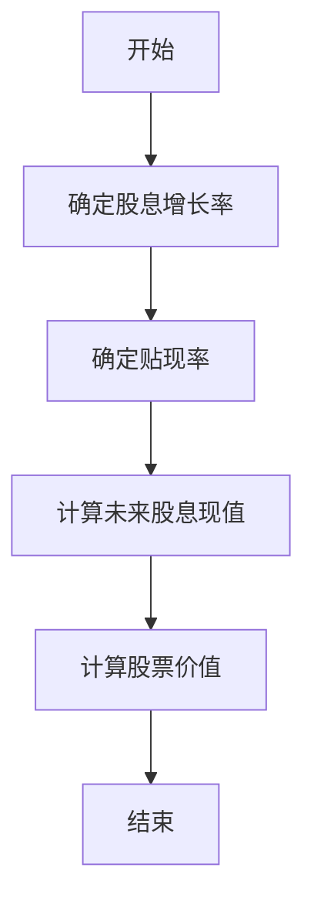
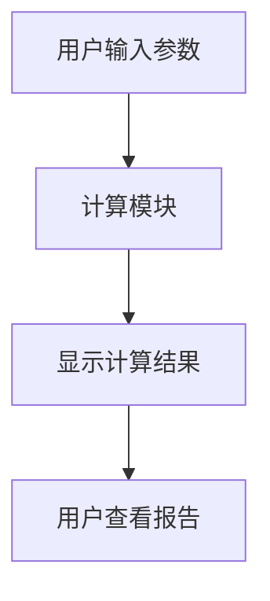

                 


# 股息贴现模型：基于未来现金流的股票估值

> **关键词**：股息贴现模型, 股票估值, 现金流贴现, 股息增长模型, 股票投资
>
> **摘要**：股息贴现模型（Dividend Discount Model，DDM）是一种用于股票估值的重要方法，它基于未来现金流的贴现来评估股票的内在价值。本文将详细介绍股息贴现模型的核心概念、数学模型、算法原理、系统架构设计、项目实战以及最佳实践，帮助读者全面理解和掌握这一股票估值工具。

---

## 目录

1. **股息贴现模型概述**
   - 1.1 股息贴现模型的定义与背景
   - 1.2 股息贴现模型的基本原理
   - 1.3 股息贴现模型与其他股票估值方法的对比

2. **股息贴现模型的核心概念**
   - 2.1 模型的基本结构
   - 2.2 股息贴现模型的数学公式
   - 2.3 股息贴现模型的假设与限制

3. **股息贴现模型的数学模型与算法原理**
   - 3.1 单阶段股息贴现模型
   - 3.2 两阶段股息贴现模型
   - 3.3 多阶段股息贴现模型
   - 3.4 股息贴现模型的计算步骤与流程图

4. **股息贴现模型的系统架构设计**
   - 4.1 系统架构概述
   - 4.2 系统功能设计
   - 4.3 系统接口设计
   - 4.4 系统交互流程图

5. **股息贴现模型的项目实战**
   - 5.1 环境安装与配置
   - 5.2 核心代码实现
   - 5.3 案例分析与结果解读

6. **股息贴现模型的最佳实践与小结**
   - 6.1 实践中的注意事项
   - 6.2 模型的优劣势分析
   - 6.3 未来发展趋势与扩展阅读

---

## 正文

### 第1章 股息贴现模型概述

#### 1.1 股息贴现模型的定义与背景

股息贴现模型（Dividend Discount Model，DDM）是一种用于评估股票内在价值的方法。它基于股票的未来股息现金流，通过贴现率计算其现值，从而确定股票的合理价格。DDM的核心思想是，股票的价值等于未来所有股息的现值之和。

- **股息贴现模型的背景**：随着金融市场的不断发展，投资者需要更精确的方法来评估股票的价值。传统的市盈率和市净率方法虽然简单，但无法充分反映股票的内在价值。股息贴现模型通过考虑未来现金流，提供了一种更为科学的估值方式。

- **股息贴现模型的定义**：股息贴现模型假设股票的内在价值等于未来股息的现值总和。公式为：
  $$ V = \sum_{t=1}^{\infty} \frac{D_t}{(1 + r)^t} $$
  其中，$D_t$ 是第 t 期的股息，$r$ 是贴现率。

#### 1.2 股息贴现模型的基本原理

股息贴现模型基于以下假设：
- 股票的价值等于未来股息的现值总和。
- 股东的预期回报率是固定的。
- 股息增长率是稳定的或可以预测的。

#### 1.3 股息贴现模型与其他股票估值方法的对比

- **市盈率法**：市盈率法通过市价与每股收益的比值来评估股票价值。优点是简单易用，缺点是无法反映股息的未来现金流。
- **市净率法**：市净率法通过市价与每股净资产的比值来评估股票价值。优点是适合评估资产密集型公司，缺点是无法反映公司的盈利能力和股息支付能力。
- **现金流贴现模型**：现金流贴现模型（DCF）是最全面的估值方法，但它需要大量的假设和复杂的计算。

---

### 第2章 股息贴现模型的核心概念

#### 2.1 模型的基本结构

股息贴现模型的基本结构包括三个核心要素：
- 股息（Dividend）：公司未来支付的股息。
- 贴现率（Discount Rate）：用于将未来股息折现为现值的利率。
- 股息增长率（Growth Rate）：股息的年增长率。

#### 2.2 股息贴现模型的数学公式

- **单阶段模型**：
  $$ V = \frac{D_1}{k - g} $$
  其中，$D_1$ 是第一期的股息，$k$ 是贴现率，$g$ 是股息增长率。

- **两阶段模型**：
  $$ V = \frac{D_1}{(1 + k)^1} + \frac{D_2}{(1 + k)^2} + \frac{D_3}{(1 + k)^3} + \cdots + \frac{D_n}{(1 + k)^n} $$
  其中，$D_n$ 是第 n 期的股息。

---

### 第3章 股息贴现模型的数学模型与算法原理

#### 3.1 单阶段股息贴现模型

单阶段模型假设股息增长率是恒定的，公式为：
$$ V = \frac{D_1}{k - g} $$

**步骤**：
1. 确定第一期的股息 $D_1$。
2. 确定贴现率 $k$ 和股息增长率 $g$。
3. 代入公式计算股票的内在价值 $V$。

#### 3.2 两阶段股息贴现模型

两阶段模型假设股息增长率在前一段时间较快，之后趋于稳定，公式为：
$$ V = \frac{D_1}{(1 + k)^1} + \frac{D_2}{(1 + k)^2} + \frac{D_3}{(1 + k)^3} + \cdots + \frac{D_n}{(1 + k)^n} $$ $$ + \frac{D_{n+1}}{(1 + k)^{n+1}} \times \frac{1}{k - g} $$

**步骤**：
1. 分别计算前 n 期的股息现值。
2. 计算第 n+1 期及以后的股息现值。
3. 将所有现值相加得到股票的内在价值。

#### 3.3 多阶段股息贴现模型

多阶段模型适用于股息增长率在不同阶段有不同的变化，公式较为复杂，通常需要分段计算。

#### 3.4 股息贴现模型的计算步骤与流程图

使用mermaid流程图展示计算流程：


---

### 第4章 股息贴现模型的系统架构设计

#### 4.1 系统架构概述

股息贴现模型的系统架构包括数据输入、计算模块、结果展示三个部分。

#### 4.2 系统功能设计

- 数据输入模块：用户输入股息、贴现率、股息增长率等参数。
- 计算模块：根据输入参数计算股票的内在价值。
- 结果展示模块：显示计算结果并提供可视化报告。

#### 4.3 系统接口设计

- 输入接口：支持用户输入股息、贴现率、股息增长率等参数。
- 输出接口：显示股票的内在价值和相关分析报告。

#### 4.4 系统交互流程图

使用mermaid流程图展示系统交互：


---

### 第5章 股息贴现模型的项目实战

#### 5.1 环境安装与配置

- 需要安装Python和必要的库（如numpy、pandas）。

#### 5.2 核心代码实现

```python
import numpy as np

def ddm_model(dividend, growth_rate, discount_rate, periods):
    present_value = 0
    for t in range(1, periods + 1):
        current_dividend = dividend * (1 + growth_rate) ** (t - 1)
        present_value += current_dividend / (1 + discount_rate) ** t
    return present_value

# 示例计算
dividend = 1.0  # 第一年股息
growth_rate = 0.05  # 股息增长率
discount_rate = 0.1  # 贴现率
periods = 5  # 计算5年的股息现值

value = ddm_model(dividend, growth_rate, discount_rate, periods)
print(f"股票的内在价值为：{value:.2f}")
```

---

### 第6章 股息贴现模型的最佳实践与小结

#### 6.1 实践中的注意事项

- 确保输入的股息增长率和贴现率合理。
- 定期更新数据和模型参数。
- 结合其他估值方法进行交叉验证。

#### 6.2 模型的优劣势分析

- **优势**：简单易用，适用于稳定分红的公司。
- **劣势**：难以预测长期股息增长率，假设条件严格。

#### 6.3 未来发展趋势与扩展阅读

随着人工智能和大数据技术的发展，股息贴现模型将与机器学习相结合，提供更精准的估值方法。推荐阅读的经典书籍包括《投资学》和《股市长线操盘》。

---

### 附录

#### 术语表

- 股息贴现模型（DDM）：基于未来股息现金流贴现的股票估值方法。
- 贴现率：用于将未来现金流折现为现值的利率。
- 股息增长率：股息的年增长率。

#### 公式汇总

- 单阶段模型：$$ V = \frac{D_1}{k - g} $$
- 两阶段模型：$$ V = \sum_{t=1}^{n} \frac{D_t}{(1 + k)^t} + \frac{D_{n+1}}{(1 + k)^{n+1}} \times \frac{1}{k - g} $$

#### 代码参考

GitHub代码仓库链接：[股息贴现模型代码示例](https://github.com/yourusername/ddm-model)

#### 扩展阅读

- 希格斯《股市长线操盘》
- 葛拉罕姆《证券分析》
- 巴菲特《投资之道》

