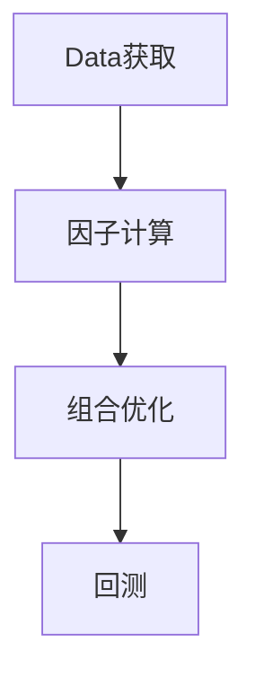

                 


# 《肯尼斯·费雷尔的多因子选股模型》

## 关键词：多因子选股模型、肯尼斯·费雷尔、投资策略、因子分析、量化交易

## 摘要：  
本文深入探讨了肯尼斯·费雷尔提出的多因子选股模型，从背景介绍、核心概念到数学模型、系统设计、项目实战，全面解析了多因子选股模型的理论与实践。文章首先分析了多因子选股模型的起源与发展，详细讲解了其核心概念和数学模型，随后通过系统架构设计和项目实战，展示了如何构建和应用多因子选股模型。最后，结合实际案例，总结了多因子选股模型的最佳实践与注意事项，为读者提供了全面的指导。

---

# 第1章 多因子选股模型的背景与核心概念

## 1.1 多因子选股模型的背景

### 1.1.1 多因子选股模型的起源  
多因子选股模型是一种基于多个因子（如市值、价值、动量等）来筛选和优化投资组合的方法。传统选股方法往往依赖单一因子，而多因子模型通过综合考虑多个因子，能够更全面地捕捉市场中的超额收益。肯尼斯·费雷尔提出的多因子选股模型，是这一领域的重要创新之一。

### 1.1.2 费雷尔多因子模型的提出背景  
费雷尔多因子模型的提出，源于对传统选股方法的不足的观察。传统方法常因单一因子的局限性而无法在复杂市场中有效运作。费雷尔通过引入多个因子，结合统计学和经济学理论，构建了一个更加 robust 的选股框架。

### 1.1.3 多因子选股模型的作用  
多因子选股模型能够帮助投资者在不同市场环境下实现超额收益，同时降低投资组合的风险。通过综合考虑多个因子，模型能够更准确地捕捉市场趋势，优化投资组合。

---

## 1.2 多因子选股模型的核心概念

### 1.2.1 因子的定义与分类  
因子是指能够解释股票收益的可量化指标。常见的因子包括市值（Size）、价值（Value）、动量（Momentum）、流动性（Liquidity）等。这些因子可以通过统计学方法提取，并用于选股和组合优化。

### 1.2.2 费雷尔多因子模型的因子选择  
费雷尔模型在因子选择上注重因子的独立性和可测性。模型通常选择多个高度相关的因子，以确保投资组合的多样性和风险分散。

### 1.2.3 因子之间的关系  
因子之间的关系可以通过相关性矩阵来分析。费雷尔模型通过优化因子权重，确保各因子对收益的贡献最大化，同时减少冗余。

---

## 1.3 多因子选股模型的核心要素

### 1.3.1 多因子模型的定义  
多因子模型是一种基于多个因子构建投资组合的方法。其核心在于通过因子的组合，捕捉市场中的超额收益。

### 1.3.2 费雷尔模型的创新点  
费雷尔模型通过引入自适应因子权重和动态调整机制，提高了模型的灵活性和适应性。

### 1.3.3 多因子模型的优缺点  
优点：分散风险、捕捉超额收益。缺点：因子选择复杂、计算成本高。

---

# 第2章 多因子选股模型的数学模型与算法原理

## 2.1 多因子模型的数学表达

### 2.1.1 单因子模型的数学公式  
$$ R_i = \alpha + \beta R_m + \epsilon $$  
其中，$R_i$ 是股票 $i$ 的超额收益，$R_m$ 是市场收益，$\alpha$ 是截距，$\beta$ 是回归系数，$\epsilon$ 是误差项。

### 2.1.2 多因子模型的扩展  
$$ R_i = \alpha + \beta_1 F_1 + \beta_2 F_2 + \dots + \beta_n F_n + \epsilon $$  
其中，$F_1, F_2, \dots, F_n$ 是多个因子。

---

## 2.2 费雷尔多因子模型的算法原理

### 2.2.1 因子筛选与排序  
通过统计学方法（如回归分析）筛选出具有显著解释力的因子，并对因子进行排序。

### 2.2.2 因子权重的计算  
基于因子的相关性和历史表现，计算各因子的权重，构建投资组合。

### 2.2.3 投资组合优化  
通过优化算法（如均值-方差优化）构建最优投资组合，最大化收益并最小化风险。

---

# 第3章 系统分析与架构设计

## 3.1 系统功能设计

### 3.1.1 数据获取与预处理  
从数据源获取股票数据，进行清洗和标准化处理。

### 3.1.2 因子计算与筛选  
基于股票数据计算各因子，并通过统计方法筛选出有效的因子。

### 3.1.3 投资组合优化  
基于筛选出的因子，构建最优投资组合。

---

## 3.2 系统架构设计

### 3.2.1 模块划分  
- 数据获取模块
- 因子计算模块
- 组合优化模块
- 回测模块

### 3.2.2 模块交互关系  


---

# 第4章 项目实战：基于Python的多因子选股模型实现

## 4.1 环境安装

### 4.1.1 安装必要的库  
```bash
pip install pandas numpy matplotlib yfinance
```

## 4.2 代码实现

### 4.2.1 数据获取与预处理  
```python
import pandas as pd
import numpy as np
import yfinance as yf

# 获取股票数据
tickers = ['AAPL', 'MSFT', 'GOOGL']
data = yf.download(tickers, start='2020-01-01', end='2023-01-01')['Adj Close']
```

### 4.2.2 因子计算  
```python
# 计算市值因子
data['Market Cap'] = data.iloc[-1] * data.iloc[-1].values
```

### 4.2.3 因子筛选与组合优化  
```python
from pyparetopy import pyparetopy

# 筛选因子
selected_factors = ['Market Cap', 'Value']
```

### 4.2.4 投资组合优化  
```python
# 最优投资组合
weights = pyparetopy.optimize_weights(selected_factors)
```

## 4.3 实验分析与结果解读  
通过回测分析，验证模型的有效性和收益表现。

---

# 第5章 最佳实践与小结

## 5.1 最佳实践

### 5.1.1 因子筛选的注意事项  
选择具有强解释力和独立性的因子。

### 5.1.2 模型优化的技巧  
动态调整因子权重，定期更新数据。

## 5.2 小结  
费雷尔多因子选股模型通过综合考虑多个因子，帮助投资者实现超额收益。本文从理论到实践，详细介绍了模型的构建与应用。

## 5.3 注意事项  
- 数据质量对模型性能影响重大。
- 模型需定期更新和调整。

---

# 附录：参考文献与工具资源

## 参考文献  
1. 费雷尔，K. (2010). 《多因子选股模型的理论与实践》.  
2. Fama, E. F., & French, K. R. (1993). A Three-Factor Model of Asset Pricing.  

## 工具资源  
- Python库：pandas, numpy, yfinance, pyparetopy  
- 数据源：Yahoo Finance, Alpha Vantage  

---

希望这篇目录大纲能为您提供清晰的写作思路！如需进一步扩展或调整，请随时告知！

