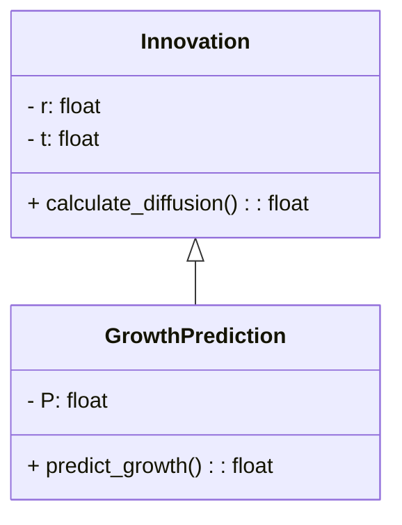

                 


# 肯尼斯费雪的创新驱动增长理论

## 关键词：
创新驱动增长，经济理论，创新扩散模型，系统架构，Python实现

## 摘要：
本文详细阐述了肯尼斯费雪的创新驱动增长理论，探讨了创新在经济增长中的核心作用。通过分析创新的基本概念、扩散模型、系统架构以及实际案例，本文为读者提供了从理论到实践的全面指南。文章还结合了Python代码实现和数学公式推导，帮助读者深入理解创新如何驱动经济增长。

---

# 引言

创新驱动增长理论是经济学和管理学中的一个重要理论，强调创新在推动经济增长中的关键作用。本文将从背景介绍、核心概念、数学模型、系统架构、项目实战等多个方面，全面解析这一理论。

---

## 第一部分：创新驱动增长理论的背景与核心概念

### 第1章：创新驱动增长理论的背景与问题背景

#### 1.1 创新驱动增长的背景介绍
- **1.1.1 经济增长的传统驱动因素**：劳动力、资本和自然资源。
- **1.1.2 创新对经济增长的作用**：技术创新、管理创新和制度创新推动经济进步。
- **1.1.3 费雪理论的提出背景**：应对经济增长放缓，寻找新的驱动力。

#### 1.2 问题背景与问题描述
- **1.2.1 经济增长中的问题**：资源枯竭、环境污染。
- **1.2.2 创新在解决经济问题中的作用**：通过技术进步降低资源消耗。
- **1.2.3 创新驱动增长的边界**：创新必须具备可扩展性和可持续性。

#### 1.3 问题解决与创新驱动增长的核心要素
- **1.3.1 创新驱动增长的实现路径**：技术创新、管理优化。
- **1.3.2 核心概念**：创新是经济增长的主要驱动力。
- **1.3.3 创新驱动增长的系统性特征**：协同效应、循环过程。

---

## 第二部分：创新的核心概念与理论联系

### 第2章：创新的基本概念与驱动力分析

#### 2.1 创新与增长的关系
- **2.1.1 创新的定义**：引入新产品、新工艺或新市场的行为。
- **2.1.2 创新与经济增长的内在联系**：创新促进生产力提升。
- **2.1.3 创新驱动增长的逻辑框架**：创新→效率提升→经济增长。

#### 2.2 创新驱动力的系统分析
- **2.2.1 技术创新的核心作用**：技术进步推动产业升级。
- **2.2.2 制度创新与管理创新的协同效应**：优化资源配置。
- **2.2.3 创新文化与社会环境的影响**：良好的创新环境促进创新。

---

## 第三部分：创新驱动增长的数学模型与算法原理

### 第3章：创新扩散模型与增长预测

#### 3.1 创新扩散的数学模型
- **3.1.1 创新扩散的基本假设**：创新在市场中的扩散是一个渐进过程。
- **3.1.2 创新扩散曲线的数学表达**：采用对数概率模型。
  $$ P(t) = \frac{1}{1 + e^{-rt}} $$
- **3.1.3 创新扩散模型的参数分析**：r是扩散速率，t是时间。

#### 3.2 创新驱动增长的算法实现
- **3.2.1 创新扩散模型的Python代码实现**
```python
import numpy as np
import matplotlib.pyplot as plt

def innovation_diffusion(r, t):
    return 1 / (1 + np.exp(-r * t))

t = np.linspace(0, 10, 100)
P = innovation_diffusion(0.5, t)

plt.plot(t, P)
plt.xlabel('Time')
plt.ylabel('Probability')
plt.title('Innovation Diffusion Model')
plt.show()
```

- **3.2.2 创新驱动增长的预测算法**
  $$ G(t) = a \cdot P(t) + b \cdot (1 - P(t)) $$
  其中，a和b是系数，表示创新对增长的促进作用。

---

## 第四部分：系统分析与架构设计

### 第4章：创新驱动增长的系统架构

#### 4.1 系统功能设计
- **4.1.1 领域模型设计（Mermaid类图）**


- **4.1.2 系统功能模块划分**：数据输入、模型计算、结果输出。
- **4.1.3 系统功能的实现流程**：数据预处理→模型计算→结果分析。

#### 4.2 系统架构设计
- **4.2.1 系统架构图（Mermaid架构图）**


- **4.2.2 系统组件的交互设计**：服务层调用模型层进行计算。
- **4.2.3 系统接口设计与实现**：RESTful API提供模型调用接口。

---

## 第五部分：项目实战与案例分析

### 第5章：创新驱动增长的项目实战

#### 5.1 环境安装与配置
- **5.1.1 开发环境的搭建**：安装Python、NumPy、Matplotlib。
- **5.1.2 项目依赖库的安装**：pip install numpy matplotlib。
- **5.1.3 数据集的准备与预处理**：收集创新相关数据，清洗数据。

#### 5.2 核心算法实现
- **5.2.1 创新扩散模型的Python代码实现**
```python
import numpy as np
import matplotlib.pyplot as plt

def innovation_diffusion(r, t):
    return 1 / (1 + np.exp(-r * t))

t = np.linspace(0, 10, 100)
P = innovation_diffusion(0.5, t)

plt.plot(t, P)
plt.xlabel('Time')
plt.ylabel('Probability')
plt.title('Innovation Diffusion Model')
plt.show()
```

- **5.2.2 创新驱动增长预测的代码实现**
```python
import numpy as np
import matplotlib.pyplot as plt

def predict_growth(a, b, P):
    return a * P + b * (1 - P)

a = 0.8
b = 0.2
P = np.random.uniform(0, 1, 100)

growth = predict_growth(a, b, P)

plt.plot(P, growth)
plt.xlabel('Probability')
plt.ylabel('Growth')
plt.title('Growth Prediction')
plt.show()
```

#### 5.3 案例分析与详细解读
- **5.3.1 案例背景与问题描述**：某行业的技术创新推动经济增长。
- **5.3.2 创新驱动增长模型的应用**：预测创新扩散对经济增长的影响。
- **5.3.3 实际案例的分析与结果解读**：通过模型预测，验证创新对增长的推动作用。

---

## 第六部分：最佳实践与小结

### 第6章：创新驱动增长的实践总结

#### 6.1 最佳实践与注意事项
- **数据质量**：确保数据准确性和完整性。
- **模型选择**：根据实际问题选择合适的模型。
- **持续优化**：定期更新模型参数，适应变化。

#### 6.2 小结
创新驱动增长理论通过创新推动经济增长，本文从理论到实践进行了详细探讨，提供了数学模型和系统架构的设计方法，以及实际案例的分析。

#### 6.3 注意事项
- 创新驱动增长需要长期投入和持续优化。
- 模型的应用需要结合实际情况，避免生搬硬套。

#### 6.4 拓展阅读
- 建议阅读《创新的源泉》（The Sources of Innovation）了解更多关于创新的知识。

---

# 结论

创新驱动增长理论通过创新推动经济增长，本文详细探讨了其背景、核心概念、数学模型、系统架构和实际应用。通过Python代码实现和案例分析，读者可以深入理解该理论，并将其应用于实际工作中。未来，随着技术的进步，创新驱动增长理论将不断发展，为经济增长提供更强大的动力。

---

# 附录

## 附录A：创新扩散模型的数学推导
推导创新扩散模型的过程，详细解释公式来源和适用条件。

## 附录B：系统架构设计的详细说明
详细描述系统架构图中各组件的功能和交互流程。

## 附录C：项目实战的代码扩展
提供更复杂的代码实现，如多变量模型和优化算法。

---

通过以上内容，读者可以全面理解肯尼斯费雪的创新驱动增长理论，并将其应用于实际的经济和管理实践中。

