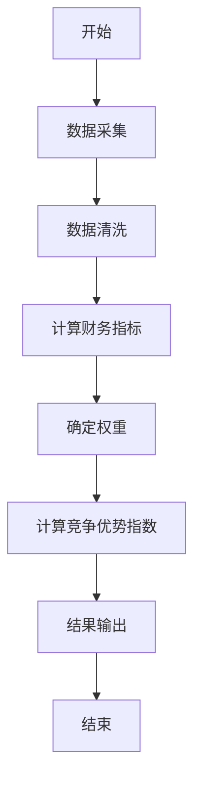
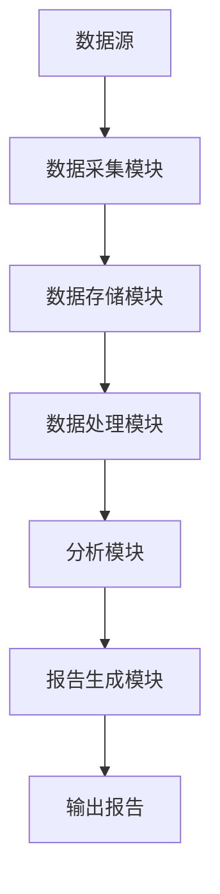

                 

# 肯尼斯费雪的竞争优势分析

> 关键词：竞争优势分析，肯尼斯·费雪，投资策略，企业分析，数学模型

> 摘要：本文深入探讨了肯尼斯·费雪的竞争优势分析理论，结合技术博客的形式，详细讲解了其核心概念、算法原理、数学模型、系统架构、项目实战及最佳实践。文章内容丰富，结构清晰，旨在帮助读者全面理解并实际应用竞争优势分析。

---

## 第1章: 竞争优势分析的背景与基础

### 1.1 竞争优势分析的定义与背景

#### 1.1.1 竞争优势的核心概念
竞争优势是指企业在市场中相对于竞争对手的独特优势，这种优势可以是资源、技术、品牌、成本或管理等方面。费雪认为，竞争优势是决定企业长期盈利能力的关键因素。

#### 1.1.2 竞争优势的分类与特征
竞争优势可以分为以下几类：
- **资源型优势**：企业独有的资源，如专利、原材料等。
- **成本优势**：生产成本低于竞争对手。
- **市场优势**：强大的市场地位和品牌影响力。
- **技术优势**：领先的技术和创新能力。

竞争优势的特征包括可持续性、可衡量性和可比较性。

#### 1.1.3 竞争优势与企业价值的关系
竞争优势直接影响企业的市场份额和盈利能力，从而影响其市场价值。费雪提出，具备持续竞争优势的企业，其股票往往能为投资者带来超额收益。

---

### 1.2 竞争优势分析的历史演变

#### 1.2.1 传统投资理论的局限性
传统投资理论（如基本面分析）过于依赖财务数据，忽略了企业竞争优势的动态变化。

#### 1.2.2 费雪竞争优势理论的提出
费雪在20世纪提出的竞争优势理论，强调企业核心竞争力和市场地位的重要性。

#### 1.2.3 现代竞争优势分析的发展
随着全球化和信息技术的发展，竞争优势分析逐渐融入更多的定量方法和模型。

---

### 1.3 竞争优势分析的重要性

#### 1.3.1 投资决策中的关键作用
竞争优势分析帮助投资者识别具备长期增长潜力的企业。

#### 1.3.2 企业竞争优势的识别与评估
企业可以通过竞争优势分析优化自身战略，提升竞争力。

#### 1.3.3 竞争优势分析的实践意义
在实际应用中，竞争优势分析可以帮助企业制定更好的投资和运营策略。

---

## 第2章: 费雪竞争优势分析的核心概念

### 2.1 竞争优势的构成要素

#### 2.1.1 企业的核心竞争力
核心竞争力是企业在市场上获胜的关键能力，例如技术创新能力或成本控制能力。

#### 2.1.2 市场地位与品牌价值
强大的市场地位和品牌价值是企业竞争优势的重要组成部分。

#### 2.1.3 财务状况与盈利能力
健康的财务状况和持续的盈利能力是企业竞争优势的财务基础。

---

### 2.2 竞争优势的衡量指标

#### 2.2.1 财务比率分析
常用的财务比率包括ROE（股东权益收益率）、ROA（资产收益率）和净利率。

#### 2.2.2 市盈率与市净率
市盈率（P/E）=股价/每股收益；市净率（P/B）=股价/每股净资产。

#### 2.2.3 股东权益收益率（ROE）
$$ROE = \frac{\text{净利润}}{\text{股东权益}}$$

---

### 2.3 竞争优势的动态变化

#### 2.3.1 行业周期的影响
行业周期波动会影响企业的竞争优势。

#### 2.3.2 竞争环境的变化
行业竞争加剧或放松管制可能改变竞争优势格局。

#### 2.3.3 企业战略调整的作用
企业通过战略调整可以增强或保持竞争优势。

---

## 第3章: 费雪竞争优势分析的数学模型与算法原理

### 3.1 竞争优势分析的数学模型

#### 3.1.1 财务指标的量化分析
通过量化分析财务指标，评估企业的财务健康状况。

#### 3.1.2 市场地位的评估模型
$$\text{市场地位指数} = \text{市场份额} \times \text{品牌影响力}$$

#### 3.1.3 综合竞争优势指数的计算公式
$$\text{竞争优势指数} = \alpha \times \text{ROE} + \beta \times \text{市场份额} + \gamma \times \text{品牌影响力}$$
其中，$\alpha$、$\beta$、$\gamma$为权重系数。

---

### 3.2 竞争优势分析的算法原理

#### 3.2.1 数据采集与处理
从财务报表和市场数据中提取相关指标。

#### 3.2.2 指标权重的确定
根据行业特点和企业实际情况确定各项指标的权重。

#### 3.2.3 综合评分的计算
根据公式计算综合竞争优势指数，并进行排名。

---

### 3.3 竞争优势分析的流程图

---

## 第4章: 竞争优势分析的系统架构与实现

### 4.1 系统架构设计

#### 4.1.1 系统功能模块划分
- 数据采集模块：负责数据的收集与存储。
- 数据处理模块：进行数据清洗和预处理。
- 分析模块：计算竞争优势指数。
- 报告生成模块：生成分析报告。

#### 4.1.2 系统数据流图

---

### 4.2 系统实现细节

#### 4.2.1 数据库设计与实现
使用关系型数据库存储企业数据，表结构包括企业ID、财务指标、市场份额等。

#### 4.2.2 算法实现与优化
编写Python脚本实现竞争优势指数的计算，优化算法效率。

#### 4.2.3 界面设计与用户体验
设计直观的用户界面，方便用户输入数据和查看结果。

---

### 4.3 系统接口设计

#### 4.3.1 数据接口规范
定义API接口，规范数据输入和输出格式。

#### 4.3.2 API设计与调用
使用RESTful API设计接口，供其他系统调用。

#### 4.3.3 接口测试与优化
通过测试确保接口稳定性和性能。

---

## 第5章: 项目实战——竞争优势分析的案例分析

### 5.1 项目背景与目标

#### 5.1.1 项目背景介绍
以某制造行业为例，分析行业内企业的竞争优势。

#### 5.1.2 项目目标与范围
通过竞争优势分析，筛选出具备长期增长潜力的企业。

#### 5.1.3 项目团队与分工
团队成员包括数据分析师、软件开发人员和行业专家。

---

### 5.2 数据收集与处理

#### 5.2.1 数据来源与采集
从财务报表和市场数据中收集相关指标。

#### 5.2.2 数据清洗与预处理
剔除无效数据，标准化处理。

#### 5.2.3 数据存储与管理
将数据存储在数据库中，便于后续处理。

---

### 5.3 竞争优势分析的实现

#### 5.3.1 竞争优势指数的计算
使用公式计算综合竞争优势指数。

#### 5.3.2 竞争优势报告的生成
生成包含分析结果的报告。

#### 5.3.3 竞争优势分析的可视化
使用图表展示分析结果。

---

### 5.4 案例分析与结果解读

#### 5.4.1 案例背景介绍
以某制造企业为例，分析其竞争优势。

#### 5.4.2 分析结果展示
展示计算出的竞争优势指数和排名。

#### 5.4.3 结果解读与策略建议
根据结果提出投资建议。

---

## 第6章: 竞争优势分析的最佳实践与注意事项

### 6.1 最佳实践

#### 6.1.1 数据来源的可靠性
确保数据来源可靠，避免错误分析。

#### 6.1.2 指标权重的合理性
根据实际情况调整指标权重，避免片面性。

#### 6.1.3 分析结果的动态更新
定期更新分析结果，适应市场变化。

---

### 6.2 小结

竞争优势分析是投资决策中的重要工具，通过定量分析和定性评估，帮助企业识别和增强竞争优势。

---

### 6.3 注意事项

- 数据分析需结合行业特点。
- 指标权重需合理分配。
- 分析结果需定期更新。

---

### 6.4 扩展阅读

推荐相关书籍和文献，供读者深入学习。

---

通过以上内容，我们可以全面理解肯尼斯费雪的竞争优势分析，并将其应用于实际投资分析中。希望本文能为读者提供有价值的见解和实用的方法。

