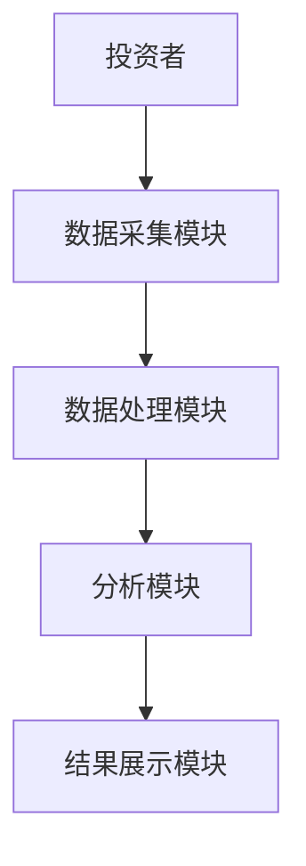

                 


# 肯尼斯费雪的长期增长型公司特征

## 关键词：长期增长型公司，肯尼斯费雪，财务指标，竞争优势，投资策略

## 摘要：  
本文将深入分析长期增长型公司的特征，从财务健康、竞争优势和市场定位等方面进行系统性探讨。通过结合肯尼斯费雪的投资理念，结合实际案例，为投资者提供一套识别和评估长期增长型公司的方法论。文章将涵盖长期增长型公司的定义、核心特征、投资策略、系统分析与项目实战，为读者提供全面而深入的见解。

---

## 第一部分: 长期增长型公司的背景与概念

### 第1章: 长期增长型公司的定义与背景

#### 1.1 长期增长型公司的定义
长期增长型公司是指那些在较长的时间跨度内能够持续实现收入和利润增长的企业。这些公司通常具有强大的竞争优势、稳定的财务表现和明确的市场定位。

#### 1.2 长期增长型公司的背景
- 长期增长型公司与经济周期的关系：在经济波动中表现出较强韧性。
- 投资者视角下的长期增长型公司：这类公司能够为投资者带来持续的超额回报。
- 长期增长型公司的社会价值：通过技术创新和市场扩展推动社会进步。

---

## 第2章: 长期增长型公司的核心特征

### 2.1 财务指标分析

| 财务指标       | 定义与意义                               |
|----------------|----------------------------------------|
| 净利润         | 公司在一定时期内的盈利水平，反映公司的盈利能力。 |
| 营业收入增长率 | 衡量公司收入增长的速度，反映市场需求和公司扩展能力。 |
| 资产回报率（ROA） | 衡量公司资产的使用效率，反映公司管理能力。 |

### 2.2 竞争优势分析

| 竞争优势       | 具体表现                               |
|----------------|----------------------------------------|
| 技术壁垒       | 公司通过技术创新形成市场壁垒。          |
| 市场垄断地位   | 公司在特定市场中占据主导地位。          |
| 成本优势       | 公司通过规模效应或技术优化降低成本。     |

### 2.3 市场定位与扩展能力

| 市场定位       | 表现形式                               |
|----------------|----------------------------------------|
| 行业地位       | 公司在行业中的排名和影响力。            |
| 市场扩展策略   | 区域扩张、产品线扩展、并购等。          |
| 全球化布局     | 将业务扩展到国际市场，提升增长空间。    |

---

## 第二部分: 长期增长型公司的竞争优势

### 第3章: 核心竞争力的构成

#### 3.1 技术创新与研发投入
- 技术创新是长期增长型公司的核心驱动力。
- 研发投入与公司未来增长潜力成正比。

#### 3.2 品牌影响力与客户忠诚度
- 强大的品牌影响力能够吸引更多的客户。
- 高客户忠诚度意味着公司具有稳定的收入来源。

---

## 第三部分: 长期增长型公司的投资价值评估

### 第4章: 投资价值评估模型

#### 4.1 财务健康指标
- 净利润与利润率：$$ \text{净利润率} = \frac{\text{净利润}}{\text{营业收入}} \times 100\% $$
- 资产回报率（ROA）：$$ \text{ROA} = \frac{\text{净利润}}{\text{平均资产总额}} \times 100\% $$
- 现金流分析：健康的现金流是公司持续增长的保障。

#### 4.2 市场地位与竞争优势
- 市场份额：$$ \text{市场份额} = \frac{\text{公司销售额}}{\text{行业总销售额}} \times 100\% $$
- 竞争对手分析：通过对比分析确定公司的竞争优势。

---

## 第四部分: 长期增长型公司的系统分析

### 第5章: 系统分析与架构设计

#### 5.1 问题场景介绍
- 识别长期增长型公司需要结合财务数据、市场数据和行业分析。

#### 5.2 系统架构设计


#### 5.3 算法实现
- 使用Python进行数据分析和建模：
  ```python
  import pandas as pd
  data = pd.read_csv('company_data.csv')
  # 计算增长率
  growth_rate = (data['revenue'].pct_change() * 100).round(2)
  ```

---

## 第五部分: 项目实战

### 第6章: 长期增长型公司案例分析

#### 6.1 苹果公司分析
- 财务表现：持续增长的收入和利润。
- 市场地位：全球科技行业的领导者。
- 技术创新：持续推出革命性产品。

#### 6.2 投资策略
- 基于苹果公司的财务和市场表现，制定长期投资计划。

---

## 第六部分: 总结与展望

### 第7章: 长期增长型公司的未来趋势

#### 7.1 未来发展趋势
- 数字化转型：推动企业增长的新引擎。
- 可持续发展：绿色经济成为新的增长点。

#### 7.2 挑战与应对策略
- 技术创新的压力：加大研发投入，保持技术领先。
- 市场竞争加剧：通过差异化竞争巩固市场地位。

---

## 注意事项：
- 长期增长型公司需要结合多维度的分析，不能仅凭单一指标判断。
- 投资者应结合市场环境和公司基本面进行综合评估。

---

## 扩展阅读：
- 《巴菲特的长期投资策略》
- 《费雪投资理论与实践》
- 《企业成长的五个驱动力》

---

通过以上分析，我们可以清晰地看到长期增长型公司的特征和投资价值。希望本文能够为投资者和企业管理者提供有价值的参考。

