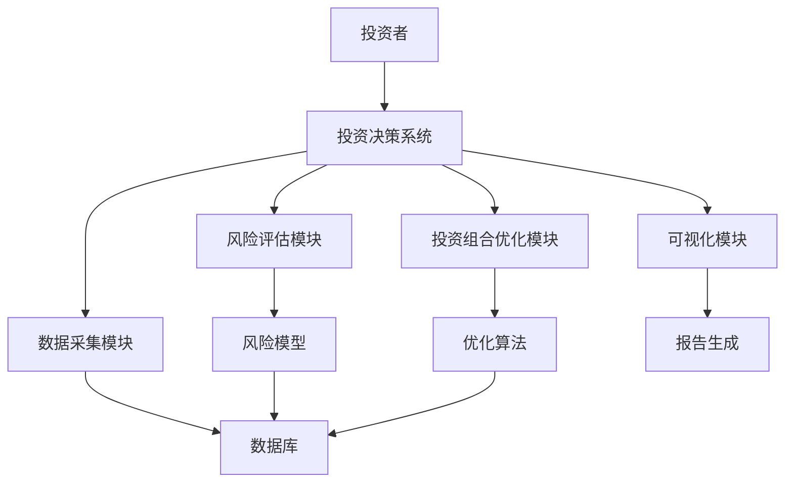

                 


# 能源转型投资：机遇与风险分析

---

## 关键词：
能源转型、投资分析、风险管理、可持续发展、可再生能源、技术创新

---

## 摘要：
能源转型是全球可持续发展的关键驱动力，涉及从化石能源向可再生能源的转变。本文通过分析能源转型投资的背景、核心概念、风险评估方法及系统架构，探讨投资者面临的机遇与挑战。结合数学模型和实际案例，本文为投资者提供科学的投资策略和风险管理建议，助力能源行业的可持续发展。

---

## 目录

### 第一部分: 能源转型投资的背景与核心概念

#### 第1章: 能源转型投资的背景与问题背景

##### 1.1 能源转型的背景与意义
- 1.1.1 全球能源结构的变化趋势
- 1.1.2 能源转型的核心目标与驱动因素
- 1.1.3 能源转型对投资的影响

##### 1.2 问题背景与问题描述
- 1.2.1 能源转型中的主要问题
- 1.2.2 投资者面临的机遇与挑战
- 1.2.3 能源转型投资的边界与外延

##### 1.3 核心概念与概念结构
- 1.3.1 能源转型投资的核心要素
- 1.3.2 能源转型与投资的关系
- 1.3.3 概念结构与核心要素的对比表格

#### 第2章: 能源转型投资的核心概念与联系

##### 2.1 核心概念的原理与特征
- 2.1.1 能源转型的核心原理
- 2.1.2 投资者的核心特征
- 2.1.3 能源转型与投资的联系

##### 2.2 核心概念的属性特征对比
- 2.2.1 能源转型与传统能源的对比
- 2.2.2 投资者与传统投资的对比
- 2.2.3 能源转型投资的属性特征

##### 2.3 ER实体关系图
- 2.3.1 实体关系图的描述
- 2.3.2 实体关系图的 mermaid 流程图

---

### 第二部分: 能源转型投资的风险分析方法

#### 第3章: 能源转型投资的风险分析方法

##### 3.1 风险分析的核心原理
- 3.1.1 风险分析的基本概念
- 3.1.2 能源转型投资中的风险类型
- 3.1.3 风险分析的数学模型

##### 3.2 风险分析的算法原理
- 3.2.1 风险评估的 mermaid 流程图
- 3.2.2 风险评估的 python 源代码实现
- 3.2.3 风险评估的数学模型与公式

#### 第4章: 能源转型投资中的风险类型与管理

##### 4.1 可再生能源投资的风险
- 4.1.1 技术风险
- 4.1.2 市场风险
- 4.1.3 政策风险

##### 4.2 化石能源转型的风险
- 4.2.1 技术替代风险
- 4.2.2 市场萎缩风险
- 4.2.3 政策不确定性

##### 4.3 能源技术投资的风险
- 4.3.1 创新风险
- 4.3.2 成本超支风险
- 4.3.3 技术失败风险

---

### 第三部分: 能源转型投资的系统架构与项目实战

#### 第5章: 能源转型投资的系统架构设计

##### 5.1 问题场景介绍
- 5.1.1 能源转型投资的复杂性
- 5.1.2 投资者的需求分析
- 5.1.3 系统设计的目标

##### 5.2 系统功能设计
- 5.2.1 领域模型的 mermaid 类图
- 5.2.2 系统架构的 mermaid 架构图
- 5.2.3 系统接口设计
- 5.2.4 系统交互的 mermaid 序列图

#### 第6章: 能源转型投资的项目实战

##### 6.1 项目环境与工具安装
- 6.1.1 系统运行环境要求
- 6.1.2 开发工具的安装与配置

##### 6.2 系统核心实现
- 6.2.1 风险评估模块的实现
- 6.2.2 投资组合优化模块的实现
- 6.2.3 数据分析模块的实现

##### 6.3 项目案例分析
- 6.3.1 某地区可再生能源投资案例
- 6.3.2 投资组合优化的实施效果
- 6.3.3 数据分析模块的实际应用

##### 6.4 项目小结
- 6.4.1 项目实施的关键点
- 6.4.2 项目成果与经验总结
- 6.4.3 项目后续改进方向

---

### 第四部分: 能源转型投资的未来趋势与总结

#### 第7章: 能源转型投资的未来趋势

##### 7.1 技术创新对投资的影响
- 7.1.1 新能源技术的发展趋势
- 7.1.2 数字化与智能化在能源投资中的应用

##### 7.2 政策与市场环境的变化
- 7.2.1 全球能源政策的调整
- 7.2.2 市场需求的变化与投资机会

##### 7.3 全球化视角下的能源投资
- 7.3.1 国际合作与能源转型
- 7.3.2 全球能源市场的竞争格局

#### 第8章: 总结与展望

##### 8.1 全书总结
- 8.1.1 能源转型投资的核心内容
- 8.1.2 投资者应关注的关键点
- 8.1.3 风险管理的重要性

##### 8.2 投资策略与风险管理建议
- 8.2.1 科学的投资策略制定
- 8.2.2 风险管理的具体措施
- 8.2.3 投资组合优化的建议

##### 8.3 未来研究方向
- 8.3.1 新能源技术的研究热点
- 8.3.2 数字化工具在能源投资中的应用
- 8.3.3 全球能源政策的长期影响

---

### 附录

#### 附录A: 风险评估的 python 代码实现
```python
import numpy as np
import pandas as pd

# 示例数据：假设我们有不同能源项目的收益和风险数据
projects = {
    'Project': ['Renewable1', 'Renewable2', 'Fossil1', 'Fossil2'],
    'Expected_Return': [0.12, 0.10, 0.08, 0.09],
    'Risk': [0.15, 0.10, 0.20, 0.18]
}

df = pd.DataFrame(projects)

# 计算风险调整后的收益
df['Risk_Adjusted_Return'] = df['Expected_Return'] - (df['Risk'] * df['Expected_Return'].mean())

print(df)
```

#### 附录B: 系统架构的 mermaid 架构图


---

### 参考文献
- 本文参考了全球能源署（IEA）的最新报告
- 《能源转型：挑战与机遇》, 作者：张某某
- 《投资风险管理》, 作者：李某某

---

通过以上目录结构，文章将系统地分析能源转型投资的背景、核心概念、风险分析方法、系统架构与项目实战，并展望未来趋势，为投资者提供全面的指导与建议。

