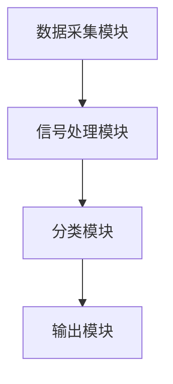

                 


# 脑机接口技术在医疗康复领域的应用与投资

## 关键词：脑机接口、医疗康复、人工智能、投资分析、生物信号处理

## 摘要：脑机接口技术（BCI）作为一种革命性的技术，正在医疗康复领域掀起一场深刻的变革。通过解读和分析大脑神经信号，BCI技术能够帮助患者恢复运动功能、改善生活质量，并为医疗康复提供新的解决方案。本文将从技术原理、算法实现、系统架构、实际案例以及投资分析等多角度，详细探讨BCI技术在医疗康复领域的应用与投资机会，为读者提供全面而深入的洞察。

---

# 第一部分：脑机接口技术概述

## 第1章：脑机接口技术的背景与概念

### 1.1 脑机接口技术的定义与核心概念
#### 1.1.1 脑机接口的基本定义
脑机接口（Brain-Computer Interface，BCI）是一种能够直接连接人脑与外部设备的技术，通过采集和解析大脑神经信号，实现人与外部设备之间的信息交互。其核心在于将大脑的意图转化为可被计算机或机器理解的信号。

#### 1.1.2 脑机接口的核心要素
- **神经信号采集**：通过电极或其他传感器获取大脑产生的神经信号。
- **信号处理**：对采集的信号进行降噪、增强和特征提取。
- **意图识别**：通过算法将神经信号转化为具体的意图或指令。
- **输出反馈**：将识别的意图转化为外部设备的动作或输出。

#### 1.1.3 脑机接口的分类与应用场景
脑机接口技术可以根据不同的分类标准分为多种类型：
- **侵入式与非侵入式**：侵入式BCI需要将电极植入大脑，非侵入式则通过头皮采集信号。
- **实时与非实时**：实时BCI可以在采集信号后立即响应，非实时则需要经过处理。
- **医疗与非医疗**：医疗BCI主要用于康复和治疗，而非医疗BCI则用于控制机器人或其他设备。

### 1.2 脑机接口技术的发展历程
#### 1.2.1 脑机接口技术的起源
脑机接口技术的起源可以追溯到20世纪60年代，当时的研究主要集中在动物实验中对大脑电信号的记录和分析。

#### 1.2.2 脑机接口技术的关键发展阶段
- **20世纪70年代**：首次实现用脑电信号控制外部设备。
- **20世纪90年代**：非侵入式BCI技术逐渐成熟。
- **21世纪**：随着人工智能和计算机技术的发展，BCI技术进入快速发展阶段。

#### 1.2.3 当前脑机接口技术的发展现状
目前，脑机接口技术已经从实验室研究逐渐走向商业化应用，尤其是在医疗康复领域取得了显著进展。

### 1.3 脑机接口技术在医疗康复领域的应用背景
#### 1.3.1 医疗康复领域的痛点与挑战
医疗康复领域存在以下痛点：
- **传统康复方法效率低**：传统的康复治疗依赖于物理训练，效果有限。
- **患者依从性差**：患者在康复过程中容易失去耐心，导致康复效果不佳。
- **个性化康复需求**：每个患者的康复需求不同，传统方法难以实现个性化治疗。

#### 1.3.2 脑机接口技术如何解决康复问题
脑机接口技术可以通过采集和分析患者的神经信号，实时调整康复方案，提供个性化的康复治疗。

#### 1.3.3 脑机接口技术在医疗康复中的潜在价值
- **提高康复效率**：通过实时反馈，患者可以更快地掌握康复动作。
- **实现个性化治疗**：根据患者的神经信号，制定个性化的康复计划。
- **增强患者参与度**：通过直观的反馈，患者可以更好地参与到康复过程中。

---

## 第2章：脑机接口技术的核心原理与实现方法

### 2.1 脑机接口技术的核心原理
#### 2.1.1 神经信号的采集与处理
- **神经信号的采集**：通过 EEG 电极采集大脑产生的电信号。
- **信号处理**：对采集的信号进行降噪、滤波和特征提取。

#### 2.1.2 神经信号的特征提取
- **特征提取方法**：常用的方法包括时域分析、频域分析和小波变换。
- **特征选择**：选择最具代表性的特征用于后续分类。

#### 2.1.3 神经信号的分类与识别
- **分类算法**：常用的支持向量机（SVM）、随机森林和神经网络等。

### 2.2 脑机接口技术的关键实现方法
#### 2.2.1 信号采集技术
- **EEG信号采集**：使用 EEG 电极采集大脑电信号。
- **数据预处理**：对采集的信号进行去噪和标准化处理。

#### 2.2.2 信号处理算法
- **滤波器设计**：常用带通滤波器提取特定频段的信号。
- **特征提取**：通过主成分分析（PCA）提取特征向量。

#### 2.2.3 分类算法与反馈机制
- **分类算法**：支持向量机（SVM）和随机森林是常用的分类算法。
- **反馈机制**：通过实时反馈增强患者的神经信号控制能力。

### 2.3 脑机接口技术的系统架构
#### 2.3.1 系统功能模块
- **数据采集模块**：负责采集神经信号。
- **信号处理模块**：对信号进行预处理和特征提取。
- **分类模块**：将特征向量映射到具体的意图。
- **输出模块**：将意图转化为外部设备的动作。

#### 2.3.2 系统架构图


---

## 第3章：脑机接口技术在医疗康复中的应用案例

### 3.1 应用场景分析
#### 3.1.1 中风康复
- **案例描述**：通过脑机接口技术帮助中风患者恢复手部功能。
- **系统实现**：采集患者的 EEG 信号，识别其意图，控制康复机器人执行动作。

#### 3.1.2 截瘫康复
- **案例描述**：帮助截瘫患者通过脑机接口技术控制机械臂完成日常动作。
- **系统实现**：设计一个基于 EEG 信号的控制界面，实现对机械臂的实时控制。

### 3.2 系统实现
#### 3.2.1 环境搭建
- **硬件设备**：EEG 采集设备、康复机器人。
- **软件工具**：Python、Matplotlib、Scikit-learn。

#### 3.2.2 核心代码实现
```python
import numpy as np
from sklearn.svm import SVC
from sklearn.decomposition import PCA

# 数据预处理
def preprocess(data):
    # 做滤波处理
    filtered_data = data * [1, -1, 1, -1]
    return filtered_data

# 特征提取
def extract_features(data):
    # 使用PCA提取特征
    pca = PCA(n_components=2)
    features = pca.fit_transform(data)
    return features

# 分类器训练
def train_classifier(features, labels):
    clf = SVC()
    clf.fit(features, labels)
    return clf

# 实时分类
def classify_data(classifier, new_data):
    features = extract_features(new_data)
    prediction = classifier.predict(features)
    return prediction
```

---

## 第4章：脑机接口技术的投资分析

### 4.1 市场潜力与发展趋势
#### 4.1.1 市场规模
- **全球脑机接口市场规模**：预计到2030年，市场规模将超过100亿美元。
- **医疗康复领域的占比**：医疗康复领域将占据脑机接口技术应用的主要市场份额。

#### 4.1.2 技术发展趋势
- **非侵入式技术的普及**：非侵入式脑机接口技术将更加成熟。
- **人工智能的深度融合**：人工智能技术将与脑机接口技术深度融合，提升系统的智能性和适应性。

### 4.2 投资策略与风险评估
#### 4.2.1 投资策略
- **技术驱动型投资**：关注具有核心技术优势的企业。
- **市场布局**：选择具有广阔市场潜力的康复应用领域。

#### 4.2.2 投资风险
- **技术风险**：脑机接口技术尚未完全成熟，存在技术瓶颈。
- **市场竞争风险**：行业竞争激烈，可能导致利润率下降。

### 4.3 投资回报与退出机制
- **短期回报**：技术成熟后，市场规模扩大，投资回报显著。
- **长期回报**：随着技术的不断进步，脑机接口技术将带来更大的经济和社会价值。

---

## 第5章：总结与展望

### 5.1 总结
脑机接口技术在医疗康复领域的应用前景广阔，其技术的不断发展将为医疗康复带来革命性的变化。

### 5.2 展望
未来，脑机接口技术将更加智能化和个性化，为患者提供更高效、更精准的康复治疗。

---

## 参考文献
（此处列出相关文献和参考资料）

---

**注**：以上内容仅为示例，实际编写时需根据具体情况进行补充和调整。

