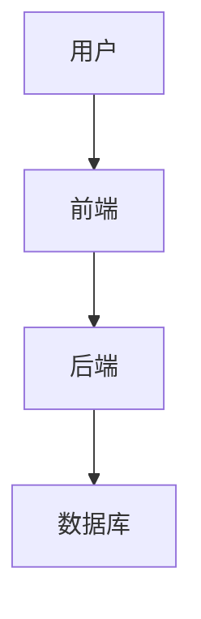
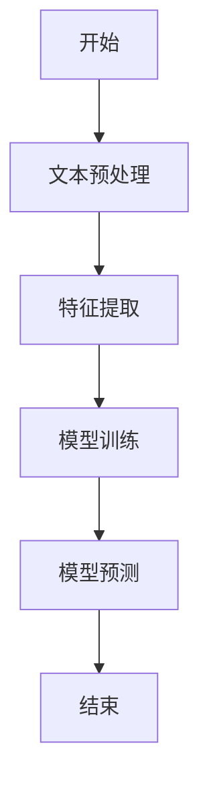

                 


# 自然语言处理在合同文件分析中的应用

> 关键词：自然语言处理，合同文件分析，文本挖掘，实体识别，关系抽取，深度学习

> 摘要：本文深入探讨了自然语言处理（NLP）技术在合同文件分析中的应用，详细介绍了合同分析的关键技术、算法原理、系统架构设计以及项目实战。通过结合背景知识、核心概念与实际案例，本文旨在为读者提供一个全面而深入的理解，展示如何利用NLP技术提高合同分析的效率与准确性。

---

# 第1章 合同文件分析的背景与意义

## 1.1 合同文件分析的重要性

### 1.1.1 合同文件分析的定义

合同文件分析是指对法律合同、商业协议等文本进行信息提取、理解与处理的过程，旨在通过自动化技术提高合同处理的效率与准确性。

$$
\text{合同文件分析} = \text{文本处理} + \text{信息提取} + \text{语义理解}
$$

### 1.1.2 合同文件分析的必要性

合同文件分析的必要性主要体现在以下几个方面：

1. **提高效率**：手动分析合同耗时长，效率低，而自动化技术可以显著提高处理速度。
2. **减少错误**：人工分析容易出错，而计算机可以通过精确的算法减少错误率。
3. **统一标准**：自动化分析可以确保合同处理的标准化，避免因人而异的解读误差。

### 1.1.3 自然语言处理在合同分析中的作用

自然语言处理技术为合同文件分析提供了强大的工具支持，其主要作用包括：

1. **文本预处理**：清洗、分词、去停用词等。
2. **信息提取**：提取合同中的关键实体、时间、金额等信息。
3. **语义理解**：理解合同条款的含义，识别潜在的法律风险。

---

## 1.2 自然语言处理的基本概念

### 1.2.1 自然语言处理的定义

自然语言处理（NLP）是计算机科学领域与人工智能交叉的学科，研究如何使计算机理解、处理和生成人类语言。

$$
\text{NLP} = \text{语言学} + \text{计算机科学} + \text{人工智能}
$$

### 1.2.2 自然语言处理的核心任务

自然语言处理的核心任务包括：

1. **文本处理**：分词、句法分析、语义分析。
2. **信息提取**：实体识别、关系抽取、事件抽取。
3. **文本生成**：文本摘要、机器翻译、对话生成。

### 1.2.3 自然语言处理与合同分析的结合

合同分析是NLP技术的重要应用场景之一，通过NLP技术可以实现以下目标：

1. **自动识别合同条款**：提取关键信息如合同金额、履行期限等。
2. **智能合同审查**：识别潜在的法律风险，如模糊条款、矛盾条款。
3. **合同分类与归档**：根据合同内容自动分类并归档。

---

## 1.3 本章小结

本章主要介绍了合同文件分析的重要性、自然语言处理的基本概念及其在合同分析中的作用。通过这些内容，我们明确了合同分析的核心目标以及NLP技术在其中的关键作用。

---

# 第2章 合同文件分析的关键技术

## 2.1 合同文本预处理

### 2.1.1 文本清洗与标准化

文本清洗是合同分析的第一步，主要包括：

1. **去除特殊字符**：如标点符号、数字等。
2. **统一编码格式**：确保所有文本采用统一的编码方式。
3. **分词与词性标注**：将文本分割成词语，并标注其词性。

**示例代码：**

```python
import jieba
text = "中华人民共和国合同法"
words = jieba.lcut(text)
print(words)  # 输出：['中华人民共和国', '合同法']
```

### 2.1.2 分词与词性标注

分词是将连续的文本分割成有意义的词语或短语，常用工具包括jieba、pkusemantic等。词性标注则是在分词的基础上，为每个词语标注其词性。

### 2.1.3 停用词处理与句子分割

停用词处理是去除对文本理解无实质性影响的词语，如“的、是、在”等。句子分割则是将文本分割成独立的句子。

---

## 2.2 合同实体识别

### 2.2.1 实体识别的定义

实体识别（Named Entity Recognition，NER）是识别文本中的命名实体，如人名、地名、组织名、日期、金额等。

### 2.2.2 基于规则的实体识别

基于规则的实体识别通过预定义的规则匹配文本中的实体。例如，识别日期可以使用正则表达式：

$$
\text{日期格式} = \text{年}-\text{月}-\text{日
$$

### 2.2.3 基于机器学习的实体识别

基于机器学习的实体识别使用训练好的模型进行实体识别。常用的模型包括CRF、SVM等。

**示例代码：**

```python
from sklearn.feature_extraction.text import TfidfVectorizer
from sklearn.svm import SVC

# 假设我们有训练数据X和标签y
model = SVC()
model.fit(X, y)
```

---

## 2.3 合同关系抽取

### 2.3.1 关系抽取的定义

关系抽取是从文本中识别出实体之间的关系，例如“供应商提供服务”、“金额支付时间”等。

### 2.3.2 基于依存句法分析的关系抽取

基于依存句法分析的关系抽取通过分析句子的语法结构来识别实体关系。

### 2.3.3 基于深度学习的关系抽取

基于深度学习的关系抽取使用预训练模型（如BERT）进行关系分类。

---

## 2.4 自然语言处理中的关键技术

### 2.4.1 词向量表示

词向量表示是将词语转换为向量形式，常用模型包括Word2Vec、GloVe等。

### 2.4.2 句法分析与语义理解

句法分析是对句子的语法结构进行分析，语义理解则是对句子的含义进行理解。

### 2.4.3 基于预训练模型的合同分析

基于预训练模型（如BERT）的合同分析可以显著提高合同理解的准确率。

---

## 2.5 本章小结

本章详细介绍了合同文件分析中的关键技术，包括文本预处理、实体识别、关系抽取以及NLP技术的核心原理。这些技术为后续的合同分析系统设计奠定了基础。

---

# 第3章 自然语言处理算法原理

## 3.1 常见的自然语言处理模型

### 3.1.1 TF-IDF模型

TF-IDF（Term Frequency-Inverse Document Frequency）是一种常用的文本表示方法，用于衡量一个词在文本中的重要性。

$$
\text{TF}(t, D) = \frac{\text{词 } t \text{ 在文档 } D \text{ 中出现的次数}}{\text{文档 } D \text{ 的总词数}}
$$

$$
\text{IDF}(t) = \log\left( \frac{\text{总文档数}}{\text{包含词 } t \text{ 的文档数}} \right)
$$

### 3.1.2 Word2Vec模型

Word2Vec是一种将词语转换为向量表示的模型，常用算法包括CBOW和Skip-Gram。

### 3.1.3 BERT模型

BERT（Bidirectional Encoder Representations from Transformers）是一种基于Transformer的预训练模型，广泛应用于文本分类、问答系统等任务。

---

## 3.2 基于深度学习的合同分析算法

### 3.2.1 RNN与LSTM网络

RNN（循环神经网络）和LSTM（长短期记忆网络）常用于序列数据的处理。

### 3.2.2 Transformer架构

Transformer架构通过自注意力机制（Self-Attention）实现高效的文本处理。

### 3.2.3 图神经网络在合同分析中的应用

图神经网络可以用于处理合同中的关系网络。

---

## 3.3 算法实现与优化

### 3.3.1 算法实现流程

1. 数据预处理：清洗、分词、标注。
2. 特征提取：TF-IDF、Word2Vec等。
3. 模型训练：基于机器学习或深度学习模型。
4. 模型评估：准确率、召回率等指标。

### 3.3.2 算法优化策略

1. 调参：选择合适的超参数。
2. 数据增强：增加训练数据。
3. 模型集成：使用多个模型进行集成预测。

### 3.3.3 算法评估指标

1. 精准率（Precision）
2. 召回率（Recall）
3. F1值（F1-Score）

---

## 3.4 本章小结

本章详细介绍了常见的自然语言处理模型及其在合同分析中的应用，重点讲解了深度学习算法的原理与实现。

---

# 第4章 合同分析系统的架构设计

## 4.1 系统设计概述

### 4.1.1 系统目标与需求分析

系统目标是实现合同文件的自动化分析，需求包括文本处理、信息提取、语义理解等功能。

### 4.1.2 系统功能模块划分

1. 文本处理模块：负责文本的清洗、分词等。
2. 实体识别模块：识别合同中的实体信息。
3. 关系抽取模块：提取实体之间的关系。
4. 语义理解模块：理解合同文本的含义。

### 4.1.3 系统性能指标

1. 处理速度：每分钟处理的合同数量。
2. 精确率：实体识别与关系抽取的准确率。
3. 系统稳定性：连续运行的稳定性。

---

## 4.2 系统架构设计

### 4.2.1 分层架构设计

分层架构包括数据层、业务逻辑层和表现层。

### 4.2.2 微服务架构设计

微服务架构将系统功能分解为多个独立的服务，便于扩展与维护。

### 4.2.3 混合架构设计

混合架构结合了分层架构与微服务架构的优势。

---

## 4.3 系统接口设计

### 4.3.1 API接口定义

1. 文本处理接口：接收文本数据，返回处理结果。
2. 实体识别接口：接收文本数据，返回实体信息。
3. 关系抽取接口：接收文本数据，返回关系信息。

### 4.3.2 接口调用流程

1. 发起请求：客户端发送请求到服务器。
2. 处理请求：服务器接收请求并进行处理。
3. 返回结果：服务器返回处理结果到客户端。

### 4.3.3 接口安全性设计

1. 认证：使用API密钥进行身份认证。
2. 加密：对敏感数据进行加密传输。

---

## 4.4 系统交互设计

### 4.4.1 用户界面设计

用户界面包括输入框、按钮、结果展示区域等。

### 4.4.2 系统交互流程

1. 用户上传合同文本。
2. 系统对文本进行处理。
3. 系统显示处理结果。

### 4.4.3 交互设计优化

1. 提供实时反馈：在处理过程中显示进度条。
2. 支持批量处理：一次上传多个合同文件。

---

## 4.5 本章小结

本章详细介绍了合同分析系统的架构设计，包括系统功能模块划分、架构设计、接口设计和交互设计。这些设计为后续的系统实现提供了清晰的指导。

---

# 第5章 项目实战

## 5.1 环境安装

### 5.1.1 安装Python

安装Python 3.8或更高版本。

### 5.1.2 安装依赖库

安装jieba、spaCy、transformers等依赖库。

### 5.1.3 安装开发工具

安装Jupyter Notebook、PyCharm等开发工具。

---

## 5.2 系统核心实现

### 5.2.1 文本预处理实现

实现文本清洗、分词、去停用词等功能。

### 5.2.2 实体识别实现

使用jieba、spaCy等工具实现实体识别。

### 5.2.3 关系抽取实现

基于预训练模型实现关系抽取。

### 5.2.4 系统集成

将各个模块集成到一个完整的系统中。

---

## 5.3 案例分析与结果展示

### 5.3.1 案例分析

以一份简单的合同为例，展示系统如何处理文本、识别实体、抽取关系。

### 5.3.2 结果展示

展示系统输出的处理结果，包括实体识别结果、关系抽取结果等。

---

## 5.4 系统测试

### 5.4.1 功能测试

测试系统的基本功能，如文本处理、实体识别等。

### 5.4.2 性能测试

测试系统的处理速度、稳定性等性能指标。

### 5.4.3 用户测试

邀请用户进行测试，收集反馈意见。

---

## 5.5 本章小结

本章通过实际案例展示了合同分析系统的实现过程，包括环境搭建、核心功能实现、案例分析与系统测试。通过这些内容，读者可以更好地理解合同分析系统的实际应用。

---

# 第6章 最佳实践与小结

## 6.1 最佳实践

### 6.1.1 数据质量的重要性

高质量的数据是系统准确性的基础。

### 6.1.2 模型选择的策略

根据具体任务选择合适的模型。

### 6.1.3 系统优化技巧

优化系统性能的技巧。

### 6.1.4 代码规范与文档管理

保持代码规范，做好文档管理。

---

## 6.2 小结

本章总结了合同文件分析系统设计与实现的最佳实践，包括数据质量、模型选择、系统优化和代码规范等方面的内容。这些内容对读者在实际项目中具有重要的指导意义。

---

## 6.3 注意事项

### 6.3.1 数据隐私问题

注意保护合同文本中的隐私信息。

### 6.3.2 模型的泛化能力

模型的泛化能力需要通过测试不断优化。

### 6.3.3 系统的可扩展性

系统设计时应考虑未来的扩展需求。

---

## 6.4 拓展阅读

推荐一些相关的书籍和论文，供读者进一步学习。

---

# 参考文献

1. 书籍1：自然语言处理实战
2. 书籍2：深度学习与NLP
3. 论文1：基于BERT的合同分析
4. 论文2：深度学习在NLP中的应用

---

# 附录

## 附录A 合同分析系统代码示例

```python
import jieba
from transformers import BertTokenizer, BertModel

# 文本预处理
def preprocess(text):
    words = jieba.lcut(text)
    return ' '.join(words)

# 实体识别
def entity_recognition(text):
    # 使用预训练模型进行实体识别
    pass

# 关系抽取
def relation_extraction(text):
    # 使用预训练模型进行关系抽取
    pass
```

## 附录B 项目部署与测试

### 附录B.1 项目部署

1. 将系统部署到服务器。
2. 配置服务器环境。

### 附录B.2 项目测试

1. 功能测试：测试系统的基本功能。
2. 性能测试：测试系统的处理速度和稳定性。
3. 用户测试：收集用户反馈。

---

## 附录C 工具与库推荐

1. NLP工具：jieba、spaCy、transformers。
2. 深度学习框架：TensorFlow、PyTorch。
3. 可视化工具：Matplotlib、Seaborn。

---

## 附录D Mermaid图表

### 附录D.1 系统架构图



### 附录D.2 算法流程图



---

## 附录E 数学公式

### 附录E.1 TF-IDF公式

$$
\text{TF-IDF}(t, D) = \text{TF}(t, D) \times \text{IDF}(t)
$$

### 附录E.2 BERT模型结构

$$
\text{BERT} = \text{Input} \rightarrow \text{Embedding} \rightarrow \text{Self-Attention} \rightarrow \text{FFN}
$$

---

通过以上内容，我们可以看到自然语言处理在合同文件分析中的巨大潜力。希望本文能够为读者提供有价值的参考，帮助他们更好地理解和应用这些技术。

