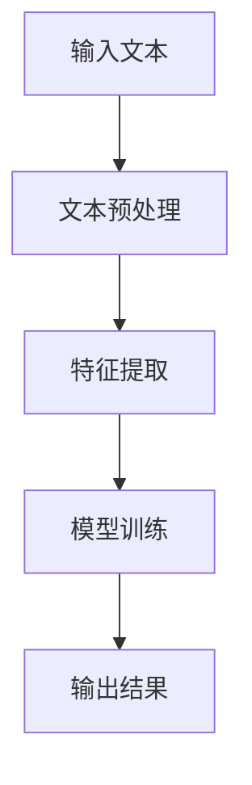
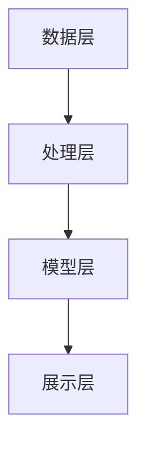

                 


# 自然语言处理技术在金融新闻分析中的应用

> **关键词**：自然语言处理，金融新闻分析，情感分析，文本挖掘，深度学习，金融风险管理

> **摘要**：自然语言处理（NLP）技术在金融新闻分析中具有重要应用价值。本文详细探讨了NLP技术在金融新闻分析中的核心概念、算法原理、系统架构设计及项目实战。通过分析文本预处理、特征提取、情感分析、实体识别和事件抽取等关键步骤，本文为读者提供了从理论到实践的全面指南。同时，文章还讨论了NLP在金融风险管理中的实际应用，为金融从业者和技术开发者提供了有价值的参考。

---

## 第1章: 自然语言处理与金融新闻分析的背景

### 1.1 自然语言处理技术的基本概念

#### 1.1.1 自然语言处理的定义与核心任务

自然语言处理（Natural Language Processing，NLP）是计算机科学、人工智能和语言学的交叉领域，旨在使计算机能够理解、解析和生成人类语言。其核心任务包括文本分类、情感分析、命名实体识别（NER）、关系抽取、文本摘要和机器翻译等。

#### 1.1.2 金融新闻分析的定义与目标

金融新闻分析是指通过对新闻文本的处理，提取有价值的信息，如市场情绪、公司动态、经济指标等，以辅助金融决策。其目标是通过自动化手段，从海量金融文本中快速获取关键信息，帮助投资者和机构做出更明智的决策。

#### 1.1.3 自然语言处理在金融新闻分析中的应用价值

NLP技术在金融新闻分析中的应用价值体现在以下几个方面：
1. **情感分析**：识别新闻中的情感倾向，预测市场情绪。
2. **实体识别**：提取公司名称、人物、日期等关键实体。
3. **事件抽取**：识别新闻中的关键事件，如并购、业绩发布等。
4. **主题分类**：将新闻按主题分类，便于信息筛选和分析。

### 1.2 问题背景与问题描述

#### 1.2.1 金融市场的信息复杂性

金融市场信息的复杂性主要体现在以下几个方面：
- 信息来源广泛：包括新闻、社交媒体、公司财报等。
- 信息更新速度快：市场动态随时变化，需要实时处理。
- 信息关联性强：单条新闻可能影响多个市场和公司。

#### 1.2.2 传统金融分析的局限性

传统金融分析主要依赖定量分析和经验判断，其局限性包括：
- 数据量有限：难以捕捉全市场信息。
- 处理效率低：人工分析耗时耗力。
- 主观性较强：依赖分析师的个人判断。

#### 1.2.3 自然语言处理在金融新闻分析中的问题解决

NLP技术通过自动化处理文本信息，解决了传统金融分析的局限性。例如：
- 自动提取新闻中的实体和事件，提高信息处理效率。
- 量化市场情绪，提供数据支持决策。
- 发现潜在的市场趋势，帮助投资者预判市场动向。

### 1.3 自然语言处理在金融新闻分析中的边界与外延

#### 1.3.1 金融新闻分析的边界

金融新闻分析的边界包括：
- 数据范围：仅限于新闻文本，不包括其他数据源（如社交媒体）。
- 分析深度：通常局限于表面信息，难以理解隐含含义。
- 情感极性：主要分析情感倾向，难以捕捉复杂的情感层次。

#### 1.3.2 自然语言处理的适用范围

NLP在金融新闻分析中的适用范围包括：
- 情感分析：预测市场情绪。
- 实体识别：提取公司、人物等信息。
- 事件抽取：识别关键事件。
- 主题分类：按主题分类新闻。

#### 1.3.3 与其他技术的结合与区别

NLP与其他技术的结合与区别：
- **结合技术**：与机器学习、深度学习结合，提升分析精度。
- **区别**：NLP专注于文本处理，其他技术如量化分析专注于数据计算。

### 1.4 核心概念与组成要素

#### 1.4.1 金融新闻分析的核心要素

金融新闻分析的核心要素包括：
- 新闻内容：文本信息。
- 市场情绪：情感分析结果。
- 实体信息：公司、人物等。
- 关键事件：并购、业绩发布等。

#### 1.4.2 自然语言处理的关键技术组成

NLP的关键技术组成包括：
- 文本预处理：分词、去除停用词等。
- 特征提取：词袋模型、TF-IDF等。
- 模型训练：机器学习、深度学习模型。

#### 1.4.3 问题解决的逻辑结构

问题解决的逻辑结构：
1. **文本预处理**：清洗数据，提取特征。
2. **模型训练**：训练情感分析、实体识别模型。
3. **结果应用**：输出市场情绪、关键实体等信息。

### 1.5 本章小结

本章介绍了自然语言处理技术的基本概念，分析了金融新闻分析的背景、问题和边界，明确了NLP在金融新闻分析中的核心作用。

---

## 第2章: 自然语言处理技术的核心概念与联系

### 2.1 自然语言处理的核心原理

#### 2.1.1 语言模型的基本原理

语言模型通过概率分布预测下一个词的概率，常用模型包括马尔可夫链和神经网络语言模型。

#### 2.1.2 词向量与上下文表示

词向量表示词语的语义，常用模型包括Word2Vec和GloVe。上下文表示通过捕捉词与词之间的关系，如BERT模型。

#### 2.1.3 深度学习在NLP中的应用

深度学习在NLP中的应用包括：
- Transformer模型：如BERT、GPT。
- 模型结构：编码器-解码器架构。

### 2.2 金融新闻分析的核心技术

#### 2.2.1 文本预处理与特征提取

文本预处理包括分词、去除停用词、词干提取等。特征提取包括TF-IDF、词袋模型等。

#### 2.2.2 情感分析与市场情绪预测

情感分析通过判断文本情感倾向，预测市场情绪。常用算法包括SVM、LSTM、BERT。

#### 2.2.3 实体识别与事件抽取

实体识别提取文本中的命名实体，事件抽取识别文本中的事件。

### 2.3 核心概念的对比与联系

#### 2.3.1 不同文本表示方法的对比

| 方法   | 优点                     | 缺点                     |
|--------|--------------------------|--------------------------|
| Word2Vec | 词向量维度低，计算效率高 | 无法捕捉上下文信息       |
| BERT    | 捕捉上下文信息能力强    | 计算资源消耗大           |

#### 2.3.2 情感分析与主题分类的联系

情感分析关注文本的情感倾向，主题分类关注文本的主题归属。两者可以协同作用，提供更全面的信息。

#### 2.3.3 实体识别与事件抽取的协同作用

实体识别提取关键实体，事件抽取识别关键事件。两者协同作用，帮助理解文本内容。

### 2.4 本章小结

本章详细介绍了自然语言处理的核心原理和金融新闻分析的核心技术，分析了不同技术之间的联系和对比。

---

## 第3章: 自然语言处理技术的算法原理

### 3.1 算法原理概述

#### 3.1.1 基于规则的文本分析

基于规则的文本分析通过预定义规则进行文本处理，如分词规则。

#### 3.1.2 统计学习方法

统计学习方法基于概率统计，如朴素贝叶斯、支持向量机（SVM）。

#### 3.1.3 深度学习模型

深度学习模型包括RNN、LSTM、Transformer等。

### 3.2 基于深度学习的自然语言处理算法

#### 3.2.1 Transformer模型的原理

Transformer模型通过自注意力机制捕捉文本全局信息，适用于长文本处理。

#### 3.2.2 BERT模型的文本表示方法

BERT模型通过双向Transformer结构，实现上下文的深度表示。

#### 3.2.3 GPT系列模型的应用

GPT系列模型通过生成式模型，生成自然语言文本。

### 3.3 金融新闻分析中的算法选择

#### 3.3.1 情感分析算法的选择

情感分析常用算法包括SVM、LSTM、BERT。选择模型时需考虑数据量、计算资源和精度要求。

#### 3.3.2 实体识别的算法优化

实体识别常用CRF、LSTM。优化方法包括数据增强、模型调优。

#### 3.3.3 事件抽取的模型设计

事件抽取通过NER和关系抽取实现。设计时需考虑事件类型和复杂度。

### 3.4 算法流程图



### 3.5 本章小结

本章详细介绍了NLP算法的原理和金融新闻分析中的算法选择，通过流程图展示了算法的整体流程。

---

## 第4章: 自然语言处理技术的数学模型与公式

### 4.1 文本表示的数学模型

#### 4.1.1 词向量的表示方法

词向量表示为高维向量，常用Word2Vec模型。例如，词向量表示为：
$$v_i = \text{Word2Vec}(w_i)$$
其中，$w_i$是第i个词。

#### 4.1.2 BERT模型的文本表示方法

BERT模型的文本表示通过双向Transformer编码器实现：
$$\text{BERT}(x) = \text{Encoder}(\text{Input}_{\text{tokens}})$$

### 4.2 情感分析的数学模型

#### 4.2.1 基于SVM的情感分析模型

SVM模型通过线性分类器对情感进行分类：
$$f(x) = \text{sign}(w \cdot x + b)$$
其中，$w$是权重向量，$b$是偏置。

#### 4.2.2 基于LSTM的情感分析模型

LSTM模型通过循环神经网络处理序列数据：
$$h_t = \text{LSTM}(h_{t-1}, x_t)$$
输出情感概率：
$$p(y=1|x) = \sigma(h_T)$$

### 4.3 实体识别的数学模型

#### 4.3.1 基于CRF的命名实体识别

CRF模型通过转移概率进行命名实体识别：
$$p(y|x) = \prod_{i=1}^n \frac{p(y_i|x_i, y_{i-1})}{\sum_{y_i} p(y_i|x_i, y_{i-1})}$$

### 4.4 本章小结

本章通过数学公式详细介绍了文本表示、情感分析和实体识别的数学模型，为读者理解NLP算法的原理提供了理论基础。

---

## 第5章: 金融新闻分析系统的架构设计与实现

### 5.1 系统架构设计

#### 5.1.1 项目背景与目标

本项目旨在开发一个基于NLP的金融新闻分析系统，目标包括：
1. 实时处理金融新闻。
2. 提供市场情绪分析。
3. 支持实体识别和事件抽取。

#### 5.1.2 系统功能设计

系统功能模块包括：
- 文本预处理模块：清洗和分词。
- 特征提取模块：TF-IDF、词袋模型。
- 模型训练模块：情感分析、实体识别。
- 结果展示模块：可视化市场情绪、关键实体。

#### 5.1.3 系统架构设计

系统架构采用分层设计：
1. 数据层：存储新闻数据。
2. 处理层：文本预处理和特征提取。
3. 模型层：训练情感分析和实体识别模型。
4. 展示层：结果可视化。

### 5.2 系统架构图



### 5.3 本章小结

本章详细设计了金融新闻分析系统的架构，包括功能模块和系统架构图。

---

## 第6章: 项目实战与扩展

### 6.1 项目实战

#### 6.1.1 环境配置

项目环境包括Python、TensorFlow、Keras、spaCy等。

#### 6.1.2 代码实现

情感分析代码示例：
```python
import tensorflow as tf
from tensorflow.keras import layers

model = tf.keras.Sequential()
model.add(layers.Embedding(10000, 16))
model.add(layers.LSTM(32))
model.add(layers.Dense(1, activation='sigmoid'))
model.compile(optimizer='adam', loss='binary_crossentropy', metrics=['accuracy'])
```

#### 6.1.3 案例分析

案例分析包括新闻文本预处理、模型训练和结果展示。

### 6.2 应用案例

#### 6.2.1 股票市场预测

通过分析新闻文本情绪，预测股票价格走势。

#### 6.2.2 风险管理

通过实体识别和事件抽取，识别潜在的市场风险。

### 6.3 系统优化

系统优化包括：
- 数据优化：增加训练数据。
- 模型优化：尝试不同的深度学习模型。
- 系统优化：优化处理流程，提高效率。

### 6.4 未来趋势

未来趋势包括：
- 更先进的模型：如更大参数的Transformer模型。
- 多模态分析：结合图像、视频等多模态数据。
- 实时分析：提高处理速度，支持实时分析。

### 6.5 本章小结

本章通过项目实战展示了NLP技术在金融新闻分析中的应用，并讨论了系统的优化和未来的发展趋势。

---

## 第7章: 总结与展望

### 7.1 总结

本文详细探讨了自然语言处理技术在金融新闻分析中的应用，从核心概念到算法原理，再到系统设计和项目实战，为读者提供了全面的指南。

### 7.2 展望

未来，随着NLP技术的不断发展，其在金融新闻分析中的应用将更加广泛和深入。结合更多技术，如深度学习、多模态分析，NLP将在金融领域发挥更大的作用。

---

## 参考文献

（此处列出相关参考文献）

---

以上是《自然语言处理技术在金融新闻分析中的应用》的技术博客文章的详细目录和部分章节内容。如需进一步扩展或修改，请随时告知！

