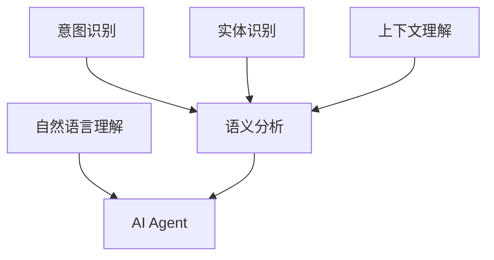

                 

# 自然语言理解增强AI Agent：深化LLM的语义分析

**关键词**：自然语言理解、AI Agent、大语言模型、语义分析、LLM、机器学习、语义网络

**摘要**：本文将探讨如何通过增强自然语言理解能力来提升AI Agent的智能化水平，特别是利用大语言模型（LLM）进行语义分析的方法。通过分析LLM的内部机制，结合实际案例，介绍如何将语义分析技术应用于AI Agent的设计与实现中。本文将从背景知识、核心概念、算法原理、系统架构、项目实战等多个方面展开，全面解析如何深化LLM的语义分析能力，为AI Agent的未来发展提供理论与实践指导。

---

## 第1章: 自然语言理解与AI Agent的背景与基础

### 1.1 自然语言理解的核心概念

#### 1.1.1 自然语言理解的定义与目标
自然语言理解（Natural Language Understanding, NLU）是人工智能领域的重要分支，旨在让计算机能够理解和解析人类语言的含义。NLU的目标是将人类语言转化为计算机可处理的结构化信息，从而实现人机交互的智能化。

#### 1.1.2 自然语言理解的典型应用场景
自然语言理解广泛应用于智能对话系统、信息检索、情感分析、机器翻译等领域。例如，在智能对话系统中，NLU负责识别用户的意图和实体信息，为后续的语义解析提供支持。

#### 1.1.3 自然语言理解与AI Agent的关系
AI Agent（智能代理）是一种能够感知环境并执行任务的智能系统。NLU作为AI Agent的核心模块之一，负责解析用户的输入指令，理解其意图和需求，从而实现智能交互。

### 1.2 大语言模型（LLM）的语义分析能力

#### 1.2.1 大语言模型的基本特点
大语言模型（Large Language Model, LLM）是指参数规模巨大、训练数据丰富的深度学习模型。LLM具有强大的上下文理解和生成能力，能够处理复杂的语义信息。

#### 1.2.2 语义分析在LLM中的实现机制
语义分析是LLM的核心能力之一。通过对大规模语料的训练，LLM能够捕捉语言中的语义信息，理解文本的深层含义。

#### 1.2.3 LLM在AI Agent中的应用潜力
LLM的语义分析能力为AI Agent提供了强大的技术支持，使其能够更准确地理解用户需求，提升交互体验。

### 1.3 本章小结
本章介绍了自然语言理解的基本概念和典型应用场景，并重点探讨了大语言模型在语义分析中的优势及其在AI Agent中的应用潜力。

---

## 第2章: 自然语言理解与大语言模型的关系

### 2.1 自然语言理解的核心要素

#### 2.1.1 语义分析的关键步骤
语义分析通常包括分词、句法分析、语义角色标注等步骤。这些步骤帮助模型理解文本的结构和含义。

#### 2.1.2 语义分析的特征提取与上下文理解
特征提取是语义分析的重要环节，通过对文本特征的提取，模型能够捕捉到关键信息。上下文理解则依赖于模型对语境的感知能力。

#### 2.1.3 语义分析的评价指标
常用的评价指标包括准确率、召回率、F1值等。这些指标能够衡量模型的语义分析能力。

### 2.2 大语言模型在自然语言理解中的优势

#### 2.2.1 大语言模型的训练数据与参数规模
LLM通常基于海量数据训练，具有强大的语义理解和生成能力。

#### 2.2.2 语义分析在LLM中的实现机制
LLM通过自注意力机制捕捉文本中的语义信息，实现对上下文的深度理解。

#### 2.2.3 LLM的多任务适应性
LLM可以同时处理多种任务，如文本生成、问答系统、情感分析等，展现出强大的通用性。

### 2.3 自然语言理解与AI Agent的实体关系图

### 2.4 本章小结
本章深入探讨了自然语言理解的核心要素，并分析了大语言模型在语义分析中的优势及其在AI Agent中的应用。

---

## 第3章: 大语言模型的语义分析算法

### 3.1 基于Transformer的语义分析模型

#### 3.1.1 Transformer模型的基本结构
Transformer模型由编码器和解码器组成，通过自注意力机制实现对文本的深度理解。

#### 3.1.2 自注意力机制的实现原理
自注意力机制通过对输入序列的全局依赖进行建模，捕捉文本中的语义信息。

#### 3.1.3

---

通过以上内容，我们已经详细介绍了自然语言理解增强AI Agent的核心概念、算法原理和系统架构。接下来的章节将围绕项目实战和最佳实践展开，进一步深入探讨如何在实际应用中提升LLM的语义分析能力。

