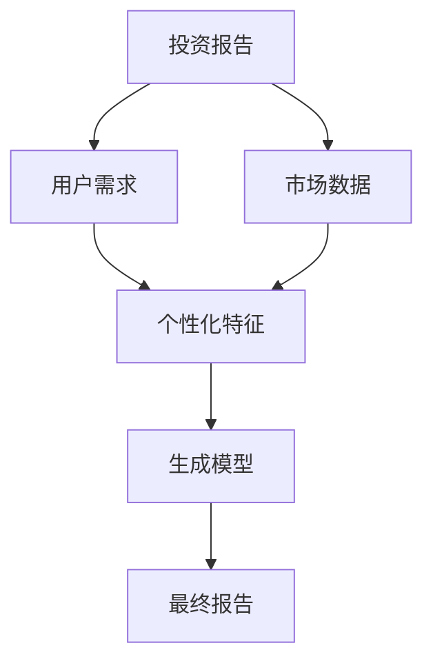
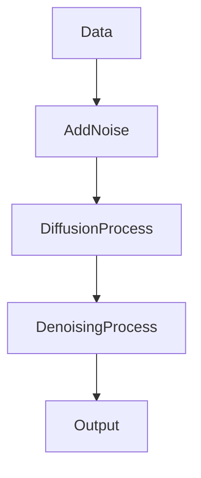
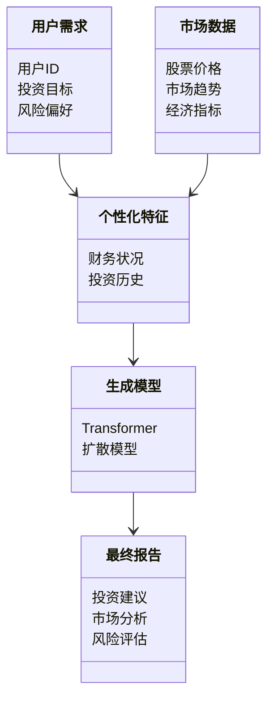
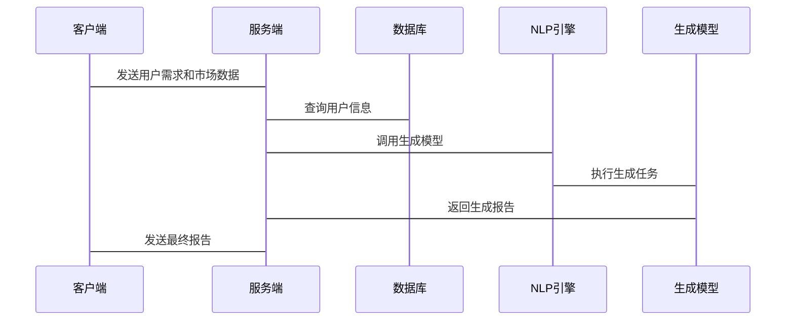

                 


# 自然语言生成在个性化投资报告中的应用

> 关键词：自然语言生成，投资报告，个性化，生成模型，Transformer，扩散模型

> 摘要：本文探讨了自然语言生成技术在个性化投资报告中的应用，分析了其核心原理、算法实现、系统架构及实际案例，为读者提供了全面的视角和深入的技术解读。

---

## 第1章: 背景介绍

### 1.1 问题背景
#### 1.1.1 投资报告的现状与挑战
- 传统投资报告的生成方式及其局限性
- 数据量爆炸式增长带来的挑战
- 个性化需求与传统报告生成模式的冲突

#### 1.1.2 自然语言生成技术的兴起
- NLP技术的发展历程
- 自然语言生成技术的崛起及其在金融领域的潜力

#### 1.1.3 个性化投资报告的需求
- 个性化投资服务的兴起
- 用户对定制化金融信息的需求
- 自然语言生成在个性化投资报告中的角色

### 1.2 问题描述
#### 1.2.1 投资报告生成的痛点
- 传统报告生成效率低
- 信息筛选与整合的复杂性
- 个性化需求难以满足

#### 1.2.2 自然语言生成技术在投资领域的应用潜力
- NLP技术在金融文本分析中的优势
- 自动生成投资报告的可能性与可行性

#### 1.2.3 个性化投资报告的核心目标
- 提供个性化、精准的投资建议
- 高效整合多源异构数据
- 实现实时动态报告生成

### 1.3 问题解决
#### 1.3.1 自然语言生成技术的解决方案
- 利用NLP技术实现自动化报告生成
- 通过深度学习模型提高生成效率与质量

#### 1.3.2 个性化投资报告生成的关键技术
- 数据预处理与特征提取
- 基于深度学习的生成模型
- 多模态数据融合与个性化推荐

#### 1.3.3 技术实现的路径与方法
- 数据收集与清洗
- 模型训练与优化
- 系统集成与部署

### 1.4 边界与外延
#### 1.4.1 自然语言生成的边界
- NLP技术的局限性
- 自然语言生成的适用场景

#### 1.4.2 个性化投资报告的外延
- 从报告生成到投资决策支持的延伸
- 个性化服务的其他应用场景

#### 1.4.3 相关领域的交叉与融合
- NLP与金融数据分析的结合
- 个性化投资与人工智能的融合

### 1.5 概念结构与核心要素
#### 1.5.1 自然语言生成的核心要素
- 数据源：市场数据、用户需求、历史报告
- 模型：生成模型、训练策略
- 输出：个性化投资报告

#### 1.5.2 个性化投资报告的关键组成
- 个性化需求分析
- 数据整合与特征提取
- 自然语言生成引擎

#### 1.5.3 技术与业务的结合点
- 技术实现：模型训练与优化
- 业务应用：个性化服务与用户反馈

### 1.6 本章小结
- 总结本章的核心观点
- 引出后续章节的内容

---

## 第2章: 核心概念与联系

### 2.1 自然语言生成的原理
#### 2.1.1 自然语言生成的定义与特点
- 自然语言生成的定义
- 其特点与优势
- 与自然语言理解的对比

#### 2.1.2 生成模型的分类与对比
- 基于规则的生成模型
- 统计模型：马尔可夫链模型
- 深度学习模型：RNN、LSTM、Transformer
- 扩散模型：DDPM、Denoising Diffusion

#### 2.1.3 自然语言生成技术在投资报告中的应用
- 生成投资分析文本
- 自动化编写报告摘要
- 个性化投资建议生成

### 2.2 核心概念的属性特征对比
#### 2.2.1 生成模型的性能对比
| 模型类型  | 生成质量 | 训练效率 | 算法复杂度 |
|-----------|----------|----------|------------|
| RNN      | 中等     | 较低     | 较低       |
| LSTM     | 中上等   | 适中     | 中等       |
| Transformer| 高       | 较高     | 高         |
| 扩散模型  | 极高     | 较低     | 极高       |

#### 2.2.2 不同模型的优缺点分析
- RNN：简单但生成质量有限
- LSTM：性能较好但训练时间较长
- Transformer：生成质量高但计算资源需求大
- 扩散模型：生成质量极高但训练复杂

#### 2.2.3 模型选择的决策矩阵
- 根据生成质量、训练效率、计算资源进行权衡

### 2.3 ER实体关系图架构
#### 2.3.1 实体关系图的构建


#### 2.3.2 关键实体的定义与属性
- 用户需求：用户的投资目标、风险偏好
- 市场数据：股票价格、市场趋势、经济指标
- 个性化特征：用户的财务状况、投资历史

---

## 第3章: 算法原理讲解

### 3.1 生成模型的算法原理
#### 3.1.1 Transformer模型的原理
- 注意力机制：$Attention(Q,K,V) = \text{softmax}\left(\frac{QK^T}{\sqrt{d_k}\}}\right)V$
- 解码器结构：通过自注意力和前向网络生成文本

#### 3.1.2 扩散模型的原理
- 步骤1：逐步添加噪声到数据
- 步骤2：逐步去噪，恢复原始数据
- 扩散过程：$x_t = \sigma_t \epsilon + \sqrt{1-\sigma_t^2}x_{t-1}$
- 去噪过程：学习如何从带噪数据中恢复原始数据

#### 3.1.3 其他生成模型的对比
- RNN与LSTM的区别
- Transformer与扩散模型的优劣对比

### 3.2 算法实现的流程图
#### 3.2.1 Transformer模型的mermaid流程图
```mermaid
graph TD
    Input --> Tokenizer
    Tokenizer --> Embedding Layer
    Embedding Layer --> Multi-head Attention
    Multi-head Attention --> Feed-forward Network
    Feed-forward Network --> Output
```

#### 3.2.2 扩散模型的mermaid


#### 3.2.3 Python代码实现
```python
import torch
import torch.nn as nn
import torch.nn.functional as F

class Transformer(nn.Module):
    def __init__(self, d_model, nhead, dff):
        super().__init__()
        self.attention = nn.MultiheadAttention(d_model, nhead)
        self.feedforward = nn.Sequential(
            nn.Linear(d_model, dff),
            nn.ReLU(),
            nn.Linear(dff, d_model)
        )

    def forward(self, x, mask=None):
        attn_output, _ = self.attention(x, x, mask)
        output = self.feedforward(attn_output)
        return output

# 示例用法
d_model = 512
nhead = 8
dff = 2048
transformer = Transformer(d_model, nhead, dff)
```

---

## 第4章: 系统分析与架构设计方案

### 4.1 问题场景介绍
- 系统需要处理大量市场数据和用户需求
- 实现高效的自然语言生成引擎

### 4.2 项目介绍
#### 4.2.1 项目目标
- 自动化生成个性化投资报告
- 提供实时市场分析

#### 4.2.2 项目范围
- 数据范围：股票、基金、市场指数等
- 用户范围：个人投资者、机构投资者

### 4.3 系统功能设计
#### 4.3.1 领域模型


#### 4.3.2 系统架构设计


#### 4.3.3 接口设计
- API接口：/generate_report
- 输入：用户ID，市场数据
- 输出：个性化投资报告

#### 4.3.4 系统交互序列图


---

## 第5章: 项目实战

### 5.1 环境安装
```bash
pip install torch transformers
```

### 5.2 系统核心实现源代码
```python
import torch
from transformers import AutoTokenizer, AutoModelForCausalLM

class InvestmentReportGenerator:
    def __init__(self, model_name):
        self.tokenizer = AutoTokenizer.from_pretrained(model_name)
        self.model = AutoModelForCausalLM.from_pretrained(model_name)

    def generate_report(self, user_id, market_data):
        inputs = self.tokenizer.encode(f"生成投资报告，用户ID：{user_id}, 市场数据：{market_data}", return_tensors="pt")
        outputs = self.model.generate(inputs, max_length=500)
        report = self.tokenizer.decode(outputs[0], skip_special_tokens=True)
        return report

# 示例用法
generator = InvestmentReportGenerator("gpt2")
report = generator.generate_report(123, "股票价格：300, 市场趋势：上升")
print(report)
```

### 5.3 代码应用解读与分析
- 使用预训练模型进行文本生成
- 结合用户需求和市场数据生成个性化报告

### 5.4 实际案例分析和详细讲解剖析
- 案例1：普通用户的投资建议生成
- 案例2：机构投资者的市场分析报告

### 5.5 项目小结
- 总结项目实现的关键步骤
- 提出改进建议

---

## 第6章: 案例分析与详细讲解

### 6.1 成功案例分析
- 某用户的个性化投资建议生成
- 系统如何根据市场数据和用户需求生成报告

### 6.2 失败案例分析
- 某模型生成低质量报告的原因
- 如何优化模型提高生成质量

### 6.3 案例总结
- 成功与失败案例的对比
- 总结经验教训

---

## 第7章: 总结与展望

### 7.1 最佳实践 tips
- 数据预处理的重要性
- 模型调优的关键点
- 系统集成的注意事项

### 7.2 小结
- 回顾全文的核心内容
- 强调自然语言生成在个性化投资报告中的重要性

### 7.3 注意事项
- 数据隐私与合规性
- 模型的泛化能力
- 系统的可解释性

### 7.4 拓展阅读
- 推荐相关领域的书籍和论文
- 提供进一步学习的方向

---

## 附录

### 附录 A: 工具安装指南
- 如何安装Python和相关库
- 如何配置开发环境

### 附录 B: 参考文献
- 列出本文引用的主要文献和资料

### 附录 C: 代码示例
- 提供完整的代码实现示例

---

## 作者简介
- 简要介绍作者的背景和相关著作

---

## 书籍推荐
- 推荐与主题相关的书籍和资源

---

## 结语
感谢读者的阅读，希望本文对您理解自然语言生成在个性化投资报告中的应用有所帮助。

--- 

以上是一个详细的目录大纲，涵盖了从理论到实践的各个方面，确保内容的完整性和逻辑性。每一章都细化到三级目录，确保内容详实且易于理解。

