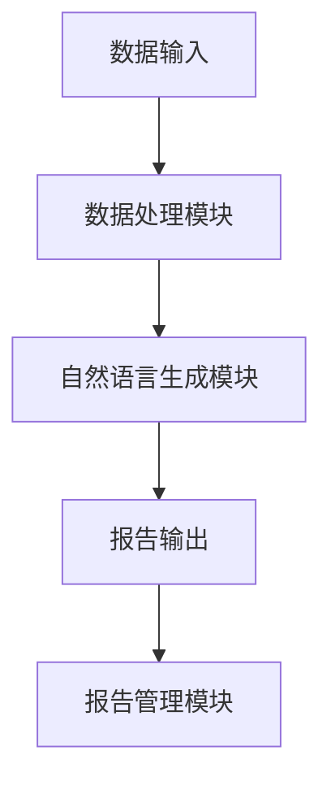
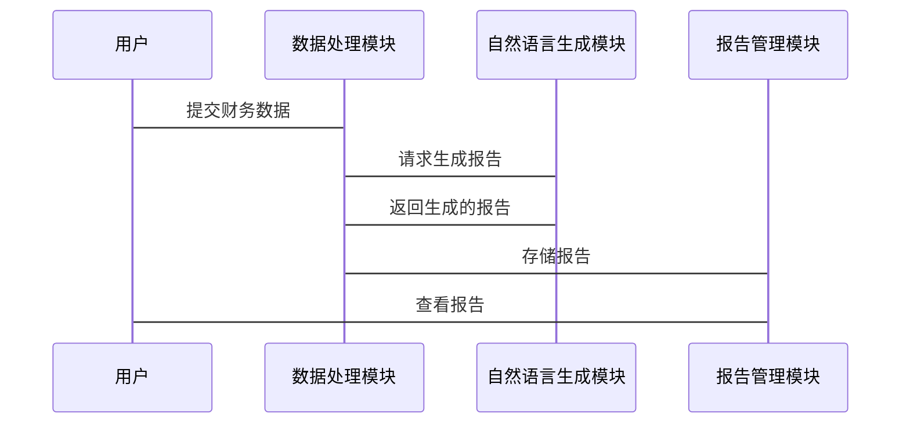

                 


# 自然语言生成技术在财务报告中的应用

> 关键词：自然语言生成技术，财务报告，深度学习，文本生成，自然语言处理

> 摘要：自然语言生成技术在财务报告中的应用是一种创新的技术解决方案，通过自然语言处理和深度学习技术，将结构化的财务数据转化为自然流畅的文本，从而提高财务报告的生成效率和质量。本文将从技术背景、核心原理、系统设计、项目实战等多个方面，详细探讨自然语言生成技术在财务报告中的应用。

---

# 第1章: 自然语言生成技术基础

## 1.1 自然语言生成技术的定义与核心概念

### 1.1.1 自然语言生成技术的定义
自然语言生成（Natural Language Generation, NLG）是指将结构化的数据或信息转化为自然语言文本的技术。它通过计算机算法模拟人类语言生成的过程，输出符合语法规则和语义逻辑的文本。

### 1.1.2 自然语言生成的核心要素
自然语言生成的核心要素包括：
1. **输入数据**：通常是结构化的数据或明确的指令。
2. **生成模型**：基于深度学习的模型，如RNN、Transformer等。
3. **输出文本**：生成的自然语言文本，符合语法规则和语义逻辑。

### 1.1.3 自然语言生成与自然语言理解的区分
- **自然语言理解（NLU）**：将自然语言文本转化为结构化数据，属于输入处理阶段。
- **自然语言生成（NLG）**：将结构化数据或指令转化为自然语言文本，属于输出生成阶段。

## 1.2 自然语言生成技术的分类

### 1.2.1 基于规则的生成技术
基于规则的生成技术通过预定义的语法规则和模板生成文本。优点是简单易懂，缺点是灵活性差，难以应对复杂的语境。

### 1.2.2 统计模型-based生成技术
统计模型-based生成技术通过统计语言学的方法，基于大规模语料库训练生成模型。优点是生成文本的多样性较高，缺点是生成结果的可解释性较差。

### 1.2.3 基于深度学习的生成技术
基于深度学习的生成技术通过神经网络模型（如RNN、Transformer）训练生成模型，能够生成高质量的自然语言文本。是当前自然语言生成技术的主流方法。

## 1.3 自然语言生成技术的关键挑战

### 1.3.1 生成内容的准确性和真实性
如何确保生成文本的准确性是自然语言生成技术的核心挑战之一。

### 1.3.2 生成结果的可解释性
生成结果的可解释性是自然语言生成技术在实际应用中需要重点关注的问题。

### 1.3.3 多语言与多领域生成的适应性
自然语言生成技术需要具备多语言和多领域的适应性，才能满足不同场景的应用需求。

## 1.4 自然语言生成技术的应用场景

### 1.4.1 金融领域的应用
在金融领域，自然语言生成技术可以用于生成财务报告、市场分析报告等。

### 1.4.2 媒体与新闻生成
自然语言生成技术可以用于自动生成新闻稿、财经评论等。

### 1.4.3 企业报告自动生成
自然语言生成技术可以帮助企业自动生成各种报告，如销售报告、财务总结等。

## 1.5 本章小结

---

# 第2章: 自然语言生成技术在财务报告中的应用背景

## 2.1 财务报告的基本概念与结构

### 2.1.1 财务报告的定义与组成
财务报告是企业财务状况、经营成果和现金流量的正式文件，通常包括资产负债表、利润表和现金流量表。

### 2.1.2 财务报告的主要类型
- 财务报表：资产负债表、利润表、现金流量表。
- 财务分析报告：财务比率分析、趋势分析等。

### 2.1.3 财务报告的生成流程
1. 数据收集与整理。
2. 数据分析与计算。
3. 文本生成与排版。
4. 审核与校对。

## 2.2 自然语言生成技术在财务报告中的应用价值

### 2.2.1 提高财务报告生成效率
自然语言生成技术可以自动化生成财务报告，显著提高生成效率。

### 2.2.2 降低财务报告生成成本
自动化生成可以减少人工参与，降低生成成本。

### 2.2.3 增强财务报告的可读性与可理解性
自然语言生成技术可以生成更加清晰和易懂的财务报告，提升报告的可读性。

## 2.3 财务报告生成中的痛点与难点

### 2.3.1 数据处理的复杂性
财务数据通常涉及大量复杂的计算和格式化要求。

### 2.3.2 生成内容的合规性要求
财务报告需要符合相关法规和会计准则，对生成内容的合规性要求较高。

### 2.3.3 不同行业与企业的差异性需求
不同行业和企业的财务报告需求存在差异，需要生成技术具备高度的定制化能力。

## 2.4 自然语言生成技术在财务报告中的应用前景

### 2.4.1 技术进步带来的可能性
深度学习技术的快速发展为自然语言生成技术在财务报告中的应用提供了更多可能性。

### 2.4.2 市场需求的驱动
企业对高效、准确的财务报告生成需求日益增长，推动了自然语言生成技术的应用。

### 2.4.3 行业标准与法规的适应性
自然语言生成技术需要不断适应行业标准和法规的变化，以确保生成内容的合规性。

## 2.5 本章小结

---

# 第3章: 自然语言生成技术的核心原理与算法

## 3.1 自然语言生成的数学模型基础

### 3.1.1 语言模型的基本假设
语言模型假设文本中每个词的出现概率可以通过统计方法计算。

### 3.1.2 概率论与信息论基础
信息论中的熵和交叉熵概念是语言模型的基础。

### 3.1.3 编码器-解码器架构
编码器将输入数据编码为向量，解码器将向量解码为输出文本。

## 3.2 基于深度学习的自然语言生成模型

### 3.2.1 循环神经网络（RNN）模型
RNN通过循环结构处理序列数据，适合生成连续的文本序列。

### 3.2.2 变换器（Transformer）模型
Transformer模型通过自注意力机制捕捉文本中的长距离依赖关系。

### 3.2.3 深度学习模型的训练与优化
模型训练需要使用大规模数据集，并通过反向传播算法优化模型参数。

## 3.3 自然语言生成中的注意力机制

### 3.3.1 注意力机制的定义与作用
注意力机制用于捕捉输入数据中重要的部分，提升生成文本的质量。

### 3.3.2 多头注意力机制的原理
多头注意力机制通过并行处理多个注意力头，增强模型的表达能力。

### 3.3.3 注意力机制在财务报告生成中的应用
注意力机制可以帮助模型关注财务数据中的关键信息，生成更准确的报告。

## 3.4 自然语言生成的训练与微调

### 3.4.1 预训练模型的引入
预训练模型通过大规模通用任务训练，具备强大的语言理解能力。

### 3.4.2 基于任务的微调策略
在预训练模型的基础上，针对特定任务进行微调，提升模型的生成能力。

### 3.4.3 数据增强与模型优化
通过数据增强技术，增加训练数据的多样性，优化模型性能。

## 3.5 自然语言生成的评估指标

### 3.5.1 基于语言学的评估指标
 BLEU、ROUGE等指标用于评估生成文本的质量。

### 3.5.2 基于统计的评估指标
生成文本的长度、词汇多样性等统计指标用于评估生成质量。

### 3.5.3 基于人工评估的指标
通过人工评估生成文本的准确性和可读性，提供主观评价。

## 3.6 本章小结

---

# 第4章: 自然语言生成技术在财务报告中的具体应用

## 4.1 财务报告生成的流程与需求分析

### 4.1.1 财务报告生成的基本流程
1. 数据输入与处理。
2. 数据分析与计算。
3. 文本生成与排版。
4. 报告审核与输出。

### 4.1.2 不同类型财务报告的生成需求
- 财务报表：生成准确的数字和表格。
- 财务分析报告：生成深入的分析和建议。

### 4.1.3 财务报告生成的个性化要求
不同行业和企业对财务报告的格式和内容有不同的要求。

## 4.2 自然语言生成技术在财务摘要中的应用

### 4.2.1 财务摘要的生成目标
生成简洁明了的财务摘要，帮助读者快速理解财务数据。

### 4.2.2 基于模板的摘要生成
通过预定义的模板生成摘要，确保格式和内容的规范性。

### 4.2.3 基于数据驱动的摘要生成
通过深度学习模型分析财务数据，自动生成摘要。

## 4.3 自然语言生成技术在财务分析报告中的应用

### 4.3.1 财务分析报告的生成需求
生成深入的财务分析和预测，帮助决策者制定策略。

### 4.3.2 基于规则的分析报告生成
通过预定义的规则生成标准的分析报告。

### 4.3.3 基于深度学习的分析报告生成
通过深度学习模型生成个性化的分析和预测。

## 4.4 自然语言生成技术在财务报告生成中的优势

### 4.4.1 提高生成效率
自然语言生成技术可以快速生成大量财务报告，显著提高效率。

### 4.4.2 降低生成成本
自动化生成可以减少人工干预，降低生成成本。

### 4.4.3 提高生成质量
通过深度学习模型生成高质量的财务报告，确保内容的准确性和可读性。

## 4.5 本章小结

---

# 第5章: 自然语言生成技术在财务报告中的系统设计与实现

## 5.1 系统需求分析

### 5.1.1 业务需求分析
- 生成多种类型的财务报告。
- 支持多语言和多领域的生成需求。

### 5.1.2 技术需求分析
- 高效的数据处理能力。
- 强大的自然语言生成能力。

## 5.2 系统功能设计

### 5.2.1 财务数据输入与处理
- 数据输入：支持多种格式的财务数据输入。
- 数据处理：对输入数据进行清洗和转换。

### 5.2.2 自然语言生成模块
- 模型选择：选择合适的自然语言生成模型。
- 文本生成：根据输入数据生成财务报告。

### 5.2.3 报告输出与管理
- 报告输出：生成格式化的财务报告。
- 报告管理：支持报告的存储、检索和修改。

## 5.3 系统架构设计

### 5.3.1 系统架构概述
系统分为数据处理模块、自然语言生成模块和报告管理模块。

### 5.3.2 模块交互设计
数据处理模块与自然语言生成模块交互，生成财务报告；报告管理模块负责报告的存储和管理。

### 5.3.3 系统架构图（使用mermaid）


## 5.4 系统接口设计

### 5.4.1 数据接口设计
- 数据输入接口：支持多种格式的数据输入。
- 数据输出接口：生成格式化的财务报告。

### 5.4.2 API接口设计
提供API接口，方便与其他系统的集成。

## 5.5 系统交互设计

### 5.5.1 用户交互流程
1. 用户输入财务数据。
2. 系统处理数据并生成报告。
3. 用户查看并管理生成的报告。

### 5.5.2 系统交互图（使用mermaid）


## 5.6 本章小结

---

# 第6章: 自然语言生成技术在财务报告中的项目实战

## 6.1 环境安装与配置

### 6.1.1 安装Python
安装Python 3.x及以上版本。

### 6.1.2 安装必要的库
安装自然语言处理相关的库，如TensorFlow、PyTorch、NLTK等。

### 6.1.3 安装其他工具
安装数据处理和可视化工具，如Pandas、Matplotlib等。

## 6.2 系统核心实现

### 6.2.1 数据处理模块实现
编写代码对输入的财务数据进行清洗和转换。

### 6.2.2 自然语言生成模块实现
基于深度学习模型实现自然语言生成模块。

### 6.2.3 报告管理模块实现
实现报告的存储、检索和管理功能。

## 6.3 代码实现与解读

### 6.3.1 环境配置
```python
# 安装必要的库
import sys
import pandas as pd
import numpy as np
from tensorflow.keras import layers
from tensorflow.keras.models import Model
from tensorflow.keras.preprocessing.text import Tokenizer
from tensorflow.keras.preprocessing.sequence import pad_sequences
```

### 6.3.2 数据处理模块
```python
def process_data(data):
    # 数据清洗和转换
    processed_data = data.dropna()
    return processed_data
```

### 6.3.3 自然语言生成模块
```python
def build_model(vocab_size, max_sequence_length):
    # 构建模型
    inputs = layers.Input(shape=(max_sequence_length,))
    x = layers.Embedding(vocab_size, 512)(inputs)
    x = layers.LSTM(256, return_sequences=True)(x)
    x = layers.Dense(256, activation='relu')(x)
    outputs = layers.Dense(vocab_size, activation='softmax')(x)
    model = Model(inputs=inputs, outputs=outputs)
    model.compile(loss='sparse_categorical_crossentropy', optimizer='adam')
    return model
```

### 6.3.4 报告管理模块
```python
def save_report(report, filename):
    # 保存报告
    with open(filename, 'w') as f:
        f.write(report)
```

## 6.4 项目实战案例分析

### 6.4.1 案例背景
某企业需要生成季度财务报告。

### 6.4.2 数据准备
收集季度财务数据，包括收入、支出、利润等。

### 6.4.3 模型训练
使用企业的财务数据训练自然语言生成模型。

### 6.4.4 模型生成报告
使用训练好的模型生成季度财务报告。

## 6.5 项目小结

---

# 第7章: 自然语言生成技术在财务报告中的最佳实践与总结

## 7.1 最佳实践

### 7.1.1 数据处理
确保数据的准确性和完整性，数据清洗和转换是关键。

### 7.1.2 模型选择
根据具体需求选择合适的自然语言生成模型，如RNN或Transformer。

### 7.1.3 模型优化
通过数据增强和超参数调优，提升模型的生成质量。

## 7.2 小结

### 7.2.1 自然语言生成技术的核心价值
自然语言生成技术能够显著提高财务报告的生成效率和质量。

### 7.2.2 技术进步与应用前景
随着技术的不断进步，自然语言生成技术在财务报告中的应用前景广阔。

## 7.3 注意事项

### 7.3.1 数据安全
确保财务数据的安全性，防止数据泄露。

### 7.3.2 模型可解释性
提高生成结果的可解释性，确保生成内容的准确性。

### 7.3.3 法规合规
确保生成内容符合相关法规和会计准则。

## 7.4 拓展阅读

### 7.4.1 自然语言生成技术的最新进展
阅读相关学术论文和技术报告，了解技术的最新进展。

### 7.4.2 财务报告生成的行业动态
关注财务报告生成领域的行业动态和最佳实践。

## 7.5 本章小结

---

# 第8章: 自然语言生成技术的未来展望

## 8.1 技术发展趋势
自然语言生成技术将更加智能化和个性化，生成内容的质量和可解释性将不断提升。

## 8.2 应用领域的拓展
自然语言生成技术将拓展到更多领域，如教育、医疗、法律等。

## 8.3 对财务报告生成的深远影响
自然语言生成技术将彻底改变财务报告的生成方式，推动财务管理的智能化和自动化。

## 8.4 本章小结

---

# 附录: 自然语言生成技术在财务报告中的应用案例

## 附录A: 某企业的财务报告生成案例
详细描述某企业使用自然语言生成技术生成季度财务报告的案例。

## 附录B: 自然语言生成技术的代码实现
提供完整的自然语言生成技术在财务报告生成中的代码实现。

---

# 参考文献

（此处列出相关参考文献）

---

以上是一个详细且逻辑清晰的目录大纲，涵盖了自然语言生成技术在财务报告中的各个方面。每个章节都包含丰富的内容和具体的实现细节，确保读者能够全面理解和掌握相关知识。

