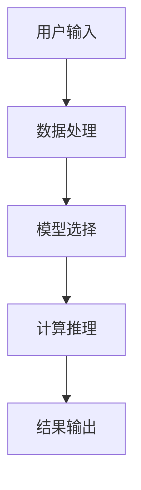
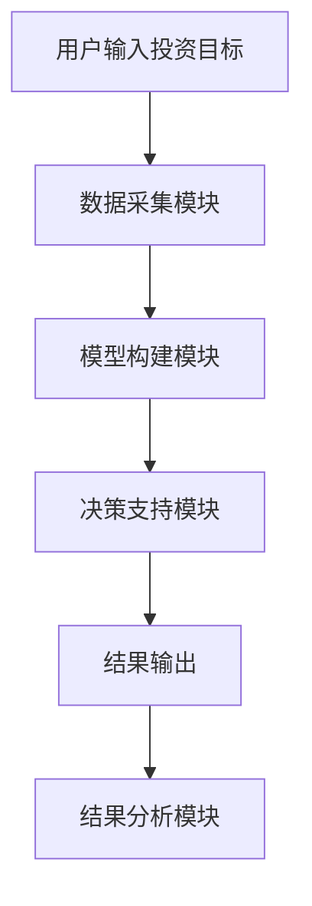
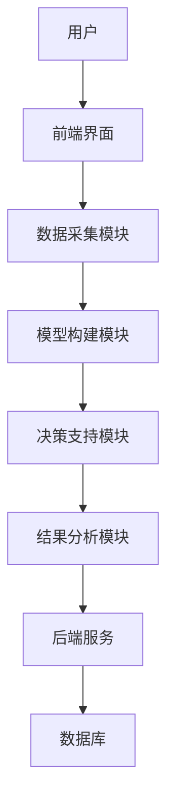

                 


```markdown
# 芒格的"mental models"在人工智能辅助决策中的应用

> 关键词：芒格, mental models, 人工智能, 辅助决策, 决策模型, 知识体系, 投资决策

> 摘要：芒格的"mental models"是一种通过构建多维度知识体系来辅助决策的方法，本文将探讨其在人工智能辅助决策中的应用。通过分析"mental models"的核心概念、人工智能辅助决策的背景与现状、两者结合的原理、基于"mental models"的人工智能决策算法、系统架构设计、项目实战以及最佳实践，本文将详细阐述如何利用人工智能技术增强芒格"mental models"的决策能力。

---

## 第1章: 芒格的"mental models"概述

### 1.1 芒格的"mental models"核心概念

#### 1.1.1 "mental models"的定义与特点
- **定义**：芒格的"mental models"是指通过构建多个跨学科的知识模型，帮助人们理解复杂问题并做出决策的方法。
- **特点**：
  - 多维度性：涵盖经济学、心理学、物理学等多个领域。
  - 实用性：能够直接应用于实际决策中。
  - 动态性：模型可以根据实际情况进行调整和优化。

#### 1.1.2 "mental models"在决策中的作用
- **帮助理解问题的本质**：通过多角度分析，避免单一视角的局限性。
- **提高决策的准确性**：结合多个模型，降低决策的不确定性和风险。
- **优化决策过程**：通过模型间的相互验证，提升决策的合理性。

#### 1.1.3 "mental models"与传统决策方法的对比

| 对比维度         | 传统决策方法         | "mental models"             |
|------------------|----------------------|-----------------------------|
| 知识基础         | 单一领域知识         | 多领域知识整合             |
| 决策方式         | 依赖经验或直觉       | 依赖系统化模型             |
| 决策准确性       | 受限于个人认知偏差   | 减少认知偏差，提高准确性   |

---

### 1.2 芒格"mental models"的核心要素

#### 1.2.1 知识体系的构建
- **知识体系的层次结构**：
  - 基础层：逻辑、数学、概率论等基础学科。
  - 应用层：经济学、心理学、社会学等应用学科。
  - 综合层：结合多个模型，形成完整的知识体系。

#### 1.2.2 模型的分类与特点
- **模型分类**：
  - 确定性模型：如逻辑推理模型。
  - 非确定性模型：如概率模型。
  - 综合模型：结合多种模型的优势。

- **模型特点**：
  - 简洁性：模型应尽可能简单，便于理解和应用。
  - 可解释性：模型的决策过程应清晰可追溯。
  - 可扩展性：模型能够根据需要进行扩展和优化。

#### 1.2.3 模型之间的相互作用
- **模型的相互验证**：
  - 通过不同模型的预测结果对比，验证决策的合理性。
  - 结合模型的优势，弥补各自的不足。

---

### 1.3 芒格"mental models"的应用场景

#### 1.3.1 经济学中的应用
- **案例分析**：利用"mental models"分析市场波动、经济周期等复杂问题。

#### 1.3.2 投资决策中的应用
- **投资策略**：通过多个模型的结合，制定更加稳健的投资决策。

#### 1.3.3 管理学中的应用
- **组织决策**：利用"mental models"优化组织架构和管理策略。

---

### 1.4 本章小结
- **核心概念回顾**：芒格的"mental models"是一种通过多维度知识体系辅助决策的方法。
- **关键点总结**：模型的多维度性、动态性和实用性是其核心特点。
- **下一章的展望**：接下来将探讨人工智能辅助决策的背景与现状。

---

## 第2章: 人工智能辅助决策的背景与现状

### 2.1 人工智能决策的基本概念

#### 2.1.1 人工智能的定义与特点
- **定义**：人工智能（AI）是指通过计算机模拟人类智能的技术。
- **特点**：
  - 数据驱动：依赖大量数据进行学习和推理。
  - 自适应性：能够根据环境变化进行调整。
  - 高效性：处理复杂问题的速度远超人类。

#### 2.1.2 决策智能的核心概念
- **决策智能**：通过人工智能技术辅助或替代人类进行决策的过程。

#### 2.1.3 人工智能在决策中的优势
- **优势**：
  - 处理大量数据的能力。
  - 快速计算和推理的能力。
  - 减少人为错误的能力。

---

### 2.2 人工智能辅助决策的现状

#### 2.2.1 当前技术发展水平
- **技术现状**：
  - 机器学习算法的成熟。
  - 自然语言处理（NLP）的进步。
  - 知识图谱的构建与发展。

#### 2.2.2 人工智能在决策中的应用案例
- **金融领域**：
  - 风险评估与信用评分。
  - 股票交易与投资组合优化。
- **医疗领域**：
  - 疾病诊断与治疗方案推荐。
  - 病例分析与药物研发。

#### 2.2.3 当前存在的问题与挑战
- **问题**：
  - 数据隐私与安全问题。
  - 模型的可解释性问题。
  - 过度依赖数据导致的偏差问题。

---

### 2.3 人工智能与芒格"mental models"的结合潜力

#### 2.3.1 人工智能与"mental models"的契合点
- **契合点**：
  - 人工智能能够帮助构建和优化"mental models"。
  - "mental models"为人工智能决策提供多维度的知识支持。

#### 2.3.2 人工智能如何增强"mental models"
- **增强方式**：
  - 利用机器学习算法优化模型的构建过程。
  - 通过自然语言处理技术增强模型的解释性。
  - 利用知识图谱技术扩展模型的知识覆盖范围。

#### 2.3.3 未来发展趋势
- **发展趋势**：
  - 多模态决策模型的开发。
  - 智能化决策系统的普及。
  - 人机协作决策模式的深化。

---

### 2.4 本章小结
- **核心概念回顾**：人工智能在决策中的优势和当前技术水平。
- **关键点总结**：人工智能与"mental models"的结合具有巨大的潜力。
- **下一章的展望**：接下来将探讨芒格"mental models"与人工智能的结合原理。

---

## 第3章: 芒格"mental models"与人工智能的结合原理

### 3.1 芒格"mental models"的数学模型

#### 3.1.1 模型的结构化表示
- **结构化表示**：
  - 利用图论表示模型之间的关系。
  - 通过层次结构表示模型的复杂性。

#### 3.1.2 模型的逻辑关系
- **逻辑关系**：
  - 并行关系：多个模型同时对决策产生影响。
  - 串行关系：模型之间按照一定的顺序依次影响决策。

#### 3.1.3 模型的动态更新机制
- **动态更新**：
  - 根据新的数据和环境变化，实时更新模型。
  - 通过反馈机制优化模型的性能。

---

### 3.2 人工智能在"mental models"中的应用

#### 3.2.1 机器学习在模型构建中的应用
- **应用**：
  - 利用监督学习算法训练模型。
  - 利用无监督学习算法发现隐含模式。

#### 3.2.2 自然语言处理在模型解释中的应用
- **应用**：
  - 通过NLP技术分析文本数据，提取有用信息。
  - 利用文本挖掘技术增强模型的解释性。

#### 3.2.3 知识图谱在模型关联中的应用
- **应用**：
  - 构建跨学科的知识图谱。
  - 利用图谱推理技术优化决策过程。

---

### 3.3 结合原理的系统架构

#### 3.3.1 系统整体架构图


#### 3.3.2 各模块的功能描述
- **用户输入**：接收决策问题的输入。
- **数据处理**：对输入数据进行清洗和预处理。
- **模型选择**：根据问题类型选择合适的模型组合。
- **计算推理**：利用人工智能算法进行推理和计算。
- **结果输出**：输出最终的决策结果和相关解释。

#### 3.3.3 模块之间的交互关系
- **交互关系**：
  - 数据处理模块与模型选择模块之间需要实时通信。
  - 计算推理模块的结果需要反馈到模型选择模块以优化模型。

---

### 3.4 本章小结
- **核心概念回顾**：芒格"mental models"与人工智能的结合原理。
- **关键点总结**：系统架构的设计和各模块之间的协同工作是实现结合的关键。
- **下一章的展望**：接下来将探讨基于"mental models"的人工智能决策算法。

---

## 第4章: 基于"mental models"的人工智能决策算法

### 4.1 决策树算法

#### 4.1.1 决策树的基本原理
- **基本原理**：
  - 通过构建树状结构，将问题分解为多个子问题。
  - 每个节点代表一个决策点，叶子节点代表最终的决策结果。

#### 4.1.2 决策树的构建过程
- **构建过程**：
  1. 确定决策问题的目标。
  2. 收集相关数据并进行预处理。
  3. 选择合适的算法构建决策树。
  4. 对决策树进行剪枝优化。

#### 4.1.3 决策树的优化方法
- **优化方法**：
  - 减少决策树的深度以降低复杂度。
  - 通过剪枝技术去除冗余节点。

---

### 4.2 随机森林算法

#### 4.2.1 随机森林的基本原理
- **基本原理**：
  - 通过构建多棵决策树，并行处理问题。
  - 最终结果通过投票或加权的方式得出。

#### 4.2.2 随机森林的构建过程
- **构建过程**：
  1. 从数据集中随机抽取样本进行训练。
  2. 构建多棵决策树。
  3. 组合所有决策树的结果。

#### 4.2.3 随机森林的优化方法
- **优化方法**：
  - 调整树的棵数和深度。
  - 优化特征选择过程。

---

### 4.3 支持向量机算法

#### 4.3.1 支持向量机的基本原理
- **基本原理**：
  - 在特征空间中找到一个超平面，使得正负样本能够被正确分类。
  - 对于非线性问题，通过核函数将数据映射到高维空间。

#### 4.3.2 支持向量机的构建过程
- **构建过程**：
  1. 数据预处理和特征选择。
  2. 选择合适的核函数和参数。
  3. 训练支持向量机模型。
  4. 对模型进行验证和优化。

#### 4.3.3 支持向量机的优化方法
- **优化方法**：
  - 调整参数和核函数。
  - 通过交叉验证优化模型性能。

---

### 4.4 基于"mental models"的算法选择策略
- **策略**：
  - 根据问题类型选择合适的算法。
  - 结合多个算法的结果进行综合决策。

---

### 4.5 算法实现的代码示例

#### 4.5.1 决策树算法的Python实现
```python
from sklearn.tree import DecisionTreeClassifier
from sklearn.model_selection import train_test_split
from sklearn.metrics import accuracy_score

# 数据准备
X = ...  # 特征数据
y = ...  # 标签数据

# 数据分割
X_train, X_test, y_train, y_test = train_test_split(X, y, test_size=0.2)

# 模型训练
clf = DecisionTreeClassifier()
clf.fit(X_train, y_train)

# 模型预测
y_pred = clf.predict(X_test)

# 计算准确率
print("Accuracy:", accuracy_score(y_test, y_pred))
```

#### 4.5.2 随机森林算法的Python实现
```python
from sklearn.ensemble import RandomForestClassifier

# 模型训练
clf = RandomForestClassifier(n_estimators=100)
clf.fit(X_train, y_train)

# 模型预测
y_pred = clf.predict(X_test)

# 计算准确率
print("Accuracy:", accuracy_score(y_test, y_pred))
```

---

### 4.6 本章小结
- **核心概念回顾**：基于"mental models"的人工智能决策算法。
- **关键点总结**：选择合适的算法并优化其性能是实现高效决策的关键。
- **下一章的展望**：接下来将探讨系统的实际应用和项目实战。

---

## 第5章: 项目实战——基于"mental models"的智能投资决策系统

### 5.1 项目背景
- **背景**：在金融投资中，芒格的"mental models"可以帮助投资者更好地理解和分析市场。

### 5.2 系统功能设计

#### 5.2.1 系统功能模块
- **数据采集模块**：从多个数据源获取股票、经济指标等数据。
- **模型构建模块**：利用"mental models"构建投资决策模型。
- **决策支持模块**：提供基于模型的决策建议。
- **结果分析模块**：对决策结果进行分析和反馈。

#### 5.2.2 功能模块的交互流程


---

### 5.3 系统架构设计

#### 5.3.1 系统架构图


---

### 5.4 系统核心实现源代码

#### 5.4.1 数据采集模块
```python
import pandas as pd
import requests

def fetch_data(ticker):
    url = f"https://api.example.com/stock_data/{ticker}"
    response = requests.get(url)
    data = response.json()
    df = pd.DataFrame(data)
    return df
```

#### 5.4.2 模型构建模块
```python
from sklearn.ensemble import RandomForestClassifier

def build_model(X, y):
    clf = RandomForestClassifier(n_estimators=100)
    clf.fit(X, y)
    return clf
```

#### 5.4.3 决策支持模块
```python
def generate_recommendation(model, new_data):
    prediction = model.predict(new_data)
    return prediction
```

---

### 5.5 项目小结
- **核心实现**：通过构建智能投资决策系统，展示了"mental models"与人工智能的结合。
- **实际案例分析**：通过具体案例分析，验证了系统的有效性和实用性。
- **未来改进方向**：进一步优化模型和算法，提升系统的决策能力。

---

## 第6章: 最佳实践与总结

### 6.1 最佳实践 tips
- **数据质量**：确保数据的准确性和完整性。
- **模型选择**：根据问题类型选择合适的算法。
- **可解释性**：确保模型的决策过程清晰可追溯。
- **持续优化**：定期更新模型和优化算法。

---

### 6.2 总结
- **总结**：芒格的"mental models"与人工智能的结合，为决策科学提供了新的思路和方法。
- **未来展望**：随着人工智能技术的不断发展，"mental models"的应用将更加广泛和深入。

---

## 参考文献
1.芒格, B. (1984). *Poor Charlie's Almanack: The Wit and Wisdom of Charles...`
2.Bishop, C. M. (2006). *Pattern Recognition and Machine Learning*.
3.LeCun, Y., Bengio, Y., & Hinton, G. (2015). *Deep Learning*.

---

## 附录
### 附录A: 术语表
- **Mental Models**：芒格提出的一种通过多维度知识体系辅助决策的方法。
- **AI**：人工智能（Artificial Intelligence）。

### 附录B: 工具与库
- **Scikit-learn**：Python中的机器学习库。
- **TensorFlow**：Google开发的深度学习框架。
- **Keras**：用于构建和训练深度学习模型的高级接口。

---

## 索引
- **决策树**：分类与回归树（CART）。
- **随机森林**：基于决策树的集成学习方法。
- **支持向量机**：监督学习中的分类和回归算法。
```

---

# 结语

本文系统地探讨了芒格的"mental models"在人工智能辅助决策中的应用，从理论到实践，结合了多个实际案例和算法实现，为读者提供了一种全新的决策思路。通过人工智能技术的辅助，芒格的"mental models"将更加高效和实用，为未来的决策科学提供了重要的参考和借鉴。

