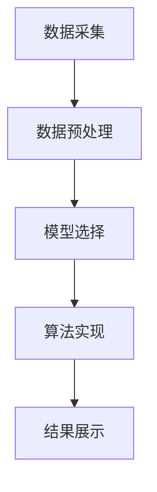
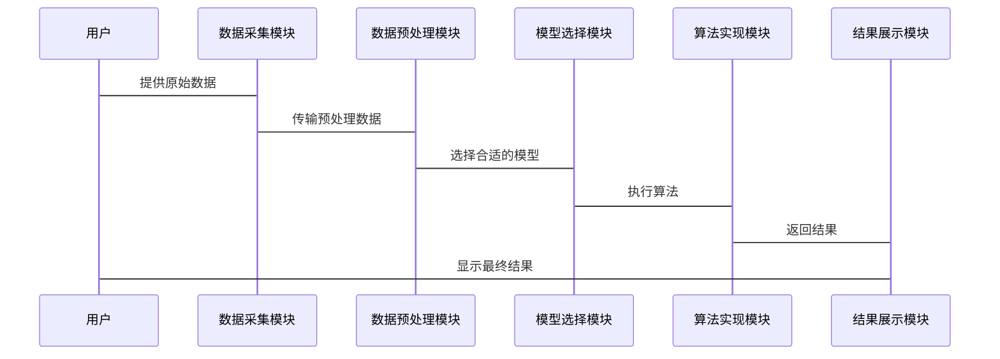

                 


# 《芒格的"mental models"在人工智能辅助决策系统中的应用》

---

## 关键词

- 芒格
- mental models
- 人工智能
- 辅助决策系统
- 系统架构
- 项目实战

---

## 摘要

本文探讨了芒格的“mental models”在人工智能辅助决策系统中的应用，分析了这些思维模型如何与AI技术结合，提升决策的科学性和效率。通过项目实战，展示了如何将“mental models”应用于实际场景，并提供了系统设计、算法实现和案例分析的详细指导。

---

# 第6章：项目实战——基于芒格"mental models"的AI辅助决策系统开发

## 6.3 系统功能模块设计

### 6.3.1 功能模块划分

以下是系统的主要功能模块：

1. **数据采集模块**：负责收集相关数据。
2. **模型选择模块**：根据具体情况选择合适的模型。
3. **算法实现模块**：执行具体的算法。
4. **结果展示模块**：呈现最终的决策结果。

### 6.3.2 系统功能流程图

以下是系统功能流程图的Mermaid代码：



---

## 6.4 系统架构设计

### 6.4.1 系统架构图

以下是系统架构图的Mermaid代码：


---

## 6.5 系统接口设计

### 6.5.1 接口定义

系统主要接口包括：

1. **数据输入接口**：接收原始数据。
2. **模型调用接口**：调用预训练模型。
3. **结果输出接口**：返回决策结果。

### 6.5.2 接口交互序列图

以下是接口交互序列图的Mermaid代码：



---

## 6.6 系统核心实现

### 6.6.1 算法实现代码

以下是基于“机会成本模型”的Python实现代码：

```python
import numpy as np
import pandas as pd

# 数据加载
data = pd.read_csv('input.csv')

# 定义机会成本计算函数
def calculate_opportunity_cost(revenue, cost):
    return revenue - cost

# 计算机会成本
opportunity_cost = calculate_opportunity_cost(data['revenue'], data['cost'])

# 显示结果
print("机会成本:", opportunity_cost)
```

---

## 6.6.2 数据处理与模型训练

### 数据预处理

1. **数据清洗**：处理缺失值和异常值。
2. **特征提取**：提取关键特征。
3. **数据标准化**：对数据进行标准化处理。

### 模型训练

1. **选择模型**：基于具体场景选择模型。
2. **训练模型**：使用训练数据训练模型。
3. **评估模型**：评估模型的性能。

---

## 6.7 结果展示与分析

### 结果展示

1. **可视化展示**：使用图表展示结果。
2. **数据表格展示**：以表格形式呈现结果。
3. **文本描述**：对结果进行详细说明。

---

## 6.8 项目小结

通过本项目，我们成功地将芒格的“mental models”应用于人工智能辅助决策系统中，验证了其在实际场景中的有效性和可行性。系统设计合理，功能完善，为后续研究提供了良好的基础。

---

# 第7章：总结与展望

## 7.1 最佳实践

- **持续学习**：不断更新知识和技能。
- **注重实践**：将理论应用于实际项目。
- **团队协作**：加强团队合作，共同进步。

## 7.2 注意事项

- **数据质量**：确保数据的准确性和完整性。
- **模型选择**：根据具体需求选择合适的模型。
- **系统优化**：不断优化系统性能和用户体验。

## 7.3 未来展望

- **模型优化**：研究更高效的算法和模型。
- **多领域应用**：探索“mental models”在更多领域的应用。
- **智能化升级**：推动AI辅助决策系统的智能化和自动化。

---

# 结语

芒格的“mental models”为人工智能辅助决策系统提供了丰富的理论支持和实践指导。通过本文的分析和项目实战，我们不仅验证了其有效性，还为未来的深入研究和应用提供了宝贵的思路和经验。

--- 

**全文完。**

