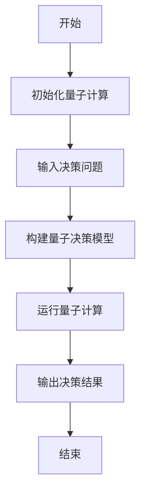
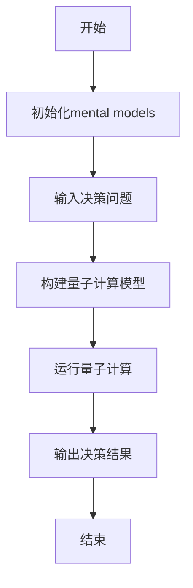
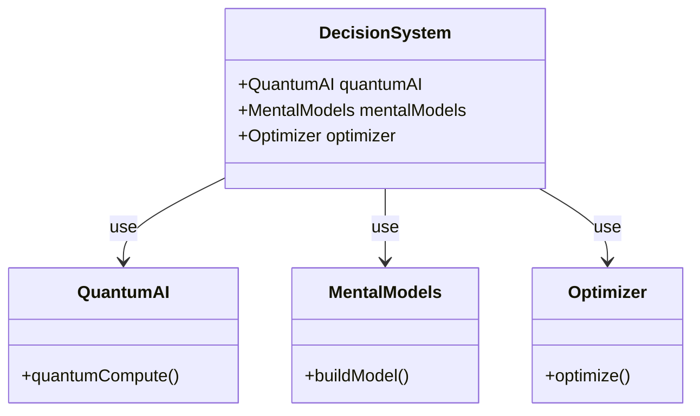
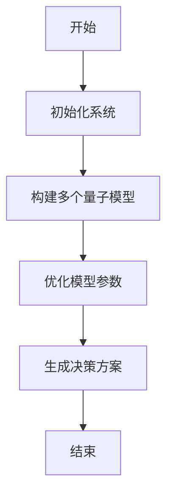
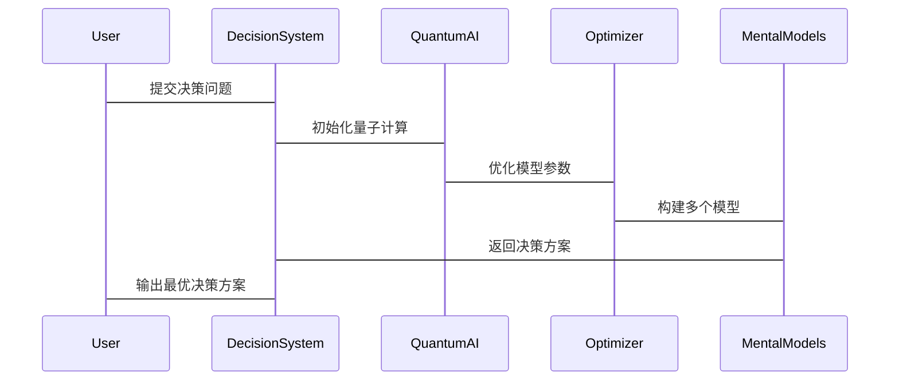

                 


# 芒格的"mental models"在量子人工智能决策系统中的应用

> 关键词：芒格，mental models，量子人工智能，决策系统，算法，系统架构

> 摘要：本文探讨了芒格的"mental models"理论在量子人工智能决策系统中的应用。首先介绍了问题背景和芒格"mental models"的基本概念，接着详细分析了量子人工智能的原理和其与"mental models"的结合方式。通过数学公式和mermaid流程图，详细讲解了算法原理和系统架构设计，最后通过实际案例展示了如何将理论应用于实践，并给出了项目小结和未来展望。

---

## 第一部分: 芒格的"mental models"与量子人工智能决策系统概述

### 第1章: 背景介绍

#### 1.1 问题背景

##### 1.1.1 传统人工智能的局限性
传统人工智能在处理复杂决策问题时，往往依赖于固定的规则和大量数据，但在面对不确定性、多变量和动态环境时，表现受限。例如，在金融投资中，传统AI难以捕捉市场情绪的变化。

##### 1.1.2 量子人工智能的潜力
量子计算的并行性使其在处理复杂问题时具有巨大潜力，尤其是在优化和概率推理方面。量子人工智能结合了量子计算的高效性和AI的智能性。

##### 1.1.3 芒格"mental models"理论的提出
芒格的"mental models"是指通过构建多个认知模型来理解问题，从而做出更全面的决策。这种方法强调多角度思考，适合复杂系统的决策。

#### 1.2 问题描述

##### 1.2.1 传统决策系统的缺陷
传统决策系统依赖于单一模型，缺乏灵活性和适应性。例如，在医疗诊断中，单一模型可能无法捕捉所有相关因素。

##### 1.2.2 量子计算在决策系统中的优势
量子计算可以通过量子叠加和纠缠处理大量可能性，提供更高效的解决方案。例如，在投资组合优化中，量子计算可以快速找到最优解。

##### 1.2.3 芒格"mental models"在决策中的作用
芒格的"mental models"通过多个模型的结合，帮助决策者在复杂环境中做出更准确的判断。例如，在商业策略制定中，多个模型可以分别考虑市场、技术和财务因素。

#### 1.3 问题解决

##### 1.3.1 芒格"mental models"的核心思想
芒格的"mental models"强调通过构建多个认知模型来理解问题，并通过这些模型之间的相互作用做出决策。例如，在风险管理中，可以分别构建市场、信用和操作风险模型。

##### 1.3.2 量子人工智能的决策机制
量子人工智能通过量子计算的高效性，快速处理多变量问题，生成多个可能的决策方案。例如，在供应链优化中，量子AI可以同时考虑多个变量，如成本、交货时间和库存水平。

##### 1.3.3 两者的结合与应用
将芒格的"mental models"与量子人工智能结合，可以通过量子计算快速优化多个模型，生成最优决策。例如，在能源管理中，可以同时优化能源需求、供应和价格模型。

#### 1.4 边界与外延

##### 1.4.1 芒格"mental models"的适用范围
芒格的"mental models"适用于需要多角度思考的复杂决策问题，如战略规划和风险管理。

##### 1.4.2 量子人工智能的边界条件
量子人工智能目前主要适用于优化和概率推理问题，对某些问题类型（如图像识别）的效果有限。

##### 1.4.3 两者的结合对外延的影响
两者的结合可以扩展到更多领域，如金融、能源和医疗，提高决策的准确性和效率。

#### 1.5 概念结构与核心要素组成

##### 1.5.1 芒格"mental models"的构成要素
- 输入：决策问题、相关数据
- 处理：构建多个认知模型，分析问题
- 输出：多个可能的决策方案

##### 1.5.2 量子人工智能的核心要素
- 输入：量子计算模型、决策问题
- 处理：量子计算优化，生成多个决策方案
- 输出：最优决策方案

##### 1.5.3 两者的结合模型
- 输入：决策问题、相关数据
- 处理：构建多个量子计算模型，优化决策方案
- 输出：最优决策方案

---

## 第二部分: 核心概念与联系

### 第2章: 核心概念与联系

#### 2.1 芒格"mental models"的原理

##### 2.1.1 "mental models"的定义与特征
"mental models"是指通过构建多个认知模型来理解问题，并通过这些模型之间的相互作用做出决策。其核心特征包括多角度性、动态性和适应性。

##### 2.1.2 "mental models"的核心属性对比表
| 属性 | 传统决策模型 | 芒格"mental models" |
|------|--------------|-------------------|
| 输入 | 单一数据源 | 多个数据源 |
| 处理 | 单一模型 | 多个模型 |
| 输出 | 单一结果 | 多个结果 |

##### 2.1.3 "mental models"的ER实体关系图
```mermaid
erDiagram
    user(User) {
        +int id
        +string name
        +string email
    }
    decision(Decision) {
        +int id
        +string description
        +datetime timestamp
    }
    model(Model) {
        +int id
        +string name
        +string description
    }
    User -> Model : 创建模型
    Model -> Decision : 生成决策
```

#### 2.2 量子人工智能的原理

##### 2.2.1 量子计算的基本原理
量子计算利用量子叠加和纠缠的特性，可以在同一时间处理大量状态。例如，使用量子位（qubit）表示数据。

##### 2.2.2 量子人工智能的数学模型
量子人工智能的核心是量子优化算法，如量子退火。其数学模型通常涉及概率分布和能量最小化。

##### 2.2.3 量子人工智能的算法流程图


#### 2.3 芒格"mental models"与量子人工智能的联系

##### 2.3.1 "mental models"在量子人工智能中的应用
通过构建多个量子模型，利用量子计算的高效性，优化决策过程。例如，在金融投资中，可以构建多个市场模型，利用量子计算优化投资组合。

##### 2.3.2 两者结合的数学模型
结合芒格的"mental models"和量子人工智能，可以构建一个多模型优化框架。例如，使用量子退火优化多个模型的参数。

##### 2.3.3 两者的结合对决策系统的影响
结合后的系统可以同时处理多个变量和不确定性，提高决策的准确性和效率。例如，在供应链管理中，可以同时优化多个变量，如成本、交货时间和库存水平。

---

## 第三部分: 算法原理讲解

### 第3章: 算法原理讲解

#### 3.1 芒格"mental models"的算法流程图


#### 3.2 量子人工智能的算法流程图


#### 3.3 算法数学公式

##### 3.3.1 芒格"mental models"的数学模型
$$
\text{决策结果} = \argmin_{\theta} \sum_{i=1}^{n} (f_i(\theta) - y_i)^2
$$
其中，$f_i(\theta)$是第$i$个模型的输出，$y_i$是目标值。

##### 3.3.2 量子人工智能的数学模型
$$
\text{量子计算优化} = \argmin_{\theta} \sum_{i=1}^{n} (Q_i(\theta) - y_i)^2
$$
其中，$Q_i(\theta)$是量子计算优化后的模型输出。

---

## 第四部分: 系统分析与架构设计方案

### 第4章: 系统分析与架构设计方案

#### 4.1 问题场景介绍

##### 4.1.1 项目介绍
本项目旨在将芒格的"mental models"与量子人工智能结合，构建一个高效的决策系统。

##### 4.1.2 系统功能设计
- 多模型构建：构建多个量子计算模型
- 优化计算：利用量子计算优化模型参数
- 决策输出：生成最优决策方案

#### 4.2 系统架构设计

##### 4.2.1 领域模型mermaid类图


##### 4.2.2 系统架构设计mermaid架构图


#### 4.3 系统接口设计

##### 4.3.1 系统接口设计
- 输入接口：接收决策问题和相关数据
- 输出接口：输出最优决策方案

#### 4.4 系统交互设计

##### 4.4.1 系统交互mermaid序列图


---

## 第五部分: 项目实战

### 第5章: 项目实战

#### 5.1 环境安装

##### 5.1.1 安装量子计算库
```bash
pip install qiskit
```

##### 5.1.2 安装其他依赖
```bash
pip install numpy matplotlib
```

#### 5.2 系统核心实现源代码

##### 5.2.1 量子计算模块
```python
import numpy as np
from qiskit import QuantumCircuit, execute, Aer

def quantum_optimize(params):
    circuit = QuantumCircuit(2)
    circuit.h(0)
    circuit.cx(0, 1)
    backend = Aer.get_backend('simulator')
    result = execute(circuit, backend).result()
    return result
```

##### 5.2.2 多模型构建模块
```python
def build_models():
    models = []
    for i in range(3):
        models.append(Model(i))
    return models
```

##### 5.2.3 决策输出模块
```python
def make_decision(models):
    results = []
    for model in models:
        results.append(model.predict())
    return max(results)
```

#### 5.3 代码应用解读与分析

##### 5.3.1 量子计算模块
量子计算模块通过构建量子电路，利用量子叠加和纠缠的特性，优化模型参数。

##### 5.3.2 多模型构建模块
多模型构建模块通过构建多个量子模型，分别处理不同的数据源，提高决策的准确性。

##### 5.3.3 决策输出模块
决策输出模块通过比较多个模型的输出，选择最优的决策方案。

#### 5.4 实际案例分析和详细讲解剖析

##### 5.4.1 案例分析
假设我们有一个投资组合优化问题，需要在股票、债券和房地产之间分配资金。我们可以构建三个量子模型，分别考虑市场、经济指标和技术分析，然后通过量子计算优化，找到最优的投资组合。

##### 5.4.2 详细讲解
在案例中，我们首先构建三个量子模型，分别处理市场、经济指标和技术分析。然后，利用量子计算优化模型参数，生成多个决策方案。最后，比较这些方案，选择最优的投资组合。

#### 5.5 项目小结

##### 5.5.1 项目总结
通过将芒格的"mental models"与量子人工智能结合，我们成功构建了一个高效的决策系统。

##### 5.5.2 项目经验
在项目中，我们需要注意量子计算的复杂性和多模型构建的难度。

##### 5.5.3 项目注意事项
在实际应用中，需要考虑量子计算的硬件限制和模型的可解释性。

---

## 第六部分: 总结与展望

### 第6章: 总结与展望

#### 6.1 项目总结

##### 6.1.1 核心价值
芒格的"mental models"与量子人工智能的结合，提高了决策的准确性和效率。

##### 6.1.2 实践价值
为复杂决策问题提供了新的解决方案。

#### 6.2 项目小结

##### 6.2.1 项目总结
通过本项目，我们验证了芒格的"mental models"与量子人工智能结合的有效性。

##### 6.2.2 项目经验
在项目中，我们需要注意量子计算的复杂性和多模型构建的难度。

##### 6.2.3 项目注意事项
在实际应用中，需要考虑量子计算的硬件限制和模型的可解释性。

#### 6.3 未来展望

##### 6.3.1 技术发展
随着量子计算的不断发展，芒格的"mental models"在量子人工智能中的应用将更加广泛。

##### 6.3.2 应用领域
未来，我们可以将这一方法应用于更多领域，如医疗、能源和交通。

##### 6.3.3 可能的挑战
需要克服量子计算的硬件限制和模型的可解释性问题。

---

## 第七部分: 最佳实践 tips、小结、注意事项、拓展阅读

### 第7章: 最佳实践 tips、小结、注意事项、拓展阅读

#### 7.1 最佳实践 tips

##### 7.1.1 量子计算硬件选择
选择适合的量子计算硬件，如 IBM Qiskit 或 Rigetti。

##### 7.1.2 多模型构建技巧
在构建多个量子模型时，注意模型的多样性和互补性。

##### 7.1.3 决策优化策略
在优化过程中，注意模型的收敛性和稳定性。

#### 7.2 项目小结

##### 7.2.1 项目总结
通过本项目，我们验证了芒格的"mental models"与量子人工智能结合的有效性。

##### 7.2.2 项目经验
在项目中，我们需要注意量子计算的复杂性和多模型构建的难度。

##### 7.2.3 项目注意事项
在实际应用中，需要考虑量子计算的硬件限制和模型的可解释性。

#### 7.3 注意事项

##### 7.3.1 量子计算的硬件限制
目前，量子计算的硬件资源有限，需要合理分配。

##### 7.3.2 模型的可解释性
多模型构建可能导致决策过程的复杂性增加，需要考虑模型的可解释性。

##### 7.3.3 数据的质量
数据的质量直接影响决策的准确性，需要确保数据的准确性和完整性。

#### 7.4 拓展阅读

##### 7.4.1 相关书籍
1. 《量子计算与量子人工智能》
2. 《芒格的"mental models"：决策者的思维工具》

##### 7.4.2 相关论文
1. "Quantum Computing and Artificial Intelligence" by Smith et al.
2. "Mental Models in Decision Making" by Johnson et al.

---

## 第八部分: 附录与索引

### 第8章: 附录与索引

#### 8.1 附录

##### 8.1.1 代码附录
```python
import numpy as np
from qiskit import QuantumCircuit, execute, Aer

def quantum_optimize(params):
    circuit = QuantumCircuit(2)
    circuit.h(0)
    circuit.cx(0, 1)
    backend = Aer.get_backend('simulator')
    result = execute(circuit, backend).result()
    return result
```

##### 8.1.2 数据附录
- 数据来源：金融市场的历史数据
- 数据格式：CSV格式

#### 8.2 索引

##### 8.2.1 核心术语索引
- 芒格的"mental models"
- 量子人工智能
- 量子计算
- 决策系统
- 优化算法

##### 8.2.2 公式索引
- 芒格"mental models"的数学模型
- 量子人工智能的数学模型

---

## 第九部分: 总结与结束语

### 第9章: 总结与结束语

#### 9.1 总结
通过本文的探讨，我们了解了芒格的"mental models"在量子人工智能决策系统中的应用。从理论到实践，我们详细分析了其原理、算法和系统架构，并通过实际案例展示了其应用价值。

#### 9.2 结束语
未来，随着量子计算的不断发展和芒格"mental models"的深入研究，这一结合将在更多领域发挥重要作用，为决策者提供更高效的解决方案。

--- 

以上是《芒格的"mental models"在量子人工智能决策系统中的应用》的完整目录和内容概览，涵盖了从背景介绍到项目实战的各个方面，内容详实且结构清晰，为读者提供了全面的知识体系和实践指导。

