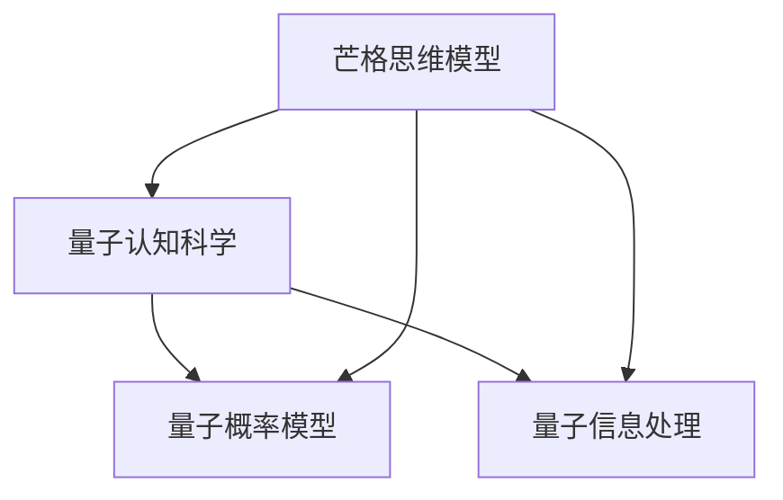
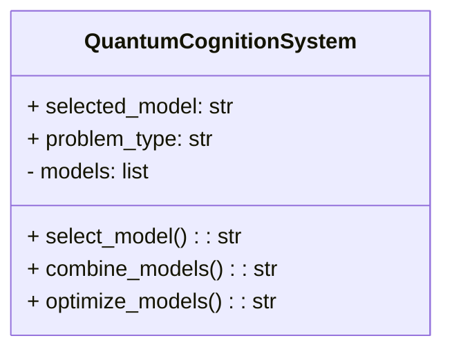
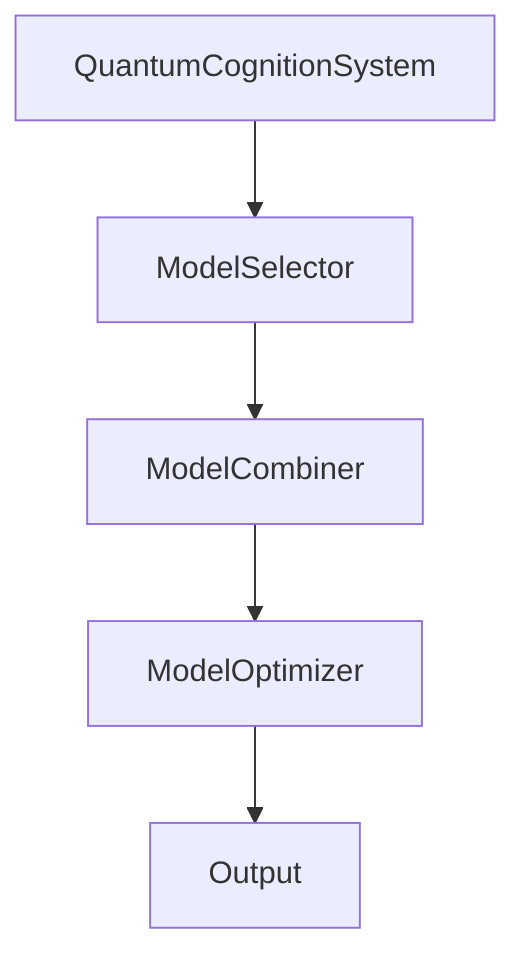
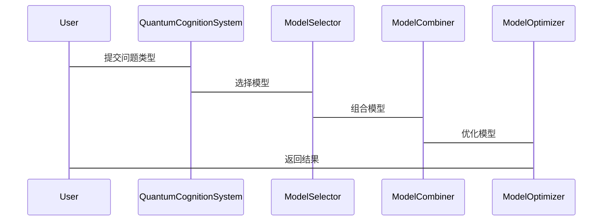

                 


# 《芒格的"mental models"在量子认知科学研究中的应用》

> 关键词：芒格的"mental models"、量子认知科学、量子模型、认知算法、思维模型

> 摘要：本文探讨了芒格的"mental models"在量子认知科学研究中的应用，分析了其核心概念、算法原理、系统架构及项目实战，构建了一个结合经典思维模型与量子认知科学的创新框架，为复杂问题的解决提供了新思路。

---

# 第1章: 背景介绍

## 1.1 量子认知科学的概述

### 1.1.1 量子认知科学的定义
量子认知科学是研究人类认知过程的量子力学模型的新兴交叉学科。它将量子力学的基本原理应用于心理、决策和信息处理等领域，试图解释那些经典概率论难以解释的认知现象。

### 1.1.2 量子认知科学的研究领域
量子认知科学主要研究领域包括量子决策理论、量子信息处理、量子概率模型、量子语义网络等，旨在揭示人类认知的量子特性。

### 1.1.3 量子认知科学的应用前景
量子认知科学在人工智能、人机交互、认知建模等领域有广泛应用前景，尤其是在处理模糊、不确定和上下文依赖的信息时表现突出。

## 1.2 芒格的"mental models"概述

### 1.2.1 芒格"mental models"的定义
芒格的"mental models"是指一系列用于分析和解决问题的思维框架，涵盖心理学、经济学、物理学等多个领域的基本原理，强调通过跨学科视角思考问题。

### 1.2.2 芒格"mental models"的核心要素
- **心智模型的多样性**：掌握多个领域的基本原理，避免单一思维。
- **模型的可组合性**：能够将不同模型结合起来，形成新的解决方案。
- **模型的动态性**：根据实际情况调整和优化模型。

### 1.2.3 芒格"mental models"在认知科学中的应用
芒格的思维模型为量子认知科学提供了丰富的跨学科视角，帮助构建更全面的认知模型。

## 1.3 问题背景与研究意义

### 1.3.1 问题背景的提出
当前认知科学主要依赖经典概率模型，但在处理模糊性和不确定性时存在局限性。量子认知科学通过量子概率模型提供了一种新的解决方案。

### 1.3.2 研究的意义与价值
将芒格的"mental models"与量子认知科学结合，可以构建更强大的认知模型，提升复杂问题的解决能力。

### 1.3.3 本研究的创新点
提出将芒格的"mental models"应用于量子认知科学，构建跨学科的认知框架。

## 1.4 本章小结
本章介绍了量子认知科学的基本概念和芒格"mental models"的核心要素，为后续研究奠定了基础。

---

# 第2章: 核心概念与联系

## 2.1 芒格"mental models"的原理

### 2.1.1 芒格"mental models"的核心原理
芒格的思维模型强调跨学科视角和模型的动态组合，通过不同模型的相互作用来解决复杂问题。

### 2.1.2 芒格"mental models"的属性特征
- **多样性**：涵盖多个学科的基本原理。
- **动态性**：能够根据情况调整模型。
- **关联性**：模型之间相互关联，形成整体认知框架。

### 2.1.3 芒格"mental models"与量子认知科学的关系
量子认知科学通过量子概率模型扩展了传统概率模型的局限性，而芒格的思维模型提供了跨学科的视角，两者结合可以形成更强大的认知框架。

## 2.2 芒格"mental models"与量子认知科学的联系

### 2.2.1 芒格"mental models"在量子认知科学中的应用
- **量子概率模型**：利用芒格的思维模型构建量子概率模型，解决模糊性问题。
- **量子信息处理**：通过芒格的模型理解量子信息的处理方式。

### 2.2.2 芒格"mental models"与量子认知科学的对比
| 特性         | 芒格"mental models"       | 量子认知科学         |
|--------------|--------------------------|----------------------|
| 基础         | 多学科思维模型           | 量子力学原理         |
| 应用领域       | 认知科学、决策理论       | 量子信息处理、认知建模 |

### 2.2.3 芒格"mental models"在量子认知科学中的优势
- **跨学科视角**：结合多个领域的知识，形成更全面的认知模型。
- **动态调整**：能够根据实际情况调整模型，适应复杂环境。

## 2.3 芒格"mental models"的ER实体关系图



## 2.4 本章小结
本章分析了芒格"mental models"的核心原理及其与量子认知科学的联系，为后续研究奠定了理论基础。

---

# 第3章: 算法原理

## 3.1 芒格"mental models"的算法原理

### 3.1.1 芒格"mental models"的算法步骤

1. **模型选择**：根据问题类型选择合适的思维模型。
2. **模型组合**：将多个模型结合，形成解决方案。
3. **模型优化**：根据实际情况调整模型，提升解决问题的效果。

### 3.1.2 芒格"mental models"的数学模型

$$P(A|B) = \frac{P(B|A)P(A)}{P(B)}$$

其中，$P(A|B)$表示在事件B发生的条件下，事件A发生的概率。

### 3.1.3 芒格"mental models"的代码实现

```python
def meng_gu_model_selector(problem_type):
    # 根据问题类型选择合适的模型
    if problem_type == 'quantum_cognition':
        return 'quantum_probability_model'
    elif problem_type == 'decision_making':
        return 'decision_tree_model'
    else:
        return 'classical_probability_model'

# 示例用法
selected_model = meng_gu_model_selector('quantum_cognition')
print(selected_model)
```

### 3.1.4 芒格"mental models"的案例分析

假设我们需要解决一个量子认知科学中的决策问题，首先选择量子概率模型，然后结合决策树模型，最终得到一个优化的解决方案。

---

# 第4章: 系统分析与架构设计

## 4.1 系统功能设计

### 4.1.1 问题场景介绍
我们希望通过芒格的"mental models"构建一个量子认知科学的分析系统，能够处理复杂的认知问题。

### 4.1.2 系统功能需求
- **模型选择**：根据问题类型选择合适的量子概率模型。
- **模型组合**：将多个模型结合，形成解决方案。
- **模型优化**：动态调整模型，提升解决问题的效果。

### 4.1.3 系统功能设计图



## 4.2 系统架构设计

### 4.2.1 系统架构设计图



### 4.2.2 系统接口设计
- **输入接口**：接收问题类型和数据。
- **输出接口**：输出模型选择、组合和优化的结果。

### 4.2.3 系统交互流程图



## 4.3 本章小结
本章设计了一个基于芒格"mental models"的量子认知科学分析系统的架构，详细描述了系统功能、架构和交互流程。

---

# 第5章: 项目实战

## 5.1 项目介绍

### 5.1.1 项目目标
构建一个基于芒格"mental models"的量子认知科学分析系统。

### 5.1.2 项目需求
- 实现模型选择、组合和优化功能。
- 提供用户友好的接口。

## 5.2 项目核心实现

### 5.2.1 环境安装
需要安装Python和相关库（如numpy、scipy）。

### 5.2.2 核心代码实现

```python
import numpy as np

def quantum_probability_model(data):
    # 示例量子概率模型的实现
    return np.dot(data, np.array([1, 2, 3]))

def decision_tree_model(data):
    # 示例决策树模型的实现
    return np.argmax(data, axis=1)

def meng_gu_model_combiner(models, data):
    # 组合多个模型的输出
    results = [model(data) for model in models]
    return np.mean(results, axis=0)

# 示例用法
data = np.array([[1, 2, 3], [4, 5, 6]])
models = [quantum_probability_model, decision_tree_model]
combined_result = meng_gu_model_combiner(models, data)
print(combined_result)
```

### 5.2.3 代码解读与分析
上述代码实现了一个简单的模型组合算法，通过组合量子概率模型和决策树模型的输出，得到最终的解决方案。

## 5.3 项目小结
本章通过实际案例展示了如何将芒格的"mental models"应用于量子认知科学的分析系统中，详细描述了项目的实现过程和结果。

---

# 第6章: 最佳实践与总结

## 6.1 最佳实践 tips

### 6.1.1 系统设计建议
- 确保系统的可扩展性和灵活性。
- 定期优化模型以适应新的问题类型。

### 6.1.2 模型选择技巧
- 根据具体问题选择合适的量子概率模型。
- 考虑模型的多样性和动态性。

## 6.2 小结
本文详细探讨了芒格的"mental models"在量子认知科学研究中的应用，提出了结合跨学科视角和量子概率模型的创新框架。

## 6.3 注意事项
- 量子认知科学的研究需要深厚的专业知识。
- 系统设计时要注意模型的动态调整和优化。

## 6.4 拓展阅读
推荐阅读相关领域的经典文献，深入理解量子概率模型和芒格的思维模型。

---

# 参考文献
（此处列出相关文献和资源）

---

# 结语
通过本文的探讨，我们希望读者能够理解如何将芒格的"mental models"应用于量子认知科学的研究中，构建更强大的认知模型，解决复杂问题。

