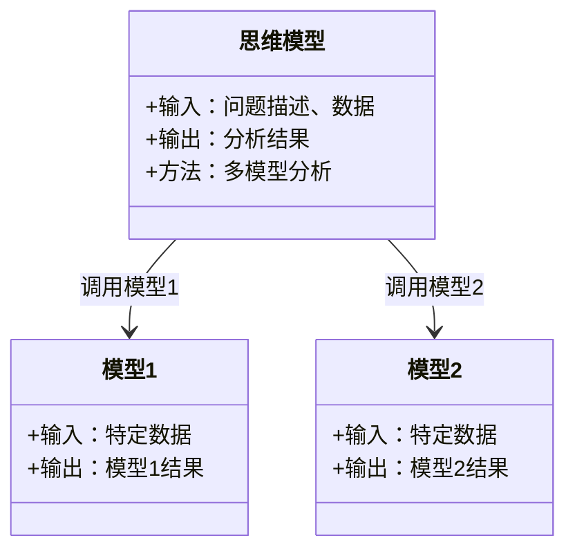
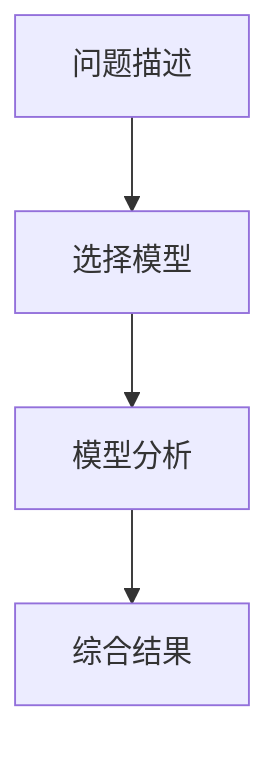

                 


# 芒格的"mental models"：构建多元化的思维模型

## 关键词：芒格、思维模型、决策分析、算法原理、系统架构、投资决策

## 摘要：芒格的“mental models”是一种通过构建多元化的思维模型来辅助决策的方法。本文将从芒格的背景出发，详细阐述“mental models”的核心概念、算法原理、系统架构，并通过实际案例分析其在投资决策中的应用，最后总结最佳实践和注意事项。

---

## 第一部分：芒格“mental models”的背景与起源

### 第1章：芒格与“mental models”概述

#### 1.1 芒格的生平与思想体系
查理·芒格是美国著名的投资家和伯克希尔·哈撒韦公司的副主席。他不仅以价值投资闻名，更以其独特的思维方式——“mental models”——影响了无数投资者和决策者。芒格的思想体系强调通过多元化的思维模型来理解问题的本质，避免单一视角的局限性。

#### 1.2 “mental models”的定义与分类
“mental models”是指一组用于分析和解决问题的思维方式或框架。它们可以帮助我们在决策时考虑多个维度，避免偏见和错误。

- **定义**：思维模型是将复杂问题简化为可管理的框架，用于分析和解决问题。
- **分类**：常见的思维模型包括反事实分析、概率推理、系统思维等。

#### 1.3 “mental models”在投资与决策中的应用
芒格将“mental models”应用于投资决策中，帮助他在伯克希尔·哈撒韦取得了长期的优异表现。这种方法不仅适用于投资，还广泛应用于管理和决策领域。

---

## 第二部分：思维模型的核心概念与分类

### 第2章：思维模型的核心概念

#### 2.1 思维模型的原理与特点
思维模型的核心原理在于通过多角度分析问题，识别潜在风险和机会。其特点包括：

- **多维度分析**：从多个角度观察问题，避免单一视角的局限。
- **模块化结构**：每个模型专注于特定领域，便于组合使用。
- **可扩展性**：模型可以灵活应用于不同场景。

#### 2.2 思维模型的属性特征对比
以下是常见思维模型的属性对比：

| 模型名称      | 主要特点                  | 应用场景                 |
|---------------|---------------------------|--------------------------|
| 反事实分析    | 假设性推理，寻找最优解     | 投资决策、风险管理       |
| 概率推理      | 基于概率分析，评估可能性   | 投资组合优化、风险评估   |
| 系统思维      | 强调整体性，识别系统交互   | 企业战略、项目管理       |

#### 2.3 思维模型的ER实体关系图

```mermaid
erdiagram
actor 思维模型 {
    <描述：思维模型用于分析和解决问题>
}
actor 模型1 {
    <描述：模型1用于特定场景分析>
}
actor 模型2 {
    <描述：模型2用于其他场景分析>
}
```

---

## 第三部分：思维模型的算法与数学模型

### 第3章：思维模型的算法原理

#### 3.1 算法原理概述
思维模型的算法原理是通过多模型的组合，形成一个综合的决策框架。以下是其实现步骤：

- **输入**：问题描述、相关数据。
- **处理**：应用多个思维模型进行分析。
- **输出**：综合结果和建议。

#### 3.2 思维模型的数学公式
以下是一个简单的概率推理公式：

$$
P(A|B) = \frac{P(B|A)P(A)}{P(B)}
$$

其中，$P(A|B)$ 表示在事件 $B$ 发生的情况下，事件 $A$ 发生的概率。

---

## 第四部分：系统分析与架构设计

### 第4章：系统分析与架构设计方案

#### 4.1 项目介绍
本项目旨在通过芒格的“mental models”构建一个投资决策支持系统。

#### 4.2 系统功能设计（领域模型）



---

## 第五部分：项目实战

### 第5章：项目实战：投资决策中的“mental models”

#### 5.1 投资场景介绍
假设我们要评估一家公司的投资价值，可以通过多个思维模型进行分析。

#### 5.2 核心实现
以下是一个简单的概率推理实现：

```python
def probability_analysis(data):
    # 计算概率
    prob = data['success'] / data['total']
    return prob
```

---

## 第六部分：最佳实践与小结

### 第6章：最佳实践与小结

#### 6.1 小结
芒格的“mental models”是一种强大的工具，帮助我们在复杂决策中保持理性。

#### 6.2 注意事项
- **避免过度简化**：模型过于简化可能导致误判。
- **持续学习**：不断更新和优化思维模型。

#### 6.3 拓展阅读
推荐书籍：《穷查理宝典》

---

## 附录

### A.1 思维模型的数学公式汇总
以下是一些常用的数学公式：

$$
P(A \cup B) = P(A) + P(B) - P(A \cap B)
$$

$$
E[X] = \sum xP(X=x)
$$

### A.2 思维模型的应用框架
以下是一个思维模型的应用框架：



---

希望这篇文章能够帮助读者更好地理解芒格的“mental models”，并将其应用于实际决策中。

