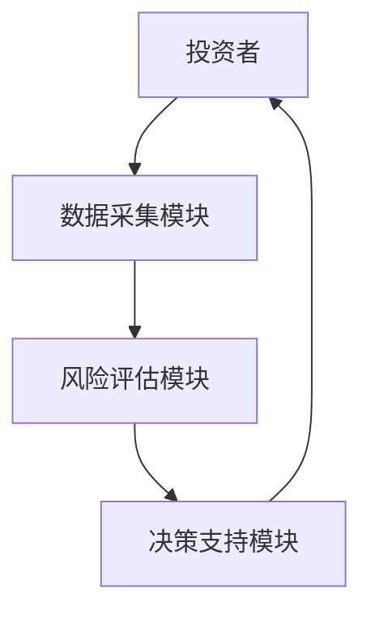

                 


# 芒格的"不做"清单：避免常见投资陷阱

---

## 关键词
芒格, 投资陷阱, 不做清单, 投资决策, 风险管理

---

## 摘要
本文将详细介绍芒格的“不做”清单，探讨其在投资决策中的重要性。通过分析常见的投资陷阱，结合实际案例和数学模型，帮助投资者避免常见误区，制定更稳健的投资策略。文章内容包括背景介绍、核心概念、算法原理、系统架构设计、项目实战及最佳实践等部分，为读者提供全面的指导。

---

## 第一部分：芒格的“不做”清单概述

### 第1章：投资陷阱的背景与挑战

#### 1.1 投资陷阱的背景
投资陷阱是指投资者在决策过程中因认知偏差、情绪影响或信息不对称等因素，导致做出错误投资决策的情况。这些陷阱可能源于市场波动、公司基本面变化或投资者自身心理偏差。

#### 1.2 投资陷阱的常见类型
- **市场泡沫陷阱**：投资者在市场高涨时盲目跟风，忽视基本面分析。
- **信息过载陷阱**：投资者被大量信息干扰，难以做出理性决策。
- **短期波动陷阱**：过度关注短期收益，忽视长期价值。
- **从众心理陷阱**：盲目跟随市场趋势，忽视独立判断。

#### 1.3 投资陷阱的负面影响
- **财务损失**：错误决策可能导致资产贬值。
- **信任危机**：多次错误决策会影响投资者的信誉。
- **心理压力**：频繁亏损会增加心理负担，影响投资判断。

---

### 第2章：芒格的“不做”清单的起源

#### 2.1 芒格的“不做”清单的提出
芒格的“不做”清单是一种投资策略，旨在通过避免常见错误来提高投资成功率。这一理念源于他对心理学和投资学的深刻理解。

#### 2.2 芒格“不做”清单的核心理念
- **避免过度自信**：承认自身局限性，避免过度自信导致的错误决策。
- **避免从众心理**：独立思考，避免随大流。
- **避免短期思维**：关注长期价值，忽略短期波动。
- **避免过度分散投资**：集中投资优质资产，避免分散导致收益稀释。
- **避免忽视风险**：始终关注风险，确保投资决策的稳健性。

#### 2.3 芒格“不做”清单的哲学基础
芒格的清单深受其“心理误判”理论影响，认为投资者的心理偏差是导致错误决策的主要原因。他强调通过自我约束和理性分析来克服这些偏差。

---

### 第3章：“不做”清单在投资决策中的重要性

#### 3.1 “不做”清单的核心作用
- **避免常见陷阱**：通过清单排除潜在风险，降低错误决策概率。
- **提升投资效率**：减少无效投资，集中资源于优质标的。
- **增强决策信心**：通过明确的清单，投资者可以更有信心地做出决策。

#### 3.2 “不做”清单的投资哲学
芒格的清单不仅仅是工具，更是一种投资哲学，强调长期价值、独立思考和风险管理。

---

### 第4章：“不做”清单的核心原则

#### 4.1 避免过度自信
投资者往往高估自己的能力，容易忽视市场不确定性。通过清单，投资者可以保持谦逊，避免过度自信。

#### 4.2 避免从众心理
从众心理是投资陷阱之一，芒格建议投资者独立思考，避免随大流。

#### 4.3 避免短期思维
短期思维导致投资者频繁交易，增加成本并降低收益。清单要求关注长期价值。

#### 4.4 避免过度分散投资
分散投资可能导致收益稀释，清单建议集中投资优质资产。

#### 4.5 避免忽视风险
风险是投资中不可忽视的一部分，清单要求投资者始终关注风险。

---

### 第5章：“不做”清单的实施策略

#### 5.1 制定“不做”清单的具体标准
- **行业限制**：避免投资高风险行业。
- **估值过高**：避免投资估值过高的股票。
- **管理层问题**：避免投资治理不善的公司。
- **市场周期**：避免在市场高点投资。

#### 5.2 定期评估和调整清单
市场环境和个人目标会变化，清单需要定期调整。

---

### 第6章：“不做”清单的案例分析

#### 6.1 典型投资陷阱案例
- **案例1：市场泡沫陷阱**：投资者在科技泡沫期间盲目投资科技股，最终亏损严重。
- **案例2：从众心理陷阱**：投资者跟随市场趋势投资某行业，但该行业因政策变化大幅亏损。

---

### 第7章：“不做”清单的数学模型与公式

#### 7.1 投资组合优化模型
$$ \text{最大化收益} \quad \sum_{i=1}^n w_i R_i $$
$$ \text{约束条件} \quad \sum_{i=1}^n w_i = 1 $$

#### 7.2 风险评估模型
$$ \text{风险} = \sqrt{\sum_{i=1}^n w_i^2 \sigma_i^2} $$

---

### 第8章：“不做”清单的系统架构设计

#### 8.1 系统功能模块划分
- 数据采集模块：收集市场数据。
- 风险评估模块：评估投资风险。
- 决策支持模块：提供投资建议。

#### 8.2 系统数据流图


---

### 第9章：“不做”清单的项目实战

#### 9.1 项目背景与目标
项目目标是通过“不做”清单筛选出优质投资标的，避免常见陷阱。

#### 9.2 项目核心实现
```python
def investment_decision(stock_data, threshold):
    # 筛选估值低于阈值的股票
    selected = stock_data[stock_data['valuation'] < threshold]
    return selected
```

---

### 第10章：最佳实践

#### 10.1 投资者的心理与行为调整
- **避免心理偏差**：通过清单约束自己的决策。
- **培养长期思维**：关注长期价值。
- **提高决策透明度**：记录决策过程，便于复盘。

#### 10.2 小结
芒格的“不做”清单是一种有效的投资工具，帮助投资者避免常见陷阱，制定稳健的投资策略。

---

## 附录：拓展阅读
- 《芒格的投资哲学》
- 《投资的真谛》
- 《风险管理的艺术》

---

通过本文的详细分析，读者可以深入了解芒格的“不做”清单，学会如何避免常见投资陷阱，制定更稳健的投资策略。

