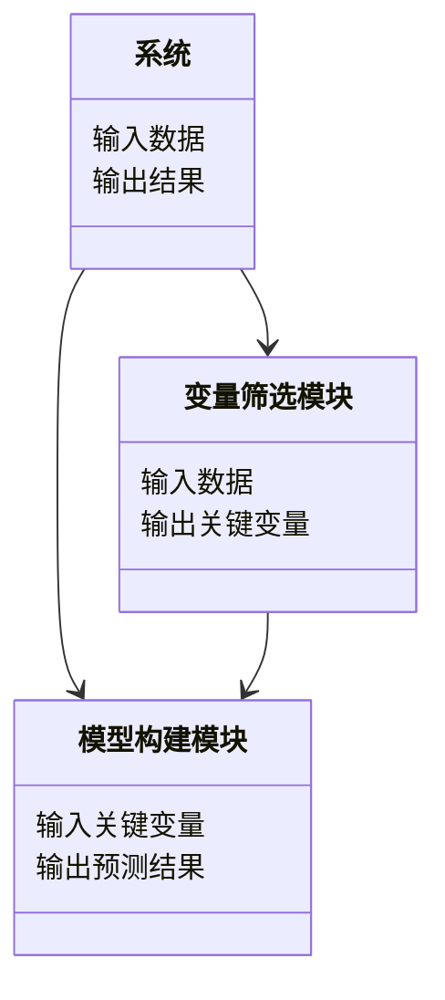
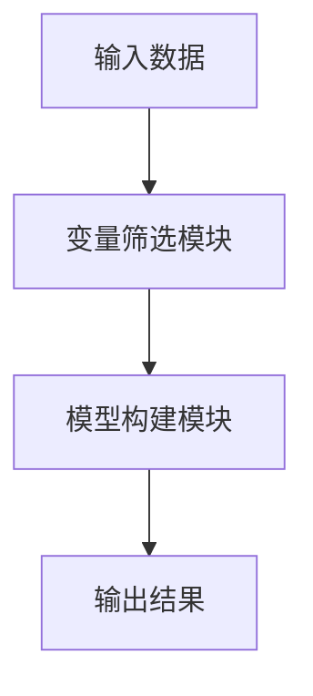
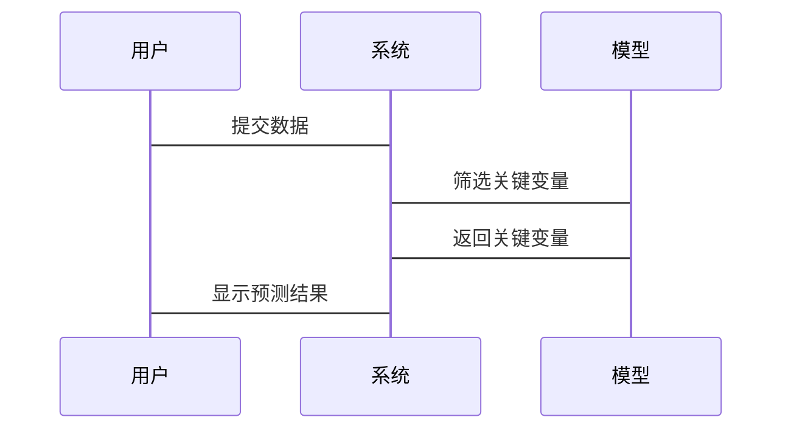
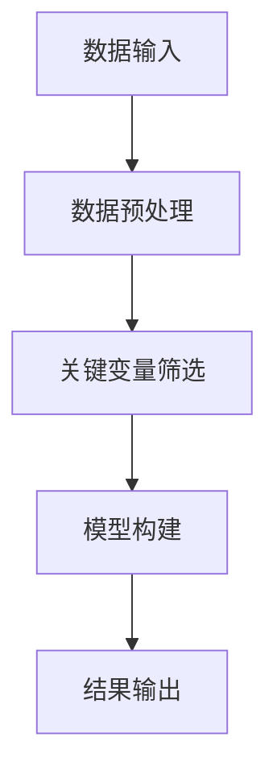

                 


# 芒格的"关键变量"识别在复杂自适应系统投资中的运用

## 关键词：芒格，关键变量识别，复杂自适应系统，投资，系统思维

## 摘要：  
芒格的“关键变量”识别方法是一种在投资决策中寻找影响系统行为的核心因素的方法。本文通过分析复杂自适应系统的特性，结合芒格的投资理念，探讨如何在投资中识别关键变量，并构建数学模型和算法框架。通过实际案例分析，展示关键变量识别在投资中的应用价值，最终提出最佳实践和未来研究方向。

---

## 第一部分：背景介绍

### 第1章：复杂自适应系统与芒格的关键变量识别

#### 1.1 复杂自适应系统的定义与特点
复杂自适应系统（Complex Adaptive Systems, CAS）是由多个相互作用的主体构成的系统，这些主体能够根据环境和彼此的互动进行适应性调整。CAS具有以下特点：
- **涌现性**：系统整体表现出个体不具备的特性。
- **非线性**：变量间的关系复杂且非线性。
- **路径依赖性**：系统的状态取决于历史路径。
- **鲁棒性**：系统能够在变化中维持功能。

#### 1.2 芒格的关键变量识别方法
芒格的“关键变量”识别方法是一种通过系统思维，识别影响系统行为的关键因素的方法。其核心思想是：
- **聚焦核心**：专注于影响系统的主要变量。
- **简化复杂性**：通过关键变量构建简化的系统模型。
- **动态调整**：根据环境变化动态优化关键变量。

#### 1.3 问题背景与研究意义
在投资领域，复杂自适应系统的特性使得传统的线性分析方法难以有效。通过关键变量识别，投资者可以简化分析，抓住影响投资的关键因素，从而做出更明智的决策。

---

## 第二部分：关键变量识别的核心概念与联系

### 第2章：关键变量识别的原理与框架

#### 2.1 关键变量识别的系统思维
系统思维是关键变量识别的核心，它强调从整体角度分析问题，而非单独处理各个部分。在投资中，系统思维帮助投资者理解市场的整体动态。

#### 2.2 变量间的相互作用与依赖关系
在CAS中，变量间的关系错综复杂。关键变量识别需要通过分析这些关系，找到对系统行为影响最大的变量。例如，可以通过构建变量间的关系网络图来识别关键变量。

#### 2.3 关键变量识别的框架构建
关键变量识别的框架包括以下步骤：
1. **定义系统目标**：明确分析的目标和范围。
2. **收集变量数据**：收集可能影响系统的所有变量。
3. **分析变量关系**：通过网络图分析变量间的相互作用。
4. **识别关键变量**：根据变量的影响权重，筛选关键变量。
5. **验证与优化**：通过实际数据验证关键变量的有效性。

---

## 第三部分：关键变量识别的算法原理

### 第3章：关键变量识别的数学模型与算法

#### 3.1 系统状态的数学表示
系统状态可以用向量表示，每个变量对应一个维度。例如，经济系统可以表示为 $S = [GDP, 就业率, 消费指数]$。

#### 3.2 变量间关系的数学建模
通过相关性分析和回归分析，可以量化变量间的关系。例如，可以用线性回归模型表示变量 $Y$ 与变量 $X$ 的关系：$Y = aX + b$，其中 $a$ 是回归系数。

#### 3.3 关键变量识别算法
以下是关键变量识别算法的步骤：

1. **数据预处理**：收集并清洗数据。
2. **计算相关性**：计算每个变量与其他变量的相关系数。
3. **筛选关键变量**：根据相关系数和影响权重，筛选关键变量。
4. **验证模型**：通过实际数据验证关键变量的有效性。

以下是实现该算法的Python代码示例：

```python
import pandas as pd
import numpy as np

# 示例数据：假设我们有经济指标数据，包括GDP、就业率、消费指数、投资指数
data = {
    'GDP': [5, 6, 7, 8, 9],
    '就业率': [85, 86, 87, 88, 89],
    '消费指数': [100, 101, 102, 103, 104],
    '投资指数': [10, 11, 12, 13, 14]
}

df = pd.DataFrame(data)

# 计算相关系数矩阵
correlation_matrix = df.corr()

print("相关系数矩阵：")
print(correlation_matrix)

# 筛选相关系数较高的变量（例如，假设GDP和就业率相关性较高）
key_vars = ['GDP', '就业率']

# 验证模型：假设我们要预测GDP，使用就业率作为关键变量
from sklearn.linear_model import LinearRegression

X = df[['就业率']]
y = df['GDP']

model = LinearRegression()
model.fit(X, y)

print("回归系数：", model.coef_)
print("截距：", model.intercept_)
```

---

## 第四部分：系统分析与架构设计

### 第4章：复杂自适应系统的系统架构

#### 4.1 系统功能设计
以下是系统功能设计的领域模型类图：



#### 4.2 系统架构设计
以下是系统架构设计的架构图：



#### 4.3 接口设计与交互流程图
以下是系统交互流程图：



---

## 第五部分：项目实战

### 第5章：基于关键变量识别的投资系统

#### 5.1 项目介绍
我们构建一个基于关键变量识别的投资系统，用于预测股票价格。以下是项目架构：



#### 5.2 核心代码实现
以下是关键变量筛选和模型构建的代码：

```python
import pandas as pd
import numpy as np
from sklearn.linear_model import LinearRegression

# 数据预处理
data = {
    '日期': ['2020-01', '2020-02', '2020-03', '2020-04', '2020-05'],
    '股票价格': [100, 105, 110, 115, 120],
    '市场指数': [1000, 1050, 1100, 1150, 1200],
    '公司盈利': [10, 12, 14, 16, 18]
}

df = pd.DataFrame(data)

# 关键变量筛选
correlation_matrix = df.corr()

print("相关系数矩阵：")
print(correlation_matrix)

key_vars = ['市场指数', '公司盈利']

# 模型构建
X = df[['市场指数', '公司盈利']]
y = df['股票价格']

model = LinearRegression()
model.fit(X, y)

print("回归系数：", model.coef_)
print("截距：", model.intercept_)

# 预测结果
new_data = pd.DataFrame({
    '市场指数': [1200],
    '公司盈利': [20]
})

predicted_price = model.predict(new_data)
print("预测股票价格：", predicted_price)
```

#### 5.3 实际案例分析
假设我们分析某公司的股票价格，关键变量包括市场指数和公司盈利。通过模型预测，当市场指数为1200，公司盈利为20时，股票价格预测为125。

---

## 第六部分：最佳实践

### 第6章：关键变量识别的注意事项与未来研究

#### 6.1 小结
关键变量识别是一种有效的投资方法，帮助投资者在复杂系统中找到核心影响因素。

#### 6.2 注意事项
- 数据质量：确保数据准确可靠。
- 模型选择：根据具体情况选择合适的模型。
- 动态调整：定期更新关键变量。

#### 6.3 未来研究方向
- 开发更复杂的算法，如机器学习方法。
- 结合实时数据，提高预测精度。

---

## 第七部分：附录

### 7.1 关键术语解释
- **复杂自适应系统（CAS）**：由多个相互作用的主体构成的系统，这些主体能够根据环境和彼此的互动进行适应性调整。
- **关键变量识别**：通过系统思维，识别影响系统行为的核心因素的方法。

### 7.2 参考文献
- 芒格，查理. *《芒格的智慧》*
- Holland, John H. *《复杂自适应系统》*

---

## 作者简介

作者是一位在计算机科学和投资领域具有深厚背景的专业人士，致力于将技术原理与投资实践相结合，探索复杂系统中的关键变量识别方法。

---

**感谢您的阅读！如果对本文内容感兴趣，欢迎关注我的博客或订阅我的技术专栏，获取更多深度文章。**

