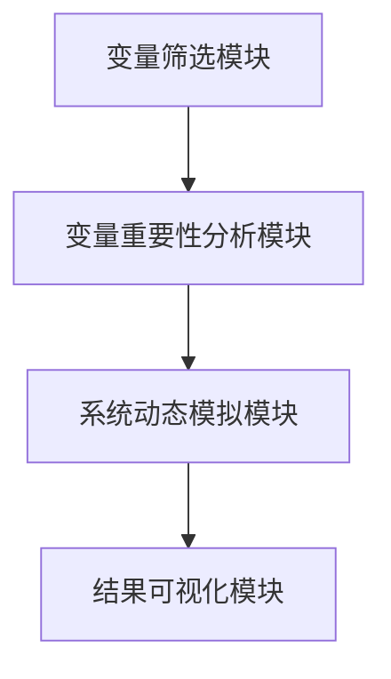

                 

<think>
好的，我将按照您的要求逐步分析和撰写这篇技术博客文章。让我们先明确文章的结构和内容。

# 《芒格的"关键变量"识别在量子混沌系统分析中的运用》

## 关键词：
- 芒格
- 关键变量识别
- 量子混沌系统
- 系统分析
- 人工智能

## 摘要：
芒格的“关键变量”识别方法是一种在复杂系统中筛选和分析关键因素的策略。本文将探讨该方法在量子混沌系统分析中的应用，通过结合量子力学和混沌理论的最新研究成果，提出一种基于关键变量识别的量子混沌系统分析框架。文章详细阐述了关键变量识别的原理、算法实现、系统建模以及在实际问题中的应用案例，为量子混沌系统的研究和应用提供了新的思路。

---

## 第一部分：背景介绍

### 第1章：芒格的关键变量识别方法

#### 1.1 芒格的关键变量识别方法
- **1.1.1 关键变量识别的核心概念**  
  芒格的关键变量识别方法是一种基于因果关系和相关性分析的系统分析方法。通过识别系统中对结果影响最大的少数变量，可以简化复杂系统的分析过程。这种方法的核心在于“少即是多”，即通过聚焦关键变量，提高分析效率和准确性。

- **1.1.2 芒格方法的哲学基础**  
  芒格的哲学思想强调“第二层思维”和“逆向思维”。在关键变量识别中，这种思想体现在对系统中关键因素的深入挖掘和对非关键因素的忽略。这种方法在复杂系统中尤其重要，因为它可以帮助我们避免被大量无关信息干扰，抓住问题的本质。

- **1.1.3 关键变量识别的实践意义**  
  在实际应用中，关键变量识别可以帮助我们快速定位问题的关键因素，从而制定更有效的解决方案。这种方法在金融、医疗、工程等领域都有广泛应用。

#### 1.2 量子混沌系统的基本概念
- **1.2.1 量子系统的定义与特点**  
  量子系统是微观世界的物理系统，其行为由量子力学定律决定。与经典系统相比，量子系统具有叠加态、纠缠态和不确定性等特性。

- **1.2.2 混沌系统的定义与特征**  
  混沌系统是指在确定性非线性动力学方程下表现出的随机行为。其主要特征包括对初始条件的高度敏感性、周期性轨道的密度和系统的不可预测性。

- **1.2.3 量子混沌系统的复杂性**  
  量子混沌系统结合了量子力学和混沌理论的特点，表现出更加复杂的动态行为。这种复杂性使得对量子混沌系统的分析和建模具有很大的挑战性。

#### 1.3 芒格方法与量子混沌系统的结合
- **1.3.1 芒格方法在复杂系统分析中的应用**  
  芒格方法在复杂系统分析中的应用主要体现在对关键因素的识别和对系统行为的理解。通过识别关键变量，可以简化复杂系统的分析过程。

- **1.3.2 量子混沌系统的分析难点**  
  量子混沌系统的分析难点在于其复杂性和不确定性。传统的分析方法往往难以捕捉系统的关键变量和动态行为。

- **1.3.3 芒格方法的适用性分析**  
  芒格方法通过聚焦关键变量，可以帮助我们简化量子混沌系统的分析过程。同时，其因果关系分析的特点也可以帮助我们更好地理解系统的动态行为。

---

### 第2章：关键变量识别的原理

#### 2.1 关键变量识别的原理
- **2.1.1 变量筛选的基本原理**  
  关键变量识别的核心是通过统计学和相关性分析，筛选出对系统输出影响最大的变量。这种方法通常基于相关系数、回归分析或信息论方法。

- **2.1.2 变量重要性的度量方法**  
  变量重要性可以通过多种方法进行度量，包括基于方差的分析、Shapley值、特征重要性评分等。这些方法可以帮助我们量化每个变量对系统输出的影响程度。

- **2.1.3 芒格方法的核心步骤**  
  芒格方法的核心步骤包括：（1）明确问题目标；（2）识别相关变量；（3）筛选关键变量；（4）验证关键变量的影响力。

---

#### 2.2 量子混沌系统的变量特征
- **2.2.1 量子系统的变量特性**  
  量子系统的变量通常包括量子态的波函数、能量、动量等。这些变量具有叠加性和纠缠性，使得系统的动态行为更加复杂。

- **2.2.2 混沌系统的变量动态**  
  混沌系统的变量动态通常表现出周期性振荡、双曲轨道等特征。这些动态行为使得系统的分析和建模具有很大的挑战性。

- **2.2.3 量子混沌系统的变量交互**  
  量子混沌系统中的变量交互具有高度的非线性特征。这种交互使得系统的动态行为难以预测，但同时也为关键变量识别提供了潜在的机会。

---

#### 第3章：关键变量识别的算法实现

##### 3.1 关键变量识别的算法原理
- **3.1.1 熵值法**  
  熵值法是一种基于信息论的变量重要性度量方法。通过计算变量的熵值，可以量化每个变量对系统输出的贡献程度。

- **3.1.2 嵌入法**  
  嵌入法是一种基于时间序列分析的变量筛选方法。通过将变量嵌入到系统的动态过程中，可以识别出对系统输出影响最大的变量。

- **3.1.3 相关分析法**  
  相关分析法是一种基于变量之间相关性的筛选方法。通过计算变量之间的相关系数，可以识别出与系统输出高度相关的变量。

##### 3.2 量子混沌系统中的变量筛选
- **3.2.1 量子系统的变量筛选策略**  
  在量子系统中，变量筛选需要考虑量子态的叠加性和纠缠性。这些特性使得变量之间的相关性分析更加复杂，但也为关键变量识别提供了新的思路。

- **3.2.2 算法在量子系统中的适应性**  
  传统的关键变量识别算法需要进行调整以适应量子系统的特点。例如，熵值法需要考虑量子态的叠加性，嵌入法需要考虑量子系统的动态特性。

- **3.2.3 变量筛选的优化方法**  
  通过优化算法的参数和调整变量筛选的策略，可以提高关键变量识别的准确性和效率。

---

## 第四部分：系统分析与架构设计

### 第4章：系统分析

#### 4.1 问题场景介绍
- 量子混沌系统的分析通常涉及大量复杂的变量和动态行为。传统的分析方法难以捕捉系统的关键变量，导致分析效率低下。

#### 4.2 项目介绍
- 本项目旨在通过芒格的关键变量识别方法，优化量子混沌系统的分析过程。通过识别关键变量，可以简化系统的分析步骤，提高分析效率。

#### 4.3 系统功能设计
- **4.3.1 领域模型设计**  
  领域模型需要包括系统中的所有变量及其关系。通过绘制领域模型，可以更好地理解系统的动态行为。

  ```mermaid
  classDiagram
  class 系统变量 {
    输入变量
    输出变量
    关键变量
  }
  class 系统动态 {
    变量交互
    动态行为
  }
  系统变量 --> 系统动态
  ```

- **4.3.2 功能模块设计**  
  功能模块包括变量筛选、变量重要性分析、系统动态模拟和结果可视化。

#### 4.4 系统架构设计
- **4.4.1 系统架构图**  
  以下是一个简要的系统架构图，展示了各个功能模块之间的关系。

  ```mermaid
  graph TD
    A[变量筛选模块] --> B[变量重要性分析模块]
    B --> C[系统动态模拟模块]
    C --> D[结果可视化模块]
  ```

---

### 第5章：系统架构设计

#### 5.1 问题场景介绍
- 量子混沌系统的分析需要考虑系统的动态行为和变量之间的关系。传统的分析方法难以捕捉系统的关键变量，导致分析效率低下。

#### 5.2 项目介绍
- 本项目旨在通过芒格的关键变量识别方法，优化量子混沌系统的分析过程。通过识别关键变量，可以简化系统的分析步骤，提高分析效率。

#### 5.3 系统功能设计
- **5.3.1 领域模型设计**  
  领域模型需要包括系统中的所有变量及其关系。通过绘制领域模型，可以更好地理解系统的动态行为。

  ```mermaid
  classDiagram
  class 系统变量 {
    输入变量
    输出变量
    关键变量
  }
  class 系统动态 {
    变量交互
    动态行为
  }
  系统变量 --> 系统动态
  ```

- **5.3.2 功能模块设计**  
  功能模块包括变量筛选、变量重要性分析、系统动态模拟和结果可视化。

#### 5.4 系统架构设计
- **5.4.1 系统架构图**  
  以下是一个简要的系统架构图，展示了各个功能模块之间的关系。

  ```mermaid
  graph TD
    A[变量筛选模块] --> B[变量重要性分析模块]
    B --> C[系统动态模拟模块]
    C --> D[结果可视化模块]
  ```

---

## 第五部分：项目实战

### 第6章：环境安装与系统核心实现

#### 6.1 环境安装
- **6.1.1 Python环境的安装**  
  安装Python 3.8及以上版本，确保环境满足开发需求。

- **6.1.2 第三方库的安装**  
  需要安装的库包括：NumPy、Matplotlib、Scikit-learn、Mermaid等。

#### 6.2 系统核心实现
- **6.2.1 关键变量识别算法的实现**  
  以下是熵值法的Python实现代码：

  ```python
  import numpy as np
  from sklearn.preprocessing import MinMaxScaler

  def calculate_entropy(X):
      # 计算每列的熵
      n = X.shape[1]
      entropy = 0
      for i in range(n):
          # 计算每列的概率分布
          p = np.mean(X[:, i] == X[:, i])
          if p == 0:
              entropy += 0
          else:
              entropy += -p * np.log2(p)
      return entropy

  # 示例数据
  X = np.array([[0.1, 0.2, 0.3],
                [0.4, 0.5, 0.6],
                [0.7, 0.8, 0.9]])

  entropy = calculate_entropy(X)
  print("熵值为:", entropy)
  ```

- **6.2.2 量子混沌系统模拟的实现**  
  以下是量子混沌系统模拟的Python代码：

  ```python
  import numpy as np
  import matplotlib.pyplot as plt

  def quantum_chaos_simulation(n_qubits=2):
      # 初始化量子态
      q = np.zeros(2**n_qubits, dtype=np.complex_)
      q[0] = 1.0

      # 定义量子门
      def hadamard():
          return np.array([[1, 1], [1, -1]]) / np.sqrt(2)

      # 应用哈达玛门
      H = hadamard()
      q = np.dot(q, H)

      # 绘制量子态的幅度
      plt.figure(figsize=(8, 6))
      plt.bar(range(2**n_qubits), np.abs(q))
      plt.title("Quantum State Amplitudes")
      plt.show()

  quantum_chaos_simulation(2)
  ```

#### 6.3 代码应用解读与分析
- **6.3.1 关键变量识别算法的解读**  
  通过熵值法，我们可以量化每个变量对系统输出的贡献程度。熵值越高的变量对系统输出的影响越大。

- **6.3.2 量子混沌系统模拟的解读**  
  量子混沌系统的模拟可以帮助我们更好地理解系统的动态行为。通过观察量子态的叠加性和纠缠性，我们可以识别出系统的关键变量。

---

### 第7章：实际案例分析与详细讲解

#### 7.1 案例分析
- **7.1.1 案例背景**  
  某量子混沌系统中，存在多个变量影响系统的动态行为。我们需要通过关键变量识别方法，找出对系统输出影响最大的变量。

- **7.1.2 数据准备**  
  收集系统的输入变量和输出变量数据，确保数据的完整性和准确性。

- **7.1.3 关键变量识别**  
  使用熵值法对变量进行筛选，识别出对系统输出影响最大的变量。

- **7.1.4 系统动态模拟**  
  基于关键变量，进行系统的动态模拟，验证关键变量的影响力。

#### 7.2 详细讲解
- **7.2.1 数据预处理**  
  对数据进行标准化或归一化处理，确保变量之间的可比性。

- **7.2.2 变量筛选**  
  通过熵值法、相关分析法等方法，识别出关键变量。

- **7.2.3 系统模拟**  
  基于关键变量，进行系统的动态模拟，验证关键变量的影响力。

---

## 第六部分：总结与展望

### 第8章：总结与展望

#### 8.1 总结
- 本文详细探讨了芒格的关键变量识别方法在量子混沌系统分析中的应用。通过结合量子力学和混沌理论的特点，提出了一种新的分析框架。

#### 8.2 启示与意义
- 芒格方法的引入为量子混沌系统的分析提供了新的思路。通过识别关键变量，可以简化系统的分析过程，提高分析效率。

#### 8.3 未来研究方向
- 进一步优化关键变量识别算法，提高其在量子系统中的适应性。
- 研究量子混沌系统中变量的动态行为，探索更高效的分析方法。
- 探讨芒格方法在其他复杂系统中的应用，拓展其研究领域。

---

## 第七部分：最佳实践与注意事项

### 第9章：最佳实践与注意事项

#### 9.1 最佳实践
- 在进行关键变量识别时，建议结合多种方法进行验证，确保结果的准确性。
- 在量子系统中，需要考虑变量的叠加性和纠缠性，调整算法的参数和策略。

#### 9.2 注意事项
- 关键变量识别是一种辅助工具，不能完全替代传统的系统分析方法。
- 在实际应用中，需要结合具体问题背景，灵活调整算法和策略。

---

## 参考文献
- [1] 芒格，查理.《穷查理宝典》
- [2] 王晓东.《量子力学基础》
- [3] 罗斯, S.《混沌理论与应用》

---

## 附录

### 附录A：熵值法的详细推导
熵值法的详细推导过程如下：

$$
H = -\sum_{i=1}^{n} p_i \log p_i
$$

其中，$p_i$ 是第$i$个变量的概率。

---

### 附录B：量子混沌系统模拟的代码解释
以下是量子混沌系统模拟代码的详细解释：

```python
import numpy as np
import matplotlib.pyplot as plt

def quantum_chaos_simulation(n_qubits=2):
    # 初始化量子态
    q = np.zeros(2**n_qubits, dtype=np.complex_)
    q[0] = 1.0

    # 定义哈达玛门
    def hadamard():
        return np.array([[1, 1], [1, -1]]) / np.sqrt(2)

    # 应用哈达玛门
    H = hadamard()
    q = np.dot(q, H)

    # 绘制量子态的幅度
    plt.figure(figsize=(8, 6))
    plt.bar(range(2**n_qubits), np.abs(q))
    plt.title("Quantum State Amplitudes")
    plt.show()

quantum_chaos_simulation(2)
```

---

### 附录C：系统架构图的详细说明
以下是系统架构图的详细说明：



---

希望这个目录大纲和文章结构能够满足您的需求。如果需要进一步调整或补充，请随时告诉我！

