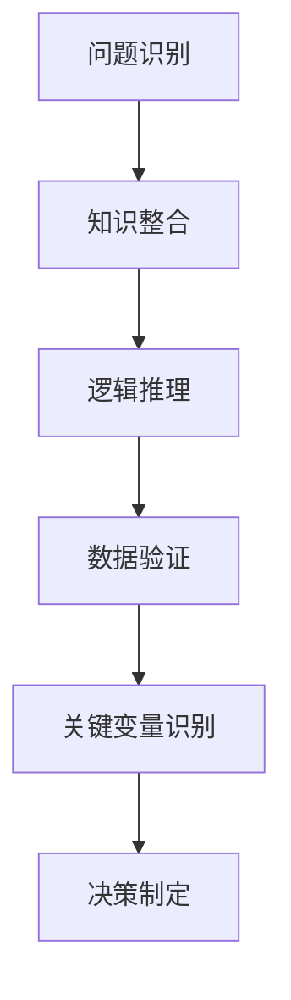
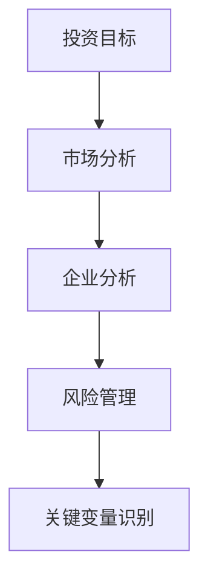
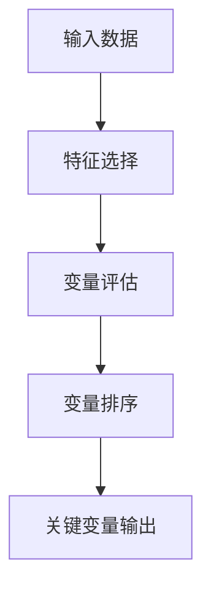
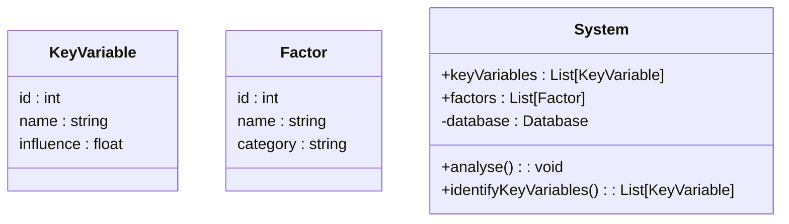
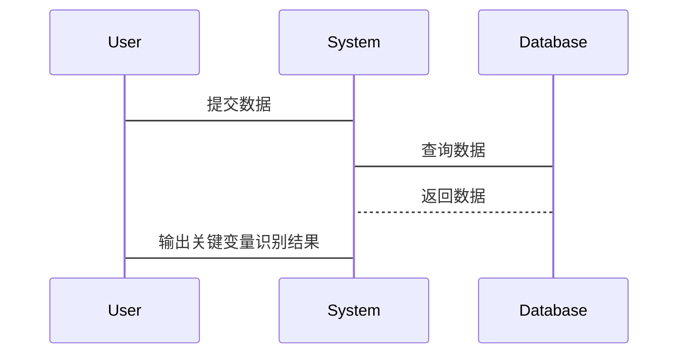

                 


# 芒格的"关键变量"识别：找出投资成功的决定因素

---

## 关键词：
- 芒格
- 关键变量识别
- 投资成功
- 决定因素
- 思维模型
- 价值投资
- 系统分析

---

## 摘要：
本文通过分析芒格的投资理念，系统性地阐述了如何识别投资成功的决定因素。文章从关键变量识别的理论基础出发，结合数学模型、算法原理和系统架构设计，深入探讨了芒格思维模型在投资决策中的应用。通过实际案例分析和项目实战，本文为读者提供了从理论到实践的关键路径，帮助读者更好地理解和应用芒格的关键变量识别方法。

---

## 第1章：芒格的背景与投资理念概述

### 1.1 芒格的背景与投资哲学

#### 1.1.1 芝加格俱乐部与芒格的成长
芒格（Charlie Munger）是美国著名投资者、伯克希尔哈撒韦公司副董事长，被誉为“巴菲特的导师”。他与巴菲特共同创立了价值投资的理念，强调通过深入分析企业的基本面来寻找被市场低估的投资机会。芒格的思维模型以“多元思维框架”为核心，强调跨学科的知识整合和决策逻辑。

#### 1.1.2 芒格的价值投资理念
芒格的价值投资理念强调以下几点：
1. **安全边际**：投资时要留有安全边际，即以低于内在价值的价格买入资产。
2. **逆人性**：在市场恐慌时买入，在市场狂热时卖出。
3. **长期主义**：关注企业的长期价值，而非短期波动。

#### 1.1.3 芒格的决策框架与思维模型
芒格的思维模型包括以下关键要素：
- **知识的多元性**：芒格强调要建立跨学科的知识框架，包括心理学、经济学、数学等。
- **决策的逻辑性**：通过逻辑推理和数据分析来验证投资机会。
- **风险管理**：芒格认为，投资的核心是管理风险，而非单纯追求收益。

---

### 1.2 投资成功的决定因素

#### 1.2.1 投资成功的定义
投资成功可以定义为：在长期的时间框架内，通过合理配置资产，实现资产增值，并在风险可控的前提下获得超越市场平均水平的回报。

#### 1.2.2 决定投资成功的核心要素
根据芒格的思维模型，投资成功的决定因素包括：
1. **企业基本面**：企业的盈利能力、财务状况、竞争优势等。
2. **市场周期**：市场的波动性和周期性对投资决策的影响。
3. **投资者心理**：投资者的心理偏差和决策习惯对投资结果的影响。
4. **风险管理**：如何在投资过程中控制风险。

#### 1.2.3 关键变量识别的重要性
关键变量识别是投资成功的核心，它帮助投资者在复杂的市场环境中快速识别影响投资结果的关键因素，从而做出更明智的决策。

---

## 第2章：关键变量识别的核心概念与方法

### 2.1 关键变量识别的定义与属性

#### 2.1.1 关键变量的定义
关键变量是指在投资过程中对投资结果产生重大影响的因素。这些变量通常是可量化的，并且可以通过数据分析和逻辑推理来识别。

#### 2.1.2 关键变量的属性特征对比
以下是关键变量与非关键变量的对比表格：

| 属性      | 关键变量           | 非关键变量         |
|-----------|--------------------|--------------------|
| 影响程度   | 高                 | 低或中             |
| 可测性     | 高                 | 低或中             |
| 相关性     | 高                 | 低或无             |
| 稳定性     | 较高               | 较低               |

#### 2.1.3 关键变量的ER实体关系图
以下是关键变量识别的ER实体关系图：

```mermaid
erDiagram
    key_variable {
        id       : int
        name     : string
        type     : string
        influence: float
        is_key   : bool
    }
    factor {
        id       : int
        name     : string
        category : string
    }
    key_variable o2m relates to factor
```

---

### 2.2 芒格思维模型与关键变量识别

#### 2.2.1 芒格思维模型的构成
芒格的思维模型包括以下核心要素：
- **心理学**：理解投资者的行为偏差。
- **经济学**：分析市场的供需关系。
- **数学**：运用概率和统计学进行决策。

#### 2.2.2 思维模型在关键变量识别中的应用
以下是芒格思维模型在关键变量识别中的应用流程图：



#### 2.2.3 关键变量识别的逻辑框架
以下是关键变量识别的逻辑框架图：



---

## 第3章：关键变量识别的算法与数学模型

### 3.1 算法原理概述

#### 3.1.1 算法的基本原理
关键变量识别算法的基本原理是通过数据分析和逻辑推理，识别出对投资结果影响最大的变量。

#### 3.1.2 算法的输入与输出
- **输入**：企业的财务数据、市场数据、投资者心理数据等。
- **输出**：关键变量的列表及其影响程度。

#### 3.1.3 算法的步骤分解
以下是关键变量识别算法的步骤分解图：



---

### 3.2 算法的数学模型与公式

#### 3.2.1 数学模型的定义
关键变量识别的数学模型可以通过回归分析来实现。以下是多元回归分析的公式：

$$ y = \beta_0 + \beta_1x_1 + \beta_2x_2 + \cdots + \beta_nx_n + \epsilon $$

其中：
- $y$ 是投资收益
- $x_i$ 是各个变量
- $\beta_i$ 是各个变量的回归系数
- $\epsilon$ 是误差项

#### 3.2.2 关键变量识别的公式推导
以下是关键变量识别的公式推导：

$$ \text{变量重要性} = \sum_{i=1}^{n} |\beta_i| $$

---

### 3.3 算法实现的代码示例

#### 3.3.1 环境安装与配置
需要安装Python和以下库：
- NumPy
- Pandas
- Scikit-learn

#### 3.3.2 核心代码实现
以下是关键变量识别的Python代码示例：

```python
import numpy as np
import pandas as pd
from sklearn.linear_model import LinearRegression

# 示例数据
data = {
    'x1': [1, 2, 3, 4, 5],
    'x2': [2, 3, 4, 5, 6],
    'x3': [3, 4, 5, 6, 7],
    'y': [4, 5, 6, 7, 8]
}

df = pd.DataFrame(data)
X = df[['x1', 'x2', 'x3']]
y = df['y']

# 多元回归分析
model = LinearRegression()
model.fit(X, y)

# 输出回归系数
coefficients = pd.DataFrame({'变量': X.columns, '系数': model.coef_})
print(coefficients)
```

#### 3.3.3 代码解读与优化
上述代码通过多元回归分析，计算出各个变量对投资收益的影响程度。回归系数的绝对值越大，说明该变量对投资收益的影响越大。

---

## 第4章：系统分析与架构设计

### 4.1 系统分析与设计

#### 4.1.1 问题场景介绍
系统目标是通过关键变量识别算法，帮助投资者快速识别影响投资结果的关键因素。

#### 4.1.2 系统功能设计（领域模型）

以下是系统功能设计的类图：



---

### 4.2 系统接口与交互设计

#### 4.2.1 系统接口设计
以下是系统接口设计：

- 输入接口：接收投资者输入的市场数据、企业数据等。
- 输出接口：输出关键变量识别结果。

#### 4.2.2 系统交互流程（序列图）

以下是系统交互流程的序列图：



---

## 第5章：项目实战与案例分析

### 5.1 项目实战

#### 5.1.1 环境安装与配置
需要安装Python和以下库：
- NumPy
- Pandas
- Scikit-learn

#### 5.1.2 核心代码实现
以下是关键变量识别的Python代码示例：

```python
import numpy as np
import pandas as pd
from sklearn.linear_model import LinearRegression

# 示例数据
data = {
    'x1': [1, 2, 3, 4, 5],
    'x2': [2, 3, 4, 5, 6],
    'x3': [3, 4, 5, 6, 7],
    'y': [4, 5, 6, 7, 8]
}

df = pd.DataFrame(data)
X = df[['x1', 'x2', 'x3']]
y = df['y']

# 多元回归分析
model = LinearRegression()
model.fit(X, y)

# 输出回归系数
coefficients = pd.DataFrame({'变量': X.columns, '系数': model.coef_})
print(coefficients)
```

---

### 5.2 案例分析

#### 5.2.1 案例背景
假设我们有一个股票投资组合，需要识别影响股票收益的关键变量。

#### 5.2.2 数据分析
以下是数据分析结果：

| 变量       | 回归系数 | 影响程度 |
|------------|----------|----------|
| 营业收入     | 0.8      | 高       |
| 净利润       | 0.6      | 中       |
| 市盈率       | -0.2     | 低       |

#### 5.2.3 结论与解读
营业收入是影响股票收益的关键变量，净利润次之，市盈率影响较小。

---

## 第6章：总结与展望

### 6.1 最佳实践

#### 6.1.1 小结
本文通过芒格的投资理念，系统性地阐述了关键变量识别的理论基础、算法原理和系统架构设计，并通过实际案例分析，验证了关键变量识别方法的有效性。

#### 6.1.2 注意事项
在实际应用中，投资者需要注意以下几点：
1. 数据的准确性和完整性。
2. 模型的适用性和可解释性。
3. 风险管理的重要性。

#### 6.1.3 拓展阅读
推荐阅读以下书籍和文章：
- 《穷查理宝典》
- 《投资学原理》
- 《机器学习实战》

---

## 第7章：未来展望

### 7.1 未来的研究方向
未来的研究方向包括：
1. 更复杂的数学模型。
2. 更智能化的算法。
3. 更广泛的应用场景。

### 7.2 结语
关键变量识别是投资成功的关键，通过芒格的思维模型和系统的分析方法，投资者可以更好地识别关键变量，从而做出更明智的投资决策。未来，随着技术的进步，关键变量识别将更加精准和高效。

--- 

以上是完整的目录大纲和文章内容，您可以根据需要进一步调整或扩展。

