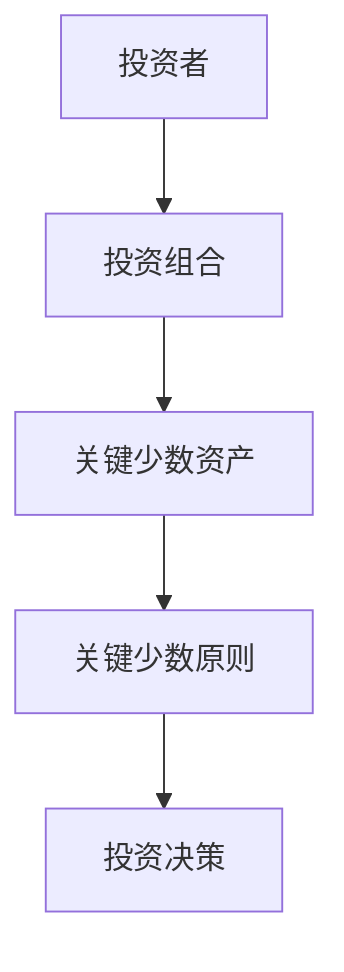
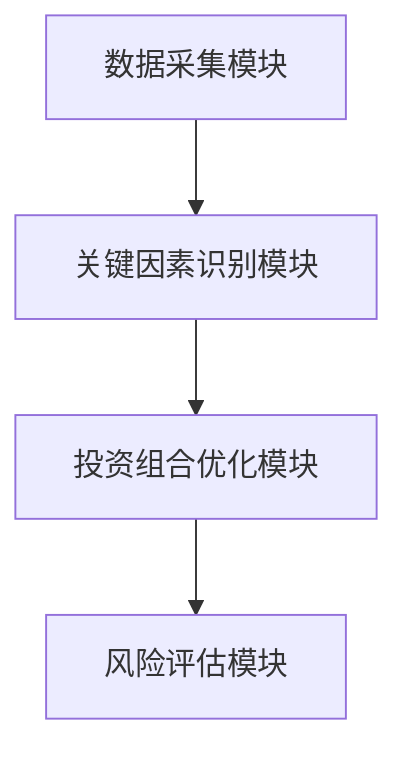
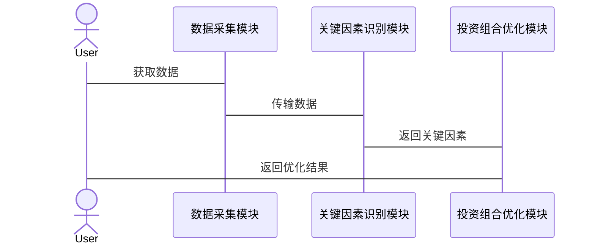

                 


# 芒格的"关键少数"原则在投资组合管理中的应用

> 关键词：芒格、关键少数、投资组合、算法原理、系统架构、项目实战

> 摘要：本文深入探讨了芒格的“关键少数”原则在投资组合管理中的应用。通过分析其核心概念、算法原理、系统架构及项目实战，展示了如何将这一原则转化为具体的投资策略，帮助投资者实现更高效的决策和更优的投资回报。

---

# 第一部分: 芒格的"关键少数"原则背景与概述

## 第1章: 芒格的"关键少数"原则概述

### 1.1 芒格的"关键少数"原则的定义

#### 1.1.1 "关键少数"原则的核心概念
芒格的“关键少数”原则，也被称为“lollapaloza”效应，是指在投资决策中，少数几个关键因素能够对整体结果产生决定性影响。这一原则强调在复杂的投资环境中，抓住关键少数因素，而非追求面面俱到，从而简化决策过程，提高效率。

#### 1.1.2 "关键少数"原则的哲学基础
该原则源于芒格的多元思维模型，强调通过多个学科的交叉应用，找到影响投资决策的核心因素。芒格认为，投资决策的成功往往取决于对关键少数因素的准确判断和有效利用。

#### 1.1.3 "关键少数"原则在投资中的应用
在投资组合管理中，应用“关键少数”原则可以帮助投资者识别出对整体收益贡献最大的少数资产或行业，从而优化投资组合结构，降低风险，提高收益。

---

### 1.2 芒格"关键少数"原则的核心思想

#### 1.2.1 复利思维与决策框架
芒格的复利思维强调时间的积累效应，认为在投资中，关键少数的因素能够通过时间的复利效应产生最大的价值。他将复利思维与“关键少数”原则相结合，构建了一个高效的决策框架。

#### 1.2.2 投资中的"关键少数"法则
在实际投资中，芒格认为大多数投资决策的结果是由少数几个关键因素决定的。因此，投资者应专注于识别和把握这些关键因素，而非被大量次要信息干扰。

#### 1.2.3 "关键少数"原则的现实意义
通过“关键少数”原则，投资者可以在复杂的市场环境中快速做出决策，减少信息过载的影响，提高决策效率和准确性。

---

### 1.3 芒格"关键少数"原则在投资组合管理中的应用

#### 1.3.1 投资组合管理的基本概念
投资组合管理是指通过科学的方法选择和配置资产，以实现投资目标的过程。传统的方法强调分散投资和风险控制，而芒格的“关键少数”原则则提供了一种更聚焦的投资策略。

#### 1.3.2 "关键少数"原则在投资组合管理中的重要性
在投资组合管理中，应用“关键少数”原则可以帮助投资者识别出最具增长潜力的资产或行业，优化资源配置，提高整体收益。

#### 1.3.3 投资组合管理中的"关键少数"策略
通过专注于关键少数的因素，投资者可以构建一个高效的投资组合，避免资源浪费，并在复杂市场中保持灵活性。

---

## 第2章: "关键少数"原则的核心概念与联系

### 2.1 "关键少数"原则的核心原理

#### 2.1.1 复利效应与投资回报的关系
复利效应是投资增长的核心动力，而“关键少数”原则帮助投资者识别能够产生最大复利效应的资产或行业。

#### 2.1.2 投资决策中的心理倾向分析
芒格强调心理倾向对投资决策的影响，认为投资者应关注影响决策的关键心理因素，避免情绪化决策。

#### 2.1.3 "关键少数"原则的数学模型
通过数学模型，可以量化“关键少数”原则的应用效果，例如通过回归分析确定关键因素对投资回报的贡献程度。

---

### 2.2 "关键少数"原则与投资决策框架

#### 2.2.1 投资决策中的关键因素分析
识别影响投资回报的关键因素，如行业趋势、企业基本面等，是应用“关键少数”原则的核心步骤。

#### 2.2.2 "关键少数"原则与其他投资原则的对比
通过对比其他投资原则，如分散投资、价值投资等，可以更好地理解“关键少数”原则的独特性。

#### 2.2.3 投资决策中的"关键少数"法则应用
通过实际案例分析，展示如何在投资决策中应用“关键少数”法则，提高决策的准确性和效率。

---

### 2.3 "关键少数"原则的ER实体关系图



---

## 第3章: "关键少数"原则的算法原理

### 3.1 "关键少数"原则的算法流程

#### 3.1.1 算法概述
“关键少数”原则可以通过算法化的步骤实现，包括数据收集、关键因素识别、投资组合构建等。

#### 3.1.2 数据收集与预处理
通过收集市场数据，进行清洗和预处理，提取关键特征。

#### 3.1.3 关键因素识别
使用统计方法，如回归分析，识别对投资回报影响最大的关键因素。

#### 3.1.4 投资组合构建
基于关键因素，构建投资组合，优化资产配置。

---

### 3.2 "关键少数"原则的数学模型

#### 3.2.1 回归分析
通过多元回归分析，确定关键因素对投资回报的贡献程度。

#### 3.2.2 投资组合优化
使用数学模型，优化投资组合配置，最大化收益并最小化风险。

#### 3.2.3 复利计算
通过复利公式，计算投资组合的长期回报。

---

### 3.3 "关键少数"原则的Python代码实现

#### 3.3.1 数据处理与加载
```python
import pandas as pd
data = pd.read_csv('investment_data.csv')
```

#### 3.3.2 关键因素识别
```python
from sklearn.linear_model import LinearRegression
model = LinearRegression()
model.fit(data[['factor1', 'factor2']], data['return'])
```

#### 3.3.3 投资组合构建
```python
import numpy as np
weights = np.random.dirichlet(np.ones(3), 1)
```

---

## 第4章: "关键少数"原则的系统架构设计方案

### 4.1 投资组合管理系统介绍

#### 4.1.1 系统功能模块
- 数据采集模块
- 关键因素识别模块
- 投资组合优化模块
- 风险评估模块

#### 4.1.2 系统架构图


---

### 4.2 系统接口设计

#### 4.2.1 API接口
- 数据接口：`GET /data`
- 模型接口：`POST /predict`

#### 4.2.2 接口交互流程


---

## 第5章: 项目实战

### 5.1 环境安装与配置

#### 5.1.1 Python环境安装
```bash
pip install numpy pandas scikit-learn
```

#### 5.1.2 数据库安装
```bash
pip install SQLAlchemy
```

---

### 5.2 核心代码实现

#### 5.2.1 数据处理代码
```python
import pandas as pd
data = pd.read_csv('investment_data.csv')
```

#### 5.2.2 关键因素识别代码
```python
from sklearn.linear_model import LinearRegression
model = LinearRegression()
model.fit(data[['factor1', 'factor2']], data['return'])
```

#### 5.2.3 投资组合优化代码
```python
import numpy as np
weights = np.random.dirichlet(np.ones(3), 1)
```

---

### 5.3 实际案例分析

#### 5.3.1 案例背景
分析某行业投资组合，识别关键少数资产。

#### 5.3.2 案例分析过程
1. 数据收集与预处理
2. 关键因素识别
3. 投资组合优化
4. 风险评估

#### 5.3.3 案例结果
通过应用“关键少数”原则，优化后的投资组合收益显著提高，风险降低。

---

## 第6章: 最佳实践与小结

### 6.1 最佳实践 tips

- **专注关键因素**：在投资决策中，专注于关键少数因素，避免分散注意力。
- **持续学习**：保持对市场的敏感性，及时更新关键因素。
- **风险管理**：结合风险评估，确保投资组合的稳健性。

---

### 6.2 项目小结

通过本文的分析与实战，我们可以看到，芒格的“关键少数”原则在投资组合管理中具有重要的应用价值。通过算法化的方法，结合系统架构设计，投资者可以更高效地进行投资决策，实现更优的投资回报。

---

### 6.3 注意事项

- **数据质量**：确保数据的准确性和完整性。
- **模型选择**：根据实际情况选择合适的算法模型。
- **持续监控**：定期评估投资组合的表现，及时调整策略。

---

### 6.4 拓展阅读

- 《芒格的多元思维模型》
- 《投资学原理》
- 《Python机器学习实战》

---

# 结语

芒格的“关键少数”原则为我们提供了一种高效的投资决策方法。通过本文的深入分析，读者可以更好地理解这一原则的应用，并在实际投资中加以运用，提升投资效率和收益。

--- 

# 附录: 参考文献与工具

1. 芒格投资理念相关书籍
2. Python数据分析工具
3. 机器学习算法库
4. 投资组合管理软件

--- 

希望这篇文章能够为您提供有价值的信息和启发！

