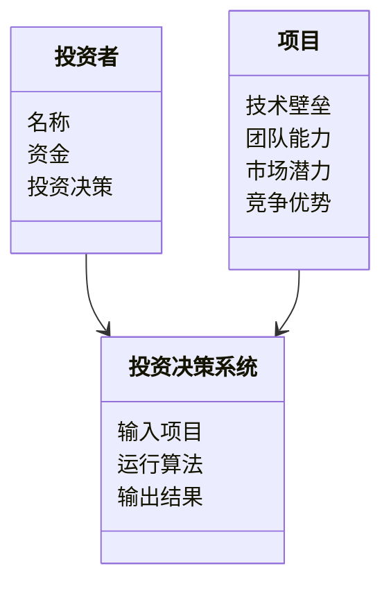
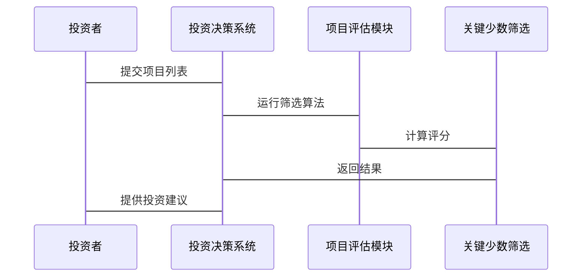

                 


# 芒格的"关键少数"原则在深科技创业投资中的应用

## 关键词：芒格，关键少数原则，深科技，创业投资，投资策略

## 摘要

本文深入探讨了芒格的关键少数原则在深科技创业投资中的应用，通过理论分析、算法设计和案例研究，展示了如何通过专注于少数高潜力项目来实现高效投资。文章从原则的背景、筛选标准、评估模型、系统架构到实际案例，全面解析了关键少数原则的应用方法，为投资者提供了实用的策略和工具。

---

## 第一部分：引言与背景

### 第1章：芒格的关键少数原则概述

#### 1.1 关键少数原则的核心概念

- **背景介绍**：芒格的关键少数原则强调专注于少数高潜力因素，以最大化回报。在深科技投资中，这意味着筛选出最具创新性和市场潜力的项目。
- **问题背景**：传统投资策略倾向于广泛撒网，导致资源分散和效率低下。关键少数原则帮助投资者聚焦于高回报领域。
- **问题解决**：通过识别关键少数因素，投资者可以集中资源，提高投资的成功率和回报率。
- **边界与外延**：关键少数原则适用于高技术门槛的领域，如人工智能、量子计算等，但需结合具体市场环境调整策略。
- **核心要素**：包括技术壁垒、团队能力、市场潜力和竞争优势等关键因素。

---

## 第二部分：核心概念与联系

### 第2章：关键少数原则的原理与机制

#### 2.1 关键少数原则的理论基础

- **决策模型**：基于芒格的决策模型，强调深度分析和关键因素的识别。
- **高潜力项目特征**：包括技术创新性、团队实力、市场定位和竞争优势。
- **稀缺性与高回报**：少数关键项目的成功能够带来指数级回报。

#### 2.2 核心概念对比分析

- **策略对比表格**：
| 投资策略 | 广泛撒网 | 关键少数 |
|----------|----------|----------|
| 投资逻辑 | 分散风险 | 高度聚焦 |
| 重点 | 多个项目 | 少数高潜力项目 |
| 优势 | 稳定回报 | 高潜在回报 |

- **ER实体关系图**：


---

## 第三部分：算法原理讲解

### 第3章：关键少数筛选算法

#### 3.1 算法流程

- **初步筛选**：基于技术壁垒、团队能力等指标，筛选出潜在项目。
- **深度评估**：评估市场潜力和竞争优势，进一步缩小范围。
- **最终筛选**：综合评分与权重分配，确定投资标的。


#### 3.2 数学模型与公式

- **技术壁垒权重计算**：
  $$ \text{权重} = \frac{\text{技术壁垒评分}}{\text{总评分}} $$
- **综合评分公式**：
  $$ \text{综合评分} = \sum (\text{指标权重} \times \text{指标评分}) $$

#### 3.3 代码实现

```python
def key_factors_analysis(projects):
    weights = {'技术壁垒': 0.4, '团队能力': 0.3, '市场潜力': 0.2, '竞争优势': 0.1}
    scores = []
    for proj in projects:
        total = 0
        for factor, weight in weights.items():
            total += proj[factor] * weight
        scores.append(total)
    return scores

# 示例数据
projects = [
    {'技术壁垒': 0.9, '团队能力': 0.8, '市场潜力': 0.7, '竞争优势': 0.6},
    {'技术壁垒': 0.7, '团队能力': 0.6, '市场潜力': 0.8, '竞争优势': 0.5}
]

# 计算评分
result = key_factors_analysis(projects)
print(result)
```

---

## 第四部分：系统分析与架构设计

### 第4章：关键少数原则的系统应用

#### 4.1 系统功能设计

- **领域模型类图**：


#### 4.2 系统架构设计

- **架构图**：


#### 4.3 接口设计与交互流程

- **交互流程图**：


---

## 第五部分：项目实战

### 第5章：关键少数原则的实际应用

#### 5.1 环境安装

- **工具安装**：安装Python和相关库（如numpy, pandas）。
- **数据准备**：收集并整理深科技项目的各项指标数据。

#### 5.2 核心代码实现

```python
import numpy as np

def calculate_weights(factors):
    total = sum(factors)
    return [factor / total for factor in factors]

# 示例因素
factors = [0.9, 0.8, 0.7, 0.6]
weights = calculate_weights(factors)
print(weights)
```

#### 5.3 案例分析

- **成功案例**：某人工智能项目，技术壁垒高，团队实力强，市场潜力大，最终获得高回报。
- **失败案例**：某项目技术壁垒一般，团队能力不足，尽管市场潜力大，但未能成功。

#### 5.4 项目总结

- **经验教训**：准确评估各因素的重要性，灵活调整权重，定期复盘和优化筛选标准。

---

## 第六部分：总结与最佳实践

### 第6章：关键少数原则的应用效果与展望

#### 6.1 应用效果总结

- **高效聚焦**：通过关键少数原则，投资者能够专注于高潜力项目，提高投资效率。
- **风险控制**：减少分散投资带来的风险，集中资源提升成功率。

#### 6.2 最佳实践建议

- **动态调整**：定期评估市场变化，及时调整筛选标准和权重。
- **数据驱动**：利用大数据分析和机器学习优化筛选模型。
- **长期视角**：关注长期价值，避免短期波动影响决策。

#### 6.3 注意事项

- **避免过度集中**：虽然关键少数原则强调聚焦，但需分散投资以控制风险。
- **团队协作**：组建多学科团队，提升评估的全面性和准确性。

#### 6.4 拓展阅读

- 建议阅读《芒格的决策模型》和《深科技投资指南》，深入了解关键少数原则和其他投资策略。

---

通过本文的详细分析和步骤讲解，投资者可以更好地理解并应用芒格的关键少数原则，提升深科技创业投资的效率和成功率。

