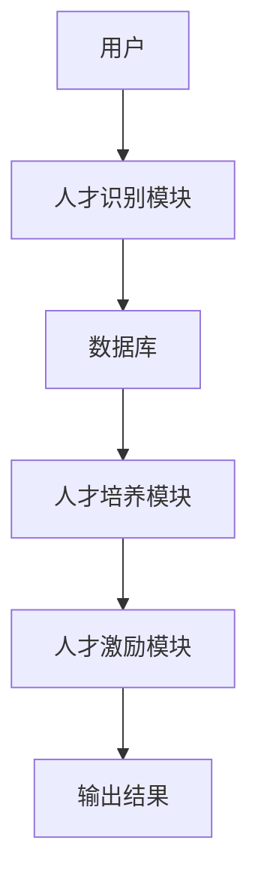
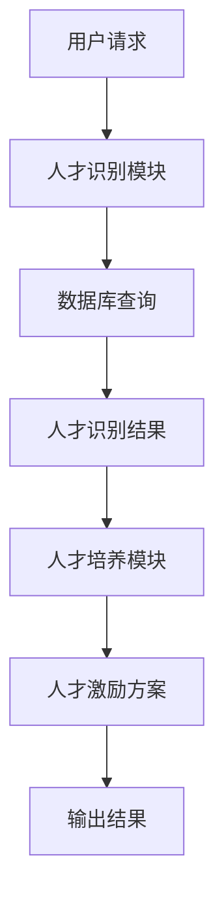

                 


# 芒格的"关键少数"原则在量子科技人才投资中的应用

---

## 关键词：
芒格，关键少数，量子科技，人才投资，系统架构，风险控制

---

## 摘要：
芒格的"关键少数"原则强调在复杂系统中，关键少数因素对整体结果的决定性影响。本文将这一原则应用于量子科技人才投资领域，探讨如何通过识别关键少数人才、优化资源配置和建立有效的激励机制，实现量子科技领域的高效投资和快速发展。文章结合量子科技的特殊性，分析了关键少数原则在人才识别、培养和激励中的具体应用，并提出了系统化的解决方案。

---

# 第一部分：芒格的"关键少数"原则与量子科技人才投资的背景

## 第1章：芒格的"关键少数"原则概述

### 1.1 芒格的"关键少数"原则的核心概念

#### 1.1.1 关键少数原则的定义
芒格的"关键少数"原则，也被称为“lollapaloza效应”，是指在复杂系统中，少数关键因素的叠加效应能够对整体结果产生决定性影响。这一原则强调在众多可能因素中，少数几个关键因素的相互作用能够放大其影响力。

#### 1.1.2 "lollapaloza效应"的特征
- **多重心理倾向的叠加**：关键少数原则的核心在于多个心理倾向的叠加效应，而非单一因素的独立作用。
- **非线性关系**：关键少数因素之间的相互作用往往呈现出非线性关系，其影响远超单一因素的贡献。
- **稀缺性**：关键少数因素通常具有稀缺性，能够在特定领域中产生杠杆效应。

#### 1.1.3 关键少数原则在投资中的应用
- **资源聚焦**：将有限资源集中投向关键少数领域或关键少数人，以最大化投资回报。
- **风险控制**：通过识别关键少数风险因素，降低投资风险。

### 1.2 量子科技人才投资的背景与意义

#### 1.2.1 量子科技的发展现状
量子科技是当前全球科技领域的前沿领域，涵盖量子计算、量子通信、量子测量等领域。其发展速度和技术突破具有重要意义，但也面临着技术复杂性和人才稀缺性的双重挑战。

#### 1.2.2 量子科技人才的特点与稀缺性
- **高知识门槛**：量子科技需要跨学科知识储备，包括物理学、计算机科学、数学等。
- **创新性**：量子科技领域的创新性要求人才具备较强的创造力和问题解决能力。
- **稀缺性**：由于量子科技的复杂性，具备顶尖能力的人才在全球范围内都非常稀缺。

#### 1.2.3 人才投资在量子科技发展中的作用
- **技术突破的催化剂**：通过投资关键人才，推动量子科技的技术突破。
- **产业链的构建**：通过培养和吸引量子科技人才，构建完整的量子科技产业链。

---

## 第2章：关键少数原则与量子科技人才投资的结合

### 2.1 关键少数原则的核心要素

#### 2.1.1 多重心理倾向的叠加效应
- 在量子科技人才投资中，关键少数原则强调多个关键因素的叠加效应。例如，顶尖人才的创新能力、团队协作能力以及外部资源的支持，共同作用于量子科技的创新发展。

#### 2.1.2 关键少数的识别标准
- **创新能力**：人才是否具备突破性创新能力。
- **技术深度**：是否在量子科技某一领域具备深厚的技术积累。
- **团队协作能力**：是否能够有效与团队协作，推动项目进展。

#### 2.1.3 关键少数在投资中的权重
- 在量子科技人才投资中，关键少数的权重通常远高于普通人才。例如，顶尖量子计算科学家的影响力可能远超过整个团队的平均水平。

### 2.2 量子科技人才投资的特殊性

#### 2.2.1 量子科技领域的复杂性
- 量子科技的复杂性要求投资者具备高度的专业知识，才能准确识别关键少数人才。
- 量子科技领域的创新性要求投资者具备长期投资的耐心，因为技术突破往往需要较长时间。

#### 2.2.2 人才投资的风险与回报
- **高风险**：量子科技领域的技术突破具有不确定性，投资失败的风险较高。
- **高回报**：一旦成功，量子科技领域的投资回报可能非常巨大。

#### 2.2.3 关键少数原则的适用性分析
- 在量子科技人才投资中，关键少数原则的适用性较高，因为少数顶尖人才的创新能力往往能够决定整个领域的技术发展速度。

---

# 第二部分：关键少数原则在量子科技人才投资中的应用

## 第3章：关键少数原则在人才识别中的应用

### 3.1 人才识别的核心维度

#### 3.1.1 技术能力评估
- **技术深度**：评估人才在量子科技某一领域的技术积累。
- **创新性**：评估人才是否具备突破性创新能力。
- **团队协作能力**：评估人才是否能够与团队有效协作。

#### 3.1.2 创新能力评估
- **创新成果**：评估人才是否具备显著的创新成果，例如发表的论文、申请的专利等。
- **创新潜力**：评估人才未来的创新潜力。

#### 3.1.3 团队协作能力评估
- **团队合作经验**：评估人才是否具备丰富的团队合作经验。
- **沟通能力**：评估人才的沟通能力和团队凝聚力。

### 3.2 关键少数原则在人才筛选中的具体应用

#### 3.2.1 通过多重维度筛选关键人才
- 通过技术能力、创新能力和团队协作能力等多个维度，筛选出具备关键少数特征的人才。

#### 3.2.2 关键少数的识别标准与流程
1. **初步筛选**：通过简历筛选具备顶尖技术背景的人才。
2. **深度评估**：通过面试、技术测试等方式，评估人才的创新能力、团队协作能力。
3. **综合评价**：结合多个维度的评估结果，识别出具备关键少数特征的人才。

#### 3.2.3 人才评估中的权重分配
- 在人才评估中，关键少数原则要求对具备关键少数特征的人才赋予更高的权重。

---

## 第4章：关键少数原则在人才培养与激励中的应用

### 4.1 人才培养的策略

#### 4.1.1 个性化培养方案的设计
- 根据关键少数人才的特点，设计个性化的培养方案，例如定制化课程、导师制等。

#### 4.1.2 关键少数的快速成长路径
- 为关键少数人才提供快速成长的机会，例如优先参与重要项目、提供资源支持等。

#### 4.1.3 人才发展中的资源倾斜
- 在资源分配中，优先满足关键少数人才的发展需求，例如提供更多的科研经费、实验设备等。

### 4.2 人才激励机制的优化

#### 4.2.1 激励机制的设计原则
- **公平性**：确保激励机制的公平性，避免内部矛盾。
- **有效性**：激励机制应当能够有效激发人才的创新潜力。
- **可持续性**：激励机制应当具有可持续性，能够长期激励人才。

#### 4.2.2 关键少数的激励策略
- **股权激励**：通过股权激励的方式，吸引和留住关键少数人才。
- **项目激励**：通过项目激励的方式，激发关键少数人才的创新潜力。
- **荣誉激励**：通过荣誉称号的方式，增强关键少数人才的归属感。

#### 4.2.3 激励与绩效的动态平衡
- 在激励机制中，需要动态平衡激励与绩效的关系，避免激励过度或激励不足。

---

## 第5章：关键少数原则在人才投资中的风险控制

### 5.1 人才投资中的风险来源

#### 5.1.1 人才流失风险
- 关键少数人才的流失可能导致量子科技领域的重大损失。

#### 5.1.2 项目失败风险
- 量子科技领域的技术突破具有不确定性，投资失败的风险较高。

#### 5.1.3 市场风险
- 量子科技领域的市场波动可能对人才投资产生重大影响。

### 5.2 风险控制的策略

#### 5.2.1 人才流失风险的控制
- **加强人才保留机制**：通过股权激励、职业发展机会等方式，增强关键少数人才的保留。
- **建立备用计划**：通过培养后备人才，降低关键少数人才流失的风险。

#### 5.2.2 项目失败风险的控制
- **分散投资**：通过分散投资的方式，降低单一项目失败的风险。
- **加强风险管理**：通过建立风险管理机制，及时发现和应对潜在风险。

#### 5.2.3 市场风险的控制
- **多元化投资**：通过多元化投资的方式，降低市场波动对投资的影响。
- **加强市场研究**：通过深入的市场研究，提高投资决策的科学性。

---

## 第6章：量子科技人才投资的系统架构设计

### 6.1 系统功能设计

#### 6.1.1 人才识别模块
- **功能描述**：通过多重维度筛选关键少数人才。
- **输入输出**：输入人才简历、技术能力评估结果，输出关键少数人才名单。

#### 6.1.2 人才培养模块
- **功能描述**：为关键少数人才设计个性化培养方案。
- **输入输出**：输入关键少数人才信息，输出个性化培养方案。

#### 6.1.3 人才激励模块
- **功能描述**：为关键少数人才设计激励机制。
- **输入输出**：输入关键少数人才信息，输出激励方案。

### 6.2 系统架构设计

#### 6.2.1 系统架构图


#### 6.2.2 数据流图


---

## 第7章：量子科技人才投资的项目实战

### 7.1 项目环境搭建

#### 7.1.1 开发环境
- **操作系统**：Linux或Windows。
- **开发工具**：Python、Jupyter Notebook、Mermaid工具等。

#### 7.1.2 数据准备
- **人才简历**：收集量子科技领域的人才简历。
- **技术评估指标**：建立技术能力评估指标。

### 7.2 核心代码实现

#### 7.2.1 人才识别模块
```python
def identify_key_players(resumes):
    key_players = []
    for resume in resumes:
        if resume['technical_depth'] >= 0.8 and resume['innovation_potential'] >= 0.8:
            key_players.append(resume['name'])
    return key_players
```

#### 7.2.2 人才培养模块
```python
def design_training_program(key_players):
    program = {}
    for player in key_players:
        program[player] = {
            'courses': ['量子计算基础', '量子算法设计'],
            'mentor': '知名量子科学家',
            'resources': ['科研经费', '实验设备']
        }
    return program
```

#### 7.2.3 人才激励模块
```python
def design_incentive_plan(key_players):
    plan = {}
    for player in key_players:
        plan[player] = {
            'equity': 0.1,
            'project': '量子通信项目',
            'recognition': '年度创新奖'
        }
    return plan
```

---

## 第8章：结论与展望

### 8.1 结论
通过芒格的"关键少数"原则，我们可以有效识别量子科技领域的关键少数人才，并通过优化资源配置和建立有效的激励机制，实现量子科技领域的高效投资和快速发展。

### 8.2 未来展望
未来，随着量子科技的进一步发展，关键少数原则的应用将更加广泛和深入。我们需要进一步研究和优化关键少数原则在量子科技人才投资中的具体应用，以推动量子科技的创新发展。

---

## 总结
本文通过详细分析芒格的"关键少数"原则在量子科技人才投资中的应用，提出了系统化的解决方案，并通过具体案例和代码实现，展示了如何在量子科技领域有效实施关键少数原则。

