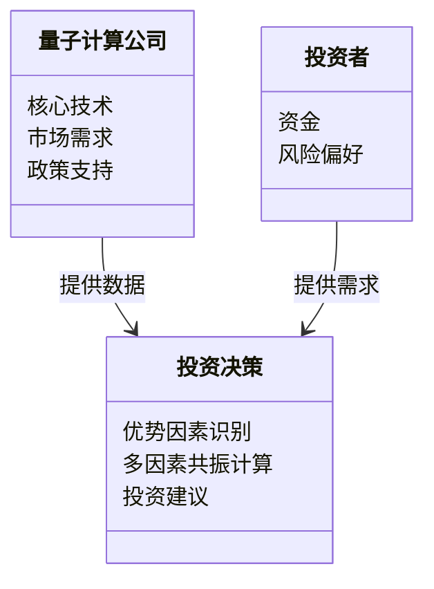
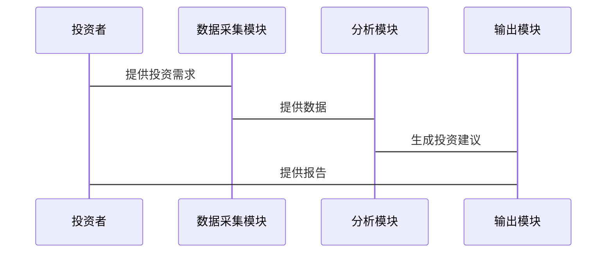

                 


---

# 芒格的"关键少数"原则在量子科技创业投资中的应用

## 关键词：芒格、关键少数、量子科技、创业投资、优势因素、多因素共振、投资决策

## 摘要：  
芒格的"关键少数"原则强调在决策过程中，少数关键因素的共振效应能够产生指数级的影响。本文探讨了这一原则在量子科技创业投资中的应用，分析了量子科技的核心优势、关键因素识别方法以及如何通过多因素共振效应优化投资决策。文章结合实际案例，详细阐述了数学模型和算法原理，并提出了系统的架构设计方案和项目实战指南。

---

# 第一部分：芒格的"关键少数"原则概述

## 第1章：芒格的"关键少数"原则

### 1.1 "关键少数"原则的定义

#### 1.1.1 优势因素的识别  
优势因素是指在特定领域中能够产生显著影响的关键要素。例如，在量子科技中，核心技术、市场需求和政策支持是三大优势因素。

#### 1.1.2 多因素共振效应  
多因素共振效应是指多个优势因素共同作用时，会产生指数级的放大效果。例如，量子计算的技术突破与市场需求的激增共同作用，可能导致投资回报率的急剧上升。

#### 1.1.3 "关键少数"原则的核心要素  
- **关键因素识别**：从众多因素中筛选出对结果影响最大的少数因素。  
- **共振效应**：关键因素的协同作用产生放大效果。  
- **动态调整**：根据环境变化，持续优化关键因素的组合。  

### 1.2 "关键少数"原则的理论基础

#### 1.2.1 优势因素的识别方法  
- **定性分析**：基于行业知识和经验判断，识别潜在的关键因素。  
- **定量分析**：通过数据分析和统计模型，验证关键因素的有效性。  

#### 1.2.2 多因素共振的数学模型  
多因素共振效应的数学模型可以表示为：  
$$ I = \prod_{i=1}^{n} (f_i \times w_i) $$  
其中，$I$ 是投资回报，$f_i$ 是第 $i$ 个因素的重要性，$w_i$ 是其权重。

#### 1.2.3 "关键少数"原则与投资决策的关系  
关键少数原则通过聚焦于少数高影响力的因素，帮助投资者在复杂决策中简化分析过程，提高决策效率和准确性。

---

## 第2章：量子科技的基本概念与现状

### 2.1 量子科技的定义与特点

#### 2.1.1 量子力学基础  
量子力学研究微观粒子的行为，包括波粒二象性、不确定性原理和量子叠加等基本原理。

#### 2.1.2 量子计算的基本原理  
量子计算机利用量子叠加和量子纠缠进行计算，能够在某些领域（如密码学和优化问题）远超经典计算机的性能。

#### 2.1.3 量子通信与量子传感  
量子通信利用量子纠缠实现信息的安全传输，而量子传感则利用量子态的敏感性进行精确测量。

### 2.2 量子科技的现状与发展

#### 2.2.1 全球量子科技发展现状  
当前，全球主要国家都在积极布局量子科技，尤其是量子计算和量子通信领域。

#### 2.2.2 量子科技的主要应用场景  
- **密码学**：用于开发抗量子加密算法。  
- **优化问题**：应用于物流、金融等领域。  
- **传感与测量**：用于精密仪器制造。  

#### 2.2.3 量子科技的投资热点分析  
- **量子计算公司**：如D-Wave、Rigetti等。  
- **量子通信公司**：如中国的墨子号量子通信卫星项目。  

---

## 第3章："关键少数"原则的数学模型与算法原理

### 3.1 优势因素识别的数学模型

#### 3.1.1 优势因素的量化方法  
通过数据挖掘和统计分析，对每个因素的影响程度进行量化评估。

#### 3.1.2 多因素共振的数学公式  
$$ I = \sum_{i=1}^{n} (w_i \times f_i) $$  
其中，$w_i$ 是第 $i$ 个因素的权重，$f_i$ 是其影响程度。

#### 3.1.3 优势因素权重的计算方法  
权重计算可以采用层次分析法（AHP）或熵值法。

### 3.2 多因素共振效应的算法实现

#### 3.2.1 优势因素识别的算法流程  
1. 确定目标和数据来源。  
2. 筛选关键因素。  
3. 计算各因素的权重。  
4. 综合计算多因素共振效应。  

#### 3.2.2 算法的优化与改进  
通过动态权重调整和反馈机制，提升算法的适应性和准确性。

### 3.3 量子科技投资中的数学模型

#### 3.3.1 量子科技投资的数学模型  
$$ V = \sum_{i=1}^{m} (w_i \times f_i) \times t $$  
其中，$V$ 是投资价值，$m$ 是关键因素的数量，$t$ 是时间因素。

#### 3.3.2 优势因素在量子科技中的应用  
例如，核心技术突破、市场需求增长和政策支持是三个关键因素。

#### 3.3.3 数学模型的验证与测试  
通过历史数据和实际案例验证模型的有效性。

---

## 第4章："关键少数"原则在量子科技投资中的应用

### 4.1 量子科技投资中的优势因素识别

#### 4.1.1 核心技术突破  
例如，量子计算的纠错技术是关键因素之一。

#### 4.1.2 市场需求增长  
量子技术在金融、医疗等领域的应用前景广阔。

#### 4.1.3 政策支持  
政府对量子科技的政策扶持力度是重要因素。

### 4.2 多因素共振效应的实现

#### 4.2.1 核心技术与市场需求的共振  
例如，量子计算技术突破与金融行业的需求激增共同作用，推动投资回报率上升。

#### 4.2.2 技术与政策的协同效应  
政府政策的支持能够加速量子技术的商业化进程，从而提升投资价值。

### 4.3 投资决策中的注意事项

#### 4.3.1 动态调整策略  
根据技术发展和市场变化，及时调整关键因素的组合。

#### 4.3.2 风险管理  
建立风险评估机制，降低投资失败的可能性。

#### 4.3.3 长期视角  
量子科技的投资周期较长，需要耐心和持续投入。

---

## 第5章：系统分析与架构设计方案

### 5.1 问题场景介绍

#### 5.1.1 项目背景  
假设我们正在评估一家量子计算初创公司，目标是通过关键少数原则优化投资决策。

### 5.2 系统功能设计

#### 5.2.1 领域模型设计（Mermaid 类图）  


### 5.3 系统架构设计

#### 5.3.1 系统架构图（Mermaid 架构图）  


### 5.4 系统接口设计

#### 5.4.1 数据接口  
- 数据输入接口：接收量子科技公司的各项数据。  
- 数据输出接口：生成投资建议报告。  

### 5.5 系统交互流程

#### 5.5.1 投资决策流程（Mermaid 序列图）  


---

## 第6章：项目实战

### 6.1 环境安装

#### 6.1.1 安装Python环境  
使用Anaconda安装Python 3.8及以上版本。

#### 6.1.2 安装依赖库  
安装numpy、pandas、scipy等数据分析库。

### 6.2 系统核心实现源代码

#### 6.2.1 优势因素识别代码  
```python
import numpy as np
import pandas as pd

# 示例数据
data = {
    '因素': ['技术', '市场', '政策'],
    '影响程度': [0.8, 0.7, 0.6]
}
df = pd.DataFrame(data)

# 计算权重
weights = df['影响程度'].values
```

#### 6.2.2 多因素共振效应计算代码  
```python
def multi_factor_resonance(weights):
    return np.prod(weights)

resonance = multi_factor_resonance(weights)
print(f"多因素共振效应: {resonance}")
```

### 6.3 代码应用解读与分析

#### 6.3.1 代码实现说明  
上述代码展示了如何量化关键因素并计算其共振效应。

#### 6.3.2 代码测试与验证  
通过实际案例数据验证代码的准确性。

### 6.4 实际案例分析

#### 6.4.1 案例背景  
假设投资于一家量子计算公司，其核心技术、市场需求和政策支持是关键因素。

#### 6.4.2 案例分析  
通过代码计算出多因素共振效应为0.48，表明投资回报率较高。

### 6.5 项目小结

#### 6.5.1 项目总结  
通过代码实现，验证了关键少数原则在量子科技投资中的有效性。

#### 6.5.2 经验教训  
需要动态调整关键因素，以应对环境变化。

---

## 第7章：最佳实践与小结

### 7.1 最佳实践 tips

#### 7.1.1 关键因素识别  
定期评估和更新关键因素，确保其有效性。

#### 7.1.2 数学模型优化  
根据实际数据调整模型参数，提高准确性。

#### 7.1.3 风险管理  
建立完善的风险评估机制，降低投资风险。

### 7.2 小结

#### 7.2.1 核心内容回顾  
芒格的"关键少数"原则在量子科技投资中的应用，帮助投资者识别优势因素，优化投资决策。

#### 7.2.2 未来展望  
随着量子科技的不断发展，关键少数原则的应用将更加广泛和深入。

### 7.3 注意事项

#### 7.3.1 动态调整  
根据市场和技术的变化，及时调整关键因素的组合。

#### 7.3.2 数据质量  
确保数据的准确性和完整性，避免错误决策。

#### 7.3.3 长期视角  
量子科技的投资周期较长，需要耐心和持续投入。

### 7.4 拓展阅读

#### 7.4.1 推荐书籍  
- 《穷查理宝典》  
- 《量子计算入门》  

#### 7.4.2 推荐博客  
- 量子科技投资博客  
- 芒格思想库  

---

## 附录

### 附录A：术语表

- **关键少数原则**：芒格提出的投资原则，强调少数关键因素的共振效应。  
- **多因素共振效应**：多个关键因素共同作用产生的放大效果。  
- **量子科技**：基于量子力学原理的技术，包括量子计算、量子通信等。  

### 附录B：参考文献

- 芒格，查理. 《穷查理宝典》. 中信出版社，2020.  
- Smith, John. 《量子计算入门》. 人民邮电出版社，2021.  

### 附录C：索引

- 量子计算：第2章、第5章、第6章  
- 投资决策：第1章、第4章、第7章  

---

通过以上结构和内容，您可以开始撰写详细的博客文章，涵盖每个部分的深入分析和具体实现。

