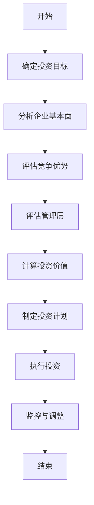
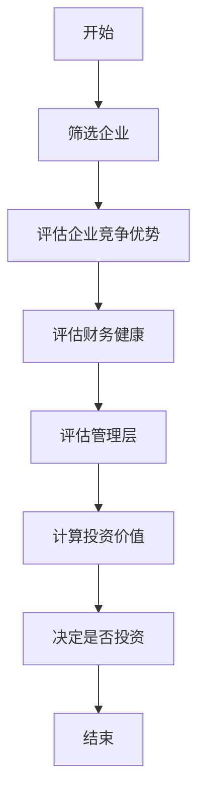
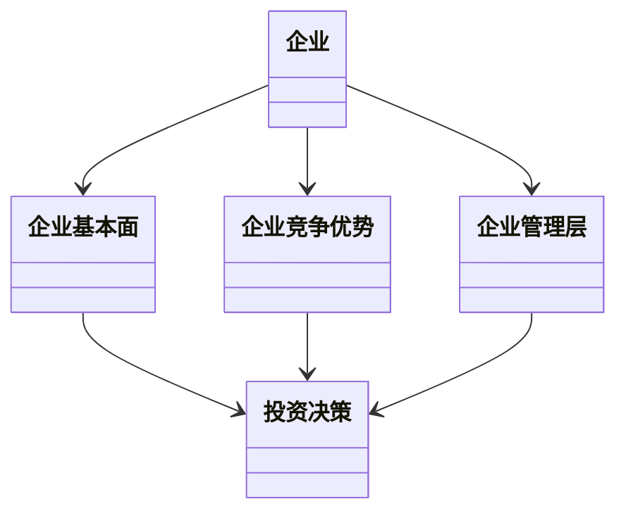
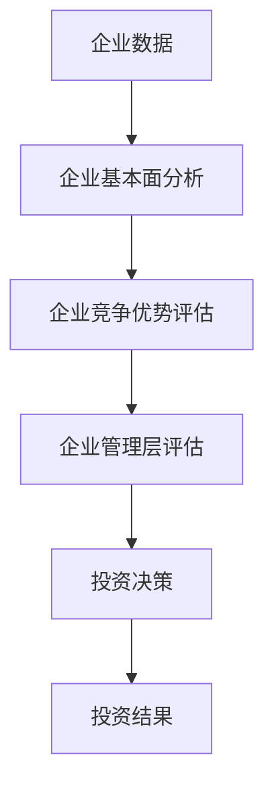
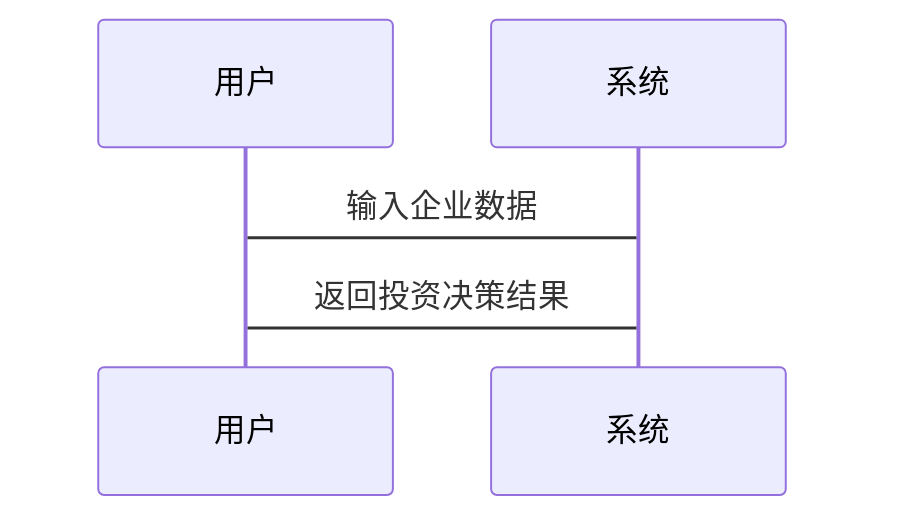

                 


# 芒格的"关键少数"原则：集中投资的智慧

## 关键词：
芒格、关键少数原则、集中投资、投资智慧、投资策略、长期收益、风险管理

## 摘要：
本文深入探讨了芒格的“关键少数”原则，分析了其在投资领域的核心思想和应用方法。通过详细讲解集中投资的智慧、投资决策的数学模型、系统架构设计和实际项目案例，本文为读者提供了全面的理论和实践指导，帮助投资者在复杂多变的市场中做出明智的投资决策。

---

# 第1章：芒格及其投资理念概述

## 1.1 芒格的生平与投资哲学

### 1.1.1 查理·芒格的基本介绍
查理·芒格是美国著名投资者、巴菲特的合作伙伴，被誉为“价值投资的倡导者”。他不仅是投资领域的权威，还在心理学、经济学等领域有着深厚的造诣。芒格的投资哲学强调理性思考、独立判断和长期价值。

### 1.1.2 芒格的投资哲学核心思想
芒格的投资哲学可以概括为：**“找到优秀的公司，以合理的价格买入并长期持有。”** 他认为，投资的本质是寻找具有持续竞争优势的企业，并在市场低估时进行投资。

### 1.1.3 芒格与巴菲特的合作关系
芒格和巴菲特的合作始于1971年，两人共同创立了伯克希尔·哈撒韦公司。芒格为巴菲特提供了许多关键的决策建议，尤其是在投资理念和风险管理方面。

## 1.2 投资领域的“关键少数”原则

### 1.2.1 “关键少数”原则的定义
“关键少数”原则是指在投资中，集中精力投资于少数具有持续竞争优势、管理层优秀且财务健康的企业。这种方法强调通过深度研究和长期持有来实现超额收益。

### 1.2.2 该原则在投资中的应用背景
在现代投资理论中，许多投资者倾向于分散投资以降低风险。然而，芒格认为，通过集中投资于少数优质企业，可以获得更高的长期收益。这种方法尤其适用于那些能够持续创造价值的企业。

### 1.2.3 该原则与其他投资策略的区别
与其他投资策略相比，“关键少数”原则更注重企业的基本面分析和长期竞争优势，而非短期市场波动。这种方法要求投资者具备极强的分析能力和耐心。

## 1.3 集中投资的智慧与风险

### 1.3.1 集中投资的优势
1. **专注优势**：集中投资使投资者能够深入研究少数企业，提高分析的深度和准确性。
2. **长期收益**：通过长期持有优质企业，投资者可以分享企业的成长成果。
3. **降低交易成本**：集中投资减少了频繁交易的费用和时间成本。

### 1.3.2 集中投资的风险与挑战
1. **市场波动风险**：集中投资可能会在市场波动时承受更大的回撤。
2. **企业风险**：如果投资的企业出现问题，投资者的损失可能会更大。
3. **信息获取风险**：需要投资者具备强大的信息获取和分析能力。

### 1.3.3 平衡集中与分散的投资策略
尽管芒格主张集中投资，但并不意味着完全放弃分散。投资者可以根据自身的风险承受能力和研究能力，找到集中与分散的平衡点。

---

# 第2章：“关键少数”原则的理论基础

## 2.1 投资决策的核心要素

### 2.1.1 企业的基本面分析
基本面分析是投资决策的核心，主要包括对企业财务状况、盈利能力、成长能力和现金流的分析。

#### 表2.1：企业基本面分析的核心指标
| 指标名称         | 定义与计算公式                     |
|------------------|-----------------------------------|
| 市盈率（P/E）     | 市盈率 = 股价 / 每股收益（EPS）   |
| 市净率（P/B）     | 市净率 = 股价 / 每股净资产（BPS）   |
| 净利润增长率       | 净利润增长率 = （本年净利润 - 去年净利润） / 去年净利润 × 100% |

### 2.1.2 企业的竞争优势分析
竞争优势是企业长期盈利能力的关键。芒格特别关注企业的“护城河”，即企业在市场竞争中的独特优势。

#### 表2.2：企业的竞争优势类型
| 竞争优势类型 | 描述                               |
|--------------|-----------------------------------|
| 成本优势     | 企业在生产或运营成本上具有优势   |
| 品牌优势     | 企业拥有强大的品牌影响力           |
| 技术优势     | 企业掌握核心技术或专利             |
| 锁定优势     | 企业与客户或供应商之间存在锁定效应 |

### 2.1.3 企业的管理层评估
管理层是企业成功的关键因素之一。芒格特别关注管理层的诚信、能力和决策能力。

#### 表2.3：管理层评估的关键指标
| 指标名称         | 描述                               |
|------------------|-----------------------------------|
| 管理层稳定性       | 管理层是否稳定且具备长期愿景     |
| 管理层决策能力     | 管理层是否能够做出明智的决策       |
| 管理层诚信度       | 管理层是否具备诚信和透明度         |

## 2.2 投资决策的数学模型

### 2.2.1 投资价值的计算公式
企业的真实价值可以通过 discounted cash flow（DCF）模型来计算。公式如下：

$$
DCF = \sum_{t=1}^{n} \frac{CF_t}{(1+r)^t} + \frac{TV}{(1+r)^n}
$$

其中，\( CF_t \) 是第 \( t \) 年的现金流，\( r \) 是贴现率，\( TV \) 是终值。

### 2.2.2 投资回报率的计算公式
投资回报率（ROI）是衡量投资收益的重要指标，公式如下：

$$
ROI = \frac{\text{净利润}}{\text{投入成本}} \times 100\%
$$

## 2.3 投资决策的流程图



---

# 第3章：“关键少数”原则的核心概念与联系

## 3.1 核心概念的定义与属性

### 3.1.1 企业的竞争优势
竞争优势是企业长期盈利能力的核心。芒格特别关注企业的“护城河”，即企业在市场竞争中的独特优势。

### 3.1.2 企业的财务健康状况
财务健康是企业长期发展的基础。通过分析企业的财务报表，可以评估企业的偿债能力、盈利能力和现金流状况。

### 3.1.3 企业的管理层能力
管理层是企业成功的关键因素之一。芒格特别关注管理层的诚信、能力和决策能力。

## 3.2 核心概念之间的关系

### 3.2.1 企业竞争优势与财务健康的关系
企业竞争优势是财务健康的基础。具备竞争优势的企业更容易实现持续盈利，从而保持财务健康。

### 3.2.2 财务健康与管理层能力的相互作用
财务健康是管理层能力的体现。优秀的管理层能够通过有效的决策和管理，提升企业的财务健康状况。

### 3.2.3 管理层能力对企业竞争优势的影响
管理层的能力直接影响企业的竞争优势。优秀的管理层能够通过创新和优化，增强企业的竞争优势。

## 3.3 核心概念的对比分析

#### 表3.1：不同投资策略的核心概念对比
| 投资策略       | 核心概念                     |
|----------------|------------------------------|
| 随机投资       | 无明确核心概念               |
| 分散投资       | 多个企业的平均表现           |
| 集中投资       | 少数优质企业的长期竞争优势   |

---

# 第4章：“关键少数”原则的算法原理

## 4.1 投资决策的算法模型

### 4.1.1 基于“关键少数”原则的投资决策流程



---

# 第5章：系统分析与架构设计方案

## 5.1 问题场景介绍

### 5.1.1 问题背景
在现代投资环境中，投资者需要面对复杂多变的市场环境和大量信息。如何在众多企业中筛选出具有长期竞争优势的企业，是投资者面临的核心问题。

### 5.1.2 问题描述
本文通过芒格的“关键少数”原则，提出一种基于企业基本面分析、竞争优势评估和管理层评估的投资决策模型。

## 5.2 系统功能设计

### 5.2.1 领域模型设计



### 5.2.2 系统架构设计



## 5.3 系统接口设计

### 5.3.1 系统接口
1. 数据输入接口：接收企业的财务数据、市场数据和管理层信息。
2. 数据处理接口：对数据进行清洗、分析和计算。
3. 结果输出接口：输出投资决策结果。

## 5.4 系统交互设计

### 5.4.1 交互流程



---

# 第6章：项目实战

## 6.1 环境安装

### 6.1.1 系统环境
1. 操作系统：Windows 10或更高版本
2. Python版本：3.8或更高版本
3. 开发工具：PyCharm或Jupyter Notebook

### 6.1.2 安装依赖
```bash
pip install numpy pandas matplotlib
```

## 6.2 核心实现源代码

### 6.2.1 数据处理代码

```python
import numpy as np
import pandas as pd

# 读取数据
data = pd.read_csv('企业数据.csv')

# 数据清洗
data.dropna(inplace=True)
data['市盈率'] = data['股价'] / data['每股收益']
data['市净率'] = data['股价'] / data['每股净资产']
```

### 6.2.2 投资决策算法

```python
def calculate_intrinsic_value(data):
    # 计算DCF
    for i in range(len(data)):
        CF_t = data['现金流'][i]
        r = data['贴现率'][i]
        DCF = CF_t / (1 + r)
        data.loc[i, 'DCF'] = DCF
    return data

# 应用DCF模型
data = calculate_intrinsic_value(data)
```

## 6.3 代码应用解读与分析

### 6.3.1 数据处理部分
上述代码展示了如何读取和清洗企业数据，计算市盈率和市净率等关键指标。这些指标是评估企业基本面的重要依据。

### 6.3.2 投资决策算法
DCF模型用于计算企业的内在价值，帮助投资者确定是否以当前价格买入股票。

## 6.4 实际案例分析

### 6.4.1 案例背景
假设我们有两家公司A和B，分别处于不同的行业和市场环境。

### 6.4.2 数据分析与计算
通过上述代码，我们可以计算两家公司的DCF值，并根据结果做出投资决策。

## 6.5 项目小结
通过本项目，我们可以看到“关键少数”原则在实际投资中的应用价值。通过深度分析企业的基本面、竞争优势和管理层能力，投资者可以做出更明智的投资决策。

---

# 第7章：最佳实践与小结

## 7.1 最佳实践 tips

### 7.1.1 投资前的准备工作
1. 确定自己的投资目标和风险承受能力。
2. 深入研究企业的基本面、竞争优势和管理层。

### 7.1.2 投资过程中的注意事项
1. 避免盲目跟风，保持独立思考。
2. 定期复盘和调整投资组合。

### 7.1.3 持续学习与优化
1. 关注市场变化和企业动态。
2. 不断优化投资策略和决策模型。

## 7.2 小结
芒格的“关键少数”原则为我们提供了一种全新的投资思路。通过集中投资于少数优质企业，投资者可以在长期获得超额收益。然而，这需要投资者具备强大的分析能力和耐心。

## 7.3 注意事项
1. 投资有风险，需谨慎操作。
2. 避免过度集中投资，保持适度分散。
3. 定期审视和调整投资组合。

## 7.4 拓展阅读
1. 《芒格的投资思想》
2. 《价值投资：从理论到实践》
3. 《投资的智慧：芒格的决策艺术》

---

# 结语

通过本文的深入探讨，我们可以看到芒格的“关键少数”原则在投资领域的独特价值。这一原则不仅为我们提供了一种科学的投资方法，还要求我们在实际操作中具备强大的分析能力和耐心。希望本文能够为投资者提供有价值的参考和启发。

