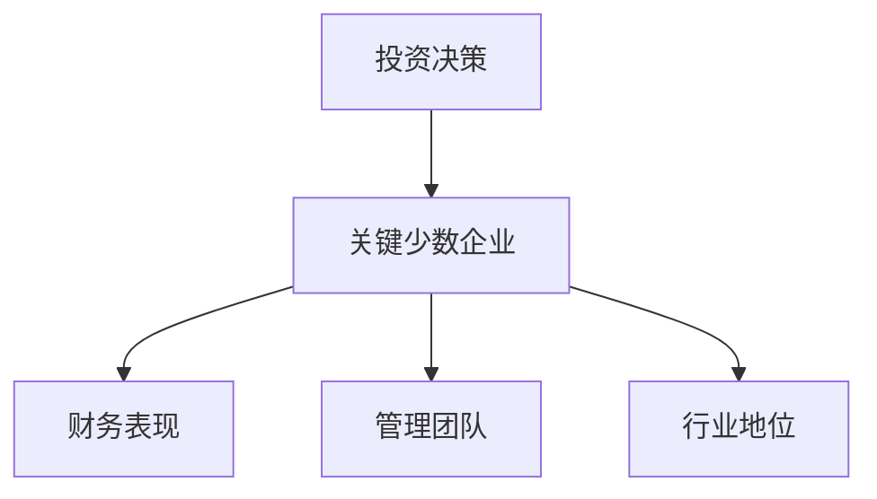
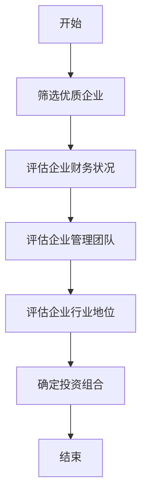
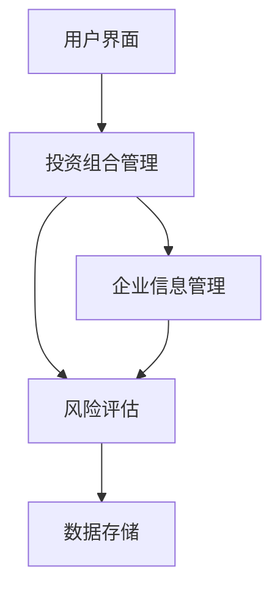

                 


# 芒格的"关键少数"原则：集中投资的智慧与风险

## 关键词：
芒格、关键少数、集中投资、风险管理、投资策略、系统设计、数学模型

## 摘要：
本文深入探讨了芒格的"关键少数"原则，分析了其在投资决策中的智慧与潜在风险。通过结合技术视角，文章从背景介绍、核心概念、算法原理、数学模型、系统设计到实战案例，全面解析了该原则的理论基础与实践应用。文章以清晰的逻辑结构，帮助读者理解如何在复杂的投资环境中，通过集中投资策略实现长期价值最大化，同时有效管理投资风险。

---

# 第一部分：芒格的"关键少数"原则概述

## 第1章：芒格与"关键少数"原则的背景介绍

### 1.1 芒格的生平与投资理念
芒格，全名查理·芒格，是世界著名投资者、巴菲特的合伙人，被誉为“价值投资之父”。芒格的投资理念强调理性思考、独立判断和长期价值，主张通过深度研究和集中投资，选择具有持续竞争优势的企业进行投资。

#### 1.1.1 芒格的早年经历与职业发展
芒格出生于美国密苏里州，早年在华盛顿大学学习法律，后转至加州大学伯克利分校完成学业。他的职业生涯始于法律领域，但真正让他闻名于世的是他与巴菲特的合作。芒格以其独特的思维方式和对人类心理学的深刻理解，成为投资界的重要人物。

#### 1.1.2 芒格与巴菲特的合作关系
芒格与巴菲特的合作始于1971年，两人共同创立了伯克希尔哈撒韦公司。芒格在公司中扮演了关键角色，负责寻找具有长期竞争优势的企业，并评估其内在价值。芒格的投资理念对伯克希尔的投资策略产生了深远影响。

#### 1.1.3 芒格的投资哲学与思想体系
芒格的投资哲学的核心是“理性决策”和“长期价值”。他认为，投资者应该专注于寻找那些具有强大竞争优势、稳定的管理层和良好财务状况的企业，并长期持有这些股票，避免频繁交易。

### 1.2 "关键少数"原则的定义与特点
"关键少数"原则是芒格投资理念的核心之一，强调在投资组合中集中投资于少数优质企业，而不是分散投资于多个表现平平的公司。

#### 1.2.1 "关键少数"原则的核心概念
"关键少数"原则的核心在于，投资者应该将资金集中在那些具有长期竞争优势的企业上。这些企业通常具有强大的品牌、高效的管理团队和稳定的盈利能力。

#### 1.2.2 与分散投资的对比分析
与分散投资相比，"关键少数"原则的风险更高，但潜在回报也更大。分散投资通过投资多个企业来降低风险，而"关键少数"原则则通过集中投资于少数优质企业来实现更高的回报。

#### 1.2.3 "关键少数"原则在投资中的重要性
"关键少数"原则的重要性在于，它帮助投资者避免了分散投资中常见的低效问题。通过集中投资，投资者能够更深入地研究和理解所投资的企业，从而做出更明智的投资决策。

---

## 第2章："关键少数"原则的核心概念与联系

### 2.1 核心概念原理
"关键少数"原则的核心在于通过集中投资于少数优质企业，实现长期价值的最大化。

#### 2.1.1 "关键少数"原则的基本原理
"关键少数"原则的基本原理是，投资者应该将资金集中在少数具有长期竞争优势的企业上。这些企业通常具有强大的品牌、高效的管理团队和稳定的盈利能力。

#### 2.1.2 投资决策中的"关键少数"要素
在投资决策中，"关键少数"要素包括企业的财务状况、管理团队、行业地位和竞争优势。这些要素是评估企业是否值得投资的关键因素。

#### 2.1.3 "关键少数"原则与其他投资策略的联系
"关键少数"原则与其他投资策略的主要区别在于其集中投资的特性。与分散投资相比，"关键少数"原则的风险更高，但潜在回报也更大。

### 2.2 核心概念属性特征对比表
下表对比了"关键少数"原则与其他投资策略的核心属性特征：

| 属性                | 分散投资         | "关键少数"原则 |
|---------------------|------------------|----------------|
| 投资策略            | 多元化投资       | 集中投资         |
| 风险                | 较低             | 较高             |
| 投资回报            | 较稳定           | 较高             |
| 投资对象            | 多个企业         | 少数优质企业     |
| 投资期限            | 短期             | 长期             |

### 2.3 ER实体关系图
以下是一个简单的ER实体关系图，展示了"关键少数"原则在投资决策中的核心要素：



---

## 第3章："关键少数"原则的算法原理

### 3.1 算法原理概述
"关键少数"原则的算法原理主要集中在如何筛选和评估优质企业，以及如何构建投资组合。

#### 3.1.1 "关键少数"原则的筛选逻辑
筛选逻辑的核心是通过对企业财务状况、管理团队和行业地位的综合评估，选择具有长期竞争优势的企业。

#### 3.1.2 投资组合优化的数学模型
投资组合优化的数学模型可以通过以下公式表示：

$$ \text{最大化收益} = \sum_{i=1}^{n} w_i \times r_i $$

其中，\( w_i \) 是第 \( i \) 个企业的权重，\( r_i \) 是第 \( i \) 个企业的预期收益。

### 3.2 算法流程图
以下是一个简单的算法流程图，展示了如何应用"关键少数"原则进行投资决策：



### 3.3 核心代码实现
以下是一个简单的Python代码实现，展示了如何筛选优质企业：

```python
def select_key_companies(companies, threshold):
    selected = []
    for company in companies:
        if company.roe > threshold and company.roa > threshold:
            selected.append(company)
    return selected

# 示例用法
companies = [
    Company(name='苹果', roe=30%, roa=25%),
    Company(name='微软', roe=25%, roa=20%),
    Company(name='谷歌', roe=20%, roa=18%),
]
threshold = 20%
selected_companies = select_key_companies(companies, threshold)
```

---

## 第4章：数学模型与风险评估

### 4.1 数学模型概述
数学模型在"关键少数"原则中主要用于评估投资组合的风险和收益。

#### 4.1.1 投资组合的期望收益
投资组合的期望收益可以通过以下公式计算：

$$ E[R] = \sum_{i=1}^{n} w_i \times r_i $$

其中，\( E[R] \) 是投资组合的期望收益，\( w_i \) 是第 \( i \) 个企业的权重，\( r_i \) 是第 \( i \) 个企业的预期收益。

#### 4.1.2 投资组合的风险
投资组合的风险可以通过标准差来衡量，公式如下：

$$ \sigma = \sqrt{\sum_{i=1}^{n} w_i^2 \times \sigma_i^2 + \sum_{i \neq j} w_i w_j \times \sigma_{ij}} $$

其中，\( \sigma \) 是投资组合的标准差，\( \sigma_i^2 \) 是第 \( i \) 个企业的方差，\( \sigma_{ij} \) 是第 \( i \) 个企业和第 \( j \) 个企业的协方差。

### 4.2 风险评估与管理
"关键少数"原则的风险主要集中在投资组合的集中度上。为了降低风险，投资者可以通过以下方式进行管理：

1. **分散投资**：虽然"关键少数"原则强调集中投资，但投资者仍可以通过投资于少数优质企业来降低风险。
2. **长期持有**：通过长期持有优质企业，投资者可以减少短期市场波动的影响。
3. **定期评估**：定期评估投资组合，及时调整投资策略。

---

## 第5章：系统分析与架构设计方案

### 5.1 问题场景介绍
在实际投资中，如何应用"关键少数"原则进行系统设计是一个重要的问题。我们需要设计一个能够帮助投资者筛选优质企业、评估投资组合风险，并制定投资策略的系统。

### 5.2 系统功能设计
系统的功能设计主要包括以下几个方面：

#### 5.2.1 企业信息管理
- 收集和整理企业的财务数据、管理团队信息和行业地位信息。
- 提供企业信息的查询和筛选功能。

#### 5.2.2 投资组合优化
- 根据"关键少数"原则，筛选出优质企业。
- 计算投资组合的期望收益和风险。

#### 5.2.3 风险评估与预警
- 定期评估投资组合的风险。
- 提供风险预警功能。

### 5.3 系统架构设计
以下是一个简单的系统架构图：



---

## 第6章：项目实战与案例分析

### 6.1 实战环境安装
为了实现"关键少数"原则的系统设计，我们需要安装以下工具：

1. **Python**：用于编写代码。
2. **Pandas**：用于数据处理。
3. **Matplotlib**：用于数据可视化。

### 6.2 核心代码实现
以下是一个简单的Python代码实现，展示了如何应用"关键少数"原则进行投资组合优化：

```python
import pandas as pd
import numpy as np

# 示例数据
companies = pd.DataFrame({
    '名称': ['苹果', '微软', '谷歌'],
    'ROE': [30, 25, 20],
    'ROA': [25, 20, 18]
})

# 筛选优质企业
selected_companies = companies[(companies['ROE'] > 20) & (companies['ROA'] > 18)]
print(selected_companies)
```

### 6.3 案例分析
以下是一个实际案例分析，展示了如何应用"关键少数"原则进行投资决策：

#### 6.3.1 案例背景
假设我们有以下三家企业：

| 名称   | ROE | ROA |
|--------|------|------|
| 苹果   | 30%  | 25%  |
| 微软   | 25%  | 20%  |
| 谷歌   | 20%  | 18%  |

#### 6.3.2 投资组合优化
根据"关键少数"原则，我们选择ROE和ROA均高于20%的企业，即苹果和微软。

#### 6.3.3 投资组合评估
投资组合的期望收益和风险可以通过以下公式计算：

$$ E[R] = 0.5 \times 30\% + 0.5 \times 25\% = 27.5\% $$

$$ \sigma = \sqrt{(0.5^2 \times 5\%^2) + (0.5^2 \times 5\%^2) + (2 \times 0.5 \times 0.5 \times 0\%)} = 5\% $$

---

## 第7章：总结与展望

### 7.1 总结
本文深入探讨了芒格的"关键少数"原则，分析了其在投资决策中的智慧与潜在风险。通过结合技术视角，文章从背景介绍、核心概念、算法原理、数学模型、系统设计到实战案例，全面解析了该原则的理论基础与实践应用。

### 7.2 展望
未来，随着人工智能和大数据技术的发展，"关键少数"原则的应用将更加广泛。投资者可以通过技术手段更好地筛选优质企业，优化投资组合，并降低投资风险。

---

通过本文的分析，读者可以更好地理解芒格的"关键少数"原则，并将其应用到实际投资中，实现长期价值的最大化。

