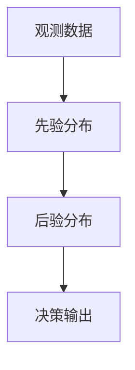
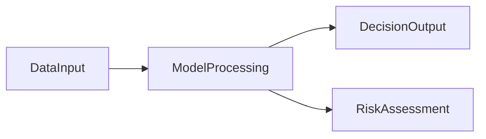
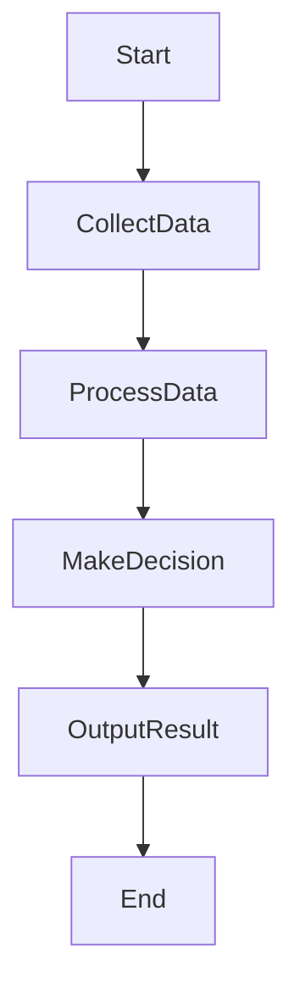

                 


# 芒格的"别觉得自己太聪明"在人工智能伦理决策中的应用

## 关键词
人工智能，伦理决策，芒格思想，不确定性推理，风险评估

## 摘要
本文探讨了芒格的“别觉得自己太聪明”思想在人工智能伦理决策中的应用。首先介绍了芒格思想的核心概念及其在AI决策中的重要性。接着分析了人工智能伦理决策的核心问题，包括不确定性处理和风险评估。通过不确定性推理算法和风险优化算法，展示了如何将芒格思想融入AI决策系统。最后，结合自动驾驶案例，详细说明了芒格思想的实际应用和优化效果。

---

## 第一部分: 芒格思想与人工智能伦理决策的背景

### 第1章: 芒格思想概述

#### 1.1 芒格思想的核心概念
- 芒格的“别觉得自己太聪明”强调谦逊和理性，避免过度自信导致的决策错误。
- 该思想适用于多个领域，尤其在AI伦理决策中，帮助系统避免过度自信带来的风险。

#### 1.2 芒格思想的哲学内涵
- 强调人类的局限性和知识的不确定性。
- 提倡在决策过程中保持谦逊，全面考虑多种可能性。

#### 1.3 芒格思想的应用领域
- AI伦理决策、金融投资、医疗决策等领域均可应用芒格的思想。

### 第2章: 人工智能伦理决策的挑战与现状

#### 2.1 人工智能决策系统的现状
- 当前AI决策系统主要依赖算法和数据，缺乏对不确定性的处理能力。
- 系统过于自信可能导致决策失误，引发伦理问题。

#### 2.2 人工智能伦理决策的核心问题
- 伦理决策涉及复杂的权衡，需要考虑多种因素。
- 不确定性处理和风险评估是关键挑战。

### 第3章: 芒格思想与人工智能伦理决策的结合

#### 3.1 芒格思想在AI决策中的应用背景
- AI决策系统易因过度自信导致错误。
- 芒格思想为AI决策提供了理性的约束机制。

#### 3.2 芒格思想对AI伦理决策的影响
- 强调谦逊和不确定性处理，提升决策的鲁棒性。
- 优化AI决策系统，使其更符合伦理要求。

---

## 第二部分: 人工智能伦理决策的核心概念与算法原理

### 第4章: 人工智能伦理决策的核心概念

#### 4.1 不确定性分析
- 不确定性在AI决策中的表现形式包括数据缺失、模型不准确等。
- 芒格思想指导系统在不确定情况下保持谨慎决策。

#### 4.2 权衡与选择
- 决策过程中的权衡分析需要考虑多目标优化。
- 芒格思想帮助系统在权衡中避免片面化。

### 第5章: 人工智能伦理决策的算法原理

#### 5.1 不确定性推理算法
- 贝叶斯网络用于处理不确定性。
- 示例：自动驾驶中的路径选择算法，综合考虑多种不确定因素。

#### 5.2 风险评估与决策优化
- 使用风险评估方法确定决策的潜在风险。
- 通过优化算法降低风险，提升决策的可靠性。

#### 5.3 芒格思想对算法的影响
- 算法中加入理性约束机制，避免过度自信。
- 通过不确定性处理算法实现芒格思想的指导作用。

---

## 第三部分: 人工智能伦理决策系统架构设计

### 第6章: 系统功能设计
- 数据输入模块：收集环境数据。
- 模型处理模块：处理数据，进行不确定性推理。
- 决策输出模块：生成决策，并进行风险评估。

#### 6.1 数据输入模块
- 传感器数据：如自动驾驶中的车速、距离等。
- 用户输入：如用户的选择偏好。

#### 6.2 模型处理模块
- 贝叶斯网络处理不确定性。
- 风险评估模型优化决策。

#### 6.3 决策输出模块
- 输出决策结果。
- 输出风险评估结果。

### 第7章: 系统架构设计

#### 7.1 系统架构图
- 使用Mermaid绘制系统架构图，展示模块交互。

#### 7.2 交互流程图
- 使用Mermaid绘制交互流程图，展示数据输入、处理、输出的全过程。

---

## 第四部分: 项目实战与案例分析

### 第8章: 项目实战

#### 8.1 环境安装
- 安装Python、TensorFlow、PyMC等工具。

#### 8.2 核心实现代码
```python
import pymc as pm

# 定义贝叶斯模型
with pm.Model() as model:
    # 定义先验分布
    alpha = pm.Normal('alpha', mu=0, sigma=1)
    beta = pm.Normal('beta', mu=0, sigma=1)
    # 定义似然函数
    y = pm.Bernoulli('y', p=pm.expit(alpha + beta*x), observed=data)
    # 进行马尔可夫链蒙特卡洛抽样
    trace = pm.sample(1000, tune=1000)

# 输出后验分布的摘要统计量
pm.summary(trace)
```

#### 8.3 代码解读与分析
- 使用贝叶斯网络处理不确定性。
- 进行马尔可夫链蒙特卡洛抽样，得到后验分布。

### 第9章: 案例分析

#### 9.1 自动驾驶中的伦理决策
- 应用芒格思想优化决策系统。
- 通过实际案例展示优化效果。

#### 9.2 实际应用中的问题
- 系统的局限性。
- 进一步优化的方向。

---

## 第五部分: 总结与展望

### 第10章: 总结
- 芒格思想在AI伦理决策中的重要性。
- 芒格思想帮助系统避免过度自信，提升决策的理性。

### 第11章: 展望
- 未来的优化方向。
- 芒格思想在更多领域的应用潜力。

---

## 结语
芒格的“别觉得自己太聪明”思想为人工智能伦理决策提供了宝贵的指导。通过将其融入算法和系统设计，可以提升AI决策的理性和可靠性。未来，这一思想将继续在AI伦理决策中发挥重要作用。

---

# 图表目录

## 图表1: 贝叶斯网络结构图


## 图表2: 系统架构图


## 图表3: 交互流程图


---

通过以上结构，文章详细探讨了芒格思想在人工智能伦理决策中的应用，从理论到实践，为读者提供了全面的视角和深入的分析。

