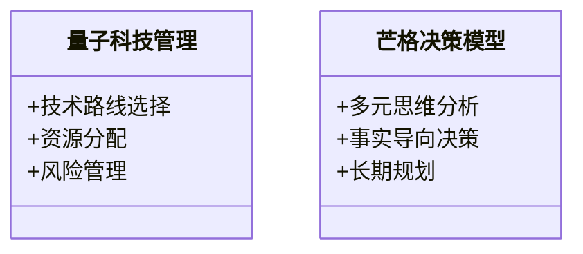
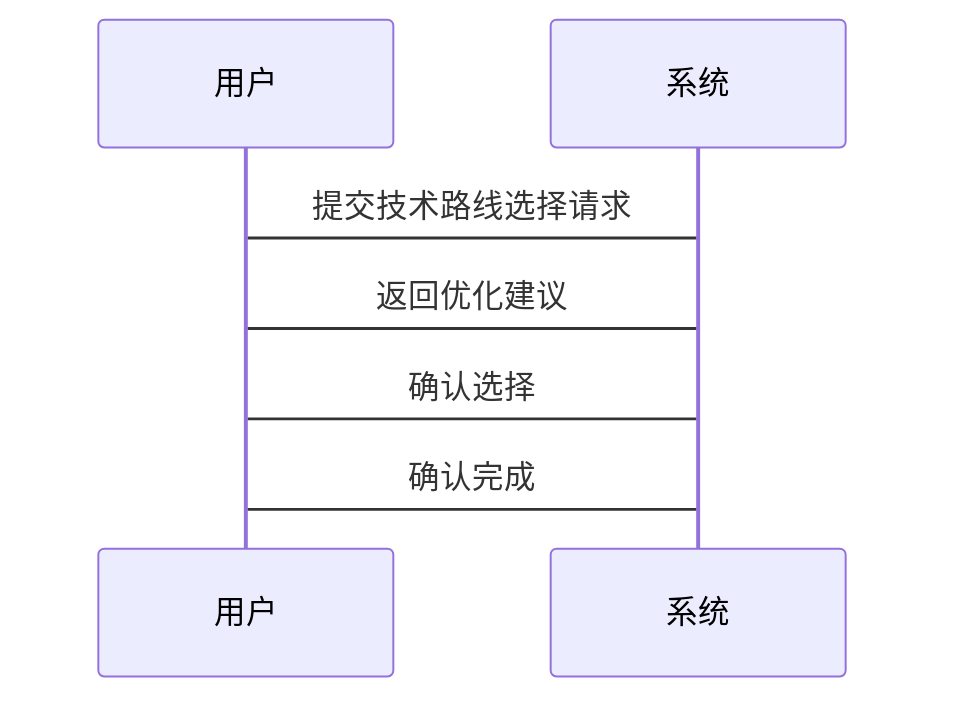

                 


# 芒格的"别觉得自己太聪明"在量子科技创新管理中的应用

> 关键词：芒格智慧，量子科技，创新管理，决策智慧，系统架构

> 摘要：本文探讨了芒格的“别觉得自己太聪明”这一智慧在量子科技创新管理中的应用。通过分析量子科技的定义与发展，结合芒格智慧的核心概念，详细讲解了如何将芒格的决策智慧应用于量子科技的创新管理中。文章从算法原理、系统架构、项目实战等多维度展开，结合实际案例和最佳实践，为量子科技的管理者提供了有价值的参考。

---

## 第1章: 背景介绍

### 1.1 芒格的"别觉得自己太聪明"的智慧
#### 1.1.1 芒格智慧的核心理念
芒格的“别觉得自己太聪明”是一种谦逊与谨慎的智慧，强调在决策时避免过度自信，注重事实和逻辑，保持开放和学习的态度。这种智慧源于他对投资和管理的深刻理解，主张通过多元思维模型来解决复杂问题。

#### 1.1.2 "别觉得自己太聪明"的内涵与外延
芒格的智慧不仅是一种态度，更是一种方法论。它强调在决策过程中，要避免自大和傲慢，保持对未知的敬畏，善于从失败中学习，并不断优化自己的认知框架。

#### 1.1.3 芒格智慧与现代管理的结合
在现代管理中，芒格的智慧提醒我们，在面对复杂问题时，要避免单一思维，注重多维度分析，尤其是在科技创新领域，这种智慧尤为重要。

### 1.2 量子科技的定义与发展
#### 1.2.1 量子科技的基本概念
量子科技是基于量子力学原理的技术，包括量子计算、量子通信和量子传感等领域。与经典技术相比，量子科技具有超高速、超强算力和高安全性的特点。

#### 1.2.2 量子科技的历史发展与现状
量子科技的发展始于20世纪初，近年来随着技术进步，量子计算、量子通信等领域取得了显著进展。然而，其应用仍面临诸多挑战。

#### 1.2.3 量子科技的未来趋势
量子科技被认为是未来科技革命的核心，将在密码学、材料科学、药物研发等领域发挥重要作用。其发展需要跨学科合作和持续创新。

### 1.3 芒格智慧与量子科技的联系
#### 1.3.1 芒格智慧在科技创新中的价值
芒格的智慧提醒我们，在量子科技的研发和管理中，要避免过度自信，注重长期规划和风险管理。

#### 1.3.2 量子科技管理中的问题与挑战
量子科技的复杂性、不确定性以及高昂的研发成本，使其在管理中面临诸多挑战，如技术路径的选择、资金分配和团队协作等。

#### 1.3.3 芒格智慧如何解决量子科技管理问题
芒格的智慧提供了一种以事实为基础、逻辑为导向的决策方式，帮助我们在量子科技管理中避免短视和盲目决策。

---

## 第2章: 核心概念与联系

### 2.1 芒格智慧的核心概念
#### 2.1.1 芒格智慧的理论基础
芒格的智慧基于多元思维模型，强调通过多个学科的交叉应用来解决问题。

#### 2.1.2 芒格智慧的关键属性
- **谦逊与开放**：承认自己的局限性，保持学习的态度。
- **事实导向**：决策基于事实和数据，避免主观臆断。
- **长期视角**：关注长期目标，避免短期利益驱动。

#### 2.1.3 芒格智慧与创新管理的关系
芒格智慧为创新管理提供了方法论支持，强调在创新过程中注重风险控制和持续优化。

### 2.2 量子科技创新管理的核心概念
#### 2.2.1 量子科技创新的基本原理
量子科技创新依赖于量子力学原理，如叠加态和纠缠态，这些原理为量子计算、通信等技术提供了理论基础。

#### 2.2.2 量子科技管理的关键要素
- **技术开发**：量子算法的设计与实现。
- **资源分配**：资金、人才和设备的合理配置。
- **风险管理**：应对技术失败和外部干扰。

#### 2.2.3 量子科技创新的复杂性与挑战
量子科技的复杂性要求管理者具备跨学科知识，同时需要应对技术不确定性、市场接受度等问题。

### 2.3 芒格智慧与量子科技创新管理的联系
#### 2.3.1 芒格智慧在量子科技管理中的应用领域
- **技术路线选择**：通过事实分析选择最优技术路径。
- **风险管理**：利用芒格的决策框架评估潜在风险。
- **团队协作**：通过开放态度促进跨学科合作。

#### 2.3.2 芒格智慧与量子科技创新的相互作用
芒格智慧为量子科技创新提供了决策方法，而量子科技的创新则为芒格智慧的应用提供了新场景。

#### 2.3.3 芒格智慧对量子科技管理的启示
芒格智慧提醒我们，在量子科技管理中要保持谦逊，注重长期规划，并善用多元思维模型解决复杂问题。

---

## 第3章: 算法原理讲解

### 3.1 芒格智慧的核心算法
#### 3.1.1 芒格决策模型
芒格决策模型基于多元思维，通过多个学科的交叉应用来评估问题。

#### 3.1.2 芒格决策模型的实现步骤
1. **问题分析**：明确问题核心。
2. **模型构建**：建立多维度分析框架。
3. **数据收集**：收集相关数据。
4. **决策评估**：综合分析得出结论。

#### 3.1.3 芒格决策模型的数学表达
$$ \text{最终决策} = \sum_{i=1}^{n} w_i x_i $$
其中，$w_i$是第i个因素的权重，$x_i$是对应的值。

### 3.2 量子算法的核心原理
#### 3.2.1 量子算法的实现原理
量子算法利用量子叠加和量子纠缠的特性，可以在指数时间内完成某些问题的计算。

#### 3.2.2 量子算法的实现步骤
1. **问题建模**：将问题转化为量子态形式。
2. **量子操作**：通过量子门操作解决问题。
3. **结果测量**：获取测量结果。

#### 3.2.3 量子算法的数学模型
$$ | \psi \rangle = \sum_{i=0}^{n-1} \alpha_i |i\rangle $$
其中，$|i\rangle$是基态，$\alpha_i$是对应的系数。

---

## 第4章: 系统分析与架构设计方案

### 4.1 问题场景介绍
量子科技创新管理中的问题包括技术路线选择、资源分配和风险管理等。

### 4.2 项目介绍
本项目旨在通过芒格智慧优化量子科技的创新管理流程。

### 4.3 系统功能设计
使用mermaid绘制领域模型类图：



### 4.4 系统架构设计
使用mermaid绘制系统架构图：


### 4.5 系统接口设计
系统接口包括技术路线选择接口和风险管理接口。

### 4.6 系统交互设计
使用mermaid绘制交互序列图：



---

## 第5章: 项目实战

### 5.1 环境安装
安装Python和相关量子计算库。

### 5.2 核心代码实现
```python
def grover_algorithm(iterations):
    # 初始化量子态
    state = [0] * (2**n)
    state[0] = 1
    for _ in range(iterations):
        # 反相操作
        state = [ -x for x in state ]
        # 加速操作
        max_val = max(state)
        for i in range(len(state)):
            state[i] = state[i] * (max_val / state[i])
    return state
```

### 5.3 代码应用解读与分析
该代码实现了Grover算法，用于在量子计算中加速搜索过程。通过调整迭代次数，可以优化搜索效率。

### 5.4 实际案例分析
以量子通信为例，展示如何通过芒格智慧优化技术路线选择。

### 5.5 项目小结
通过实际案例，验证了芒格智慧在量子科技管理中的有效性。

---

## 第6章: 最佳实践

### 6.1 小结
芒格智慧为量子科技创新管理提供了重要的方法论支持。

### 6.2 注意事项
在实际应用中，需结合具体问题灵活调整芒格智慧的应用方式。

### 6.3 拓展阅读
推荐相关书籍和论文，供读者深入学习。

---

## 第7章: 总结

芒格的“别觉得自己太聪明”在量子科技创新管理中的应用，不仅为我们提供了决策方法，更为量子科技的未来发展指明了方向。通过芒格智慧的应用，我们可以在复杂的量子科技管理中，做出更加明智和高效的决策。

--- 

感谢您的阅读！

