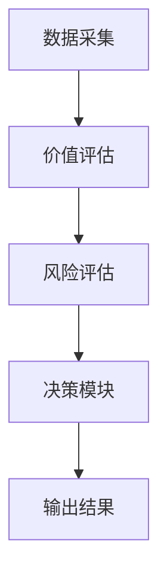
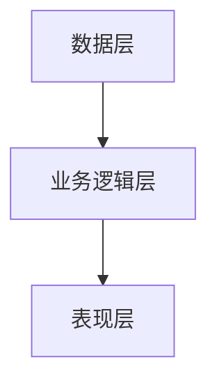

                 


# 芒格的"别觉得自己太聪明"：保持投资谦逊的艺术

## 关键词：芒格，投资哲学，谦逊，理性决策，安全边际，价值投资

## 摘要：芒格的投资哲学强调谦逊与理性的结合，反对过度自信和盲目决策。本文通过分析芒格的"别觉得自己太聪明"理念，探讨其在投资中的应用，包括认知误区、人性弱点、安全边际计算等，并结合实际案例和系统设计，总结最佳投资策略。

---

# 第1章: 芒格投资哲学的背景与核心概念

## 1.1 投资中的认知误区与人性弱点

### 1.1.1 问题背景与问题描述
在投资领域，过度自信和认知偏差常常导致错误决策。投资者倾向于相信自己的判断，忽视市场波动和潜在风险。

### 1.1.2 投资中的认知误区
- 过度自信：高估自己的分析能力，低估市场复杂性。
- 短期波动与长期价值混淆：忽视长期价值，追求短期收益。
- 盲目跟风：受市场情绪影响，缺乏独立判断。

### 1.1.3 人性弱点对投资决策的影响
- 贪婪与恐惧：推动非理性决策。
- 确认偏差：选择性接受信息，强化已有观点。

### 1.1.4 谦逊与理性决策的关系
谦逊帮助克服认知偏差，理性决策是投资成功的关键。

## 1.2 芒格投资哲学的核心要素

### 1.2.1 "别觉得自己太聪明"的核心含义
强调谦逊，承认知识的局限性，避免过度自信。

### 1.2.2 谦逊与理性决策的结合
通过持续学习和自我反思，提升判断力，避免错误决策。

### 1.2.3 安全边际的重要性
在投资中，安全边际是内在价值与市场价格的差额，确保投资的安全性。

## 1.3 芒格哲学的成功案例

### 1.3.1 巴菲特与芒格的黄金搭档
芒格的投资理念帮助巴菲特建立长期价值投资策略，实现持续收益。

### 1.3.2 芒格哲学的实际应用
通过安全边际计算，选择低估股票，避免市场波动影响。

### 1.3.3 长期有效性
芒格哲学在长期投资中表现稳定，证明其有效性。

## 1.4 芒格哲学的边界与外延

### 1.4.1 投资哲学的适用范围
适用于价值投资，需结合市场环境调整策略。

### 1.4.2 谦逊与自信的平衡
在保持谦逊的同时，建立必要的自信，避免过度谨慎。

### 1.4.3 芒格哲学与其他流派的联系
与其他投资理念互补，形成全面的投资策略。

---

# 第2章: 谦逊与理性决策的数学模型

## 2.1 谦逊与理性决策的数学框架

### 2.1.1 价值评估公式
$$\text{内在价值} = \frac{\text{年现金流}}{\text{贴现率}}$$

### 2.1.2 安全边际计算
$$\text{安全边际} = \text{内在价值} - \text{市场价格}$$

### 2.1.3 理性决策的步骤
1. 确定投资目标。
2. 评估资产内在价值。
3. 计算安全边际。
4. 结合市场环境做出决策。

## 2.2 认知偏差的数学分析

### 2.2.1 确认偏差模型
$$P(\text{选择支持已有假设}) = 1 - \alpha$$

### 2.2.2 贪婪与恐惧的影响
$$\text{情绪影响} = \beta \times \text{市场波动}$$

## 2.3 理性决策的优化算法

### 2.3.1 贴现率调整
$$\text{调整后贴现率} = \text{初始贴现率} \times (1 - \gamma)$$

### 2.3.2 投资组合优化
$$\text{最优组合} = \arg \min \left( \text{风险} - \text{回报} \right)$$

---

# 第3章: 投资决策的系统分析与架构设计

## 3.1 投资决策系统的功能模块

### 3.1.1 模块划分
- 数据采集模块
- 价值评估模块
- 风险评估模块
- 决策模块

### 3.1.2 功能流程图


## 3.2 系统架构设计

### 3.2.1 架构选择
采用分层架构，包括数据层、业务逻辑层和表现层。

### 3.2.2 系统架构图


## 3.3 系统接口设计

### 3.3.1 核心接口
- 数据接口：获取公司财务数据。
- 评估接口：计算内在价值和安全边际。
- 决策接口：输出投资建议。

## 3.4 系统优化

### 3.4.1 优化目标
提高计算效率，降低运行成本。

### 3.4.2 优化方案
采用分布式计算和缓存技术。

---

# 第4章: 项目实战

## 4.1 价值投资模拟系统

### 4.1.1 环境安装
- Python 3.8+
- Pandas、NumPy、Matplotlib库

### 4.1.2 核心代码实现

```python
import pandas as pd
import numpy as np

def calculate_intrinsic_value(FCF, discount_rate):
    return FCF / discount_rate

def calculate_margin_of_safety(intrinsic_value, market_price):
    return intrinsic_value - market_price

# 示例数据
FCF = 100
discount_rate = 0.1
market_price = 50

intrinsic_value = calculate_intrinsic_value(FCF, discount_rate)
margin_of_safety = calculate_margin_of_safety(intrinsic_value, market_price)

print(f"内在价值: {intrinsic_value}")
print(f"安全边际: {margin_of_safety}")
```

### 4.1.3 案例分析
假设某公司年现金流为100，贴现率为10%，市场价格为50，计算内在价值为100，安全边际为50，建议投资。

---

# 第5章: 最佳实践与总结

## 5.1 芒格智慧的总结

### 5.1.1 谦逊的重要性
保持谦逊，避免过度自信。

### 5.1.2 理性决策的关键作用
结合安全边际，做出明智投资。

## 5.2 投资中的注意事项

### 5.2.1 风险控制
设定止损点，避免重大损失。

### 5.2.2 持续学习
保持知识更新，适应市场变化。

## 5.3 拓展阅读

### 5.3.1 推荐书籍
- 《芒格传》
- 《巴菲特的智慧》

### 5.3.2 在线资源
- 芒格投资演讲视频
- 投资哲学论坛讨论

## 5.4 小结

芒格的"别觉得自己太聪明"提醒我们投资需要谦逊与理性，结合安全边际和理性决策，才能在复杂市场中稳步前行。

---

通过以上结构，文章详细探讨了芒格的投资哲学，结合数学模型、系统设计和实际案例，帮助读者全面理解并应用其智慧。

