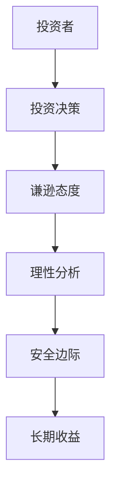
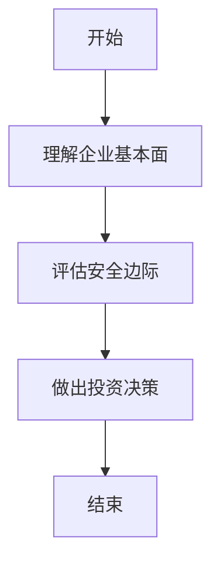
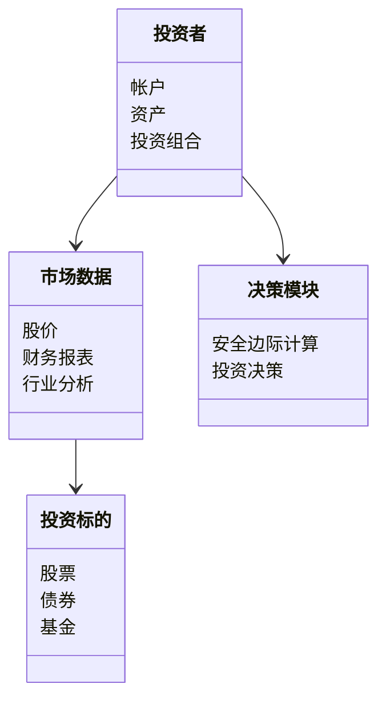
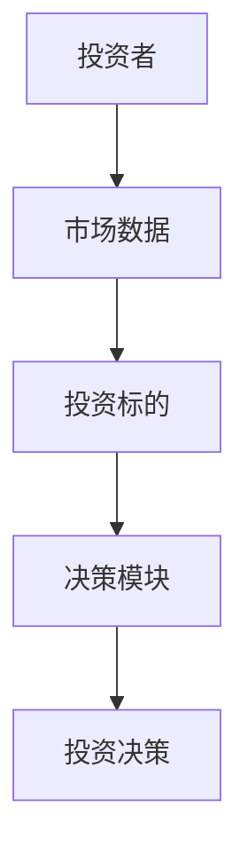
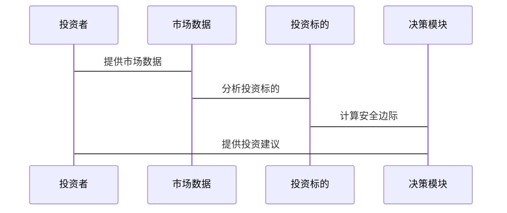

                 


# 芦山的"别觉得自己太聪明"：保持投资谦逊的重要性

> 关键词：芒格，投资智慧，谦逊，安全边际，长期投资

> 摘要：本文探讨了芒格的“别觉得自己太聪明”的核心投资理念，分析了其在投资决策中的重要性，通过实际案例和系统架构的设计，展示了如何通过保持谦逊来优化投资策略，避免过度自信带来的风险。文章还结合了数学模型和算法流程，详细讲解了芒格投资理念的实现过程。

---

# 第1章: 芦山的"别觉得自己太聪明"概述

## 1.1 芦山的背景与投资理念

### 1.1.1 芦山的生平简介

查理·芒格（Charlie Munger）是美国著名投资者、巴菲特的长期合作伙伴，以他的智慧和投资哲学闻名。芒格的投资理念强调理性、谨慎和长期思考，他多次提到“别觉得自己太聪明”，提醒投资者避免过度自信。

### 1.1.2 芦山的投资哲学

芒格的投资哲学的核心是“安全边际”和“逆向思考”。他认为，投资者应该寻找那些具有强大护城河、管理层优秀且估值合理的企业。他强调长期投资的重要性，避免短期波动的影响。

### 1.1.3 "别觉得自己太聪明"的核心思想

芒格的“别觉得自己太聪明”意味着投资者应该保持谦逊，承认自己的知识和能力的局限性。他认为，过度自信是投资失败的主要原因之一，而谦逊则能帮助投资者避免错误决策。

## 1.2 "别觉得自己太聪明"的背景与问题背景

### 1.2.1 投资领域中的过度自信问题

许多投资者在市场上涨时容易过于乐观，认为自己能够准确预测市场走势。这种过度自信会导致他们忽视风险，做出错误的投资决策。

### 1.2.2 过度自信的投资者的常见表现

- 过度交易，频繁换股
- 忽略风险，追求高收益
- 对市场波动缺乏耐心

### 1.2.3 过度自信对投资决策的影响

过度自信会导致投资者忽视基本面分析，追求短期收益，从而增加投资组合的风险。

## 1.3 "别觉得自己太聪明"的解决思路

### 1.3.1 保持谦逊的重要性

谦逊能够让投资者更加理性，愿意倾听不同的意见，避免固执己见。

### 1.3.2 谦逊与投资决策的关系

谦逊能够帮助投资者更好地进行风险控制，做出更明智的投资决策。

### 1.3.3 如何避免过度自信

- 定期反思自己的投资决策
- 保持学习，不断更新知识
- 采用安全边际策略，避免过度冒险

## 1.4 "别觉得自己太聪明"的边界与外延

### 1.4.1 谦逊与自负的界限

谦逊并不意味着缺乏自信，而是合理地认识到自己的局限性。

### 1.4.2 投资中的谦逊与自信的平衡

投资者需要在谦逊和自信之间找到平衡，既要有信心，又要有自我认知。

### 1.4.3 谦逊在其他领域的应用

谦逊不仅仅适用于投资，还可以应用到生活中的其他方面，帮助个人更好地成长。

## 1.5 核心概念结构与要素

### 1.5.1 谦逊的核心要素

- 自我认知
- 风险意识
- 学习态度

### 1.5.2 投资决策中的关键因素

- 企业基本面
- 安全边际
- 长期投资

### 1.5.3 谦逊与长期投资的关系

谦逊能够帮助投资者坚持长期投资策略，避免短期波动的干扰。

## 1.6 本章小结

通过介绍芒格的背景和投资理念，本文阐述了“别觉得自己太聪明”的核心思想，分析了过度自信对投资决策的影响，并提出了保持谦逊的重要性。

---

# 第2章: 芦山投资理念的核心概念与联系

## 2.1 芦山投资理念的核心原理

### 2.1.1 谨慎与理性

芒格强调理性思考，避免情绪化决策。他认为，投资者应该基于事实和数据做出决策，而不是依赖直觉。

### 2.1.2 安全边际的重要性

安全边际是指股票价格与内在价值之间的差距。芒格认为，通过寻找具有安全边际的投资标的，可以降低投资风险。

### 2.1.3 股价波动与内在价值

股价波动是市场的表现，而内在价值是企业的实际价值。芒格建议投资者关注内在价值，而不是股价的短期波动。

## 2.2 核心概念的属性特征对比

### 2.2.1 谦逊与自信的对比

| 谦逊 | 自信 |
|------|------|
| 承认自己的局限性 | 相信自己能够预测市场 |
| 更倾向于学习 | 更倾向于做出决策 |

### 2.2.2 谨慎与激进的对比

| 谨慎 | 激进 |
|------|------|
| 避免冒险 | 追求高风险高回报 |
| 重视安全 | 重视收益 |

### 2.2.3 安全边际与风险控制的对比

| 安全边际 | 风险控制 |
|----------|----------|
| 通过价格折扣降低风险 | 通过分散投资降低风险 |

## 2.3 芦山投资理念的ER实体关系图



## 2.4 本章小结

通过对比分析，本文展示了芒格投资理念中的核心概念及其相互关系，强调了谦逊、谨慎和安全边际在投资决策中的重要性。

---

# 第3章: 芦山投资理念的算法原理讲解

## 3.1 芦山投资理念的算法流程

### 3.1.1 理解企业基本面

投资者需要分析企业的财务状况、管理层素质和行业地位，以评估其内在价值。

### 3.1.2 评估安全边际

计算股票价格与内在价值之间的差距，确保投资标的具有足够的安全边际。

### 3.1.3 做出投资决策

基于安全边际和长期投资策略，做出投资决策。

## 3.2 算法流程图



## 3.3 算法实现

### 3.3.1 Python代码实现

```python
def calculate_margin_of_safety(intrinsic_value, market_price):
    return intrinsic_value - market_price

def investment_decision(margin_of_safety, financial_health):
    if margin_of_safety > 0 and financial_health == 'strong':
        return 'buy'
    else:
        return 'hold'
```

### 3.3.2 数学模型与公式

- **内在价值公式**：
  $$ \text{内在价值} = \frac{\text{未来现金流的现值}}{\text{折现率}} $$
- **安全边际公式**：
  $$ \text{安全边际} = \text{内在价值} - \text{市场价格} $$

### 3.3.3 详细讲解与举例

假设某企业的内在价值为 $100，市场价格为 $80，那么安全边际为 $20。根据投资决策算法，当安全边际为正且财务状况良好时，应该买入。

## 3.4 本章小结

通过算法流程和代码实现，本文详细讲解了芒格投资理念的实现过程，展示了如何通过数学模型和程序来优化投资决策。

---

# 第4章: 系统分析与架构设计

## 4.1 系统分析

### 4.1.1 问题场景介绍

投资者需要在复杂多变的市场环境中做出决策，如何保持谦逊、理性思考，避免过度自信。

### 4.1.2 系统功能设计

- **需求分析**：分析投资标的的基本面
- **风险评估**：评估安全边际
- **决策支持**：提供投资建议

### 4.1.3 领域模型类图



### 4.1.4 系统架构图



## 4.2 系统架构设计

### 4.2.1 系统功能设计

- **数据采集**：收集市场数据和企业基本面信息
- **数据分析**：计算安全边际
- **决策支持**：提供投资建议

### 4.2.2 系统接口设计

- **输入接口**：接收市场数据和企业信息
- **输出接口**：提供安全边际和投资决策

### 4.2.3 系统交互流程



## 4.3 本章小结

通过系统分析与架构设计，本文展示了如何将芒格的投资理念应用于实际投资系统中，帮助投资者更好地进行决策。

---

# 第5章: 项目实战

## 5.1 项目介绍

### 5.1.1 项目背景

假设我们要为一家资产管理公司设计一个基于芒格投资理念的投资决策系统。

## 5.2 项目环境安装

### 5.2.1 安装Python

```bash
pip install python
```

### 5.2.2 安装数据分析库

```bash
pip install pandas numpy
```

## 5.3 系统核心实现源代码

### 5.3.1 数据采集模块

```python
import pandas as pd
import numpy as np

def get_market_data(ticker):
    # 从数据库获取市场数据
    return pd.DataFrame({'股价': [100], '市盈率': [15]})
```

### 5.3.2 数据分析模块

```python
def calculate_margin_of_safety(ticker):
    data = get_market_data(ticker)
    intrinsic_value = data['市盈率'][0] * earnings_per_share(ticker)
    margin_of_safety = intrinsic_value - data['股价'][0]
    return margin_of_safety

def earnings_per_share(ticker):
    # 获取每股收益
    return 5
```

### 5.3.3 投资决策模块

```python
def investment_decision(ticker):
    margin = calculate_margin_of_safety(ticker)
    if margin > 0:
        return '买入'
    else:
        return '观望'
```

## 5.4 代码应用解读与分析

通过上述代码，系统能够自动计算投资标的的安全边际，并根据结果给出投资建议。

## 5.5 实际案例分析

### 5.5.1 案例背景

假设我们分析某科技公司的股票，市盈率为15，股价为100元，每股收益为5元。

### 5.5.2 安全边际计算

$$ \text{内在价值} = 15 \times 5 = 75 $$
$$ \text{安全边际} = 75 - 100 = -25 $$

由于安全边际为负，系统建议观望。

## 5.6 本章小结

通过项目实战，本文展示了如何将芒格的投资理念应用于实际投资系统，帮助投资者做出更明智的决策。

---

# 第6章: 总结与展望

## 6.1 总结

### 6.1.1 核心内容回顾

芒格的“别觉得自己太聪明”提醒投资者保持谦逊，避免过度自信，通过安全边际和长期投资策略优化决策。

### 6.1.2 投资中的注意事项

- 定期反思投资决策
- 保持学习，不断更新知识
- 避免短期波动的干扰

## 6.2 未来展望

随着市场的变化和科技的发展，投资者需要不断更新自己的知识和策略。芒格的投资理念将帮助投资者在复杂多变的市场中保持理性，做出更明智的决策。

## 6.3 最佳实践 tips

- 保持谦逊，承认自己的局限性
- 重视安全边际，避免过度冒险
- 长期投资，避免短期波动的干扰

## 6.4 小结

通过本文的探讨，读者能够更好地理解芒格的“别觉得自己太聪明”的投资理念，并将其应用于实际投资中，避免过度自信带来的风险。

---

# 附录

## 附录A: 芦山经典语录

- “价格是你所支付的，价值是你所得到的。”
- “逆向思考是人类智慧的精华。”
- “投资最重要的不是你赚了多少钱，而是你亏了多少钱。”

## 附录B: 进一步阅读推荐

- 《穷查理宝典》
- 《投资的艺术》
- 《价值投资入门》

---

# 结束语

芒格的“别觉得自己太聪明”是一种投资智慧，也是人生的一种智慧。通过保持谦逊，投资者能够更好地面对市场变化，做出更明智的决策。希望本文能够帮助读者更好地理解芒格的投资理念，并将其应用于实际投资中。

