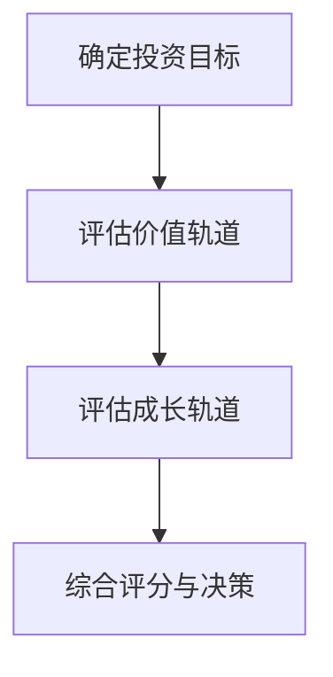
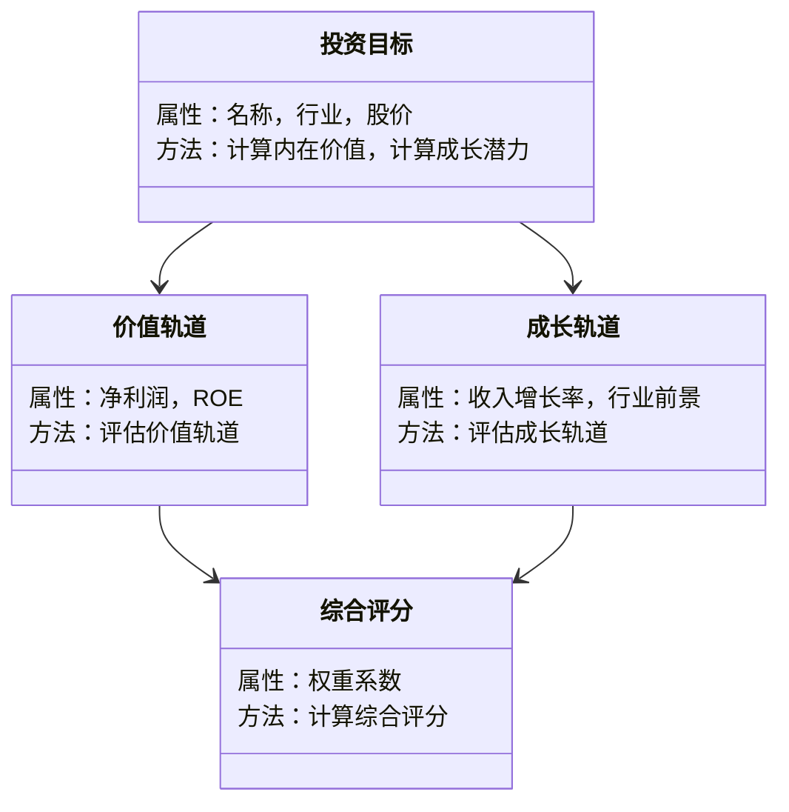
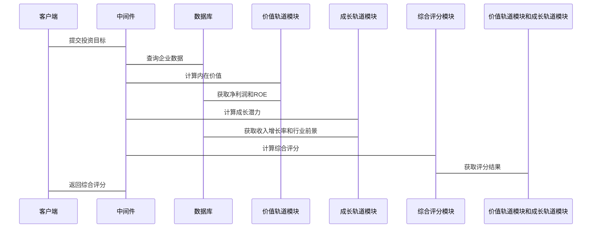

                 


# 芒格的“双轨分析”在投资决策中的应用

## 关键词：芒格、双轨分析、投资决策、价值轨道、成长轨道、投资模型

## 摘要：  
芒格的“双轨分析”是一种独特且高效的投资分析方法，它通过将投资目标分为价值轨道和成长轨道，帮助投资者更全面地评估投资机会。本文深入解析了“双轨分析”的核心概念、算法原理及其在实际投资中的应用，并通过具体案例展示了其在系统中的实现和效果。

---

## 第1章：芒格“双轨分析”的背景与核心概念

### 1.1 芒格的“双轨分析”概述

#### 1.1.1 芒格的生平与投资理念  
查理·芒格是沃伦·巴菲特的长期合作伙伴，被誉为“投资界的思想家”。他提出了一系列独特的投资理念，其中“双轨分析”是其最具影响力的方法之一。芒格主张投资者应从多个角度分析企业，避免单一维度的决策偏差。

#### 1.1.2 “双轨分析”的起源与背景  
“双轨分析”起源于芒格对传统投资分析方法的反思。他认为，传统方法往往过于关注企业的财务数据，而忽略了市场趋势和企业成长潜力。因此，他提出了“双轨分析”，将投资目标分为价值轨道和成长轨道。

#### 1.1.3 “双轨分析”在投资决策中的地位  
“双轨分析”是芒格投资体系的核心，它帮助投资者在复杂市场中找到低估的优质企业，同时兼顾成长性和安全性。

### 1.2 “双轨分析”的核心概念

#### 1.2.1 价值轨道的定义与特点  
价值轨道关注企业的内在价值，即企业在公平市场条件下的合理估值。其特点包括：  
- 以企业盈利能力为核心。  
- 强调安全边际，即股价低于内在价值时的投资机会。  

#### 1.2.2 成长轨道的定义与特点  
成长轨道关注企业的成长潜力，即企业在未来可能实现的收入和利润增长。其特点包括：  
- 以企业增长率为核心。  
- 强调市场趋势和行业前景。  

#### 1.2.3 两者的联系与区别  
- **联系**：双轨分析将企业估值与成长潜力结合起来，形成全面的投资分析框架。  
- **区别**：价值轨道侧重当前估值，成长轨道侧重未来增长。  

### 1.3 “双轨分析”与其他投资方法的对比

#### 1.3.1 基本面分析与技术分析的区别  
- 基本面分析关注企业的财务数据和行业地位，而技术分析关注股价走势和市场情绪。  
- 双轨分析综合了基本面和成长性，弥补了两者的不足。  

#### 1.3.2 双轨分析与价值投资的异同  
- **相同点**：均重视企业内在价值。  
- **不同点**：双轨分析还考虑了成长性，而价值投资更注重安全边际。  

#### 1.3.3 双轨分析与趋势投资的异同  
- **相同点**：均关注市场趋势。  
- **不同点**：双轨分析结合了趋势与估值，而趋势投资更注重短期市场走势。  

---

## 第2章：芒格“双轨分析”的核心模型与算法

### 2.1 “双轨分析”的模型结构

#### 2.1.1 价值轨道的构成要素  
- **企业盈利**：净利润、ROE等。  
- **安全边际**：股价与内在价值的差异。  

#### 2.1.2 成长轨道的构成要素  
- **收入增长率**：过去三年的收入增长率。  
- **行业前景**：行业市场规模和竞争格局。  

#### 2.1.3 两者的相互作用  
- 价值轨道为投资提供安全边际，成长轨道为投资提供增长潜力。  

### 2.2 “双轨分析”的核心算法

#### 2.2.1 算法步骤分解  
1. 确定投资目标：选择行业和企业。  
2. 评估价值轨道：计算内在价值。  
3. 评估成长轨道：分析成长潜力。  
4. 综合评分：结合两者得出最终评分。  

#### 2.2.2 算法流程图  


---

## 第3章：芒格“双轨分析”的算法原理与数学模型

### 3.1 算法步骤分解

#### 3.1.1 确定投资目标  
- 选择具有成长潜力和估值合理的行业和企业。  

#### 3.1.2 评估价值轨道  
- 计算企业内在价值：$$V = \frac{E}{P}$$  
  其中，$E$为企业的净利润，$P$为股价。  

#### 3.1.3 评估成长轨道  
- 计算企业成长潜力：$$G = \frac{GDP}{P}$$  
  其中，$GDP$为企业收入增长率，$P$为股价。  

#### 3.1.4 综合评分  
- 综合评分公式：$$S = \alpha V + \beta G$$  
  其中，$\alpha$和$\beta$为权重系数，通常$\alpha = 0.6$，$\beta = 0.4$。  

### 3.2 数学模型

#### 3.2.1 价值轨道的数学公式  
$$V = \frac{E}{P}$$  

#### 3.2.2 成长轨道的数学公式  
$$G = \frac{GDP}{P}$$  

#### 3.2.3 综合评分公式  
$$S = 0.6V + 0.4G$$  

---

## 第4章：芒格“双轨分析”的系统分析与架构设计

### 4.1 系统功能设计

#### 4.1.1 领域模型（Mermaid 类图）  


### 4.2 系统架构设计

#### 4.2.1 系统架构（Mermaid 架构图）  


### 4.3 系统交互设计

#### 4.3.1 系统交互（Mermaid 序列图）  


---

## 第5章：芒格“双轨分析”的项目实战

### 5.1 环境安装

#### 5.1.1 系统环境  
- 操作系统：Linux/Windows/MacOS  
- 语言：Python 3.8+  
- 库：numpy, pandas, matplotlib  

#### 5.1.2 安装依赖  
```bash
pip install numpy pandas matplotlib
```

### 5.2 核心实现源代码

#### 5.2.1 投资目标类  
```python
class InvestmentTarget:
    def __init__(self, name, industry, price):
        self.name = name
        self.industry = industry
        self.price = price
```

#### 5.2.2 价值轨道类  
```python
class ValueTrack:
    def __init__(self, net_income, roe):
        self.net_income = net_income
        self.roe = roe

    def calculate_value(self, price):
        v = self.net_income / price
        return v
```

#### 5.2.3 成长轨道类  
```python
class GrowthTrack:
    def __init__(self, revenue_growth, industry_prospect):
        self.revenue_growth = revenue_growth
        self.industry_prospect = industry_prospect

    def calculate_growth(self, price):
        g = self.revenue_growth / price
        return g
```

#### 5.2.4 综合评分类  
```python
class CombinedScore:
    def __init__(self, alpha=0.6, beta=0.4):
        self.alpha = alpha
        self.beta = beta

    def calculate_score(self, value, growth):
        score = self.alpha * value + self.beta * growth
        return score
```

### 5.3 代码实现与分析

#### 5.3.1 具体案例分析  
假设我们要分析苹果公司的投资决策：  
- 投资目标：苹果公司，行业：科技，股价：150美元。  
- 价值轨道：净利润为100亿美元，ROE为25%。  
- 成长轨道：收入增长率为15%，行业前景良好。  

计算步骤：  
1. 计算价值轨道：$$V = \frac{100}{150} = 0.6667$$  
2. 计算成长轨道：$$G = \frac{15}{150} = 0.10$$  
3. 综合评分：$$S = 0.6 \times 0.6667 + 0.4 \times 0.10 = 0.4 + 0.04 = 0.44$$  

---

## 第6章：芒格“双轨分析”的总结与最佳实践

### 6.1 总结与反思

#### 6.1.1 双轨分析的优势  
- 全面性：同时考虑价值和成长。  
- 稳健性：结合安全边际和增长潜力。  

#### 6.1.2 双轨分析的局限性  
- 简单性：过于简化可能导致遗漏细节。  
- 主观性：权重系数的设置存在主观性。  

### 6.2 最佳实践

#### 6.2.1 实践建议  
- 灵活调整权重系数，根据市场环境变化进行调整。  
- 定期更新企业数据，保持模型的实时性。  

#### 6.2.2 注意事项  
- 避免过度依赖模型，结合市场情绪和突发事件进行判断。  
- 在实际操作中，建议结合多种分析方法，形成多维度的投资决策体系。  

### 6.3 未来拓展

#### 6.3.1 模型优化方向  
- 引入更多因子，如PE、PB等。  
- 结合机器学习，提升模型的预测精度。  

#### 6.3.2 应用场景扩展  
- 应用于组合投资，优化资产配置。  
- 应用于风险管理，识别潜在风险点。  

---

## 第7章：总结与展望

### 7.1 本文总结  
芒格的“双轨分析”是一种高效的投资分析方法，它通过将投资目标分为价值轨道和成长轨道，帮助投资者全面评估企业价值和成长潜力。本文详细介绍了“双轨分析”的核心概念、算法原理和系统架构，并通过具体案例展示了其在实际投资中的应用。

### 7.2 未来展望  
随着人工智能和大数据技术的发展，“双轨分析”有望进一步优化，引入更多因子和模型，提升投资决策的科学性和准确性。同时，其在风险管理、组合投资等领域的应用也将进一步拓展，为投资者提供更强大的工具和方法。

---

## 关键词标签：  
#投资决策，#双轨分析，#芒格，#价值轨道，#成长轨道，#投资模型

