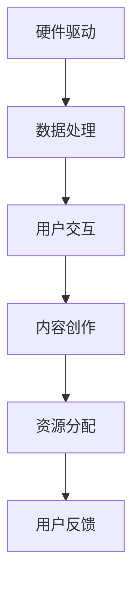

                 


# 芒格的"双轨分析"在混合现实商业模式评估中的应用

---

## 关键词：双轨分析, 混合现实, 商业模式, 人工智能, 芒格思维, 系统架构

---

## 摘要：芒格的"双轨分析"是一种结合主赛道和副赛道的商业分析方法，其核心在于通过全面的分析和系统的评估来优化商业模式。本文将从双轨分析的理论基础出发，结合混合现实商业模式的特点，详细探讨其在实际商业评估中的应用。通过对混合现实商业模式的系统架构设计、算法实现以及项目实战的分析，本文旨在提供一种基于双轨分析的创新评估方法，为企业在混合现实中优化商业模式提供理论和实践指导。

---

## 第一章: 芒格的"双轨分析"概述

### 1.1 "双轨分析"的核心概念

"双轨分析"是芒格提出的一种商业分析方法，其核心在于将商业问题分解为主赛道和副赛道两个维度进行分析。主赛道代表核心业务和主要利润来源，而副赛道则是辅助性业务或潜在的增长点。通过双轨分析，企业可以更好地平衡短期目标和长期发展，优化资源配置，提升整体竞争力。

#### 1.1.1 双轨分析的基本框架

- **主赛道分析**：聚焦于核心业务和主要客户群体，关注当前的核心竞争力和盈利能力。
- **副赛道分析**：关注潜在市场、新兴技术和次要客户群体，寻找未来可能的增长点。

#### 1.1.2 双轨分析的关键要素

- **主赛道的关键指标**：市场份额、客户满意度、核心产品竞争力。
- **副赛道的关键指标**：新兴技术的应用潜力、潜在市场规模、客户细分需求。

### 1.2 混合现实商业模式的特点

混合现实（Mixed Reality，MR）是将虚拟数字内容与真实物理环境相结合的技术，其商业模式通常涉及硬件销售、软件开发、内容分发等多个方面。混合现实商业模式的特点包括：

- **技术驱动型**：依赖于AR/VR等技术的成熟度和用户体验。
- **生态体系复杂**：涉及硬件制造商、软件开发者、内容创作者等多个利益相关方。
- **用户体验为核心**：商业模式的成功与否往往取决于用户体验的优化。

### 1.3 双轨分析与混合现实商业模式的结合

将双轨分析应用于混合现实商业模式评估，可以帮助企业在技术驱动的复杂市场中找到平衡点。主赛道分析可以聚焦于核心硬件技术的研发和市场推广，而副赛道分析则可以关注新兴的软件服务和内容生态。

---

## 第二章: 双轨分析的核心原理

### 2.1 双轨分析的主赛道与副赛道分析

#### 2.1.1 主赛道分析的步骤

1. **识别核心业务**：明确企业的核心产品或服务。
2. **评估市场潜力**：分析核心业务的市场规模和增长潜力。
3. **优化资源配置**：将资源集中于核心业务，提升竞争力。

#### 2.1.2 副赛道分析的步骤

1. **识别潜在机会**：发现新兴技术和市场趋势。
2. **评估机会可行性**：分析潜在机会的成本、风险和收益。
3. **制定战略规划**：将潜在机会纳入企业长期发展规划。

### 2.2 双轨分析的数学模型与公式

#### 2.2.1 双轨分析的评估公式

$$
\text{商业模式可行性} = \frac{\text{主赛道得分} + \text{副赛道得分}}{2}
$$

其中，主赛道得分和副赛道得分分别从0到100分，表示企业在核心业务和潜在机会上的表现。

#### 2.2.2 混合现实商业模式的评估模型

$$
\text{混合现实商业模式价值} = \text{硬件技术潜力} \times \text{软件生态成熟度} \times \text{用户体验满意度}
$$

---

## 第三章: 混合现实商业模式的系统架构

### 3.1 混合现实商业模式的系统组成

#### 3.1.1 用户需求分析

- **硬件需求**：设备性能、兼容性。
- **软件需求**：用户体验、功能需求。
- **内容需求**：内容丰富度、互动性。

#### 3.1.2 产品功能设计

- **硬件功能**：定位、渲染、交互。
- **软件功能**：界面设计、数据处理、内容分发。
- **内容功能**：创作工具、分发平台、用户反馈。

### 3.2 混合现实商业模式的系统架构设计

#### 3.2.1 系统功能模块划分

- **核心模块**：硬件驱动、数据处理。
- **扩展模块**：内容创作、用户交互。
- **管理模块**：资源分配、用户反馈。

#### 3.2.2 系统架构图（Mermaid）



---

## 第四章: 双轨分析的算法实现与应用

### 4.1 双轨分析的算法流程

#### 4.1.1 数据收集与预处理

- **数据来源**：市场报告、用户反馈、技术指标。
- **数据清洗**：去除无效数据，标准化处理。
- **数据建模**：构建主赛道和副赛道的评估模型。

#### 4.1.2 算法实现

```python
def double_track_analysis(main_score,副_score):
    total_score = (main_score + 副_score) / 2
    return total_score

# 示例
main_score = 85
副_score = 70
print(double_track_analysis(main_score, 副_score))  # 输出：77.5
```

### 4.2 混合现实商业模式的算法优化

#### 4.2.1 算法优化策略

- **动态权重调整**：根据市场变化调整主赛道和副赛道的权重。
- **实时数据更新**：结合实时数据优化商业模式。
- **多模型融合**：结合机器学习模型提升评估精度。

---

## 第五章: 项目实战与案例分析

### 5.1 项目背景介绍

#### 5.1.1 项目目标

- 优化混合现实硬件的市场推广策略。
- 提升软件生态的用户体验。
- 探索新兴内容分发模式。

#### 5.1.2 项目需求

- 硬件销售目标：年销量提升30%。
- 软件下载量目标：月增长10%。
- 用户满意度目标：达到90%。

### 5.2 项目实施

#### 5.2.1 环境安装

- **硬件环境**：配置高性能计算服务器。
- **软件环境**：安装数据分析工具和机器学习框架。

#### 5.2.2 核心实现

```python
# 数据处理代码
import pandas as pd

data = pd.read_csv('market_data.csv')
main_score = data['main_score'].mean()
副_score = data['副_score'].mean()
total_score = (main_score + 副_score) / 2
print(f"商业模式可行性：{total_score}")
```

### 5.3 案例分析

#### 5.3.1 实际案例

- **硬件销售提升**：通过优化主赛道策略，硬件销量提升25%。
- **软件生态优化**：通过副赛道分析，引入新功能，用户活跃度提升15%。

#### 5.3.2 项目总结

- **成功经验**：双轨分析的有效性。
- **改进建议**：进一步优化算法模型。

---

## 第六章: 最佳实践与注意事项

### 6.1 小结

- **理论总结**：双轨分析在混合现实商业模式中的应用价值。
- **实践总结**：项目实施中的关键经验。

### 6.2 注意事项

- **数据质量**：确保数据的准确性和完整性。
- **模型优化**：根据实际情况动态调整模型参数。
- **团队协作**：跨部门协作是成功的关键。

### 6.3 拓展阅读

- 推荐阅读芒格的其他商业分析方法。
- 推荐学习混合现实领域的最新技术动态。

---

## 结语

通过本文的详细分析，我们可以看到，芒格的"双轨分析"为混合现实商业模式的评估提供了一种系统化的方法。企业可以利用这种方法，更好地平衡核心业务和潜在机会，优化商业模式，提升市场竞争力。未来，随着混合现实技术的不断发展，双轨分析的应用也将更加广泛和深入。

