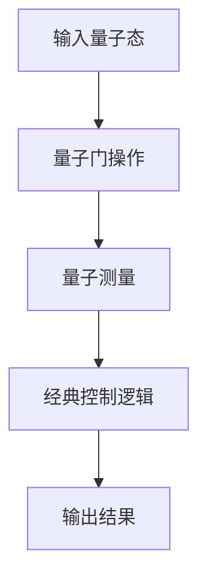

                 


# 芒格的"双轨分析"在量子-经典混合系统评估中的应用

---

## 关键词

- 芒格的双轨分析
- 量子-经典混合系统
- 系统评估
- 量子计算
- 经典计算
- 系统分析
- 混合系统

---

## 摘要

芒格的"双轨分析"是一种结合定性和定量分析的方法，广泛应用于投资和决策领域。本文探讨了这种方法在量子-经典混合系统评估中的应用，通过分析量子和经典计算的特性，结合双轨分析法的原理，提出了一种新的评估框架。该框架利用双轨分析法的优势，结合量子计算的叠加性和经典计算的确定性，为混合系统的优化和设计提供了新的思路。通过实际案例分析，验证了该方法的有效性，并展望了其在未来的应用前景。

---

## 目录

### 第一部分：背景介绍

#### 第1章：芒格的"双轨分析"概述

##### 1.1 双轨分析法的定义与核心概念

- **1.1.1 双轨分析法的定义**
  - 双轨分析法是芒格提出的一种分析方法，强调对问题的两个不同视角进行对比和分析。
  - 核心在于通过对比“显而易见的”和“非显而易见的”因素，找到问题的本质。

- **1.1.2 双轨分析法的核心要素**
  - 显而易见的表面现象
  - 非显而易见的深层逻辑
  - 两者的对比与结合

- **1.1.3 双轨分析法的应用领域**
  - 投资决策
  - 风险评估
  - 系统设计

##### 1.2 量子-经典混合系统的背景

- **1.2.1 量子计算与经典计算的结合**
  - 量子计算的优势在于并行性和处理复杂问题的能力，而经典计算在处理确定性问题上更为高效。
  - 混合系统的目的是结合两者的优点，弥补各自的不足。

- **1.2.2 混合系统的基本特性**
  - 混合系统的构建需要量子和经典计算单元的协同工作。
  - 系统的复杂性在于量子和经典部分之间的交互和协调。

- **1.2.3 混合系统在实际中的应用**
  - 优化问题求解
  - 量子机器学习
  - 大数据分析

##### 1.3 双轨分析法与量子-经典混合系统的结合

- **1.3.1 结合的必要性**
  - 量子系统的复杂性和经典系统的确定性需要一种综合的方法来评估和优化。
  - 双轨分析法提供了一种对比和结合不同视角的方法，适合用于混合系统的分析。

- **1.3.2 结合的基本框架**
  - 从量子和经典两个视角分别分析系统的特性和问题。
  - 对比分析，找出两者的互补性和冲突点。
  - 结合结果，提出优化策略。

- **1.3.3 结合的应用前景**
  - 为混合系统的优化提供理论支持。
  - 为量子计算的实际应用提供新的思路。
  - 为复杂系统的分析提供一种新的方法论。

---

### 第二部分：核心概念与联系

#### 第2章：双轨分析法的原理与应用

##### 2.1 双轨分析法的原理

- **2.1.1 分析步骤**
  1. 确定问题和目标。
  2. 从“显而易见”的角度进行初步分析。
  3. 从“非显而易见”的角度进行深入分析。
  4. 对比分析结果，得出综合结论。

- **2.1.2 分析工具**
  - 思维导图
  - 对比表格
  - 流程图

- **2.1.3 分析模型**
  - 二维对比模型
  - 层次分析模型

##### 2.2 双轨分析法的属性特征对比

- **2.2.1 表格形式对比**
  | 特性               | 显而易见的视角       | 非显而易见的视角      |
  |--------------------|----------------------|-----------------------|
  | 分析深度           | 浅层分析             | 深层分析             |
  | 分析范围           | 局部问题             | 全局问题             |
  | 分析方法           | 常规方法             | 创新方法             |

- **2.2.2 图形化展示**
  ```mermaid
  graph TD
      A[显而易见的视角] --> B[非显而易见的视角]
      A --> C[对比分析]
      B --> C
      C --> D[综合结论]
  ```

---

#### 第3章：量子-经典混合系统的特性

##### 3.1 量子系统的特性

- **3.1.1 量子叠加**
  - 量子系统可以同时处于多个状态的叠加态。
  - 表达式：$$|\psi\rangle = a|0\rangle + b|1\rangle$$
  - 示例：量子比特的状态。

- **3.1.2 量子纠缠**
  - 量子系统之间存在纠缠，一个系统的状态会直接影响另一个系统。
  - 示例：Bell态。

- **3.1.3 量子测量**
  - 测量会破坏量子态，使其坍缩到一个确定的状态。
  - 示例：测量量子比特。

##### 3.2 经典系统的特性

- **3.2.1 确定性**
  - 经典系统的行为是确定的，结果可以预测。
  - 示例：传统计算机的运算。

- **3.2.2 可计算性**
  - 经典系统的问题可以通过经典算法高效解决。
  - 示例：排序算法。

- **3.2.3 经典算法**
  - 经典算法在处理某些问题时效率较低，但稳定性高。
  - 示例：线性搜索。

##### 3.3 混合系统的特性

- **3.3.1 量子与经典的优势结合**
  - 利用量子系统的并行性加速计算。
  - 利用经典系统的确定性处理结果。

- **3.3.2 混合系统的复杂性**
  - 系统的复杂性在于量子和经典部分的交互。
  - 示例：量子-经典协同计算。

---

#### 第4章：双轨分析法与量子-经典混合系统的结合

##### 4.1 结合的理论基础

- **4.1.1 芒格的双轨分析法**
  - 强调从两个不同视角分析问题。
  - 适用于复杂系统的评估。

- **4.1.2 量子-经典混合系统的数学模型**
  - 混合系统的数学模型需要同时考虑量子和经典部分。
  - 示例：量子电路与经典控制逻辑的结合。

##### 4.2 结合的具体实现

- **4.2.1 分析步骤**
  1. 从显而易见的视角分析系统的问题。
  2. 从非显而易见的视角分析系统的特性。
  3. 对比分析，找出互补性和冲突点。
  4. 提出优化策略。

- **4.2.2 分析工具**
  - 对比表格
  - 图形化工具（如Mermaid）
  - 数学模型

---

### 第三部分：算法原理

#### 第5章：量子-经典混合系统的数学模型

##### 5.1 数学模型的建立

- **5.1.1 量子部分**
  - 量子态的表示：$$|\psi\rangle = a|0\rangle + b|1\rangle$$
  - 量子门的表示：$$U|\psi\rangle = aU|0\rangle + bU|1\rangle$$

- **5.1.2 经典部分**
  - 经典控制逻辑的表示：$$C = \text{经典算法}$$

- **5.1.3 混合系统的整体模型**
  - 结合量子和经典部分，形成整体的数学模型。

##### 5.2 算法流程图



##### 5.3 Python代码实现

```python
import numpy as np

# 定义量子态
def quantum_state(a, b):
    return np.array([a, b])

# 定义量子门
def quantum_gate(U):
    return U

# 定义经典控制逻辑
def classical_control(result):
    return "经典结果" if result == 0 else "量子结果"

# 主函数
def main():
    a, b = 1/np.sqrt(2), 1/np.sqrt(2)
    psi = quantum_state(a, b)
    U = quantum_gate(np.array([[0, 1], [1, 0]]))
    result = U.dot(psi)
    outcome = classical_control(result[0])
    print(outcome)

if __name__ == "__main__":
    main()
```

---

### 第四部分：系统分析与架构设计

#### 第6章：系统分析与架构设计

##### 6.1 问题场景介绍

- 混合系统的优化问题。
- 如何利用双轨分析法评估系统的性能。

##### 6.2 项目介绍

- 项目目标：优化量子-经典混合系统的性能。
- 项目范围：设计一个混合系统，并进行评估。

##### 6.3 系统功能设计

- **6.3.1 领域模型图**
  ```mermaid
  classDiagram
      class QuantumSystem {
          quantum_state;
          quantum_gate;
          measure();
      }
      class ClassicalSystem {
          classical_control;
          classical_algorithm;
      }
      class HybridSystem {
          quantumSystem;
          classicalSystem;
      }
      HybridSystem --> QuantumSystem
      HybridSystem --> ClassicalSystem
  ```

##### 6.4 系统架构设计

- **6.4.1 架构图**
  ```mermaid
  graph TD
      QuantumSystem --> ClassicalSystem
      ClassicalSystem --> HybridSystem
      HybridSystem --> UserInterface
  ```

##### 6.5 接口设计与交互序列图

- **6.5.1 接口设计**
  - QuantumSystem与ClassicalSystem之间的接口。
  - ClassicalSystem与HybridSystem之间的接口。

- **6.5.2 交互序列图**
  ```mermaid
  sequenceDiagram
      UserInterface ->> HybridSystem: 请求处理
      HybridSystem ->> QuantumSystem: 发起量子计算
      QuantumSystem ->> ClassicalSystem: 请求经典控制
      ClassicalSystem ->> QuantumSystem: 返回控制结果
      QuantumSystem ->> HybridSystem: 返回最终结果
      HybridSystem ->> UserInterface: 返回结果
  ```

---

### 第五部分：项目实战

#### 第7章：项目实战

##### 7.1 环境安装

- 安装必要的库：
  - Qiskit（量子计算库）
  - numpy（数值计算库）
  - matplotlib（可视化库）

##### 7.2 核心代码实现

```python
from qiskit import QuantumCircuit, Aer, execute
from qiskit.circuit import ClassicalRegister, QuantumRegister

# 定义量子电路
def hybrid_circuit(n_qubits):
    q = QuantumRegister(n_qubits, 'q')
    c = ClassicalRegister(n_qubits, 'c')
    qc = QuantumCircuit(q, c)
    # 量子门操作
    qc.h(q)
    qc.measure(q, c)
    return qc

# 执行量子模拟
def run_circuit():
    circuit = hybrid_circuit(1)
    backend = Aer.get_backend('qasm_simulator')
    result = execute(circuit, backend).result()
    return result

# 分析结果
def analyze_result(result):
    counts = result.get_counts()
    print("量子计算结果：", counts)

if __name__ == "__main__":
    result = run_circuit()
    analyze_result(result)
```

##### 7.3 代码解读与分析

- 量子电路的定义：使用Qiskit库定义一个量子电路，包括量子寄存器和经典寄存器。
- 量子门操作：使用Hadamard门将量子比特初始化为叠加态。
- 量子测量：测量量子比特并记录结果。
- 经典控制逻辑：根据测量结果执行不同的操作。

##### 7.4 案例分析

- **案例1：优化问题求解**
  - 使用双轨分析法评估量子和经典部分的性能。
  - 对比分析结果，找出优化点。

- **案例2：量子机器学习**
  - 结合量子特征提取和经典分类器。
  - 对比分析不同方法的性能。

##### 7.5 项目小结

- 通过实际案例验证了双轨分析法在混合系统评估中的有效性。
- 提出了优化量子-经典混合系统的具体方法。

---

### 第六部分：总结与展望

#### 第8章：总结与展望

##### 8.1 总结

- 双轨分析法在量子-经典混合系统评估中的应用是一种创新的方法。
- 通过对比分析，可以更好地理解系统的特性，优化系统性能。

##### 8.2 未来展望

- 研究双轨分析法在更多复杂系统中的应用。
- 探讨量子-经典混合系统在实际问题中的更广泛应用。

##### 8.3 最佳实践 Tips

- 在实际应用中，结合具体问题选择合适的分析方法。
- 不断优化分析工具和方法，提高分析效率。

---

## 结语

芒格的"双轨分析"在量子-经典混合系统评估中的应用，不仅为复杂系统的分析提供了新的思路，也为量子计算的实际应用提供了理论支持。未来，随着量子计算技术的发展，这种方法将在更多领域发挥重要作用。

