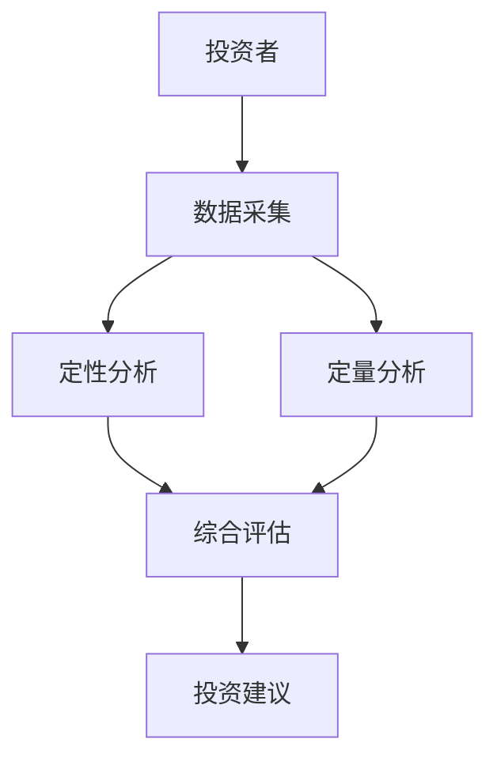
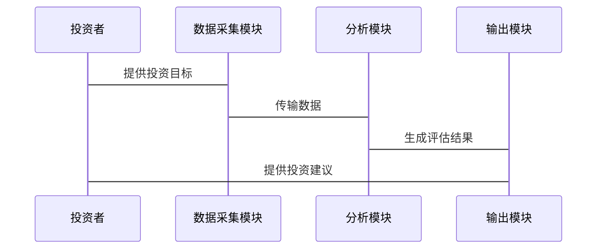

                 


# 芮格的"双轨分析"：结合定性和定量的投资方法

> 关键词：双轨分析，定性分析，定量分析，芒格投资，投资方法，系统设计

> 摘要：本文详细介绍了芒格的“双轨分析”方法，结合定性和定量分析的投资策略。通过系统的分析和实际案例，探讨了如何将定性分析和定量分析相结合，以提升投资决策的科学性和准确性。文章从背景、原理、系统设计到项目实战，全面解析了“双轨分析”的核心思想和实际应用。

---

## 第一部分：引言

### 第1章：芒格“双轨分析”的背景与重要性

#### 1.1 投资分析的演变
- 传统投资分析方法的局限性
- 芮格“双轨分析”的提出背景
- “双轨分析”在现代投资中的地位

#### 1.2 定性分析与定量分析的结合
- 定性分析的优缺点
- 定量分析的优缺点
- 两者的结合如何互补

---

## 第二部分：定性分析的核心原理

### 第2章：定性分析的原理与方法

#### 2.1 定性分析的基本原理
- 定性分析的定义
- 定性分析的核心要素：企业基本面、管理团队、行业地位等
- 定性分析的逻辑框架

#### 2.2 定性分析的主要方法
- 财务报表分析：利润表、资产负债表、现金流量表
- 管理团队评估：CEO的背景、战略眼光、决策能力
- 行业分析：市场规模、竞争格局、行业周期
- 企业竞争优势分析：护城河、核心竞争力

#### 2.3 定性分析的优缺点
- 优点：灵活性、深度、洞察力
- 缺点：主观性、难以量化、时间成本高

#### 2.4 定性分析的ER实体关系图
```mermaid
erDiagram
    actor 投资者 {
        <属性> 企业名称
        <属性> 管理团队
        <属性> 行业地位
        <属性> 财务状况
    }
    actor 投资决策 {
        <关联> 企业基本面
        <关联> 竞争优势
        <关联> 行业趋势
    }
```

---

### 第3章：定量分析的核心原理

#### 3.1 定量分析的基本原理
- 定量分析的定义
- 定量分析的核心要素：市盈率、市净率、ROE、股息率等
- 定量分析的逻辑框架

#### 3.2 定量分析的主要方法
- 基本面量化：PE、PB、ROE等指标
- 技术分析：K线图、均线、成交量
- 财务指标分析：盈利能力、成长能力、偿债能力、运营能力

#### 3.3 定量分析的优缺点
- 优点：客观性、可比性、效率高
- 缺点：忽视企业独特性、依赖数据质量、难以捕捉市场情绪

---

## 第三部分：定性与定量分析的结合

### 第4章：定性与定量分析的结合原理

#### 4.1 结合的必要性
- 单一方法的局限性
- 结合后的优势：全面性、准确性、稳健性

#### 4.2 结合的方法与步骤
1. 确定投资目标与筛选标准
2. 定性分析初筛：企业基本面、竞争优势
3. 定量分析复筛：财务指标、估值指标
4. 综合评估：定性与定量结果的结合

#### 4.3 结合的优势
- 提高决策的全面性
- 减少单一方法的偏差
- 提升投资的稳健性

---

### 第5章：定性与定量分析的结合公式

#### 5.1 综合评分公式
$$
\text{综合评分} = \sum (\text{定性评分} \times \text{权重}_1) + \sum (\text{定量评分} \times \text{权重}_2)
$$

#### 5.2 权重分配公式
$$
\text{权重}_1 = \frac{\text{定性分析的重要性}}{\text{定性+定量分析的重要性}}
$$
$$
\text{权重}_2 = \frac{\text{定量分析的重要性}}{\text{定性+定量分析的重要性}}
$$

#### 5.3 示例：投资决策中的应用
- 某股票定性评分为80，定量评分为70
- 权重分配：定性40%，定量60%
- 综合评分：$80 \times 0.4 + 70 \times 0.6 = 32 + 42 = 74$

---

## 第四部分：芒格“双轨分析”的系统设计与应用

### 第6章：芒格“双轨分析”的系统架构设计

#### 6.1 系统功能设计
- 数据采集模块：收集企业基本面数据、市场数据
- 定性分析模块：评估企业竞争优势、管理团队
- 定量分析模块：计算财务指标、估值指标
- 综合评估模块：结合定性与定量结果，生成投资建议

#### 6.2 系统架构图


#### 6.3 系统接口设计
- 数据接口：从数据库获取企业数据
- 分析接口：调用定性与定量分析模块
- 输出接口：生成投资建议报告

#### 6.4 系统交互图


---

## 第五部分：项目实战：基于“双轨分析”的投资系统开发

### 第7章：项目实战

#### 7.1 环境安装与配置
- 安装Python、Pandas、Matplotlib、Scikit-learn等工具
- 数据源获取：股票数据、财务数据
- 系统开发环境搭建：IDE、版本控制工具

#### 7.2 系统核心实现源代码
- 定性分析模块代码：
  ```python
  def qualitative_analysis(company_data):
      # 企业基本面评分
      management_score = company_data['management_score']
      industry_position_score = company_data['industry_position_score']
      competitive_advantage_score = company_data['competitive_advantage_score']
      return (management_score + industry_position_score + competitive_advantage_score) / 3
  ```

- 定量分析模块代码：
  ```python
  def quantitative_analysis(company_data):
      pe_ratio = company_data['pe_ratio']
      pb_ratio = company_data['pb_ratio']
      roe = company_data['roe']
      return (pe_ratio + pb_ratio + roe) / 3
  ```

- 综合评估模块代码：
  ```python
  def combined_score(qualitative_score, quantitative_score, qualitative_weight, quantitative_weight):
      return qualitative_score * qualitative_weight + quantitative_score * quantitative_weight
  ```

#### 7.3 项目小结
- 通过代码实现“双轨分析”的核心逻辑
- 系统架构清晰，功能模块化
- 投资者可以根据需求调整权重和分析指标

---

## 第六部分：总结与展望

### 第8章：总结与展望

#### 8.1 总结
- 芮格“双轨分析”的核心思想
- 定性与定量分析的结合优势
- 系统设计与项目实现的关键点

#### 8.2 展望
- 结合AI技术提升分析效率
- 进一步优化权重分配模型
- 扩展更多行业的投资分析案例

---

## 最佳实践 Tips

- 在实际投资中，建议根据市场环境动态调整权重
- 定期回顾投资组合的表现，优化分析模型
- 结合市场情绪和突发事件，灵活调整投资策略

---

## 小结

芒格的“双轨分析”方法通过结合定性和定量分析，为投资者提供了一种科学、系统的投资决策方式。本文从原理、系统设计到项目实战，全面解析了“双轨分析”的核心思想和实际应用。希望读者能够通过本文，更好地理解和应用这一方法，提升投资决策的科学性和准确性。

---

## 注意事项

- 投资有风险，本文仅为理论分析，不构成投资建议
- 数据分析需结合具体市场环境，避免机械套用模型
- 定期回顾和优化分析模型，以适应市场变化

---

## 拓展阅读

- 《芒格的投资思想》
- 《定性与定量分析的结合方法》
- 《系统设计与投资分析》

---

通过本文的详细讲解，读者可以全面掌握芒格“双轨分析”的核心思想，并将其应用于实际投资中。希望本文能为投资者提供有价值的参考和启发。

