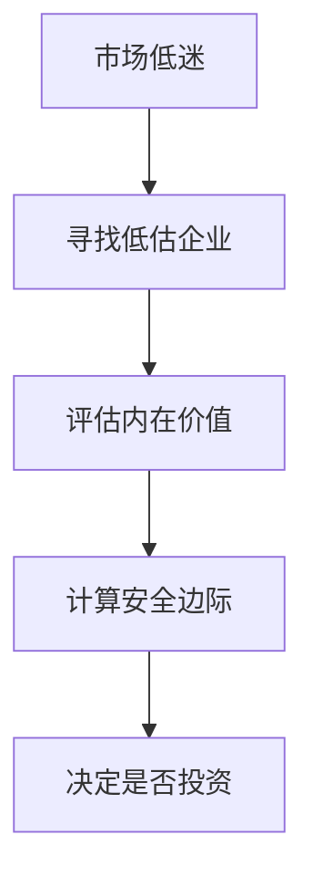
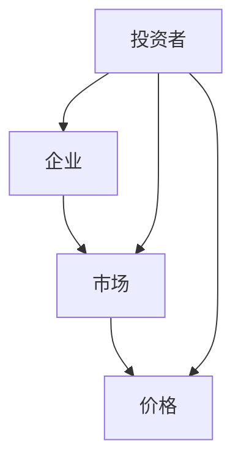
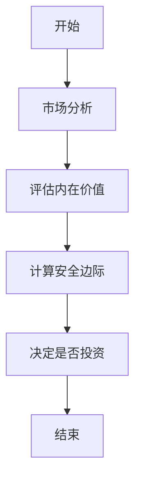
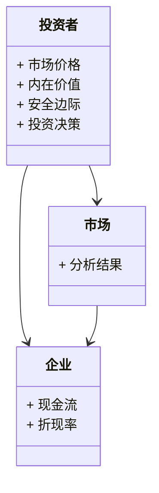
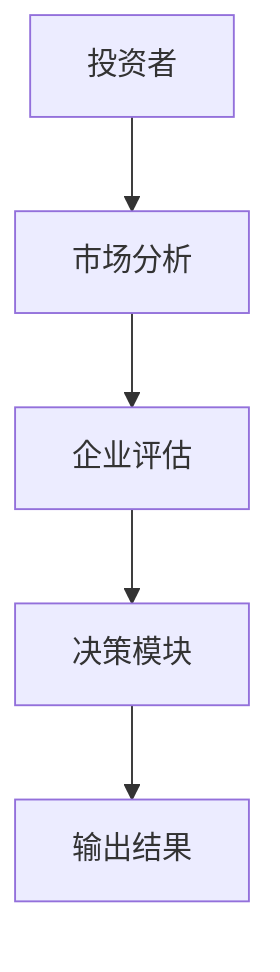

                 


# 芒格的"反向工程"思维在投资中的应用

> 关键词：芒格，反向工程，投资，安全边际，逆向思维，价值投资

> 摘要：本文深入探讨了芒格的“反向工程”思维在投资中的应用，从理论基础到实际案例，结合数学模型和系统架构，详细分析了如何利用这种思维方式在复杂市场环境中做出明智的投资决策。文章通过系统分析和实战案例，展示了如何构建投资决策系统，帮助投资者在不确定的市场中寻找价值。

---

# 第一部分: 芒格的"反向工程"思维概述

## 第1章: 芒格与"反向工程"思维的背景介绍

### 1.1 芒格投资理念的核心概念

#### 1.1.1 "反向工程"思维的定义
“反向工程”思维是一种逆向思考的投资策略，即通过分析企业的内在价值，寻找市场价格低于其内在价值的优质企业进行投资。这种思维方式强调从企业的基本面出发，寻找市场中的“便宜货”，而不是跟随市场的趋势或情绪。

#### 1.1.2 投资中的问题背景与问题描述
在传统投资中，许多人倾向于跟随市场趋势或依赖技术分析，这种正向思维容易受到市场波动和情绪的影响。然而，这种方法往往导致投资者在市场高点买入，在低点卖出。芒格通过“反向工程”思维，强调在市场恐慌时寻找低估的机会，在市场狂热时保持冷静。

#### 1.1.3 "反向工程"思维如何解决问题
通过关注企业的内在价值，芒格的“反向工程”思维帮助投资者在市场底部发现被低估的优质企业，避免了市场波动带来的短期损失，并能够在长期中获得超额收益。

#### 1.1.4 "反向工程"思维的边界与外延
“反向工程”思维的应用并非无限制。它适用于基本面稳定、具有持续竞争优势的企业，而不适合那些处于衰退期或缺乏竞争优势的企业。此外，这种思维需要结合市场的宏观经济环境进行调整。

#### 1.1.5 核心要素组成与概念结构
“反向工程”思维的核心要素包括：
- **内在价值**：企业未来现金流的现值。
- **市场价格**：当前市场上的交易价格。
- **安全边际**：内在价值与市场价格的差额。
- **竞争优势**：企业在行业中的竞争优势。

---

### 1.2 "反向工程"思维的核心原理

#### 1.2.1 安全边际的计算
安全边际是“反向工程”思维中的关键概念，它表示市场价格与内在价值之间的差距。安全边际越大，投资的风险越小。

公式：
$$ \text{安全边际} = \text{内在价值} - \text{市场价格} $$

#### 1.2.2 逆向思维在投资中的应用
芒格强调在市场低迷时寻找投资机会，而在市场繁荣时保持谨慎。这种逆向思维帮助投资者避免了追高杀跌的错误。

#### 1.2.3 投资者心态与决策偏差
投资者常常受到心理偏差的影响，如过度自信、从众心理等。芒格的“反向工程”思维提醒投资者保持独立思考，避免被市场情绪左右。

---

## 第1.3 芒格的“反向工程”思维的哲学基础

### 1.3.1 多元思维模型
芒格提倡建立多元思维模型，将多个学科的原理和方法结合起来，用于分析问题。这种思维方式帮助投资者更好地理解企业的内在价值和市场动态。

### 1.3.2 物理学思维
芒格将物理学的思维方式引入投资领域，强调通过分析企业的“重力”（即内在价值）来确定其在市场中的位置。

### 1.3.3 经济学视角下的“反向工程”
从经济学的角度来看，“反向工程”思维是一种通过分析供给与需求的关系，寻找市场失衡点的投资策略。

---

## 1.4 本章小结
芒格的“反向工程”思维是一种逆向思考的投资策略，通过关注企业的内在价值和市场价格的差异，帮助投资者在市场中找到低估的机会。这种思维需要结合多元思维模型和物理学思维，同时注意投资者心态和决策偏差的影响。

---

# 第二部分: "反向工程"思维的核心概念与联系

## 第2章: "反向工程"思维的核心概念原理

### 2.1 安全边际的数学模型与公式

#### 2.1.1 安全边际的定义公式
$$ \text{安全边际} = \text{内在价值} - \text{市场价格} $$

#### 2.1.2 安全边际的影响因素
- **内在价值**：企业未来现金流的现值。
- **市场价格**：当前市场上的交易价格。
- **行业环境**：宏观经济环境和行业趋势。
- **竞争优势**：企业在行业中的竞争优势。

#### 2.1.3 安全边际与投资风险的关系
安全边际越大，投资风险越小。当市场价格低于内在价值时，安全边际为正，投资风险较低。

---

### 2.2 逆向思维的决策树分析

#### 2.2.1 逆向思维的决策树构建


#### 2.2.2 决策树的数学模型
- 如果市场价格 < 内在价值，则投资。
- 如果市场价格 >= 内在价值，则等待。

---

### 2.3 "反向工程"思维的ER实体关系图



---

## 2.4 本章小结
“反向工程”思维的核心概念包括安全边际和逆向思维。安全边际是内在价值与市场价格的差额，逆向思维则是通过分析市场低迷时的机会来寻找投资标的。通过决策树和ER图，我们可以清晰地理解“反向工程”思维的应用过程。

---

# 第三部分: "反向工程"思维的算法原理讲解

## 第3章: "反向工程"思维的算法原理

### 3.1 "反向工程"思维的算法流程

#### 3.1.1 算法步骤
1. 分析市场环境，寻找低迷时期。
2. 评估目标企业的内在价值。
3. 计算安全边际。
4. 根据安全边际决定是否投资。

#### 3.1.2 算法流程图


---

### 3.2 安全边际的计算公式

#### 3.2.1 内在价值的计算
$$ \text{内在价值} = \sum_{t=1}^{n} \frac{CF_t}{(1+r)^t} $$
其中，$CF_t$ 是第 $t$ 年的现金流，$r$ 是折现率。

#### 3.2.2 安全边际的计算
$$ \text{安全边际} = \text{内在价值} - \text{市场价格} $$

---

## 3.3 算法的数学模型与代码实现

#### 3.3.1 计算内在价值的Python代码
```python
def calculate_intrinsic_value(cash_flows, discount_rate):
    n = len(cash_flows)
    intrinsic_value = 0
    for t in range(n):
        intrinsic_value += cash_flows[t] / (1 + discount_rate) ** t
    return intrinsic_value

# 示例
cash_flows = [100, 150, 200]
discount_rate = 0.1
iv = calculate_intrinsic_value(cash_flows, discount_rate)
print(f"内在价值: {iv}")
```

#### 3.3.2 计算安全边际的代码
```python
def calculate_margin_of_safety(intrinsic_value, market_price):
    return intrinsic_value - market_price

# 示例
iv = 500
mp = 400
mos = calculate_margin_of_safety(iv, mp)
print(f"安全边际: {mos}")
```

---

## 3.4 本章小结
“反向工程”思维的算法流程包括市场分析、内在价值计算、安全边际计算和投资决策。通过Python代码实现这些步骤，可以帮助投资者更好地量化分析。

---

# 第四部分: 系统分析与架构设计

## 第4章: 投资决策系统的设计

### 4.1 系统功能设计

#### 4.1.1 系统功能模块
1. **市场分析模块**：分析市场环境，识别低迷时期。
2. **内在价值计算模块**：计算目标企业的内在价值。
3. **安全边际计算模块**：计算安全边际。
4. **投资决策模块**：根据安全边际决定是否投资。

#### 4.1.2 系统功能设计类图


---

### 4.2 系统架构设计

#### 4.2.1 系统架构图


---

## 4.3 本章小结
投资决策系统的架构设计包括市场分析、企业评估、安全边际计算和投资决策四个模块。通过系统的模块化设计，投资者可以更高效地进行投资决策。

---

# 第五部分: 项目实战

## 第5章: 实战案例分析

### 5.1 案例背景

#### 5.1.1 项目介绍
假设当前市场低迷，寻找一家具有竞争优势的低估企业。

#### 5.1.2 环境分析
市场整体低迷，投资者情绪低落，企业估值被低估。

---

### 5.2 投资策略制定

#### 5.2.1 企业评估
1. 分析企业的现金流。
2. 计算内在价值。
3. 比较市场价格与内在价值。

#### 5.2.2 安全边际计算
$$ \text{安全边际} = \text{内在价值} - \text{市场价格} $$

---

### 5.3 投资决策与监控

#### 5.3.1 投资策略制定
如果安全边际为正，决定投资；否则，等待。

#### 5.3.2 投资监控
定期评估企业的内在价值和市场价格，调整投资策略。

---

## 5.4 本章小结
通过实战案例分析，我们可以看到“反向工程”思维在实际投资中的应用过程。从企业评估到安全边际计算，再到投资决策，每一步都需要细致的分析和计算。

---

# 第六部分: 总结与展望

## 第6章: 总结与展望

### 6.1 本章小结
芒格的“反向工程”思维是一种逆向思考的投资策略，通过分析企业的内在价值和市场价格的差异，寻找被低估的投资机会。这种思维结合了安全边际、逆向思维和多元思维模型，帮助投资者在复杂市场环境中做出明智的决策。

---

### 6.2 最佳实践 tips

#### 6.2.1 长期投资
“反向工程”思维强调长期投资，避免短期波动的影响。

#### 6.2.2 价值投资
寻找具有竞争优势的企业，关注内在价值而非市场价格。

#### 6.2.3 安全边际的重要性
安全边际是投资决策的关键因素，确保投资的风险可控。

---

### 6.3 未来展望
随着市场环境的变化，“反向工程”思维需要不断调整和优化。未来的研究可以结合更多学科的知识，提升投资决策的科学性和精确性。

---

## 6.4 本章小结
芒格的“反向工程”思维是一种强大的投资工具，通过逆向思维和安全边际的概念，帮助投资者在复杂市场中寻找机会。未来的研究可以进一步结合技术分析和大数据，提升投资决策的效率和准确性。

---

# 结语
芒格的“反向工程”思维是一种值得深入研究和实践的投资策略。通过系统的分析和实际案例的探讨，我们可以更好地理解其核心概念和应用方法。希望本文能够为投资者提供有价值的见解和启发，帮助他们在投资道路上走得更稳更远。

