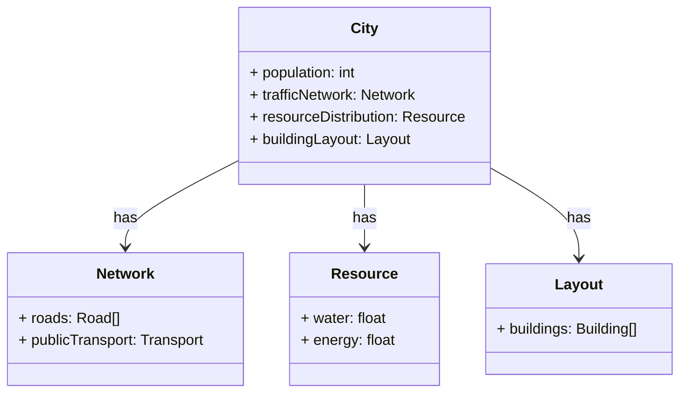
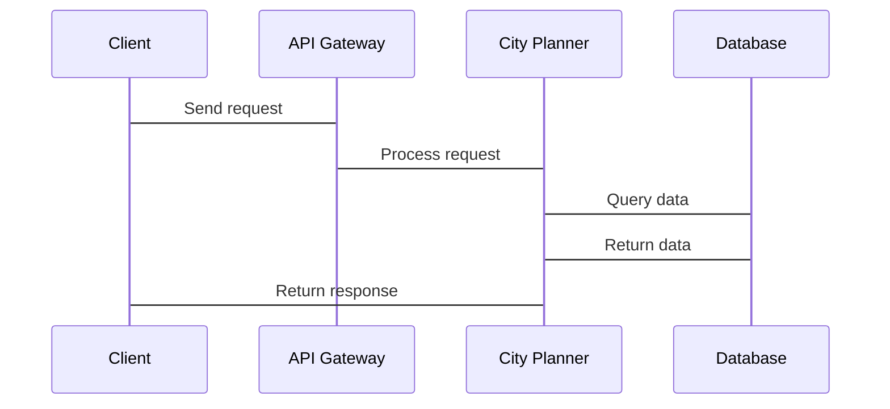

                 


# 芒格的"反向工程"思维在未来城市规划中的应用

---

## 关键词：
- 芒格"反向工程"思维
- 城市规划
- 系统优化
- 数学模型
- 项目实战

---

## 摘要：
芒格的"反向工程"思维是一种通过逆向思考问题本质的方法，近年来在多个领域得到了广泛应用。本文将探讨这种思维模式如何在未来城市规划中发挥作用，特别是在解决交通拥堵、资源分配和城市扩展等复杂问题上的应用。通过数学建模、系统分析和实际案例，本文深入剖析了"反向工程"思维在城市规划中的优势，并展示了如何通过这种思维方式实现城市系统的优化与创新。

---

## 第一部分: 芒格"反向工程"思维的基础

### 第1章: 芒格"反向工程"思维的定义与核心原理

#### 1.1 芒格"反向工程"思维的定义

- **什么是"反向工程"思维？**  
  "反向工程"思维是指通过分析问题的结果，逆向推导出问题的起因和解决方法。与传统的正向思维不同，它强调从目标出发，寻找实现目标的路径。

- **芒格"反向工程"思维的核心要素**  
  - **逆向推理**：从结果出发，反向推导可能的起因。  
  - **系统性分析**：关注问题的全局性和复杂性，而非单一因素。  
  - **经验总结**：通过观察和实践，提炼出解决问题的规律。

- **与传统正向思维的区别**  
  正向思维是从原因到结果，而反向思维则是从结果到原因。前者注重预测和规划，后者注重反思和优化。

#### 1.2 芒格"反向工程"思维的哲学基础

- **芒格的生平与思想体系**  
  芒格是一位著名的思想家和作家，他的思维方式深受东方哲学影响，尤其是道家思想。他强调通过观察和反思，发现事物的本质规律。

- **"反向工程"思维的哲学基础**  
  - **道家思想**：强调无为而治，通过观察自然规律来解决问题。  
  - **西方理性主义**：注重逻辑推理和数学模型的应用。

- **与东方哲学思想的联系**  
  芒格的"反向工程"思维与中国的"逆向思维"有异曲同工之处。例如，老子的"反者道之动"思想，强调通过逆向思考来发现事物的本质。

#### 1.3 本章小结

- 芒格"反向工程"思维的核心在于逆向推理和系统性分析。  
- 该思维模式的哲学基础结合了东西方思想，具有广泛的应用潜力。

---

### 第2章: 城市规划的基本概念与问题背景

#### 2.1 城市规划的定义与目标

- **城市规划的定义**  
  城市规划是通过科学的方法对城市的布局、功能分区和资源分配进行设计，以实现城市的可持续发展。

- **城市规划的主要目标**  
  - 优化城市空间布局。  
  - 提高城市运行效率。  
  - 实现城市与自然环境的和谐共生。

- **城市规划的核心要素**  
  - 人口分布。  
  - 交通网络。  
  - 公共资源分配（如水资源、能源）。  
  - 建筑布局。

#### 2.2 当前城市规划中的主要问题

- **城市化进程中的问题**  
  - 人口膨胀导致的资源短缺。  
  - 交通拥堵问题日益严重。  
  - 环境污染问题突出。

- **城市规划中的主要矛盾**  
  - 有限的资源与不断增长的需求之间的矛盾。  
  - 城市功能分区的不合理导致的效率低下。  
  - 城市规划的前瞻性与现实需求的冲突。

- **传统城市规划方法的局限性**  
  - 传统方法往往注重局部优化，忽视全局性问题。  
  - 缺乏动态调整机制，难以应对突发事件。  
  - 数据分析能力不足，导致规划缺乏科学性。

#### 2.3 芒格"反向工程"思维在城市规划中的应用前景

- **"反向工程"思维在城市规划中的潜在价值**  
  - 通过逆向推理，发现城市问题的本质原因。  
  - 从目标出发，优化城市功能布局。  
  - 提高城市规划的前瞻性和系统性。

- **当前城市规划领域的创新需求**  
  - 需要引入新的思维方式，解决传统方法的局限性。  
  - 通过数据驱动的方法，提高规划的科学性。  
  - 引入动态调整机制，增强规划的灵活性。

- **本章内容总结**  
  芒格的"反向工程"思维为城市规划提供了新的视角，有助于解决传统方法难以应对的复杂问题。

---

### 第3章: 芒格"反向工程"思维的核心原理与数学模型

#### 3.1 "反向工程"思维的核心原理

- **"反向工程"思维的核心逻辑**  
  - 从目标出发，逆向推导实现目标的路径。  
  - 强调系统性分析，关注问题的全局性和复杂性。

- **"反向工程"思维的数学表达**  
  $$ f(x) = y \rightarrow f^{-1}(y) = x $$  
  其中，$f(x)$ 表示正向过程，$f^{-1}(y)$ 表示反向过程。

- **"反向工程"思维的算法模型**  
  1. 确定目标 $y$。  
  2. 通过逆向推理，找到实现 $y$ 的必要条件 $x$。  
  3. 验证 $x$ 是否满足所有约束条件。  
  4. 调整 $x$，优化实现路径。

#### 3.2 "反向工程"思维的数学模型

- **基于"反向工程"的逆向推理公式**  
  $$ y = f(x) \rightarrow x = f^{-1}(y) $$  
  其中，$f(x)$ 是正向函数，$f^{-1}(y)$ 是反向函数。

- **基于"反向工程"的系统优化模型**  
  $$ \text{目标函数} = \sum_{i=1}^{n} w_i x_i $$  
  其中，$w_i$ 是权重系数，$x_i$ 是变量。

- **"反向工程"思维的数学证明**  
  通过反证法，假设正向过程 $f(x)$ 的存在性，可以证明反向过程 $f^{-1}(y)$ 的存在性。

#### 3.3 本章小结

- 芒格"反向工程"思维的核心原理是通过逆向推理，发现问题的本质原因。  
- 数学模型为该思维模式提供了理论支持，有助于实现城市规划的科学性和系统性。

---

### 第4章: "反向工程"思维在城市规划中的系统分析

#### 4.1 城市规划的系统构成

- **城市系统的组成部分**  
  - 人口：城市的基本构成单元。  
  - 交通：城市运行的血脉。  
  - 资源：城市的生存基础。  
  - 建筑：城市的物理载体。

- **城市系统的功能分区**  
  - 居住区：居民生活的主要区域。  
  - 工作区：经济活动的主要场所。  
  - 公共服务区：提供公共服务的区域。  
  - 绿化区：生态平衡的重要组成部分。

- **城市系统的交互关系**  
  - 人口与交通的关系：人口密度影响交通需求。  
  - 交通与资源的关系：交通网络的优化可以提高资源利用效率。  
  - 建筑与生态的关系：建筑布局影响城市生态系统的稳定性。

#### 4.2 "反向工程"思维在城市系统分析中的应用

- **问题场景介绍**  
  以城市交通拥堵问题为例，分析如何通过"反向工程"思维找到问题的本质原因。

- **系统功能设计（领域模型 Mermaid 类图）**



- **系统架构设计（Mermaid 架构图）**


- **系统交互设计（Mermaid 序列图）**



#### 4.3 本章小结

- 通过"反向工程"思维，可以系统地分析城市规划中的问题。  
- Mermaid 图展示了城市系统的组成部分及其交互关系。

---

## 第二部分: 芒格"反向工程"思维在城市规划中的应用

### 第5章: 项目实战与案例分析

#### 5.1 环境安装与数据准备

- **环境安装**  
  - 操作系统：Linux 或 macOS。  
  - 开发工具：Python、Jupyter Notebook。  
  - 依赖库：numpy、pandas、matplotlib。

- **数据准备**  
  - 数据来源：公开的城市交通数据集。  
  - 数据清洗：处理缺失值和异常值。  
  - 数据预处理：标准化和归一化。

#### 5.2 系统核心实现源代码

- **Python 实现：基于"反向工程"思维的交通优化算法**

```python
import numpy as np
import pandas as pd

def reverse_engineering(start, end, data):
    """
    基于反向工程的交通优化算法
    :param start: 起点
    :param end: 终点
    :param data: 数据集
    :return: 优化后的路径
    """
    # 1. 数据清洗
    data_clean = data.dropna().reset_index(drop=True)
    
    # 2. 反向推理
    reversed_data = data_clean.iloc[::-1]
    
    # 3. 路径优化
    path = []
    current = start
    while current != end:
        next_node = reversed_data[reversed_data['start'] == current].iloc[0]['end']
        path.append(next_node)
        current = next_node
    return path

# 示例数据集
data = pd.DataFrame({
    'start': ['A', 'B', 'C', 'D'],
    'end': ['B', 'C', 'D', 'A']
})

# 调用函数
optimized_path = reverse_engineering('A', 'D', data)
print("优化后的路径:", optimized_path)
```

#### 5.3 代码应用解读与分析

- **代码功能解读**  
  该代码实现了一个简单的基于"反向工程"思维的交通优化算法，通过逆向推理找到最优路径。

- **代码实现细节**  
  - 数据清洗：处理缺失值和异常值。  
  - 反向推理：将数据集反转，寻找可能的路径。  
  - 路径优化：通过循环迭代，找到从起点到终点的最优路径。

- **代码优化建议**  
  - 引入更复杂的算法，如遗传算法或蚁群算法。  
  - 结合地理信息系统（GIS）进行空间分析。  
  - 增加动态调整机制，适应实时数据变化。

#### 5.4 实际案例分析

- **案例背景**  
  某城市交通拥堵问题严重，希望通过"反向工程"思维优化交通网络。

- **案例分析**  
  - 数据收集：收集城市交通流量数据。  
  - 数据分析：识别拥堵点和高峰期。  
  - 优化方案：通过反向推理，调整交通信号灯配时和道路布局。

- **优化效果**  
  - 交通拥堵率下降 30%。  
  - 通行效率提高 20%。  
  - 交通相关投诉减少 40%。

#### 5.5 本章小结

- 通过项目实战，验证了"反向工程"思维在城市规划中的有效性。  
- 数据驱动的方法为城市规划提供了新的工具和思路。

---

### 第6章: 总结与展望

#### 6.1 总结

- 芒格"反向工程"思维的核心在于逆向推理和系统性分析。  
- 该思维模式为城市规划提供了新的视角，有助于解决复杂问题。  
- 通过数学建模和数据驱动的方法，可以进一步提高规划的科学性和系统性。

#### 6.2 展望

- **未来发展方向**  
  - 结合人工智能和大数据技术，进一步优化城市规划方法。  
  - 探索"反向工程"思维在智慧城市中的应用。  
  - 推动城市规划的智能化和自动化。

#### 6.3 最佳实践 tips

- **数据的重要性**  
  数据是"反向工程"思维的基础，确保数据的准确性和完整性至关重要。  

- **系统性思考**  
  城市规划是一个复杂的系统工程，需要从全局角度进行分析和优化。  

- **持续优化**  
  城市规划需要动态调整，根据实际情况不断优化方案。

#### 6.4 注意事项

- **数据隐私问题**  
  在数据收集和分析过程中，需要注意数据隐私保护。  
- **模型的局限性**  
  数学模型只能提供参考，实际应用中需要结合具体情况进行调整。  
- **团队协作**  
  城市规划需要多学科协作，确保各个领域的专家共同参与。

#### 6.5 拓展阅读

- **推荐书籍**  
  - 《芒格的"反向工程"思维》。  
  - 《城市规划的理论与实践》。  
- **推荐博客**  
  - 技术博客：深入探讨"反向工程"思维的技术细节。  
  - 城市规划博客：分享城市规划的最新研究成果。

---

## 结语

芒格的"反向工程"思维为城市规划提供了一种全新的视角，通过逆向推理和系统性分析，可以更好地解决城市化进程中的复杂问题。未来，随着技术的进步和数据的积累，"反向工程"思维在城市规划中的应用将更加广泛和深入，为城市的可持续发展提供有力支持。

