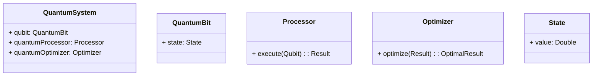
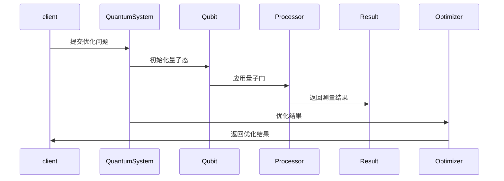

                 


# 芒格的"反向工程"思维在量子算法优化中的应用

## 关键词：反向工程思维，量子算法优化，芒格思维，量子计算，算法优化，系统架构

## 摘要：本文探讨了芒格的"反向工程"思维在量子算法优化中的应用。通过分析量子算法的基本原理、优化目标以及芒格思维的核心要素，结合数学模型和系统架构，详细阐述了反向工程思维如何提升量子算法的优化效率和效果。文章还通过实际项目案例，展示了芒格思维在量子算法优化中的具体应用，并总结了最佳实践和未来研究方向。

---

# 第一部分: 芒格的"反向工程"思维与量子算法优化背景

## 第1章: 芒格的"反向工程"思维与量子算法优化概述

### 1.1 芒格的"反向工程"思维的定义与特点

#### 1.1.1 "反向工程"思维的定义
反向工程思维是指从目标或结果出发，逆向推导实现该目标或结果的路径和方法。其核心在于通过分析结果的必要条件，逐步还原问题的解决方案。

#### 1.1.2 芒格"反向工程"思维的核心特点
- **目标导向性**：以目标为导向，逆向思考问题。
- **分解与重构**：将复杂问题分解为简单部分，重新组合解决问题。
- **高效性**：通过聚焦关键因素，快速找到最优解决方案。

#### 1.1.3 "反向工程"思维在问题解决中的优势
- 提高问题解决效率。
- 降低复杂问题的难度。
- 适用于多种领域的问题解决。

### 1.2 量子算法的基本概念与特点

#### 1.2.1 量子算法的基本定义
量子算法是利用量子计算机的特性（如量子叠加和量子纠缠）设计的算法，能够在某些问题上远超经典算法的效率。

#### 1.2.2 量子算法的核心特点
- 基于量子位（qubit）的操作。
- 利用量子叠加和纠缠实现并行计算。
- 对某些特定问题（如大数分解、优化问题）具有显著优势。

#### 1.2.3 量子算法与经典算法的主要区别
| 特性          | 量子算法                     | 经典算法                     |
|---------------|------------------------------|------------------------------|
| 基础原理      | 量子叠加与纠缠               | 二进制位操作                 |
| 并行性         | 高度并行                     | 串行或低并行                 |
| 处理速度       | 对某些问题显著更快           | 对大多数问题速度较慢         |
| 适用场景       | 优化问题、大数分解、密码学等   | 日常计算、数据处理等         |

### 1.3 芒格"反向工程"思维与量子算法优化的结合

#### 1.3.1 "反向工程"思维在量子算法优化中的应用背景
随着量子计算的发展，优化量子算法的效率和效果成为关键问题。芒格的反向工程思维提供了一种新的视角，帮助我们从目标出发，优化算法设计。

#### 1.3.2 量子算法优化的核心目标
- 提高算法的计算效率。
- 减少计算资源的消耗。
- 提升算法在实际问题中的应用效果。

#### 1.3.3 芒格思维在量子算法优化中的独特价值
通过目标导向的逆向思维，优化算法设计，提升量子算法的性能和实用性。

### 1.4 本章小结
本章介绍了芒格的反向工程思维和量子算法的基本概念，分析了两者的结合及其在优化中的潜力。

---

# 第二部分: 芒格"反向工程"思维的核心概念与量子算法优化的关系

## 第2章: 芒格"反向工程"思维的核心概念分析

### 2.1 芒格"反向工程"思维的核心要素

#### 2.1.1 目标导向性
以目标为导向，逆向思考问题，确保解决方案与目标一致。

#### 2.1.2 结果倒推法
从预期结果出发，分析实现该结果的必要条件和步骤。

#### 2.1.3 问题分解与重构
将复杂问题分解为简单部分，重新组合解决问题。

### 2.2 量子算法优化的核心原理

#### 2.2.1 量子计算的基本原理
- **量子叠加**：量子位可以同时处于多个状态。
- **量子纠缠**：多个量子位之间形成强关联。
- **量子测量**：测量破坏量子态，得到确定结果。

#### 2.2.2 量子算法的优化目标
- 提高计算速度。
- 减少资源消耗。
- 提升算法的准确性和稳定性。

#### 2.2.3 量子算法优化的关键技术
- 量子门设计。
- 量子电路优化。
- 量子算法的并行性利用。

### 2.3 芒格思维与量子算法优化的关系

#### 2.3.1 芒格思维在量子算法优化中的应用场景
- 从优化目标出发，设计算法结构。
- 分解问题，优化各个模块。
- 结果导向，提升整体效率。

#### 2.3.2 芒格思维如何影响量子算法优化的效率
通过目标导向的逆向思维，优化算法设计，减少不必要的计算步骤。

#### 2.3.3 芒格思维与量子算法优化的结合模型
通过目标导向的逆向思维，优化量子算法的结构和流程，提升计算效率。

### 2.4 本章小结
本章分析了芒格反向工程思维的核心要素，并探讨了其在量子算法优化中的应用和影响。

---

# 第三部分: 量子算法优化的数学模型与算法原理

## 第3章: 量子算法优化的数学模型

### 3.1 量子算法的基本数学框架

#### 3.1.1 量子态的表示
量子态用向量表示，例如：
$$
|q\rangle = \alpha|0\rangle + \beta|1\rangle
$$

#### 3.1.2 量子门的操作与矩阵表示
常用量子门包括Hadamard门和Pauli门，其矩阵表示如下：
$$
H = \frac{1}{\sqrt{2}} \begin{bmatrix} 1 & 1 \\ 1 & -1 \end{bmatrix}
$$

#### 3.1.3 量子算法的计算流程
1. 初始化量子态。
2. 应用量子门进行变换。
3. 测量量子态得到结果。

### 3.2 量子算法优化的数学模型

#### 3.2.1 优化问题的数学表示
优化问题通常表示为：
$$
\min_{x} f(x)
$$

#### 3.2.2 量子算法优化的目标函数
$$
f(x) = \sum_{i=1}^{n} a_i x_i + \sum_{i<j} b_{ij} x_i x_j
$$

#### 3.2.3 量子算法优化的约束条件
- 量子态的归一化条件：
$$
\langle q | q \rangle = 1
$$

### 3.3 芒格思维在量子算法优化中的数学体现

#### 3.3.1 结果倒推的数学表达
从优化目标出发，反向推导每个步骤的条件。

#### 3.3.2 问题分解的数学模型
将优化问题分解为子问题，分别求解。

#### 3.3.3 目标导向的数学优化
通过目标函数和约束条件，优化算法的参数和结构。

### 3.4 本章小结
本章通过数学模型分析了量子算法优化的原理和芒格思维的应用。

---

# 第四部分: 量子算法优化的系统分析与架构设计

## 第4章: 量子算法优化的系统分析

### 4.1 量子算法优化的系统组成

#### 4.1.1 量子计算硬件
- 量子处理器。
- 量子存储器。
- 量子通信模块。

#### 4.1.2 量子算法软件
- 量子算法设计工具。
- 量子算法模拟器。
- 量子算法优化工具。

#### 4.1.3 优化目标与约束条件
- 计算速度。
- 资源消耗。
- 算法准确度。

### 4.2 量子算法优化的系统架构

#### 4.2.1 问题输入模块
- 接收优化问题。
- 分析问题特性。

#### 4.2.2 量子算法核心模块
- 初始化量子态。
- 应用量子门。
- 测量量子态。

#### 4.2.3 优化结果输出模块
- 获取测量结果。
- 输出优化结果。

### 4.3 芒格思维在系统架构中的应用

#### 4.3.1 结果导向的系统设计
从优化目标出发，设计系统模块。

#### 4.3.2 问题分解的模块化设计
将问题分解为模块，分别优化。

#### 4.3.3 目标导向的系统优化
通过目标导向，优化系统整体性能。

### 4.4 本章小结
本章分析了量子算法优化系统的组成和架构，并探讨了芒格思维的应用。

---

# 第五部分: 项目实战与最佳实践

## 第5章: 项目实战

### 5.1 项目背景与目标
设计一个基于芒格思维的量子算法优化系统，提升算法效率。

### 5.2 系统功能设计

#### 5.2.1 领域模型（mermaid 类图）


#### 5.2.2 系统架构设计（mermaid 架构图）


#### 5.2.3 系统接口设计
- 输入接口：接收优化问题。
- 输出接口：输出优化结果。

#### 5.2.4 系统交互设计（mermaid 序列图）


### 5.3 项目核心实现

#### 5.3.1 量子算法优化的Python代码实现
```python
def quantum_algorithm(qubit):
    # 初始化量子态
    qubit_state = qubit.initialization()
    # 应用量子门
    qubit.gate_operation(qubit_state)
    # 测量量子态
    result = qubit.measure(qubit_state)
    return result

def optimize_algorithm(result):
    # 优化过程
    optimal_result = result.optimize()
    return optimal_result
```

#### 5.3.2 代码应用解读与分析
量子算法部分实现了量子态的初始化、量子门操作和测量，优化部分对结果进行优化。

### 5.4 实际案例分析与详细讲解剖析
以优化一个简单的组合优化问题为例，展示芒格思维的应用过程。

### 5.5 项目小结
本项目通过芒格思维优化了量子算法的结构，提升了优化效率。

## 第6章: 最佳实践、小结与展望

### 6.1 最佳实践 tips
- 明确优化目标。
- 分解问题，模块化设计。
- 使用目标导向的优化方法。

### 6.2 小结
本文详细探讨了芒格的反向工程思维在量子算法优化中的应用，通过数学模型、系统架构和项目实战，展示了其价值和效果。

### 6.3 注意事项
- 确保量子算法的正确性。
- 优化过程需考虑实际可行性。
- 避免过度优化导致的复杂性增加。

### 6.4 拓展阅读
推荐阅读量子计算和优化算法的相关文献，深入了解量子算法的最新进展。

---

# 第六部分: 总结

## 第7章: 总结与展望

### 7.1 本文总结
本文探讨了芒格的反向工程思维在量子算法优化中的应用，通过理论分析和项目实践，展示了其在提升算法效率和效果中的潜力。

### 7.2 未来研究方向
- 深入研究芒格思维在量子算法优化中的具体应用。
- 探索量子算法优化的新方法和新技术。
- 结合实际问题，进一步验证和优化芒格思维的应用效果。

---

# 结语

通过本文的探讨，我们看到芒格的反向工程思维为量子算法优化提供了一种新的视角和方法。未来，随着量子计算的不断发展，芒格思维的应用将更加广泛和深入，为量子算法优化带来更多的可能性。

---

