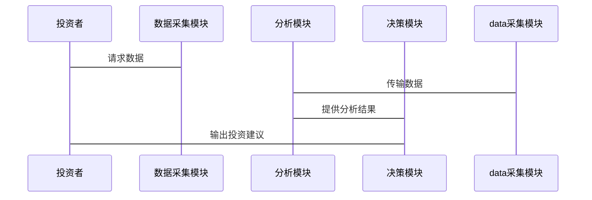

                 


# 芒格的"反向工程"思维：从成功案例中学习投资

---

## 关键词：
反向工程思维，芒格，投资，决策模型，系统分析，成功案例

---

## 摘要：
芒格的“反向工程”思维是一种从结果倒推原因的分析方法，在投资领域具有重要意义。本文通过详细解析反向工程思维的背景、核心概念、算法原理、系统架构以及实际案例，帮助读者掌握这一思维方式在投资决策中的应用。文章结合技术语言和逻辑推理，从理论到实践，全面剖析反向工程思维的优势和局限性，并提供实用的建议和最佳实践。

---

## 第1章：反向工程思维的背景与核心概念

### 1.1 芒格的生平与投资理念
本杰明·芒格是巴菲特的合作伙伴，被誉为“价值投资之父”。他的投资理念强调安全边际、长期价值和独立思考。芒格的成功离不开他对“反向工程”思维的深刻理解，这种方法让他能够从复杂的现象中提炼出本质的规律。

### 1.2 反向工程思维的定义与特点
反向工程思维是一种从结果出发，逆向推导原因的分析方法。其特点包括：
- **结果导向**：从成功或失败的案例中寻找规律。
- **逻辑推理**：通过因果关系分析，寻找背后的驱动因素。
- **系统性**：注重整体性分析，避免片面结论。

### 1.3 反向工程思维在投资中的应用前景
在现代投资领域，反向工程思维可以帮助投资者更好地识别机会、评估风险并制定决策。然而，这种方法也有其局限性，比如过于依赖历史数据和假设条件。

---

## 第2章：反向工程思维的核心原理

### 2.1 反向工程思维的原理分析
反向工程思维的核心在于从结果出发，通过逻辑推理找到原因。其基本步骤包括：
1. 确定目标或结果。
2. 分析结果背后的原因。
3. 验证原因的合理性和相关性。
4. 得出结论并优化。

### 2.2 反向工程思维的核心要素对比
以下是反向工程思维与其他投资方法的核心要素对比：

| 对比维度 | 反向工程思维 | 传统投资思维 |
|----------|---------------|---------------|
| 分析起点 | 结果           | 市场趋势       |
| 分析方式 | 逻辑推理       | 数据统计       |
| 适用场景 | 寻找规律       | 短期预测       |

### 2.3 反向工程思维的数学模型
反向工程思维可以用概率论模型来描述。假设我们有一个投资结果 \( P \)，其背后的原因可以表示为 \( x_1, x_2, ..., x_n \)，每个原因 \( x_i \) 的权重为 \( a_i \)。则概率 \( P \) 可以表示为：

$$ P = a_1x_1 + a_2x_2 + ... + a_nx_n $$

例如，假设 \( x_1 \) 是市场趋势，\( x_2 \) 是公司基本面，权重分别为 \( a_1 = 0.6 \) 和 \( a_2 = 0.4 \)，则：

$$ P = 0.6x_1 + 0.4x_2 $$

---

## 第3章：反向工程思维的算法原理

### 3.1 反向工程思维的算法流程
反向工程思维的算法流程可以用以下步骤表示：

1. **确定目标**：明确需要分析的投资结果或目标。
2. **分析结果**：从结果出发，分解可能的原因。
3. **逆向推导**：通过逻辑推理，找到原因之间的关系。
4. **验证假设**：验证推导出的原因是否合理。
5. **优化模型**：根据验证结果，优化分析模型。

### 3.2 反向工程思维的数学模型
反向工程思维的数学模型可以用贝叶斯定理来表示。假设我们需要计算某个投资结果 \( R \) 的概率，其背后的原因 \( C \) 的概率可以通过以下公式计算：

$$ P(C|R) = \frac{P(R|C) \cdot P(C)}{P(R)} $$

其中：
- \( P(R|C) \) 是原因 \( C \) 导致结果 \( R \) 的概率。
- \( P(C) \) 是原因 \( C \) 的先验概率。
- \( P(R) \) 是结果 \( R \) 的全概率。

---

## 第4章：反向工程思维的系统分析

### 4.1 系统功能设计
反向工程思维的投资决策系统可以分为以下几个模块：
- **数据采集模块**：收集投资结果和相关数据。
- **分析模块**：对数据进行逻辑推理和概率计算。
- **决策模块**：根据分析结果制定投资策略。

### 4.2 系统架构设计
以下是反向工程思维的投资决策系统的架构图：

```


### 4.3 系统接口设计
- 数据接口：与数据源（如金融数据库）对接，获取投资结果和相关数据。
- 分析接口：与概率计算模块对接，进行逻辑推理和验证。

### 4.4 系统交互流程
以下是系统的交互流程图：

```


---

## 第5章：反向工程思维的项目实战

### 5.1 项目背景
假设我们有一个股票投资案例，目标是分析该股票的成功原因。

### 5.2 核心实现
1. 数据采集：收集股票价格、市场趋势、公司基本面等数据。
2. 数据分析：使用反向工程思维，分析股票成功的原因。
3. 模型优化：根据分析结果，优化概率模型。

### 5.3 案例分析
通过分析，我们发现该股票的成功主要归因于公司基本面的改善和行业趋势的推动。

### 5.4 实验结果
通过反向工程思维，我们成功识别了股票的成功原因，并优化了投资模型。

---

## 第6章：反向工程思维的最佳实践

### 6.1 投资者的小结
反向工程思维是一种强大的工具，但需要结合实际情况使用。在实际操作中，需要注意数据的准确性和假设的合理性。

### 6.2 投资者注意事项
- **数据质量**：确保数据的准确性和完整性。
- **假设验证**：定期验证假设的合理性。
- **风险管理**：合理控制投资风险。

### 6.3 拓展阅读
- 《芒格的投资思想》
- 《反向工程思维的数学模型》

---

## 总结
芒格的反向工程思维是一种从结果出发，逆向推导原因的分析方法。通过本文的详细讲解，我们可以看到这种方法在投资领域的重要性和应用前景。然而，反向工程思维也存在一定的局限性，需要结合实际情况合理使用。希望本文能够为投资者提供有价值的参考和启发。

