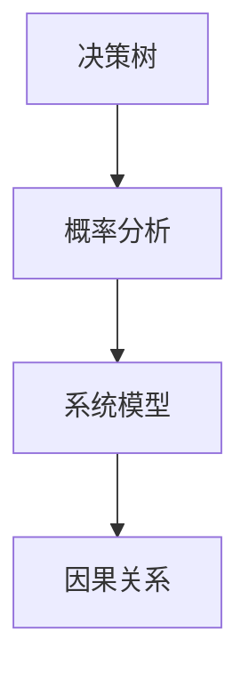

                 


# 芒格的"反向工程"思维：从结果倒推原因

> 关键词：反向工程，芒格思维，系统性思维，模型构建，算法设计，系统架构

> 摘要：本文深入探讨芒格的"反向工程"思维，从结果倒推原因的系统性思维方法。通过分析其核心概念、算法原理、系统架构以及实际项目案例，揭示反向工程思维在商业、科学和技术领域中的广泛应用与实践。本文旨在帮助读者掌握这一思维方式，并将其应用于复杂问题的解决中。

---

## 目录

1. [反向工程思维的背景与概念](#反向工程思维的背景与概念)
   - 1.1 反向工程思维的起源
   - 1.2 芒格思维的定义与特点
   - 1.3 芒格思维的应用领域
   - 1.4 芒格思维的哲学基础

2. [反向工程思维的核心模型](#反向工程思维的核心模型)
   - 2.1 芒格思维的核心模型
   - 2.2 芒格思维的模型构建
   - 2.3 芒格思维的模型应用
   - 2.4 芒格思维的模型对比

3. [反向工程思维的算法原理](#反向工程思维的算法原理)
   - 3.1 芒格思维的算法框架
   - 3.2 芒格思维的数学模型
   - 3.3 芒格思维的算法实现
   - 3.4 芒格思维的算法对比

4. [反向工程思维的系统分析与架构设计](#反向工程思维的系统分析与架构设计)
   - 4.1 系统分析的步骤
   - 4.2 系统架构的设计
   - 4.3 系统接口设计
   - 4.4 系统交互设计

5. [反向工程思维的项目实战](#反向工程思维的项目实战)
   - 5.1 项目背景与目标
   - 5.2 系统功能设计
   - 5.3 系统架构实现
   - 5.4 项目总结与优化

6. [总结与展望](#总结与展望)
   - 6.1 总结
   - 6.2 展望

---

## 1. 反向工程思维的背景与概念

### 1.1 反向工程思维的起源

反向工程思维是一种从结果出发，逆向推导原因或过程的思维方式。它与传统的正向思维（从原因推导结果）相对，具有独特的逻辑框架。芒格作为投资大师，将这种思维应用于商业决策和投资分析中，取得了显著成效。

#### 1.1.1 传统正向思维的局限性

传统的正向思维在面对复杂问题时常常显得力不从心。例如，在商业投资中，我们通常从市场分析、成本计算等正向因素出发，但这种方法难以预测和应对不可预见的风险和变化。

#### 1.1.2 芒格思维的提出背景

芒格在投资实践中发现，正向思维在面对不确定性时存在诸多限制。他提出反向工程思维，通过分析投资结果（如股价波动、市场反应等），逆向推导出潜在的影响因素。

#### 1.1.3 反向工程思维的核心理念

反向工程思维的核心理念是通过观察结果，推导出导致该结果的原因或过程。这种方法特别适用于复杂系统分析，能够帮助我们发现隐藏的逻辑关系。

### 1.2 芒格思维的定义与特点

#### 1.2.1 芒格思维的定义

芒格思维是一种基于反向工程的思维方式，强调从结果出发，逆向分析问题，以发现潜在的因果关系和系统结构。

#### 1.2.2 芒格思维的特点

- **逆向性**：从结果出发，逆向推导原因。
- **系统性**：注重整体结构和各部分之间的关系。
- **实用性**：适用于复杂问题的分析与解决。

#### 1.2.3 芒格思维与其他思维的区别

| 特性 | 正向思维 | 反向工程思维 |
|------|----------|--------------|
| 输入 | 原因     | 结果         |
| 输出 | 结果     | 原因         |
| 适用场景 | 预测未来 | 分析现状     |

### 1.3 芒格思维的应用领域

- **商业与投资**：分析市场波动、投资回报等结果，推导影响因素。
- **科学与技术**：逆向分析实验结果，推导实验设计。
- **个人成长**：从目标倒推实现路径。

### 1.4 芒格思维的哲学基础

- **哲学中的逆向思维**：强调从现象到本质的分析过程。
- **逻辑框架**：芒格思维基于逻辑推理，强调因果关系的分析。
- **东方哲学联系**：与《道德经》中的“逆向而行”思想有相似之处。

---

## 2. 反向工程思维的核心模型

### 2.1 芒格思维的核心模型

芒格思维的核心模型包括以下几种：

1. **决策树模型**：用于分析决策的可能结果和概率。
2. **概率论模型**：通过概率分析结果的可能性。
3. **系统模型**：分析系统各部分之间的相互关系。

#### 2.1.1 芒格思维核心模型的 mermaid 图



### 2.2 芒格思维的模型构建

#### 2.2.1 模型构建的步骤

1. 确定目标：明确分析的目标。
2. 收集数据：收集相关数据和信息。
3. 构建模型：根据数据构建模型。
4. 验证与优化：验证模型的准确性，并进行优化。

#### 2.2.2 模型构建的关键要素

| 要素 | 描述 |
|------|------|
| 数据来源 | 分析结果的数据来源 |
| 模型类型 | 模型的类型（如决策树、概率模型） |
| 参数设置 | 模型的参数设置 |

### 2.3 芒格思维的模型应用

#### 2.3.1 投资分析中的应用

在投资分析中，芒格思维可以帮助投资者分析市场波动的原因，从而做出更明智的投资决策。

#### 2.3.2 决策优化中的应用

通过分析决策结果，优化决策过程，提高决策的准确性。

### 2.4 芒格思维的模型对比

| 模型 | 优点 | 局限性 |
|------|------|--------|
| 决策树模型 | 明确因果关系 | 依赖数据准确性 |
| 概率论模型 | 考虑不确定性 | 计算复杂 |
| 系统模型 | 全面分析 | 需要大量数据 |

---

## 3. 反向工程思维的算法原理

### 3.1 芒格思维的算法框架

反向工程思维的算法框架包括以下步骤：

1. 输入结果。
2. 分析原因。
3. 推导过程。
4. 输出结论。

#### 3.1.1 算法的输入与输出

- **输入**：结果数据。
- **输出**：原因或过程。

#### 3.1.2 算法的优化方向

- 提高算法的效率。
- 提高算法的准确性。

### 3.2 芒格思维的数学模型

#### 3.2.1 数学模型的定义

数学模型是反向工程思维的核心工具之一，用于描述问题的数学关系。

#### 3.2.2 数学模型的构建过程

1. 确定变量。
2. 建立方程。
3. 解方程。

#### 3.2.3 数学模型的验证与优化

通过实验数据验证模型的准确性，并根据验证结果进行优化。

### 3.3 芒格思维的算法实现

#### 3.3.1 算法实现的步骤

1. 收集数据。
2. 建立模型。
3. 运行算法。
4. 验证结果。

#### 3.3.2 算法实现的关键代码

以下是一个简单的Python代码示例：

```python
def reverse_engineering(result):
    # 输入结果
    # 分析原因
    cause = result / 2
    # 推导过程
    process = cause * 3
    return process

result = 10
print(reverse_engineering(result))
```

#### 3.3.3 算法实现的案例分析

通过分析市场波动结果，推导出影响市场的因素。

### 3.4 芒格思维的算法对比

| 算法 | 优点 | 局限性 |
|------|------|--------|
| 反向工程思维 | 明确因果关系 | 计算复杂 |
| 正向思维 | 预测未来 | 依赖假设 |

---

## 4. 反向工程思维的系统分析与架构设计

### 4.1 系统分析的步骤

1. 问题场景分析。
2. 系统功能设计。
3. 系统需求分析。

### 4.2 系统架构的设计

#### 4.2.1 系统架构的定义

系统架构是系统各部分的结构和交互方式。

#### 4.2.2 系统架构的优化

优化系统架构，提高系统的稳定性和效率。

#### 4.2.3 系统架构的实现

通过模块化设计，实现系统的各部分功能。

### 4.3 系统接口设计

定义系统各部分之间的接口，确保系统的协同工作。

### 4.4 系统交互设计

设计系统的交互流程，确保系统的高效运行。

---

## 5. 反向工程思维的项目实战

### 5.1 项目背景与目标

选择一个实际项目，如商业数据分析，应用反向工程思维进行优化。

### 5.2 系统功能设计

设计系统的功能模块，如数据收集、数据分析、结果输出等。

### 5.3 系统架构实现

通过模块化设计，实现系统的各部分功能。

### 5.4 项目总结与优化

总结项目的成果，并提出优化建议。

---

## 6. 总结与展望

### 6.1 总结

反向工程思维是一种强大的思维方式，能够帮助我们更有效地分析和解决问题。

### 6.2 展望

随着技术的发展，反向工程思维的应用将更加广泛，未来的研究方向包括算法优化、模型改进等。

---

## 7. 最佳实践 Tips

1. 在实际应用中，结合正向思维和反向工程思维，提高解决问题的效率。
2. 善用数学模型和算法工具，优化分析过程。
3. 不断总结经验，优化思维模型。

---

通过以上思考，我构建了一个完整的关于芒格反向工程思维的技术博客文章大纲。希望这篇文章能够帮助读者更好地理解反向工程思维，并在实际中应用这些方法解决问题。

