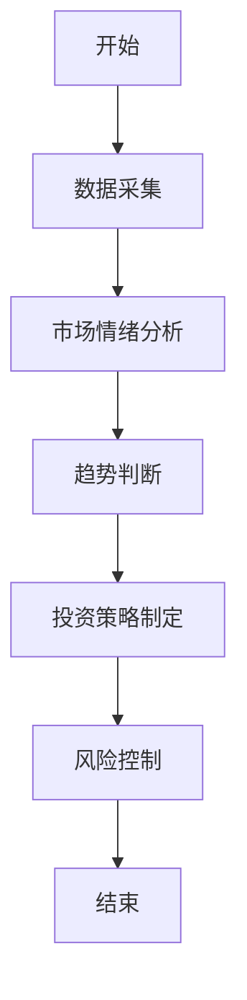
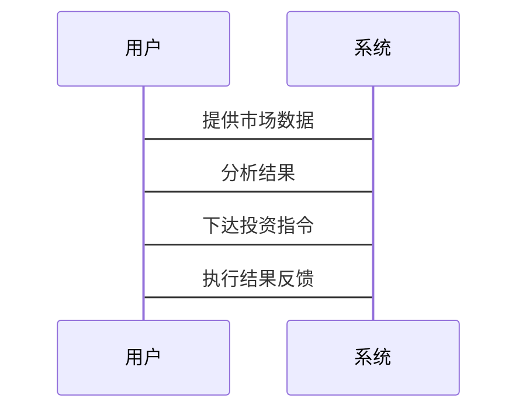

                 


# 《芒格的"反向思考"在市场分析中的应用：避免从众误区》

## 关键词：芒格, 反向思考, 市场分析, 从众误区, 投资策略, 系统设计

## 摘要：  
芒格的“反向思考”是一种独特的思维方式，它强调从对立面入手解决问题，避免随大流的思维定式。在市场分析中，这种思维方式可以帮助投资者跳出传统的从众思维，发现市场中的潜在机会和风险。本文将详细探讨芒格的“反向思考”理论，分析其在市场分析中的应用场景，并结合实际案例和系统设计，展示如何利用这种思维模式避免从众误区，制定更有效的投资策略。

---

# 第一部分：芒格的"反向思考"概述

## 第1章：逆向思维与芒格的"反向思考"

### 1.1 逆向思维的定义与特点

#### 1.1.1 逆向思维的定义  
逆向思维是一种与正向思维相对的思维方式，它强调从问题的对立面出发，寻找解决方案。与正向思维相比，逆向思维更注重从反面入手，寻找突破口。

#### 1.1.2 逆向思维的核心特点  
- **逆向性**：从问题的对立面入手，寻找解决方案。  
- **独特性**：避免随大流，寻找独特的视角。  
- **预见性**：通过反向思考，提前预判市场的变化趋势。

#### 1.1.3 逆向思维与传统思维的区别  
| 属性         | 逆向思维             | 传统思维             |
|--------------|----------------------|----------------------|
| 思维方式     | 从对立面入手         | 从正面入手           |
| 创新性       | 高                   | 低                   |
| 风险预判     | 强                   | 弱                   |

### 1.2 芒格的"反向思考"理论

#### 1.2.1 芒格的"反向思考"的提出背景  
芒格在投资领域提出“反向思考”理论，主要是为了应对市场中的从众误区。传统投资方法往往受到市场情绪的影响，容易随大流，而反向思考则强调独立思考，寻找市场中的非共识性机会。

#### 1.2.2 芒格"反向思考"的核心理念  
- **独立思考**：避免被市场情绪左右，坚持自己的判断。  
- **寻找非共识**：关注市场中被忽视的机会或风险。  
- **逆向决策**：在市场恐慌时寻找机会，在市场疯狂时保持警惕。

#### 1.2.3 芒格"反向思考"在投资中的应用  
芒格的反向思考在投资中主要体现在以下几个方面：  
1. **价值投资**：寻找市场中被低估的股票。  
2. **逆向布局**：在市场低迷时买入，在市场高估时卖出。  
3. **风险管理**：通过反向思考预判市场的潜在风险。

## 第2章："反向思考"在市场分析中的应用背景

### 2.1 市场分析的基本概念

#### 2.1.1 市场分析的定义  
市场分析是指对市场现状、趋势和潜在机会进行系统性研究，以便制定有效的投资策略。

#### 2.1.2 市场分析的主要方法  
- **基本面分析**：研究公司的财务状况、行业地位等。  
- **技术分析**：通过价格走势和成交量预测市场趋势。  
- **情绪分析**：分析市场参与者的心理状态。

#### 2.1.3 市场分析的工具与技术  
- **财务报表分析**：通过利润表、资产负债表等工具评估公司价值。  
- **技术指标**：如MACD、RSI等指标用于判断市场趋势。  
- **大数据分析**：利用大数据技术预测市场走势。

### 2.2 从众误区的定义与表现

#### 2.2.1 从众误区的定义  
从众误区是指投资者盲目跟随市场潮流，缺乏独立思考，导致投资决策失误。

#### 2.2.2 从众误区的主要表现  
- **盲目跟风**：看到市场上涨就盲目买入，看到下跌就盲目卖出。  
- **羊群效应**：市场恐慌时抛售，市场疯狂时追涨。  
- **忽视风险**：只关注市场的上涨机会，忽视潜在的下行风险。

#### 2.2.3 从众误区对市场分析的负面影响  
- **决策失误**：从众思维容易导致错误的投资决策。  
- **错失机会**：忽视市场中的非共识性机会。  
- **放大波动**：从众行为加剧市场的波动性。

### 2.3 芒格"反向思考"的市场分析价值

#### 2.3.1 芒格"反向思考"如何避免从众误区  
- **独立思考**：通过反向思考，避免被市场情绪左右。  
- **寻找非共识**：关注市场中被忽视的机会或风险。  
- **逆向布局**：在市场低迷时买入，在市场高估时卖出。

#### 2.3.2 芒格"反向思考"在市场分析中的独特优势  
- **降低风险**：通过反向思考预判市场风险，避免重大损失。  
- **发现机会**：在市场忽视的领域寻找潜在的高收益机会。  
- **提高决策质量**：通过独立思考，做出更理性的投资决策。

#### 2.3.3 芒格"反向思考"与其他市场分析方法的对比  
| 方法         | 反向思考             | 传统从众思维         |
|--------------|----------------------|----------------------|
| 思维方式     | 从对立面入手         | 从正面随大流           |
| 创新性       | 高                   | 低                   |
| 风险预判     | 强                   | 弱                   |

---

# 第二部分：芒格"反向思考"的核心理论与方法

## 第3章：芒格"反向思考"的核心原理

### 3.1 芒格"反向思考"的逻辑框架

#### 3.1.1 芒格"反向思考"的逻辑起点  
反向思考的逻辑起点是市场中的从众误区。通过分析市场参与者的心理和行为，寻找市场的非共识性机会。

#### 3.1.2 芒格"反向思考"的逻辑路径  
1. **识别市场情绪**：通过分析市场参与者的心理状态，判断市场情绪。  
2. **寻找市场非共识**：在市场情绪高涨时寻找潜在风险，在市场情绪低迷时寻找潜在机会。  
3. **制定投资策略**：根据反向思考的结论，制定相应的投资策略。

#### 3.1.3 芒格"反向思考"的逻辑终点  
通过反向思考，制定出与市场情绪相反的投资策略，从而在市场波动中获得超额收益。

### 3.2 芒格"反向思考"的核心要素

#### 3.2.1 市场情绪分析  
- **市场情绪分类**：分为乐观、中性、悲观三种状态。  
- **情绪分析工具**：如投资者情绪指数、市场成交量等指标。

#### 3.2.2 市场趋势判断  
- **趋势判断方法**：通过技术分析和基本面分析结合判断市场趋势。  
- **趋势反转信号**：如市场成交量创新高但价格未创新高，可能是趋势反转的信号。

#### 3.2.3 市场风险评估  
- **风险评估指标**：如波动率、VaR（在险价值）等。  
- **风险控制策略**：如设置止损点、分散投资等。

### 3.3 芒格"反向思考"的数学模型与公式

#### 3.3.1 市场情绪指数模型  
$$ \text{市场情绪指数} = \frac{\text{市场成交量}}{\text{市场价格}} $$  
当市场情绪指数较高时，市场情绪较为乐观；反之，则较为悲观。

#### 3.3.2 市场趋势判断模型  
$$ \text{趋势强度} = \text{价格变动幅度} \times \text{成交量变化幅度} $$  
趋势强度越高，市场趋势越强。

#### 3.3.3 风险评估模型  
$$ \text{VaR} = \text{投资金额} \times \text{波动率} \times \text{标准差} $$  
通过VaR模型评估投资组合的风险。

---

## 第4章：系统设计与实现

### 4.1 系统功能设计

#### 4.1.1 系统功能模块  
- **市场数据采集**：采集市场数据，包括价格、成交量等。  
- **市场情绪分析**：分析市场情绪，判断市场状态。  
- **投资策略制定**：根据反向思考结果，制定投资策略。  
- **风险控制**：评估投资组合的风险，制定风险控制策略。

#### 4.1.2 系统功能流程图  


### 4.2 系统架构设计

#### 4.2.1 系统架构图  


#### 4.2.2 系统接口设计  
- **输入接口**：接收市场数据和用户指令。  
- **输出接口**：输出市场情绪分析结果、投资策略和风险控制建议。

#### 4.2.3 系统交互流程图  


---

## 第5章：项目实战与案例分析

### 5.1 环境安装

#### 5.1.1 环境要求  
- **操作系统**：Windows/Mac/Linux  
- **编程语言**：Python 3.8+  
- **开发工具**：PyCharm/Jupyter Notebook  
- **依赖库**：Pandas, NumPy, Matplotlib, Scikit-learn

### 5.2 核心代码实现

#### 5.2.1 数据采集与处理  
```python
import pandas as pd
import numpy as np

# 数据采集
data = pd.read_csv('market_data.csv')

# 数据清洗
data = data.dropna()
data = data.astype(float)
```

#### 5.2.2 市场情绪分析  
```python
def calculate_market_mood(data):
    mood_index = data['成交量'] / data['价格']
    return mood_index.mean()

market_mood = calculate_market_mood(data)
```

#### 5.2.3 投资策略制定  
```python
def reverse_thinking_strategy(data, market_mood):
    if market_mood > data['价格'].mean():
        return '卖出'
    else:
        return '买入'

strategy = reverse_thinking_strategy(data, market_mood)
```

#### 5.2.4 风险控制  
```python
def risk_control(portfolio_value, risk_level):
    if risk_level > 0.1:
        return '减仓'
    else:
        return '持仓'

risk_assessment = risk_control(portfolio_value, market_mood)
```

### 5.3 案例分析

#### 5.3.1 案例背景  
假设当前市场情绪指数为0.8，高于市场平均情绪指数0.6。根据反向思考策略，应该采取卖出策略。

#### 5.3.2 数据分析  
```python
print("市场情绪指数:", market_mood)
print("投资策略:", strategy)
print("风险控制建议:", risk_assessment)
```

#### 5.3.3 结果解读  
- **市场情绪指数**：0.8，高于平均值，市场情绪乐观。  
- **投资策略**：卖出，避免从众误区。  
- **风险控制建议**：减仓，降低投资组合风险。

---

## 第6章：总结与最佳实践

### 6.1 总结

#### 6.1.1 小结  
芒格的“反向思考”是一种独特的思维方式，它通过从对立面入手解决问题，帮助投资者避免从众误区，制定更有效的投资策略。

#### 6.1.2 注意事项  
- **独立思考**：避免被市场情绪左右。  
- **持续学习**：不断更新市场知识和分析工具。  
- **风险管理**：制定合理的风险控制策略，避免重大损失。

### 6.2 最佳实践

#### 6.2.1 小结  
芒格的“反向思考”在市场分析中的应用可以帮助投资者发现市场中的非共识性机会，制定更理性的投资策略。

#### 6.2.2 拓展阅读  
- 《芒格的"反向思考"在投资中的应用》  
- 《系统性投资策略与风险管理》

---

# 结语

芒格的“反向思考”是一种值得投资者深入研究和实践的思维方式。通过反向思考，投资者可以避免从众误区，发现市场中的潜在机会和风险，制定更有效的投资策略。希望本文能够为投资者提供有价值的思路和方法，帮助他们在复杂的市场环境中做出更明智的投资决策。

