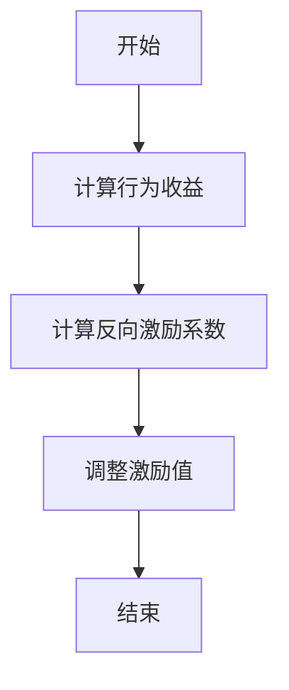
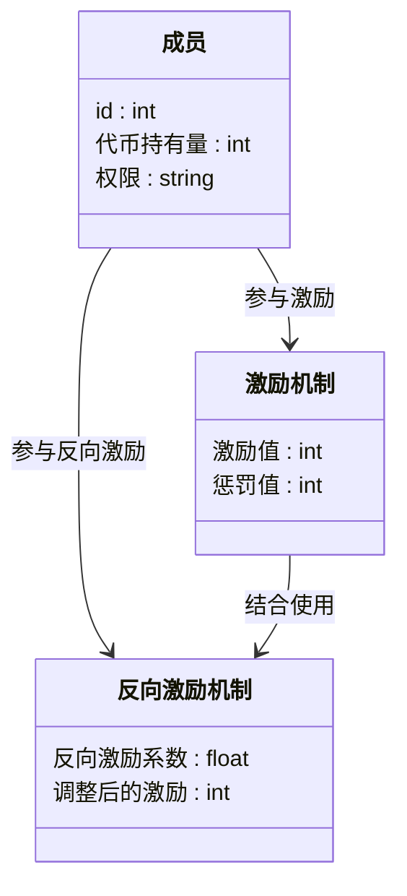
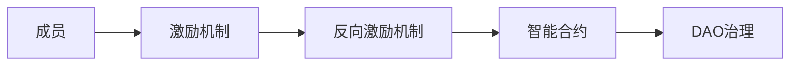
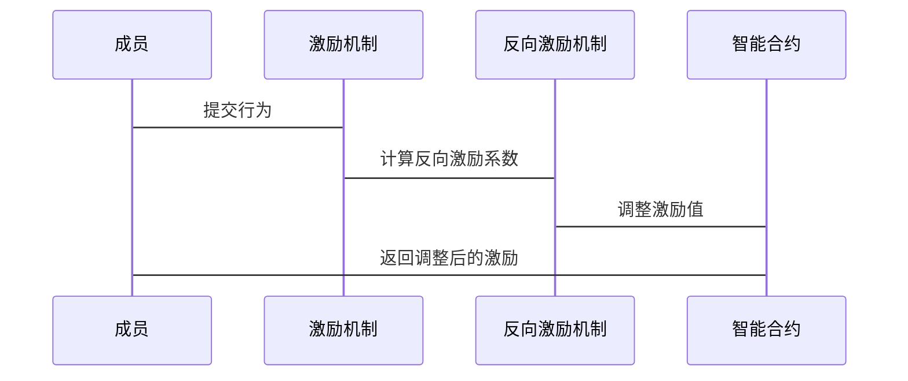

                 


# 芒格的"反向激励"分析在去中心化自治组织(DAO)中的应用

---

## 关键词

- 芒格反向激励
- 去中心化自治组织（DAO）
- 激励机制
- 区块链技术
- 智能合约

---

## 摘要

本文深入探讨了芒格的反向激励理论在去中心化自治组织（DAO）中的应用，分析了传统激励机制的局限性，提出了反向激励在DAO治理中的潜在价值。通过构建数学模型和算法流程，结合实际案例，详细阐述了反向激励如何通过智能合约实现，以平衡个人行为与组织目标。文章还探讨了系统的架构设计和实际应用中的注意事项，为DAO的高效治理提供了新的思路。

---

# 正文

## 第一部分：背景介绍

### 第1章：反向激励与DAO概述

#### 1.1 反向激励的基本概念

- **定义与特征**  
  反向激励是一种通过减少激励来限制或调整个体行为的机制。其核心在于通过设定惩罚性或限制性的激励措施，引导个体行为朝向更符合组织目标的方向发展。  
  - **反向激励的特征**：  
    - 以限制行为为主，而非鼓励行为。  
    - 通常与负面结果相关联，如罚款、减少奖励等。  
    - 强调行为的边界和约束。

- **反向激励与传统激励机制的区别**  
  传统激励机制通过奖励鼓励个体行为，而反向激励则通过惩罚或限制来调整行为。两者结合可以更好地平衡个体与组织目标。

- **理论基础与发展背景**  
  反向激励理论源于行为经济学，强调个体行为的多面性和复杂性。在组织管理中，反向激励常用于纠正短期行为和过度竞争。

#### 1.2 去中心化自治组织（DAO）的概念

- **定义与特征**  
  DAO是基于区块链技术的去中心化组织，通过智能合约实现自治治理。其特点包括去中心化、透明性和抗审查性。  
  - **DAO的组织架构**：  
    - 治理决策通过代币持有者的投票实现。  
    - 智能合约自动执行规则和激励机制。  
    - 成员角色和权限由代币持有量决定。

- **DAO与传统组织的对比**  
  - **传统组织**：中心化管理，权力集中于管理层。  
  - **DAO**：去中心化治理，权力分散于成员。

- **DAO的激励机制**  
  DAO通常依赖代币激励来鼓励成员贡献，但传统激励可能引发短期行为和过度竞争。反向激励机制可以弥补这一不足。

#### 1.3 芒格的反向激励理论

- **芒格的反向激励理论概述**  
  芒格认为，反向激励通过限制行为来促进整体目标的实现。其核心思想是通过设定合理的激励边界，避免个体行为偏离组织目标。

- **反向激励在DAO中的潜在价值**  
  在DAO中，反向激励可以用于平衡成员的短期行为和长期目标，防止过度竞争和资源浪费。

---

## 第二部分：核心概念与联系

### 第2章：反向激励与DAO的核心概念分析

#### 2.1 反向激励的理论模型

- **反向激励的原理与机制**  
  反向激励通过设定惩罚或限制，引导个体行为向更符合组织目标的方向发展。其机制包括：  
  - 确定行为边界：设定行为的上限和下限。  
  - 设定反向激励系数：根据行为偏离目标的程度调整激励。

- **反向激励的数学模型与公式**  
  反向激励的核心公式如下：  
  $$激励函数 = f(行为, 反向激励参数)$$  
  $$收益 = 行为 × 反向激励系数$$  
  其中，反向激励系数用于调整行为的激励程度。

- **反向激励的动态调整模型**  
  $$调整后的激励 = 原激励 + 反向激励系数 × 时间因子$$  

#### 2.2 DAO的组织结构与激励机制

- **DAO的治理模型与激励方式**  
  DAO通过智能合约实现治理决策的自动化。激励机制通常包括代币奖励和惩罚机制。

- **DAO中的角色与权限分配**  
  成员的权限和角色由代币持有量决定，包括投票权、决策权等。

- **反向激励与DAO激励机制的结合**  
  通过设定反向激励机制，DAO可以在治理决策中平衡个体行为和组织目标。

#### 2.3 反向激励与DAO的对比分析

- **对比分析表格**  
  | 比较维度 | 反向激励 | DAO激励机制 |  
  |----------|----------|------------|  
  | 目标     | 约束行为 | 鼓励贡献   |  
  | 工具     | 惩罚机制 | 代币奖励    |  
  | 适用场景 | 纠正过度行为 | 鼓励积极贡献 |  

- **ER实体关系图**  
  使用Mermaid绘制的DAO激励机制与反向激励的ER图如下：

```mermaid
erDiagram
    participant 成员 {
        id : int
        代币持有量 : int
        权限 : string
    }
    participant 激励机制 {
        激励值 : int
        惩罚值 : int
    }
    participant 反向激励机制 {
        反向激励系数 : float
        调整后的激励 : int
    }
    member --> 激励机制 : 参与激励
    member --> 反向激励机制 : 参与反向激励
    激励机制 --> 反向激励机制 : 结合使用
```

---

## 第三部分：算法原理

### 第3章：反向激励的数学模型与算法原理

#### 3.1 反向激励的数学模型

- **反向激励的核心公式**  
  $$反向激励系数 = \frac{1}{行为收益}$$  
  $$收益 = 行为 × 反向激励系数$$  

- **反向激励的动态调整模型**  
  $$调整后的激励 = 原激励 + 反向激励系数 × 时间因子$$  

- **算法流程图（使用Mermaid）**  



#### 3.2 反向激励的算法实现

- **核心代码实现**  
  ```python
  def 反向激励算法(行为收益):
      反向激励系数 = 1 / 行为收益
      调整后的激励 = 原激励 + 反向激励系数 * 时间因子
      return 调整后的激励
  ```

- **代码解读与分析**  
  该算法根据行为收益计算反向激励系数，并动态调整激励值。通过调整反向激励系数，可以平衡个体行为和组织目标。

---

## 第四部分：系统分析与架构设计

### 第4章：系统分析与架构设计方案

#### 4.1 问题场景介绍

- **问题场景**  
  在DAO治理中，成员可能为了个人利益而做出损害整体利益的行为。反向激励机制可以通过限制这些行为，促进成员更长远地考虑组织目标。

#### 4.2 项目介绍

- **项目名称**  
  芒格反向激励在DAO中的应用系统。

#### 4.3 系统功能设计

- **领域模型（使用Mermaid类图）**  



#### 4.4 系统架构设计

- **系统架构图（使用Mermaid）**  



#### 4.5 系统接口设计

- **主要接口**  
  - 成员接口：提交行为，获取激励值。  
  - 激励机制接口：计算激励值和反向激励系数。  
  - 智能合约接口：执行激励机制和反向激励机制。

#### 4.6 系统交互流程

- **交互流程图（使用Mermaid）**  



---

## 第五部分：项目实战

### 第5章：项目实战

#### 5.1 环境安装

- **工具与环境**  
  - Python 3.8+  
  - Mermaid CLI  
  - Solidity（智能合约开发）

#### 5.2 核心代码实现

- **智能合约代码（Solidity）**  
  ```solidity
  // 反向激励机制智能合约
  contract 反向激励合约 {
      mapping(address => uint) public 代币持有量;
      mapping(address => uint) public 激励值;
      
      function 提交行为(address _address, uint _行为收益) public {
          uint 反向激励系数 = 1 / _行为收益;
          uint 调整后的激励 = 激励值[_address] + 反向激励系数 * 时间因子();
          代币持有量[_address] = 代币持有量[_address] + 调整后的激励;
      }
  }
  ```

- **Python代码实现**  
  ```python
  def 调整激励(行为收益, 时间因子):
      反向激励系数 = 1 / 行为收益
      调整后的激励 = 原激励 + 反向激励系数 * 时间因子
      return 调整后的激励

  # 示例应用
  行为收益 = 100
  时间因子 = 0.5
  调整后的激励 = 调整激励(行为收益, 时间因子)
  print(调整后的激励)  # 输出：100 + (1/100) * 0.5
  ```

#### 5.3 项目小结

- **项目总结**  
  通过智能合约实现反向激励机制，可以在DAO中平衡个体行为和组织目标，防止过度竞争和短期行为。

---

## 第六部分：最佳实践与小结

### 第6章：最佳实践

#### 6.1 最佳实践 tips

- **动态调整反向激励系数**  
  根据组织目标和成员行为动态调整反向激励系数，以确保机制的有效性。

- **结合正向激励**  
  反向激励应与正向激励结合使用，避免单纯惩罚导致的积极性下降。

#### 6.2 小结

- **总结全文**  
  芒格的反向激励理论为DAO的治理提供了一种新的思路。通过合理设计激励机制，可以平衡个体行为和组织目标，促进DAO的高效运作。

#### 6.3 注意事项

- **避免过度惩罚**  
  反向激励应适度使用，避免过度惩罚导致成员积极性下降。

- **动态调整机制**  
  反向激励系数应根据实际情况动态调整，确保机制的有效性和公平性。

#### 6.4 拓展阅读

- **推荐阅读**  
  - 《反向激励在区块链治理中的应用》  
  - 《去中心化自治组织的数学建模与优化》

---

## 结语

芒格的反向激励理论为去中心化自治组织（DAO）的治理提供了一种新的思路。通过合理设计激励机制，DAO可以在去中心化的基础上实现高效的组织管理。未来，随着区块链技术的发展，反向激励在DAO中的应用将更加广泛和深入。

