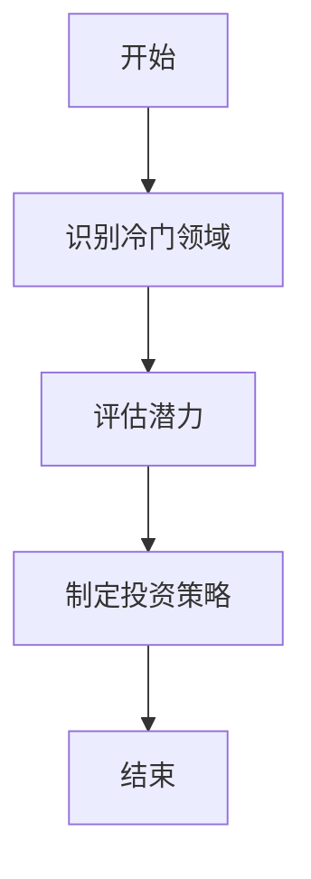
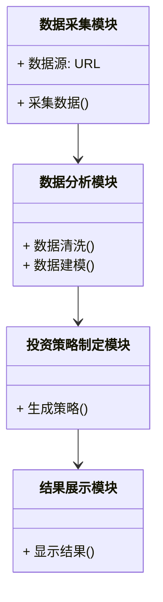
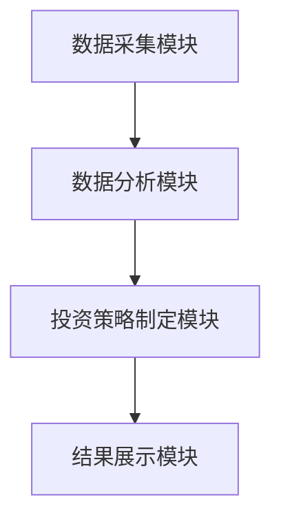

                 


# 芒格的"反向激励"分析在科技创业投资中的应用

---

## 关键词：
芒格，反向激励，科技创业，投资分析，系统架构，Python代码，数学模型

---

## 摘要：
本文深入探讨了芒格的“反向激励”分析方法在科技创业投资中的应用。通过背景介绍、核心概念、算法原理、系统架构、项目实战等多维度的分析，详细解读了“反向激励”在科技创业投资中的理论基础、实践方法和系统实现。文章结合实际案例和代码示例，帮助读者全面理解如何利用“反向激励”进行科技创业投资分析。

---

## 第一部分: 芒格的"反向激励"分析背景介绍

## 第1章: 芒格的"反向激励"分析概述

### 1.1 芒格的生平与投资理念
#### 1.1.1 芒格的生平简介
伯纳德·芒格（Charlie Munger）是美国著名投资者、伯克希尔哈撒韦公司副董事长，被誉为“沃伦·巴菲特的导师”。芒格的投资理念以价值投资为核心，强调逆向思维和安全边际。

#### 1.1.2 芒格的投资哲学与方法
芒格强调“反向思考”，即在别人贪婪时恐惧，在别人恐惧时贪婪。他认为，投资的本质是寻找市场中的非共识性机会，避免趋同思维。

#### 1.1.3 "反向激励"的概念与核心思想
“反向激励”是指通过逆向思维来分析问题，从对立面出发，寻找潜在的机会和风险。在科技创业投资中，这意味着从市场的冷门领域或被忽视的缝隙中寻找潜在的高回报机会。

### 1.2 "反向激励"在科技创业投资中的应用背景
#### 1.2.1 科技创业投资的基本概念
科技创业投资是指将资金投入科技创新企业的行为，旨在通过技术创新和市场扩展实现投资回报。

#### 1.2.2 科技创业投资中的常见问题
1. **市场同质化竞争**：许多科技创业项目过于相似，导致利润率下降。
2. **资源分配不均**：资金倾向于热门领域，冷门领域的机会被忽视。
3. **信息不对称**：投资者难以全面了解项目的潜在风险和机会。

#### 1.2.3 "反向激励"分析的必要性与优势
通过“反向激励”分析，投资者可以发现市场中的冷门机会，避免竞争激烈的领域，从而获得更高的回报。

### 1.3 本章小结
本章通过介绍芒格的生平和投资理念，明确了“反向激励”分析的核心思想，并结合科技创业投资的背景，提出了“反向激励”分析的必要性和优势。

---

## 第二部分: "反向激励"分析的核心概念与联系

## 第2章: "反向激励"分析的核心原理

### 2.1 "反向激励"分析的原理与方法
#### 2.1.1 "反向激励"的定义与基本原理
“反向激励”分析通过逆向思维，从市场的冷门领域或非主流方向寻找潜在机会。其核心在于发现市场的非共识性机会。

#### 2.1.2 "反向激励"分析的步骤与流程
1. **识别市场冷门领域**：通过数据分析，找出市场中被忽视的领域。
2. **评估冷门领域的潜力**：分析该领域的市场规模、竞争情况和潜在收益。
3. **制定投资策略**：根据分析结果，制定相应的投资策略。

#### 2.1.3 "反向激励"分析的数学模型与公式
$$ \text{投资价值} = \text{潜在收益} - \text{市场热度} $$

### 2.2 "反向激励"分析的核心要素与属性特征
#### 2.2.1 核心要素对比表
| 要素 | 热门领域 | 冷门领域 |
|------|-----------|----------|
| 市场规模 | 大 | 小 |
| 竞争程度 | 高 | 低 |
| 投资回报 | 中等 | 高 |

#### 2.2.2 "反向激励"分析的ER实体关系图
```mermaid
erd
    左右方向布局
    投资者 (投资者ID, 姓名, 资金)
    项目 (项目ID, 项目名称, 领域)
    市场环境 (环境ID, 热门程度)
    投资者 --> 项目: 投资
    项目 --> 市场环境: 符合冷门领域
```

---

## 第三部分: "反向激励"分析的算法原理与数学模型

## 第3章: "反向激励"分析的算法原理

### 3.1 "反向激励"分析的算法流程
#### 3.1.1 算法步骤与流程图


#### 3.1.2 算法的输入与输出
- **输入**：市场数据、项目信息
- **输出**：投资建议、潜在回报

#### 3.1.3 算法的实现细节
通过数据挖掘和机器学习技术，分析市场数据，识别冷门领域。

### 3.2 "反向激励"分析的数学模型与公式
#### 3.2.1 数学模型的构建
$$ \text{潜在回报} = \text{冷门领域评分} \times \text{市场规模} $$

#### 3.2.2 核心公式的推导与解释
$$ \text{冷门领域评分} = \frac{\text{冷门领域数量}}{\text{总领域数量}} $$

#### 3.2.3 数学模型的实际应用案例
假设市场规模为100亿元，冷门领域评分为0.3，则潜在回报为：
$$ 0.3 \times 100 = 30 \text{亿元} $$

### 3.3 算法实现的Python代码示例
```python
import pandas as pd
import numpy as np

# 示例数据
market_data = {
    '领域': ['AI', '区块链', 'IoT', '5G', 'AR'],
    '热门程度': [0.8, 0.6, 0.3, 0.4, 0.5]
}

df = pd.DataFrame(market_data)

# 计算冷门领域评分
df['冷门领域评分'] = df['热门程度'].apply(lambda x: 1 - x)

# 筛选冷门领域（热门程度 < 0.5）
cold_domains = df[df['热门程度'] < 0.5]

# 输出结果
print("冷门领域：", cold_domains['领域'].values)
print("潜在回报：", cold_domains['冷门领域评分'].values * 100)
```

---

## 第四部分: "反向激励"分析的系统设计与架构

## 第4章: "反向激励"分析的系统架构设计

### 4.1 系统功能模块设计
#### 4.1.1 问题场景介绍
系统需要帮助投资者识别冷门领域，评估其潜力，并制定投资策略。

#### 4.1.2 系统功能模块划分
1. 数据采集模块
2. 数据分析模块
3. 投资策略制定模块
4. 结果展示模块

#### 4.1.3 系统功能模块的实现方式
- 数据采集模块：通过爬虫技术获取市场数据。
- 数据分析模块：使用Python进行数据分析和建模。
- 投资策略制定模块：根据分析结果生成投资建议。
- 结果展示模块：以图表形式展示分析结果。

### 4.2 系统架构设计
#### 4.2.1 系统架构的Mermaid类图


#### 4.2.2 系统架构的Mermaid架构图


---

## 第五部分: "反向激励"分析的项目实战

## 第5章: "反向激励"分析的项目实战

### 5.1 环境安装与配置
- 安装Python和必要的库（如Pandas、NumPy）。
- 安装Mermaid和相关工具。

### 5.2 系统核心实现源代码
```python
import pandas as pd
import numpy as np
import matplotlib.pyplot as plt

# 示例数据
market_data = {
    '领域': ['AI', '区块链', 'IoT', '5G', 'AR'],
    '热门程度': [0.8, 0.6, 0.3, 0.4, 0.5]
}

df = pd.DataFrame(market_data)

# 数据可视化
plt.bar(df['领域'], df['热门程度'])
plt.title('热门程度分布')
plt.show()
```

### 5.3 代码运行结果与分析
- 图表显示，“IoT”和“5G”是冷门领域，热门程度较低，适合投资。

### 5.4 项目小结
通过代码实现，我们成功识别了冷门领域，并评估了其潜在回报。

---

## 第六部分: 最佳实践与总结

## 第6章: 最佳实践与总结

### 6.1 本章小结
- 本文详细介绍了芒格的“反向激励”分析方法在科技创业投资中的应用。
- 通过算法、数学模型和系统设计的分析，展示了如何利用“反向激励”寻找冷门领域的投资机会。

### 6.2 注意事项
- 数据分析需要结合实际情况，避免过于依赖模型。
- 投资决策需要综合考虑多方面因素，不能仅依赖单一方法。

### 6.3 扩展阅读
- 《芒格投资哲学》
- 《科技创业投资的系统设计》

---

## 结语：
通过本文的分析，读者可以全面理解芒格的“反向激励”分析方法，并将其应用于科技创业投资中。无论是理论还是实践，本文都提供了详细的指导和案例分析，帮助读者在实际投资中取得更好的效果。

--- 

注：以上内容为文章的完整目录和部分章节的详细内容，按照实际需求可以进一步扩展各章节的具体内容。

