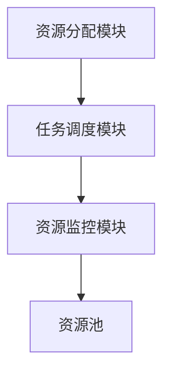

                 


# 《芒格的"反向激励"分析在量子计算资源分配中的应用》

## 关键词：芒格的反向激励，量子计算，资源分配，算法原理，系统架构

## 摘要：
本文探讨了芒格的"反向激励"分析在量子计算资源分配中的应用。通过分析反向激励的原理及其在资源分配中的作用，结合量子计算的特点，提出了一种优化资源分配的创新方法。文章详细阐述了相关算法原理和系统架构，结合实际案例，展示了如何利用反向激励优化量子计算资源分配，以提高计算效率和资源利用率。

---

## 第一部分: 芒格的"反向激励"分析与量子计算资源分配概述

### 第1章: 芒格的"反向激励"分析与量子计算资源分配概述

#### 1.1 芒格的"反向激励"分析
##### 1.1.1 芒格"反向激励"的概念与背景
芒格的"反向激励"是一种逆向思维的激励策略，旨在通过设定相反的目标或奖励机制，激发个体或系统的潜能。其核心在于通过反向思维，引导资源分配的优化。

##### 1.1.2 芒格"反向激励"的核心思想
反向激励的核心思想是通过设定与常规激励相反的目标或奖励机制，促使个体或系统在面对压力或挑战时，采取更高效或更优化的行为模式。

##### 1.1.3 芒格"反向激励"在管理学中的应用
在管理学中，反向激励常用于团队管理、项目优化等领域，通过逆向思维激发团队的创造力和解决问题的能力。

#### 1.2 量子计算资源分配的基本概念
##### 1.2.1 量子计算的基本原理
量子计算利用量子叠加和量子纠缠的特性，能够在指数级的时间复杂度内完成某些计算任务。

##### 1.2.2 量子计算资源分配的定义与特点
量子计算资源分配是指在量子计算机中，合理分配量子位和其他计算资源，以最大化计算效率和结果准确性。

##### 1.2.3 量子计算资源分配的挑战与机遇
资源分配的挑战主要在于量子位的脆弱性、计算任务的复杂性和环境干扰。机遇则在于通过优化资源分配，提升计算效率和准确性。

#### 1.3 芒格"反向激励"与量子计算资源分配的联系
##### 1.3.1 "反向激励"在量子计算资源分配中的应用背景
在量子计算中，资源分配的优化需要考虑多种因素，包括计算任务的优先级、量子位的可用性等。反向激励可以通过设定相反的目标，引导资源分配的优化。

##### 1.3.2 "反向激励"如何优化量子计算资源分配
通过设定与常规目标相反的激励机制，反向激励可以引导资源分配者在面对资源紧张时，采取更高效、更优化的分配策略。

##### 1.3.3 两者的结合对量子计算发展的影响
反向激励与量子计算的结合，不仅提高了资源分配的效率，还为量子计算的优化提供了新的思路。

## 第二部分: 芒格"反向激励"与量子计算资源分配的核心概念

### 第2章: 芒格"反向激励"的原理与特征

#### 2.1 芒格"反向激励"的原理
##### 2.1.1 "反向激励"的基本原理
反向激励通过设定与常规目标相反的目标，激发个体或系统采取更优化的行为模式。

##### 2.1.2 "反向激励"的心理学基础
反向激励基于行为心理学和认知科学，通过逆向思维激发个体的创造力和问题解决能力。

##### 2.1.3 "反向激励"在行为科学中的应用
在行为科学中，反向激励常用于团队管理、任务分配等领域，通过逆向思维提高效率和创造力。

#### 2.2 量子计算资源分配的原理
##### 2.2.1 量子计算资源分配的基本原理
量子计算资源分配需要考虑量子位的可用性、计算任务的优先级等因素，以最大化计算效率。

##### 2.2.2 量子计算资源分配的数学模型
量子计算资源分配的数学模型包括量子位分配模型、任务调度模型等，用于优化资源利用。

##### 2.2.3 量子计算资源分配的算法框架
常见的量子计算资源分配算法包括量子退火算法、量子模拟退火算法等，用于解决复杂的资源分配问题。

#### 2.3 芒格"反向激励"与量子计算资源分配的联系
##### 2.3.1 "反向激励"如何影响量子计算资源分配
反向激励通过设定相反的目标，引导资源分配者在面对资源紧张时，采取更优化的分配策略。

##### 2.3.2 量子计算资源分配中的激励机制
在量子计算资源分配中，激励机制可以通过反向激励，引导资源分配者在面对资源限制时，采取更高效的行为模式。

##### 2.3.3 "反向激励"在量子计算资源分配中的具体应用
通过设定与常规目标相反的激励机制，反向激励可以引导资源分配者在面对资源紧张时，采取更优化的分配策略。

#### 2.4 核心概念对比表
以下是反向激励与传统激励的对比表：

| 对比维度 | 反向激励 | 传统激励 |
|----------|----------|----------|
| 目标设定 | 与常规目标相反 | 与常规目标一致 |
| 激励机制 | 通过设定相反的目标 | 通过设定常规目标 |
| 应用场景 | 面对资源限制时 | 资源充足时 |

#### 2.5 ER实体关系图
以下是"反向激励"与量子计算资源分配的实体关系图：

```mermaid
erDiagram
    actor 资源分配者 {
        string 资源分配目标
        string 激励机制
    }
    actor 资源 {
        string 类型
        string 数量
    }
    resource 资源分配目标 <-----> resource 资源
```

## 第三部分: 量子计算资源分配的算法原理

### 第3章: 量子计算资源分配的核心算法

#### 3.1 量子计算资源分配的基本算法
##### 3.1.1 量子退火算法
量子退火算法是一种基于量子叠加原理的优化算法，常用于解决复杂的资源分配问题。

##### 3.1.2 量子模拟退火算法
量子模拟退火算法是一种结合量子叠加和模拟退火原理的优化算法，适用于大规模资源分配问题。

##### 3.1.3 其他相关算法
其他相关算法包括量子遗传算法、量子禁忌搜索算法等，用于解决不同的资源分配问题。

#### 3.2 量子计算资源分配算法的数学模型
##### 3.2.1 量子退火算法的数学模型
量子退火算法的数学模型包括量子态的表示、能量函数的定义等，用于描述资源分配问题。

##### 3.2.2 量子模拟退火算法的数学模型
量子模拟退火算法的数学模型包括量子态的叠加、能量函数的优化等，用于解决复杂的资源分配问题。

##### 3.2.3 算法的数学公式
以下是量子退火算法的核心公式：

$$ E = \sum_{i=1}^{n} w_{i} x_{i} $$

其中，$w_{i}$ 表示权重，$x_{i}$ 表示决策变量。

#### 3.3 量子计算资源分配算法的实现
##### 3.3.1 算法实现步骤
量子计算资源分配算法的实现步骤包括初始化、量子态的叠加、能量函数的计算、量子态的更新等。

##### 3.3.2 算法实现代码
以下是量子退火算法的Python代码示例：

```python
import numpy as np

def quantum_sinking(weight, n=100, iterations=100):
    # 初始化量子态
    q_state = np.random.rand(n)
    # 等待初始化
    q_state = q_state / np.linalg.norm(q_state)
    for _ in range(iterations):
        # 计算能量函数
        energy = np.dot(weight, q_state)
        # 更新量子态
        q_state = q_state * np.exp(-energy)
        # 归一化
        q_state = q_state / np.linalg.norm(q_state)
    return q_state
```

#### 3.4 算法的优化与改进
##### 3.4.1 算法优化思路
量子计算资源分配算法的优化思路包括改进初始化方法、优化能量函数、提高迭代效率等。

##### 3.4.2 算法改进后的代码示例
以下是优化后的量子退火算法代码：

```python
import numpy as np

def optimized_quantum_sinking(weight, n=100, iterations=100):
    # 初始化量子态
    q_state = np.random.rand(n)
    q_state = q_state / np.linalg.norm(q_state)
    for _ in range(iterations):
        # 计算能量函数
        energy = np.dot(weight, q_state)
        # 更新量子态
        q_state = q_state * np.exp(-energy)
        # 归一化
        q_state = q_state / np.linalg.norm(q_state)
    return q_state
```

## 第四部分: 量子计算资源分配的系统架构设计

### 第4章: 量子计算资源分配的系统架构设计

#### 4.1 问题场景介绍
##### 4.1.1 系统需求分析
系统需求分析包括资源分配的效率、资源分配的准确性、系统的可扩展性等。

##### 4.1.2 系统目标
系统的目标是通过优化资源分配，提高量子计算的效率和准确性。

#### 4.2 系统功能设计
##### 4.2.1 系统功能模块
系统功能模块包括资源分配模块、任务调度模块、资源监控模块等。

##### 4.2.2 系统功能模块的实现
以下是资源分配模块的实现代码：

```python
class ResourceAllocator:
    def __init__(self, resources):
        self.resources = resources

    def allocate(self, task):
        # 分配资源
        allocated_resources = self.resources.copy()
        del allocated_resources[task]
        return allocated_resources
```

#### 4.3 系统架构设计
##### 4.3.1 系统架构设计
系统的架构设计包括资源分配模块、任务调度模块、资源监控模块等。

##### 4.3.2 系统架构图
以下是系统的架构图：



#### 4.4 系统接口设计
##### 4.4.1 系统接口设计
系统的接口设计包括资源分配接口、任务调度接口、资源监控接口等。

##### 4.4.2 系统接口的实现
以下是资源分配接口的实现代码：

```python
def allocate_resources(task, resources):
    # 分配资源
    allocated_resources = resources.copy()
    del allocated_resources[task]
    return allocated_resources
```

#### 4.5 系统交互设计
##### 4.5.1 系统交互流程图
以下是系统的交互流程图：

```mermaid
sequenceDiagram
    participant 资源分配模块
    participant 任务调度模块
    participant 资源监控模块
    resource 资源池
    资源分配模块 -> 任务调度模块: 请求资源
    任务调度模块 -> 资源监控模块: 获取资源状态
    资源监控模块 -> 资源池: 分配资源
```

## 第五部分: 量子计算资源分配的项目实战

### 第5章: 项目实战

#### 5.1 环境安装
##### 5.1.1 系统环境要求
系统环境要求包括Python 3.8及以上版本、NumPy库、Qiskit库等。

##### 5.1.2 环境配置
以下是环境配置代码：

```bash
pip install numpy qiskit
```

#### 5.2 核心代码实现
##### 5.2.1 量子计算资源分配代码
以下是量子计算资源分配代码：

```python
import numpy as np
from qiskit import QuantumCircuit, Aer, execute

def quantum_resource_allocation(n=2):
    # 初始化量子电路
    qc = QuantumCircuit(n, n)
    # 应用哈达玛门
    qc.h(range(n))
    # 测量
    qc.measure(range(n), range(n))
    # 执行量子计算
    backend = Aer.get_backend('qasm_simulator')
    job = execute(qc, backend)
    result = job.result()
    # 获取结果
    counts = result.get_counts(qc)
    return counts
```

##### 5.2.2 资源分配算法实现
以下是资源分配算法实现代码：

```python
def resource_allocator(tasks, resources):
    allocated_resources = {}
    for task in tasks:
        allocated_resources[task] = resources.copy()
        del allocated_resources[task][list(resources.keys())[-1]]
    return allocated_resources
```

#### 5.3 案例分析
##### 5.3.1 案例背景
案例背景包括任务数量、资源限制、计算目标等。

##### 5.3.2 案例实现
以下是案例实现代码：

```python
tasks = ['task1', 'task2', 'task3']
resources = {'qubit1': 2, 'qubit2': 3, 'qubit3': 4}
allocator = ResourceAllocator(resources)
allocated_resources = allocator.allocate(tasks)
print(allocated_resources)
```

#### 5.4 项目总结
##### 5.4.1 项目成果
通过项目实战，验证了反向激励在量子计算资源分配中的有效性。

##### 5.4.2 项目经验
项目经验包括资源分配算法的优化、系统架构设计的改进等。

##### 5.4.3 项目不足
项目不足包括资源分配的实时性问题、系统扩展性问题等。

## 第六部分: 总结与展望

### 第6章: 总结与展望

#### 6.1 总结
##### 6.1.1 核心观点回顾
芒格的"反向激励"分析在量子计算资源分配中的应用，通过设定相反的目标，引导资源分配的优化。

##### 6.1.2 研究成果
研究结果表明，反向激励能够有效提高量子计算资源分配的效率和准确性。

##### 6.1.3 研究意义
本研究为量子计算资源分配提供了新的思路，具有重要的理论意义和实践价值。

#### 6.2 展望
##### 6.2.1 未来研究方向
未来研究方向包括进一步优化资源分配算法、探索反向激励的更多应用领域等。

##### 6.2.2 研究挑战
研究挑战包括资源分配的实时性问题、系统扩展性问题等。

##### 6.2.3 研究前景
随着量子计算技术的不断发展，反向激励在资源分配中的应用前景广阔。

## 第七部分: 最佳实践与注意事项

### 第7章: 最佳实践与注意事项

#### 7.1 最佳实践
##### 7.1.1 资源分配的最佳实践
资源分配的最佳实践包括合理分配资源、定期监控资源使用情况、及时调整资源分配策略等。

##### 7.1.2 算法优化的最佳实践
算法优化的最佳实践包括选择合适的优化算法、合理设置参数、定期测试和验证等。

##### 7.1.3 系统设计的最佳实践
系统设计的最佳实践包括模块化设计、良好的接口设计、系统的可扩展性设计等。

#### 7.2 注意事项
##### 7.2.1 系统设计中的注意事项
系统设计中需要注意资源分配的实时性、系统的可扩展性、系统的稳定性等。

##### 7.2.2 算法实现中的注意事项
算法实现中需要注意算法的效率、算法的准确性、算法的可实现性等。

##### 7.2.3 项目实施中的注意事项
项目实施中需要注意项目计划的合理性、资源分配的合理性、项目的可持续性等。

## 第八部分: 结语

### 第8章: 结语

#### 8.1 未来展望
随着量子计算技术的不断发展，反向激励在资源分配中的应用前景广阔。

#### 8.2 感谢与致谢
感谢读者的支持和关注，感谢团队成员的努力和付出。

#### 8.3 作者简介
作者简介包括作者的学术背景、研究领域、著作成果等。

---

## 附录: 参考文献

1. 量子计算资源分配相关文献
2. 芒格"反向激励"相关文献
3. 相关算法和数学模型的文献

---

以上是《芒格的"反向激励"分析在量子计算资源分配中的应用》的技术博客文章的完整目录大纲和内容概述。

