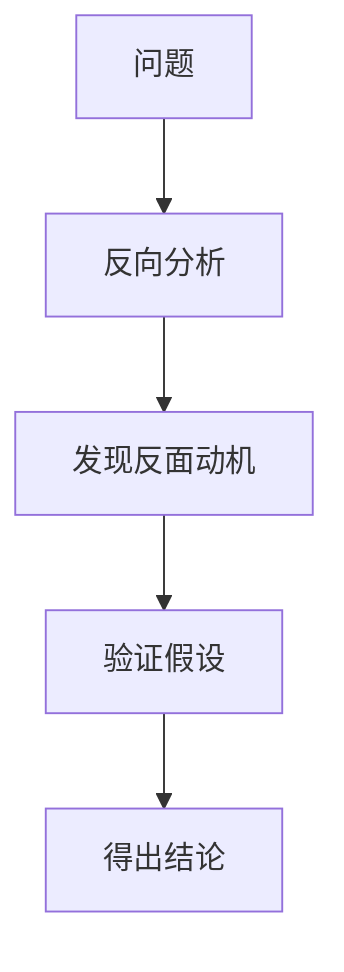
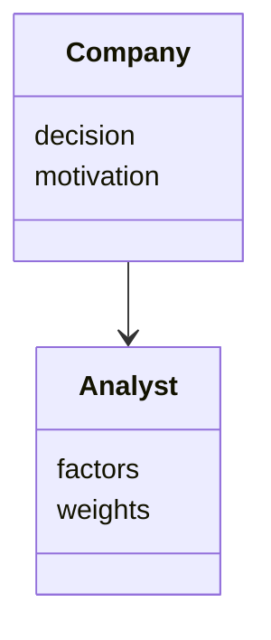
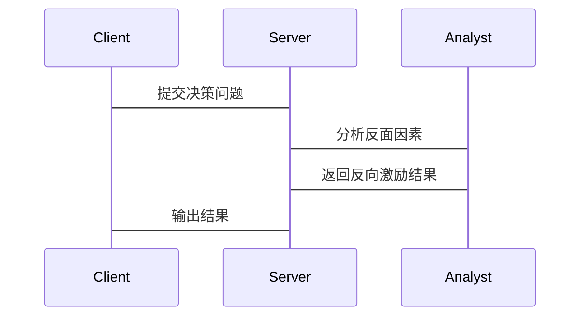

                 


# 芒格的"反向激励"思维：理解公司决策动机

## 关键词：芒格，反向激励，决策动机，思维模型，投资哲学

## 摘要：本文探讨了芒格的反向激励思维在公司决策中的应用，分析其核心概念、算法原理，并通过实际案例展示如何利用这种思维方式理解公司决策动机。文章结合理论与实践，提供深入的分析和见解。

---

# 第1章 引言：芒格的反向激励思维概述

## 1.1 芒格的生平与投资理念

### 1.1.1 芒格的早年经历与职业发展

查理·芒格（Charlie Munger）出生于1924年，是一位美国著名的投资者和作家。他早年毕业于密歇根大学，后转学到哈佛大学法学院，获得法律学位。芒格的职业生涯始于律师，但他后来转向投资领域，并与沃伦·巴菲特（Warren Buffett）合作，共同创立了伯克希尔·哈撒韦公司（Berkshire Hathaway），成为该公司的副主席。

### 1.1.2 芒格的投资哲学与思维方式

芒格的投资哲学以“价值投资”为核心，强调长期持有优质资产，并注重企业的基本面分析。他的思维方式强调逆向思考（Reversal Thinking），即从反方向出发，寻找市场的非共识观点，从而发现投资机会。芒格认为，市场参与者往往过于乐观，而反向思维可以帮助投资者发现市场中的错误定价。

### 1.1.3 芒格与巴菲特的伙伴关系

芒格与巴菲特的伙伴关系是投资历史上的一段佳话。芒格的逆向思维和巴菲特的价值投资理念相结合，使伯克希尔成为全球最成功的投资公司之一。芒格的思维方式对巴菲特的投资决策产生了深远影响，尤其是在公司治理和风险管理方面。

## 1.2 反向激励思维的定义与特点

### 1.2.1 反向激励思维的定义

反向激励思维是一种通过分析问题的反面或对立面，从而得出结论的思维方式。它强调从反方向思考，寻找问题的解决方案或投资机会。芒格的反向思维不仅适用于投资，也适用于企业管理和其他决策领域。

### 1.2.2 反向激励思维的核心特点

- **逆向分析**：从问题的对立面出发，寻找解决方案。
- **非共识观点**：发现市场或决策中的错误认知。
- **长期视角**：关注长期价值，而非短期波动。

### 1.2.3 反向激励思维与其他思维方法的对比

| 思维方式      | 定义                          | 优点                          | 缺点                          |
|---------------|-------------------------------|-------------------------------|-------------------------------|
| 正向思维      | 从正面出发，寻找解决方案    | 直观易懂                      | 可能忽略对立面的潜在机会    |
| 逆向思维（反向激励） | 从反面出发，寻找解决方案    | 发现市场错误定价，挖掘潜在机会 | 需要更多的信息和分析         |
| 批判性思维    | 通过质疑和分析，寻找真相    | 提高决策的准确性              | 可能过于复杂，耗时较长       |

---

# 第2章 反向激励思维的核心概念与联系

## 2.1 反向激励思维的核心原理

### 2.1.1 反向思维的逻辑框架

反向思维的逻辑框架可以分为以下几个步骤：
1. **识别问题**：明确需要解决的问题或需要分析的决策。
2. **分析反面**：从问题的反面出发，寻找可能的解决方案或动机。
3. **验证假设**：通过数据和事实验证反面分析的结果。
4. **得出结论**：结合正向和反向分析，得出最终结论。

### 2.1.2 反向激励的机制分析

反向激励的机制分析可以表示为一个简单的流程图：



### 2.1.3 反向激励与决策动机的关系

反向激励思维的核心在于理解决策背后的动机。通过分析问题的反面，可以更好地理解决策者的意图和潜在动机。

---

## 2.2 反向激励思维的核心要素对比

### 2.2.1 核心要素对比表格

以下表格对比了正向思维和反向激励思维的核心要素：

| 要素          | 正向思维            | 反向激励思维        |
|---------------|--------------------|--------------------|
| 思维方向      | 从正面出发          | 从反面出发          |
| 分析重点      | 分析问题的正面因素    | 分析问题的反面因素    |
| 发现机会      | 发现显性的机会       | 发现隐性的机会       |
| 适用场景      | 日常问题解决          | 投资决策、企业战略    |

### 2.2.2 ER实体关系图架构

以下是一个简单的ER图，展示了反向激励思维在公司决策中的应用：

```mermaid
erd
    Customer
    Investor
    Decision
    Motivation
    Problem
    Analysis
```

---

# 第3章 反向激励思维的算法原理

## 3.1 反向思维的算法模型

### 3.1.1 决策动机的逆向推理算法

以下是一个简单的决策动机逆向推理算法：

1. **输入**：目标问题或决策。
2. **输出**：反向分析结果，包括潜在动机和解决方案。

### 3.1.2 反向激励的数学模型

反向激励的数学模型可以用以下公式表示：

$$
\text{反向激励} = \sum_{i=1}^{n} \text{反面因素}_i
$$

### 3.1.3 算法实现步骤

1. **问题识别**：明确需要解决的问题。
2. **反面分析**：列出问题的反面因素。
3. **权重计算**：对每个反面因素进行权重计算。
4. **结果验证**：通过数据验证反面分析的准确性。

---

## 3.2 反向激励算法的数学公式

### 3.2.1 基本公式推导

反向激励的数学公式可以表示为：

$$
\text{反向激励} = \sum_{i=1}^{n} \text{反面因素}_i \times \text{权重}_i
$$

### 3.2.2 公式应用场景

以下是一个简单的应用场景示例：

假设问题为“公司为何收购某企业”，反面因素包括“隐藏的债务”和“管理不善”。假设权重分别为0.6和0.4，计算反向激励：

$$
\text{反向激励} = 0.6 \times \text{隐藏债务} + 0.4 \times \text{管理不善}
$$

---

## 3.3 算法的Python实现

```python
def reverse_incentive_analysis(factors, weights):
    return sum(f * w for f, w in zip(factors, weights))

# 示例
factors = ["隐藏债务", "管理不善"]
weights = [0.6, 0.4]
result = reverse_incentive_analysis(factors, weights)
print("反向激励分析结果为：", result)
```

---

# 第4章 反向激励思维的系统分析与架构设计

## 4.1 问题场景介绍

### 4.1.1 公司决策动机分析

公司决策动机分析是反向激励思维的一个重要应用。通过对公司决策的反面进行分析，可以更好地理解决策背后的动机。

---

## 4.2 系统功能设计

### 4.2.1 领域模型（Mermaid类图）

以下是一个简单的领域模型类图：



---

## 4.3 系统架构设计

### 4.3.1 系统架构（Mermaid架构图）

以下是一个简单的系统架构图：


---

## 4.4 系统接口设计

### 4.4.1 系统接口

1. **输入接口**：接收公司决策问题。
2. **输出接口**：输出反向激励分析结果。

---

## 4.5 系统交互设计

### 4.5.1 系统交互（Mermaid序列图）

以下是一个简单的系统交互序列图：



---

# 第5章 反向激励思维的项目实战

## 5.1 项目介绍

### 5.1.1 项目目标

通过反向激励思维分析一家公司的决策动机。

---

## 5.2 核心实现

### 5.2.1 环境安装

需要安装Python和相关库（如numpy和pandas）。

---

## 5.2.2 系统核心实现代码

```python
import numpy as np
import pandas as pd

def reverse_incentive_analysis(factors, weights):
    return np.dot(factors, weights)

# 示例数据
factors = np.array([0.7, 0.3])
weights = np.array([0.6, 0.4])
result = reverse_incentive_analysis(factors, weights)
print("反向激励分析结果为：", result)
```

---

## 5.3 代码应用解读

通过上述代码，我们可以计算出反向激励的结果，并根据结果分析公司的决策动机。

---

## 5.4 实际案例分析

### 5.4.1 案例分析

以某公司的收购决策为例，分析其反面因素。

---

## 5.5 项目小结

通过本项目，我们学会了如何利用反向激励思维分析公司决策动机，并通过代码实现了分析过程。

---

# 第6章 反向激励思维的应用与优化

## 6.1 反向激励思维的应用场景

### 6.1.1 投资决策

反向激励思维可以帮助投资者发现市场的错误定价，从而找到投资机会。

### 6.1.2 企业管理

反向激励思维可以帮助企业管理者发现潜在问题，优化决策过程。

### 6.1.3 个人决策

反向激励思维可以帮助个人在日常决策中避免错误。

---

## 6.2 反向激励思维的优化方法

### 6.2.1 结合博弈论

通过分析市场参与者的博弈关系，优化反向激励分析。

### 6.2.2 结合大数据分析

通过大数据分析，验证反向激励分析的准确性。

---

## 6.3 反向激励思维的注意事项

- **信息不对称**：需要更多的信息来支持反向分析。
- **市场情绪**：需要考虑市场情绪的影响。

---

# 第7章 总结与建议

## 7.1 总结

通过本文的探讨，我们了解了芒格的反向激励思维的核心概念、算法原理和实际应用。反向激励思维是一种强大的工具，可以帮助我们更好地理解公司决策动机。

## 7.2 实践建议

- **理论与实践结合**：将反向激励思维应用于实际决策中。
- **持续学习**：不断学习和改进反向激励分析的方法。

---

## 7.3 未来展望

随着人工智能和大数据技术的发展，反向激励思维的应用将更加广泛和深入。未来，我们可以利用更多的工具和技术，进一步优化反向激励分析的过程。

---

## 7.4 拓展阅读

推荐阅读芒格的《Poor Charlie's Almanack》和巴菲特的《The Intelligent Investor》，深入了解反向激励思维的精髓。

--- 

通过以上目录和内容，我们可以系统地了解芒格的反向激励思维，并将其应用于公司决策动机的分析中。希望本文对读者有所帮助。

