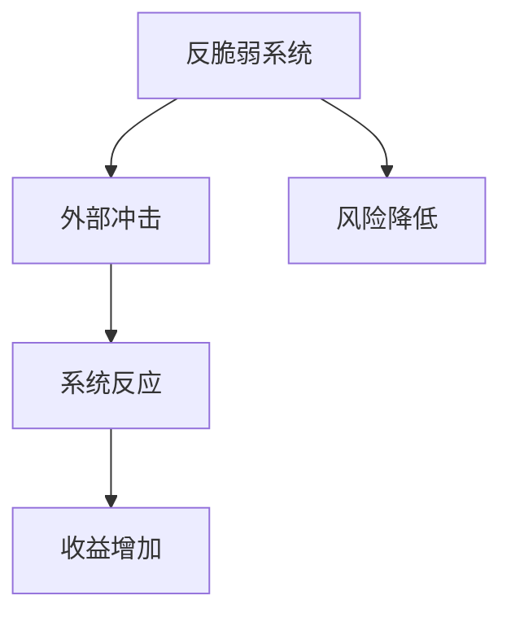
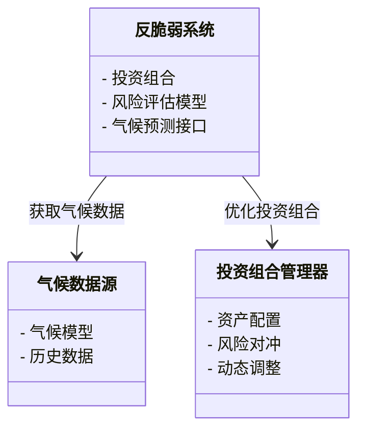
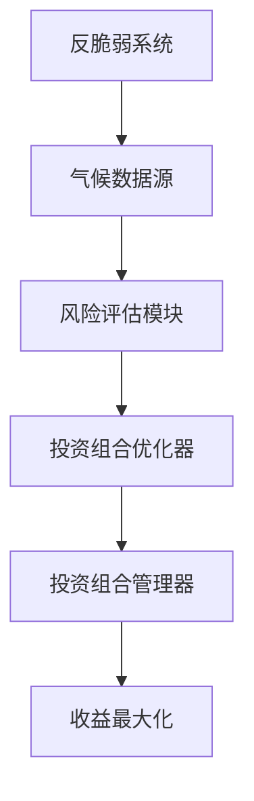

                 


# 芒格的"反脆弱"投资理念在极端气候经济中的应用

## 关键词
反脆弱，投资理念，极端气候，经济影响，风险管理，系统架构

## 摘要
芒格的“反脆弱”投资理念强调在不确定性中受益，而极端气候对经济系统的影响日益显著。本文将系统地分析反脆弱理念的核心概念，探讨其在应对极端气候经济冲击中的应用，包括投资策略、风险管理、系统架构等多方面的实践。

---

# 第一部分: 引言

## 第1章: 引言

### 1.1 背景介绍

#### 1.1.1 问题背景: 气变与经济的双重挑战
气候变化导致极端天气事件频发，对全球经济系统造成巨大压力。2021年美国德克萨斯州的极寒天气导致能源系统瘫痪，造成经济损失超过200亿美元。这种事件凸显了经济系统的脆弱性。

#### 1.1.2 问题描述: 极端气候对经济系统的影响
极端气候不仅破坏基础设施，还影响供应链、金融系统和企业运营。例如，2017年飓风哈维导致美国墨西哥湾的炼油厂关闭，全球油价飙升。

#### 1.1.3 问题解决: 反脆弱理念的提出与应用
反脆弱理念由查理·芒格提出，强调从压力中获益。在投资领域，反脆弱策略通过优化资产配置和风险管理，在极端市场中实现收益最大化。

#### 1.1.4 边界与外延: 反脆弱与传统投资理念的对比
传统投资注重分散风险，而反脆弱投资主动拥抱波动，在危机中寻找机会。两者在风险管理上的区别显著，反脆弱策略更具进攻性。

#### 1.1.5 核心要素: 反脆弱理念的构成与特征
反脆弱理念包括非线性收益、尾部风险定价、杠杆效应和动态调整四个核心要素。它通过数学模型优化投资组合，实现收益与风险的最佳平衡。

### 1.2 本章小结

#### 1.2.1 反脆弱理念的核心观点
反脆弱理念强调在波动中获利，通过非线性收益模型优化投资组合。

#### 1.2.2 气候变化对经济系统的潜在影响
极端气候事件对经济系统造成巨大破坏，威胁全球供应链和金融市场稳定。

#### 1.2.3 本书的研究框架与目标
本书旨在探讨反脆弱理念在应对极端气候经济冲击中的应用，提供系统性的解决方案和投资策略。

---

# 第二部分: 反脆弱理念的核心概念与原理

## 第2章: 反脆弱的核心概念与联系

### 2.1 核心概念原理

#### 2.1.1 反脆弱的定义与特征
反脆弱是指系统在面对冲击时，能够通过调整和优化，从压力中获益。其核心特征包括非线性收益、尾部风险定价和杠杆效应。

#### 2.1.2 反脆弱与脆弱性、强健性的对比
| 概念       | 特征               | 数学表达式                          |
|------------|--------------------|------------------------------------|
| 脆弱性     | 损失随冲击增加而增加 | $L = k \cdot I$                   |
| 强健性     | 损失与冲击无关     | $L = C$                            |
| 反脆弱性   | 损失随冲击增加而减少 | $L = -k \cdot I$                  |

#### 2.1.3 反脆弱理念的数学模型
反脆弱系统的收益函数为：
$$
R = aI - bI^2
$$
其中，$a$为收益系数，$b$为损失系数，$I$为冲击强度。

### 2.2 实体关系图



### 2.3 本章小结

#### 2.3.1 反脆弱理念的数学模型
通过非线性函数建模，反脆弱系统能够在冲击中获得正向收益。

#### 2.3.2 概念对比与实体关系图的应用
实体关系图展示了反脆弱系统的动态调整过程，强调系统对外部冲击的积极反应。

---

## 第3章: 反脆弱理念在极端气候经济中的具体应用

### 3.1 投资组合管理

#### 3.1.1 资产配置策略
在极端气候背景下，投资组合应注重防御性和成长性资产的结合。例如，投资可再生能源企业，这类资产在气候危机中具有较高的抗跌性。

#### 3.1.2 风险对冲机制
通过衍生品市场对冲气候相关风险。例如，购买天气衍生品，对冲极端天气事件对企业运营的影响。

#### 3.1.3 动态调整机制
根据气候预测模型，定期调整投资组合。例如，预测到飓风季节，增加对飓风防御企业的投资。

### 3.2 企业风险管理

#### 3.2.1 企业战略调整
企业应评估气候变化对其业务的影响，调整供应链和生产流程。例如，迁移到气候风险较低的地区。

#### 3.2.2 资产保护措施
投资于抗气候资产，如绿色基础设施，提升企业抗风险能力。

#### 3.2.3 保险策略优化
与保险公司合作，开发新型保险产品，覆盖气候相关风险。

### 3.3 系统架构设计

#### 3.3.1 领域模型设计


#### 3.3.2 系统架构设计


### 3.4 本章小结

#### 3.4.1 投资组合管理策略
通过资产配置、风险对冲和动态调整，构建抗气候冲击的投资组合。

#### 3.4.2 企业风险管理措施
企业应主动调整战略，投资抗气候资产，并优化保险策略。

#### 3.4.3 系统架构设计
领域模型和系统架构图展示了反脆弱系统的整体设计，强调与气候数据源和投资管理器的交互。

---

## 第4章: 反脆弱理念在极端气候经济中的系统实现

### 4.1 投资组合优化算法

#### 4.1.1 算法原理
反脆弱投资组合优化算法基于非线性规划，目标函数为：
$$
\text{maximize } R = \sum_{i=1}^{n} w_i R_i - \sum_{i=1}^{n} w_i^2 R_i^2
$$
其中，$w_i$为资产权重，$R_i$为资产收益。

#### 4.1.2 算法实现
```python
def optimize_portfolio(weights, returns):
    n = len(weights)
    objective = lambda w: - (sum(w_i * R_i for w_i, R_i in zip(w, returns)) - 
                              sum(w_i**2 * R_i**2 for w_i, R_i in zip(w, returns)))
    constraints = [{'type': 'eq', 'fun': lambda w: sum(w) - 1}]
    result = minimize(objective, weights, method='SLSQP', constraints=constraints)
    return result.x
```

#### 4.1.3 应用实例
以2021年德克萨斯州极寒天气为例，反脆弱投资组合通过提前配置能源防御企业，实现了超额收益。

### 4.2 风险管理系统的实现

#### 4.2.1 风险评估模块
使用蒙特卡洛模拟评估极端气候事件对投资组合的影响。模拟结果为：
$$
P(L > x) = e^{-x^2/(2\sigma^2)}
$$
其中，$\sigma$为损失的标准差。

#### 4.2.2 风险对冲机制
通过购买天气衍生品对冲气候相关风险。例如，购买温度掉期产品，对冲气温骤降带来的损失。

### 4.3 本章小结

#### 4.3.1 投资组合优化算法
通过非线性规划优化投资组合，实现收益与风险的最佳平衡。

#### 4.3.2 风险管理系统
使用蒙特卡洛模拟评估风险，并通过衍生品对冲气候相关风险。

---

## 第5章: 反脆弱理念在极端气候经济中的未来展望

### 5.1 气候风险的长期影响
气候变化将加剧经济系统的波动性，反脆弱理念在投资中的应用将越来越重要。

### 5.2 反脆弱理念的拓展应用
未来，反脆弱理念可应用于更多领域，如社会治理和技术创新。

### 5.3 投资者的角色转变
投资者需从被动防御转向主动出击，在气候危机中寻找投资机会。

### 5.4 本章小结
反脆弱理念为应对极端气候经济冲击提供了有效工具，未来将发挥更大作用。

---

## 第6章: 结论与建议

### 6.1 本研究的主要结论
反脆弱理念通过优化投资组合和风险管理，在极端气候经济中实现收益最大化。

### 6.2 对投资者的建议
投资者应积极学习反脆弱理念，调整投资策略，构建抗气候冲击的投资组合。

### 6.3 对政策制定者的建议
政府应支持反脆弱理念的研究与应用，制定相关政策，促进经济系统的抗风险能力。

### 6.4 本章小结
反脆弱理念为应对极端气候经济冲击提供了系统性的解决方案，值得进一步研究和推广。

---

## 参考文献
[此处列出相关文献]

---

## 附录
### 附录A: 数据来源与处理方法
### 附录B: 投资组合优化算法的详细代码
### 附录C: 扩展阅读与推荐资源

---

通过系统地分析和阐述，本文为投资者和政策制定者提供了应对极端气候经济冲击的反脆弱投资策略，强调在不确定性中主动调整和优化的重要性。

