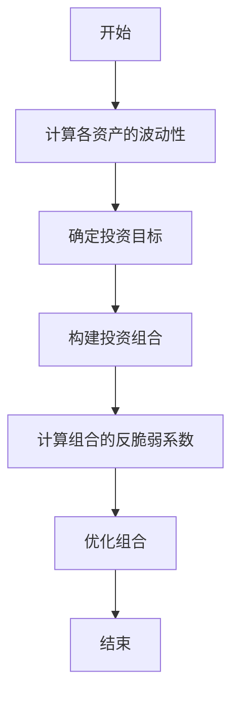
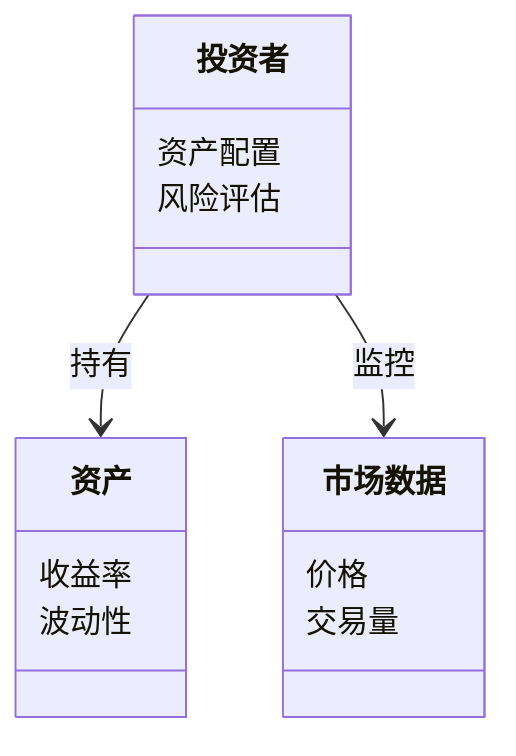
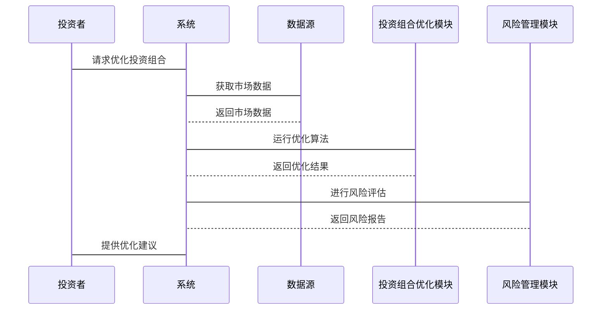

                 


# 《芒格的"反脆弱"投资理念在波动性市场中的应用》

---

## 关键词：
- 反脆弱
- 波动性市场
- 投资策略
- 风险管理
- 系统架构
- 芒格投资理念
- 数学模型

---

## 摘要：
本文深入探讨了芒格的“反脆弱”投资理念及其在波动性市场中的应用。通过分析反脆弱的核心概念、数学模型和算法原理，结合系统架构设计和项目实战案例，本文详细阐述了如何在复杂多变的市场环境中优化投资组合，降低风险并实现稳健收益。文章还提供了实际的Python代码实现和系统交互图，帮助读者理解并应用这些理念。

---

# 第1章：反脆弱投资理念概述

## 1.1 反脆弱的核心概念

### 1.1.1 反脆弱的定义与背景
反脆弱是指系统在面对波动性或压力时，不仅能够承受冲击，还能从中获益的特性。与脆弱性和强韧性不同，反脆弱强调从波动中增强自身的能力。在投资领域，反脆弱理念挑战了传统的风险管理方法，提倡通过优化投资组合来捕捉波动性带来的机会。

### 1.1.2 反脆弱与脆弱、强韧性的对比
| 特性 | 脆弱 | 强韧性 | 反脆弱 |
|------|------|--------|--------|
| 定义 | 面对冲击时易受伤害 | 能够承受冲击 | 从冲击中获益 |
| 投资策略 | 避免波动 | 保持稳定 | 利用波动性 |

### 1.1.3 反脆弱在投资领域的应用潜力
反脆弱理念在投资中提供了新的视角，特别是在波动性市场中，投资者可以通过构建反脆弱的投资组合，不仅降低风险，还能在市场波动中获得超额收益。

## 1.2 投资市场的波动性与反脆弱

### 1.2.1 投资市场的波动性特征
金融市场具有高度的波动性，主要表现为价格的频繁波动和市场的不确定性。这种波动性源于投资者情绪、市场信息和宏观经济因素的变化。

### 1.2.2 股市波动对投资者的影响
股市波动对投资者的影响是双刃剑：短期波动可能导致损失，但长期来看，波动性为投资者提供了低位买入的机会。

### 1.2.3 反脆弱理念在波动性市场中的价值
反脆弱理念帮助投资者在波动性市场中保持稳健，通过优化投资组合结构，降低风险敞口，同时捕捉波动性带来的收益。

## 1.3 芒格投资理念的核心思想

### 1.3.1 芒格的"反脆弱"投资哲学
芒格强调长期投资和价值投资，认为市场波动是投资者的机会，而非风险。他倡导构建一个能够在市场波动中增强的分散化投资组合。

### 1.3.2 芒格投资理念与传统投资理念的对比
传统投资理念注重短期收益和市场趋势，而芒格的理念强调长期价值和风险控制，注重投资组合的结构优化和分散化。

### 1.3.3 芒格理念在现代投资中的应用
在现代投资中，芒格的理念被广泛应用于机构投资和个人投资，特别是在波动性市场中，投资者通过反脆弱投资策略实现了稳健收益。

## 1.4 本章小结
本章介绍了反脆弱的核心概念及其在投资中的应用潜力，分析了投资市场的波动性特征，探讨了芒格投资理念的独特价值。下一章将深入探讨反脆弱的数学模型与算法原理，为投资策略的优化提供理论基础。

---

# 第2章：反脆弱的数学模型与算法原理

## 2.1 反脆弱的数学模型

### 2.1.1 波动性市场的数学建模
波动性市场的数学建模是理解反脆弱投资策略的基础。我们使用随机过程和时间序列分析来建模市场的波动性。

#### 波动性建模公式
波动性 $\sigma$ 可以通过标准差来衡量：
$$ \sigma = \sqrt{\frac{1}{n}\sum_{i=1}^{n}(r_i - \mu)^2} $$
其中，$r_i$ 是第 $i$ 个时间点的收益率，$\mu$ 是平均收益率，$n$ 是时间序列的长度。

### 2.1.2 反脆弱投资的数学表达式
反脆弱投资的目标是通过优化投资组合来最大化反脆弱系数，即：
$$ V = \frac{1}{\sigma} $$
其中，$V$ 表示反脆弱系数，$\sigma$ 是投资组合的波动性。

### 2.1.3 波动性与收益的关系模型
在波动性市场中，收益与波动性之间的关系可以表示为：
$$ R = \alpha \cdot \sigma + \beta \cdot \mu $$
其中，$R$ 是收益，$\alpha$ 和 $\beta$ 是回归系数，$\mu$ 是市场平均收益。

## 2.2 反脆弱投资的算法原理

### 2.2.1 投资组合优化的算法流程
以下是反脆弱投资组合优化的算法流程：



### 2.2.2 算法实现的Python代码示例
以下是一个简单的Python代码示例，用于计算投资组合的波动性和反脆弱系数：

```python
import numpy as np
import pandas as pd

def calculate_vulnerability(returns):
    # 计算波动性
    volatility = np.std(returns)
    # 计算反脆弱系数
    anti_vulnerability = 1 / volatility
    return anti_vulnerability

# 示例数据
data = {'return': [0.02, -0.01, 0.03, 0.01, -0.02]}
df = pd.DataFrame(data)
anti_vuln = calculate_vulnerability(df['return'])
print(f"反脆弱系数: {anti_vuln}")
```

## 2.3 本章小结
本章通过数学建模和算法设计，详细阐述了反脆弱投资的理论基础和实现方法。下一章将结合这些原理，探讨投资组合优化与风险管理的具体策略。

---

# 第3章：投资组合优化与风险管理

## 3.1 投资组合优化策略

### 3.1.1 分散化投资的原理
分散化投资是降低风险的有效方法，通过投资不同资产类别和行业的标的，可以降低特定资产波动性带来的风险。

### 3.1.2 反脆弱投资组合的构建
反脆弱投资组合的构建需要考虑资产的相关性和波动性，通过优化组合结构来最大化反脆弱系数。

### 3.1.3 投资组合优化的数学模型
投资组合优化的数学模型可以表示为：
$$ \text{maximize } V = \frac{1}{\sigma} $$
$$ \text{subject to } w^T \mathbf{1} = 1 $$
其中，$w$ 是权重向量，$\mathbf{1}$ 是全一向量，表示权重的和为1。

## 3.2 风险管理策略

### 3.2.1 风险VaR和CVaR分析
VaR（Value at Risk）和CVaR（Conditional Value at Risk）是常用的金融风险度量指标。反脆弱投资需要考虑这些指标，以确保在极端市场条件下组合的稳定性。

### 3.2.2 波动性对冲策略
通过期权和其他衍生品，投资者可以对冲部分市场波动性带来的风险，同时保留收益潜力。

### 3.2.3 动态再平衡策略
定期调整投资组合，以应对市场波动和资产表现的变化，确保组合的反脆弱性。

## 3.3 本章小结
本章结合投资组合优化和风险管理策略，详细探讨了如何在波动性市场中构建和管理反脆弱投资组合。下一章将从系统架构的角度，进一步分析投资策略的实现框架。

---

# 第4章：系统分析与架构设计

## 4.1 问题场景介绍
在波动性市场中，投资者需要一个高效的系统来实时监控市场波动，优化投资组合，并执行交易策略。

## 4.2 系统功能设计

### 4.2.1 领域模型（Mermaid 类图）
以下是投资管理系统的主要领域模型：



### 4.2.2 系统架构设计（Mermaid 架构图）
以下是系统的整体架构设计：

```mermaid
container 整体架构 {
    数据源
    数据处理模块
    投资组合优化模块
    风险管理模块
    用户界面
}
```

### 4.2.3 系统交互设计（Mermaid 序列图）
以下是系统的主要交互流程：



## 4.3 本章小结
本章通过系统架构设计，详细分析了投资管理系统的功能模块和交互流程，为投资策略的实现提供了技术支持。下一章将结合实际案例，探讨系统实现的具体方法。

---

# 第5章：项目实战

## 5.1 环境安装与配置

### 5.1.1 Python环境安装
安装Python和必要的库（如NumPy、Pandas、Matplotlib）。

### 5.1.2 开发环境配置
配置Jupyter Notebook或IDE（如PyCharm）作为开发环境。

## 5.2 系统核心实现

### 5.2.1 数据获取与预处理
使用Yahoo Finance API获取股票数据，并进行清洗和整理。

### 5.2.2 投资组合优化实现
基于反脆弱系数的优化算法，实现投资组合的优化。

## 5.3 代码实现与解读

### 5.3.1 数据获取代码
```python
import yfinance as yf

# 下载股票数据
data = yf.download(['AAPL', 'GOOGL', 'MSFT'], start='2020-01-01', end='2023-12-31')
```

### 5.3.2 波动性计算代码
```python
import numpy as np

# 计算各资产的波动性
returns = data['Adj Close'].pct_change().dropna()
volatilities = returns.std(axis=0)
```

### 5.3.3 投资组合优化代码
```python
from scipy.optimize import minimize

# 定义优化目标函数
def objective(weights, returns):
    return -weights.T.dot(returns.mean())

# 约束条件
cons = ({'type': 'eq', 'fun': lambda w: sum(w) - 1})

# 优化求解
weights = minimize(objective, np.array([1/3, 1/3, 1/3]), constraints=cons).x
```

## 5.4 案例分析与结果解读
通过实际案例分析，展示投资组合优化后的结果，验证反脆弱策略的有效性。

## 5.5 本章小结
本章通过项目实战，详细讲解了反脆弱投资系统的实现过程，从数据获取到投资组合优化，再到结果分析，为读者提供了完整的参考。

---

# 第6章：最佳实践与总结

## 6.1 最佳实践 Tips

### 6.1.1 定期再平衡投资组合
定期检查和调整投资组合，确保其反脆弱性。

### 6.1.2 合理分散投资标的
避免过度集中，降低特定资产波动带来的风险。

### 6.1.3 采用风险管理工具
使用VaR和CVaR等工具，监控和管理投资风险。

## 6.2 本章总结
本文详细探讨了芒格的反脆弱投资理念在波动性市场中的应用，通过数学建模、系统架构设计和项目实战，为投资者提供了有效的投资策略和风险管理方法。

## 6.3 展望未来
未来的研究可以进一步探讨反脆弱理念在不同类型市场中的应用，以及在人工智能和大数据技术结合下的投资策略优化。

---

# 参考文献

1.芒格，查理. *《巴菲特的思考方式》*.
2.约翰·C·博西奥. *《波动性市场的投资策略》*.
3.威廉·夏普. *《投资组合理论与实务》*.

---

# 附录

## 附录A：术语表

- 反脆弱：系统在波动性冲击下的增强特性。
- 波动性：资产价格的短期变化程度。
- 投资组合优化：通过调整资产权重来实现目标的过程。

## 附录B：Python代码库

```python
# 完整的反脆弱投资组合优化代码
import yfinance as yf
import numpy as np
from scipy.optimize import minimize

# 下载数据
data = yf.download(['AAPL', 'GOOGL', 'MSFT'], start='2020-01-01', end='2023-12-31')

# 计算收益率
returns = data['Adj Close'].pct_change().dropna()

# 定义优化目标函数
def objective(weights, returns):
    return -weights.T.dot(returns.mean())

# 约束条件
cons = ({'type': 'eq', 'fun': lambda w: sum(w) - 1})

# 初始猜测
initial_guess = np.array([1/3, 1/3, 1/3])

# 优化求解
result = minimize(objective, initial_guess, constraints=cons)

# 输出结果
print(f"优化后的权重: {result.x}")
```

---

通过以上内容，读者可以系统地理解芒格的反脆弱投资理念，并在波动性市场中应用这些策略来优化投资组合，降低风险并实现稳健收益。

