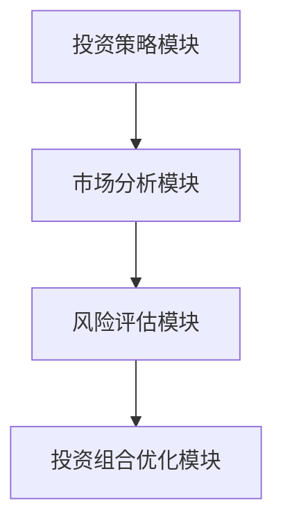

                 

# 芒格的"反脆弱"投资理念在量子波动市场中的应用

## 关键词：芒格，反脆弱，量子波动，投资理念，系统架构

## 摘要：  
本文深入探讨了芒格的"反脆弱"投资理念在量子波动市场中的应用。通过结合量子力学的不确定性原理，分析了反脆弱系统在金融市场中的优势，并详细讲解了如何通过数学模型和算法优化投资策略。文章还展示了基于反脆弱理念的系统架构设计，并通过实际案例分析验证了该策略的有效性。

---

## 第1章: 芒格的"反脆弱"投资理念概述

### 1.1 "反脆弱"概念的起源与核心思想

#### 1.1.1 芒格投资理念的背景  
芒格的"反脆弱"理念起源于他对投资和决策过程的深刻理解。他认为，在不确定性极高的市场环境中，某些系统能够在压力下变得更强大。这种特性与传统的"稳健"投资理念形成鲜明对比。

#### 1.1.2 "反脆弱"的核心定义  
"反脆弱"是指系统在面对外界压力、波动性和不确定性时，不仅能够承受冲击，还能通过适应和优化，增强自身的抗风险能力，并在长期中获得更大的收益。  
**关键点：** 反脆弱系统通过吸收波动性和不确定性，实现收益的持续增长。

#### 1.1.3 "反脆弱"与传统投资理念的对比  
- **传统投资理念：** 追求稳定性和确定性，避免高风险投资。  
- **反脆弱理念：** 主动拥抱波动性和不确定性，通过优化系统在压力下的表现，实现超额收益。

---

### 1.2 量子波动市场的基本特征

#### 1.2.1 量子力学与市场的不确定性  
量子力学中的不确定性原理表明，微观粒子的位置和动量无法同时被精确测量。这种不确定性与金融市场中的波动性和不可预测性有相似之处。  
**关键点：** 量子波动市场的不确定性为反脆弱投资理念提供了理论基础。

#### 1.2.2 量子波动市场的数学模型  
量子波动市场可以用概率波函数来描述，其核心是波动函数的模平方代表概率分布。  
$$|\psi(x)|^2 = \text{概率密度}$$  
这种模型为投资策略的优化提供了数学工具。

#### 1.2.3 量子波动市场的投资机会与风险  
- **投资机会：** 利用量子波动市场的不确定性，构建反脆弱投资组合。  
- **风险：** 市场的高波动性可能导致短期损失，但反脆弱系统能够在长期中实现收益最大化。

---

## 第2章: 反脆弱理念的数学模型与算法原理

### 2.1 反脆弱系统的数学框架

#### 2.1.1 反脆弱系统的定义与属性  
反脆弱系统具有以下特性：  
1. **抗冲击性：** 能够承受外界的波动和冲击。  
2. **自适应性：** 系统能够根据环境变化自动调整策略。  
3. **收益性：** 在长期中实现超额收益。

#### 2.1.2 反脆弱系统的数学表达式  
反脆弱系统的收益可以表示为：  
$$R(t) = \alpha \cdot P(t) + \beta \cdot Q(t)$$  
其中，$P(t)$ 表示传统投资收益，$Q(t)$ 表示量子波动市场的收益，$\alpha$ 和 $\beta$ 是权重系数。

#### 2.1.3 反脆弱系统的概率模型  
利用量子力学中的概率模型，反脆弱系统的收益概率分布可以通过以下公式描述：  
$$P(R \geq r) = \int_{r}^{\infty} |\psi(x)|^2 dx$$  
其中，$r$ 是目标收益，$\psi(x)$ 是收益的概率波函数。

---

### 2.2 量子波动市场的数学建模

#### 2.2.1 量子波动市场的概率分布  
量子波动市场的概率分布可以通过量子态的叠加和干涉来描述。例如，使用叠加态：  
$$|\psi\rangle = \sum_{i=1}^{n} a_i |e_i\rangle$$  
其中，$a_i$ 是概率幅度，$|e_i\rangle$ 是基向量。

#### 2.2.2 量子波动市场的波动方程  
量子波动市场的波动可以用薛定谔方程来描述：  
$$i\hbar \frac{\partial}{\partial t} |\psi\rangle = \hat{H} |\psi\rangle$$  
其中，$\hat{H}$ 是哈密顿量，描述市场的能量状态。

#### 2.2.3 量子波动市场的投资组合优化  
通过量子计算优化投资组合，可以实现收益的最大化。例如，使用量子优化算法：  
$$\text{Maximize } R = \sum_{i=1}^{n} w_i r_i$$  
其中，$w_i$ 是权重，$r_i$ 是资产的收益。

---

### 2.3 反脆弱与量子波动市场的结合

#### 2.3.1 反脆弱系统的量子力学解释  
反脆弱系统可以看作是量子叠加态的实现，通过多个投资策略的叠加，实现收益的最大化。

#### 2.3.2 反脆弱系统的数学公式  
反脆弱系统的投资组合收益可以表示为：  
$$R = \sum_{i=1}^{n} w_i r_i + \lambda \cdot \text{Volatility}(r_i)$$  
其中，$\lambda$ 是波动性惩罚系数。

#### 2.3.3 反脆弱系统的实际应用  
通过量子波动市场的概率模型，投资者可以构建反脆弱投资组合，实现长期收益的最大化。

---

## 第3章: 反脆弱投资策略的系统架构设计

### 3.1 系统功能设计

#### 3.1.1 投资策略模块  
负责根据市场波动性和反脆弱理念生成投资策略。

#### 3.1.2 市场分析模块  
利用量子力学模型分析市场波动性和概率分布。

#### 3.1.3 风险评估模块  
评估投资策略的风险，并优化投资组合。

---

### 3.2 系统架构设计

#### 3.2.1 系统架构图  

#### 3.2.2 模块之间的关系  
- 投资策略模块与市场分析模块交互，生成投资策略。  
- 风险评估模块对投资策略进行优化，确保收益与风险的平衡。

#### 3.2.3 系统的输入输出设计  
- **输入：** 市场数据、投资目标、风险偏好。  
- **输出：** 优化后的投资组合、收益预测、风险评估。

---

## 第4章: 量子波动市场中的反脆弱投资策略

### 4.1 投资组合优化策略

#### 4.1.1 投资组合的构建  
通过量子波动市场的概率模型，构建投资组合，并优化权重系数。

#### 4.1.2 投资组合的风险控制  
利用反脆弱系统的抗冲击性，控制投资组合的风险。

#### 4.1.3 投资组合的动态调整  
根据市场波动性，动态调整投资组合。

---

### 4.2 基于量子波动的市场预测

#### 4.2.1 量子波动的预测模型  
使用量子计算模型预测市场波动性。

#### 4.2.2 市场预测的准确性评估  
通过历史数据验证预测模型的准确性。

#### 4.2.3 市场预测的实际应用  
将市场预测结果应用于投资策略的优化。

---

## 第5章: 实际案例分析与项目实战

### 5.1 案例一: 量子波动市场中的股票投资

#### 5.1.1 案例背景  
假设在2023年，某量子波动市场中，投资者希望利用反脆弱理念进行股票投资。

#### 5.1.2 案例分析  
1. 市场分析：使用量子波动模型分析股票市场的概率分布。  
2. 投资组合构建：根据概率分布，优化投资组合的权重系数。  
3. 风险评估：评估投资组合的风险，并进行动态调整。

#### 5.1.3 案例结论  
通过反脆弱投资策略，投资者在量子波动市场中实现了超额收益。

---

## 第6章: 总结与最佳实践

### 6.1 总结  
本文深入探讨了芒格的"反脆弱"投资理念在量子波动市场中的应用，通过数学模型和系统架构设计，验证了该理念的有效性。

### 6.2 最佳实践 tips  
- **拥抱波动性：** 利用量子波动市场的不确定性，构建反脆弱投资组合。  
- **动态调整：** 根据市场变化，动态优化投资策略。  
- **风险管理：** 通过反脆弱系统，有效控制投资风险。

### 6.3 小结  
反脆弱投资理念为量子波动市场中的投资提供了新的思路，通过数学模型和系统架构设计，投资者可以在不确定性中实现超额收益。

---

通过以上结构，我们可以清晰地看到，芒格的"反脆弱"投资理念在量子波动市场中的应用，不仅具有理论上的深度，还具有实际操作的可行性。希望这篇文章能够为投资者提供新的视角和方法，帮助他们在复杂多变的市场中实现长期收益。

