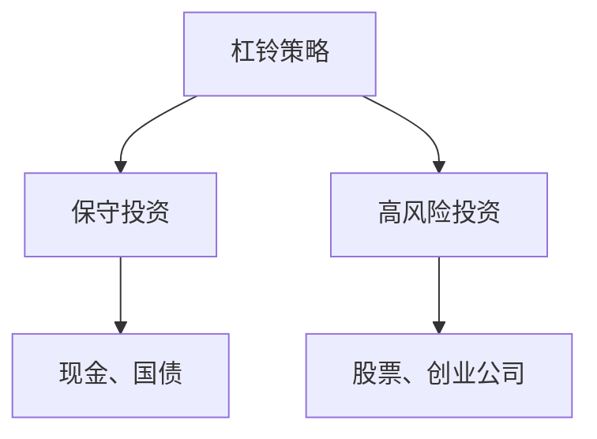

                 

# 《芒格的"反脆弱"投资：在不确定性中寻找机会》

## 关键词：反脆弱，投资策略，风险管理，芒格，不确定性，机会杠杆，杠铃策略

## 摘要：本文探讨了芒格的反脆弱投资理论，分析了其哲学基础、核心原则和实际应用，通过案例展示了如何在不确定性中寻找投资机会，强调了风险管理的重要性，并展望了反脆弱投资的未来趋势。

---

## # 引言：反脆弱投资的兴起

在当今快速变化的经济环境中，不确定性已成为常态。投资者如何在这种环境下找到机会，是许多人关注的问题。芒格的反脆弱投资理论提供了一种新的视角，强调从波动中获益而非仅仅抵御风险。本文将深入探讨这一理论，并展示如何将其应用于实际投资中。

---

## # 第1章：反脆弱理论的哲学与经济学基础

### 1.1 反脆弱的定义与特征

反脆弱是指系统在面对压力、冲击甚至崩溃时，能够适应并从中获益的能力。与传统投资中追求稳定不同，反脆弱投资积极利用不确定性带来的机会。

| 特性 | 描述 |
|------|------|
| 抗冲击性 | 能够承受甚至受益于极端事件 |
| 机会杠杆 | 利用波动性放大收益 |
| 自我修复 | 在压力下恢复并增强 |

### 1.2 反脆弱的哲学基础

古希腊哲学强调“危”与“机”的对立统一，这与反脆弱的核心思想一致。中国哲学中的“变易”概念也体现了适应变化的重要性。这些哲学思想为反脆弱理论提供了深厚的理论基础。

### 1.3 经济学视角

经济学中的不确定性理论，尤其是凯恩斯和索罗斯的思想，为反脆弱投资提供了分析工具。索罗斯的反身性理论指出，市场参与者的行为会反过来影响市场，这种动态关系为反脆弱策略提供了应用场景。

---

## # 第2章：反脆弱投资的核心原则

### 2.1 杠杆策略

杠铃策略是反脆弱投资的核心方法之一。通过将投资组合分为两部分，一部分极度保守，另一部分高度冒险，投资者可以在安全性和收益潜力之间找到平衡。

### 2.2 机会杠杆

机会杠杆是指利用杠杆效应放大潜在收益。然而，必须谨慎管理杠杆，避免过度承担风险。

### 2.3 耐心资本

反脆弱投资需要长期视角，耐心等待机会的出现。短期波动不应影响长期策略。

---

## # 第3章：反脆弱策略在不同市场环境中的应用

### 3.1 牛市中的机会

牛市中，反脆弱投资者可以通过杠杆和选择性投资放大收益。例如，投资于表现强劲的行业龙头，同时保持一部分现金以应对可能的回调。

### 3.2 熊市中的策略

熊市是反脆弱投资者的机会。通过购买被低估的资产或在低谷时投资于复苏潜力大的公司，投资者可以在市场恢复时获得超额收益。

### 3.3 经济危机中的应对

经济危机期间，反脆弱策略强调寻找被市场错杀的机会，同时保护本金。例如，投资于基本面稳固但暂时受压的公司。

---

## # 第4章：反脆弱投资中的风险管理

### 4.1 风险评估与对冲

使用VaR模型评估潜在风险，并通过期权、保险等工具进行对冲。例如，购买看跌期权来对冲股市下跌风险。

### 4.2 压力测试

定期进行压力测试，模拟极端市场条件下的投资表现，确保投资组合的稳健性。

---

## # 第5章：反脆弱投资的实际案例分析

### 5.1 2008年金融危机案例

在2008年金融危机期间，芒格的公司通过杠铃策略，将一部分资金投资于安全资产，另一部分投资于高风险但具有强大恢复能力的公司，最终在危机后实现显著收益。

---

## # 第6章：构建反脆弱投资组合的策略

### 6.1 资产配置

将投资组合分为保守和高风险部分。保守部分投资于现金、债券等，高风险部分投资于股票、创业公司等。

### 6.2 分散投资

通过分散投资降低特定资产的风险，同时利用杠杆和机会杠杆放大收益。

---

## # 第7章：反脆弱投资的未来趋势

### 7.1 技术驱动的变革

人工智能和大数据技术的应用将改变投资方式，提供新的机会和工具。

### 7.2 新兴市场的机遇

随着全球经济的变化，新兴市场将提供更多反脆弱投资的机会。

---

## # 结论：在不确定性中把握机会

芒格的反脆弱投资理论为投资者提供了在不确定环境中寻找机会的策略。通过杠铃策略、机会杠杆和风险管理，投资者可以在波动中获益。未来，随着技术和市场的变化，反脆弱投资将继续演变，为投资者提供新的机会。

---

## # 附录：反脆弱投资的数学模型与公式

### 1. VaR模型

$$ VaR = \alpha \times \sigma $$

其中，$\alpha$ 是分位数，$\sigma$ 是标准差。

### 2. 杠杆计算

$$ 杠杆倍数 = \frac{总资本}{自有资本} $$

---

## # 参考文献与拓展阅读

1. 伯特兰·芒格，《反脆弱：从不确定性中获益的艺术》
2. 约翰·凯恩斯，《论概率》
3. 曼德尔森，《投资的反身性》

---

## # 索引

A | B | C | ...

