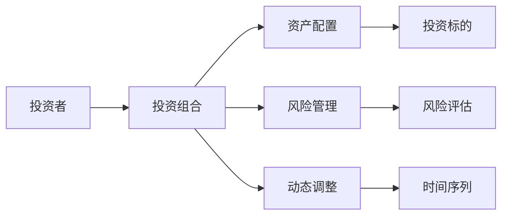
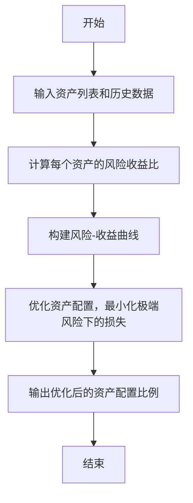
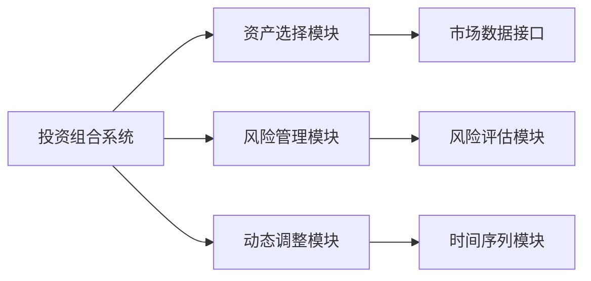
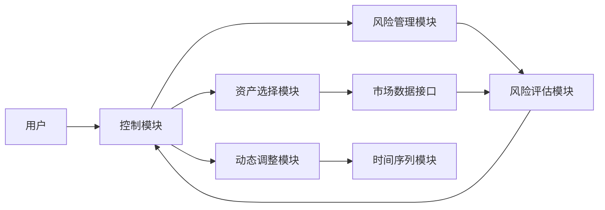

                 


# 《芒格的"反脆弱"概念在投资组合构建中的应用》

---

## 关键词：
- 反脆弱
- 投资组合
- 风险管理
- 资产配置
- 系统架构

---

## 摘要：
本文深入探讨了芒格提出的“反脆弱”概念，并将其应用于投资组合的构建中。通过分析反脆弱的核心原理、投资组合的构建策略以及系统的风险管理方法，本文提出了一种基于反脆弱原则的投资组合优化框架。文章结合理论与实践，通过算法原理、系统架构设计和项目实战，详细阐述了如何利用反脆弱理念在复杂的投资环境中实现稳健收益。本文旨在为投资者提供一种新的视角，帮助他们在不确定性和风险中构建更具韧性的投资组合。

---

## 第一部分: 反脆弱概念与投资组合基础

### 第1章: 反脆弱概念的背景与定义

#### 1.1 反脆弱的定义与核心理念
反脆弱是指系统在面对压力、波动和不确定性时，不仅能够承受冲击，还能通过适应和优化在压力下茁壮成长。这一概念与传统的“稳健”和“脆弱”不同，反脆弱强调在逆境中获得增强的能力。

- **反脆弱的定义**：反脆弱是指系统在面对压力时，能够通过自我修复、适应和优化，实现能力的提升和目标的强化。
- **反脆弱的核心理念**：
  - **不对称性**：承受小概率的负面冲击，获得更大的正面收益。
  - **自我修复与增强**：在压力下，系统能够自动调整以应对挑战。
  - **杠杆效应**：利用外部压力和波动，实现系统能力的提升。

#### 1.2 投资组合的基本概念
投资组合是指将资金分配到不同资产类别中的策略，以实现风险和收益的平衡。投资组合的核心目标是通过分散投资降低风险，同时追求收益的最大化。

- **投资组合的定义**：投资组合是将资金分配到多种资产（如股票、债券、房地产等）的组合，以实现风险和收益的最佳平衡。
- **投资组合的分类**：
  - 按风险偏好：保守型、平衡型、进取型。
  - 按资产类别：股票型、债券型、混合型。
- **投资组合的目标与风险**：
  - **目标**：实现资产的保值与增值。
  - **风险**：市场波动、流动性风险、信用风险等。

#### 1.3 反脆弱与投资组合的结合
反脆弱理念与投资组合构建的结合，旨在通过优化资产配置和风险管理，使投资组合在面对市场波动和经济不确定性时，不仅能够抵御风险，还能在长期实现超额收益。

- **反脆弱在投资组合中的意义**：
  - 提高投资组合的抗风险能力。
  - 利用市场波动实现收益增强。
  - 在经济衰退或市场危机中表现优于传统投资组合。
- **反脆弱与投资组合目标的契合点**：
  - 长期稳健收益。
  - 降低极端风险下的损失。
  - 利用市场波动实现超额收益。

---

## 第二部分: 反脆弱概念在投资组合中的应用

### 第2章: 反脆弱投资组合的构建原理

#### 2.1 反脆弱投资组合的核心要素
反脆弱投资组合的构建需要考虑以下几个核心要素：

- **投资标的的选择标准**：
  - 选择具有反脆弱特性的资产：如波动性高但具有长期增长潜力的资产。
  - 避免选择过于脆弱的资产：如高杠杆、高风险的资产。
- **风险收益比的评估**：
  - 通过历史数据分析和市场预测，评估不同资产的风险与收益比。
  - 选择具有不对称收益潜力的资产。
- **投资组合的动态调整机制**：
  - 定期重新评估投资组合的风险和收益。
  - 根据市场变化和资产表现进行动态调整。

#### 2.2 反脆弱投资组合的属性特征对比
为了更好地理解反脆弱投资组合的特点，我们需要将其与传统投资组合进行对比分析。

- **反脆弱与稳健投资组合的对比**：
  - **风险承受能力**：反脆弱投资组合能够在极端风险下表现更好。
  - **收益潜力**：反脆弱投资组合具有更高的不对称收益潜力。
- **反脆弱与高风险投资组合的对比**：
  - **风险控制**：反脆弱投资组合通过系统性风险管理降低了纯粹高风险投资的不确定性。
  - **收益稳定性**：反脆弱投资组合在波动中更稳定，收益更有保障。
- **反脆弱与传统投资组合的对比**：
  - **目标**：传统投资组合追求稳定收益，反脆弱投资组合追求在波动中增强收益。
  - **策略**：传统投资组合注重分散化，反脆弱投资组合注重动态优化和风险管理。

#### 2.3 反脆弱投资组合的ER实体关系图
下图展示了反脆弱投资组合的核心要素及其关系：



---

## 第三部分: 反脆弱投资组合的算法原理

### 第3章: 反脆弱投资组合的算法实现

#### 3.1 算法原理概述
反脆弱投资组合的构建需要结合数学模型和算法优化。以下是一个简化的反脆弱投资组合优化算法：

1. **输入**：资产列表、历史价格数据、风险承受能力。
2. **目标**：最大化投资组合的长期收益，同时最小化极端风险下的损失。
3. **步骤**：
   - 确定每个资产的风险收益比。
   - 计算投资组合的风险-收益曲线。
   - 优化资产配置，使投资组合在极端风险下损失最小化。
4. **输出**：优化后的资产配置比例。

#### 3.2 数学模型与公式
以下是反脆弱投资组合优化的数学模型：

- **目标函数**：
  $$ \text{最大化} \quad \sum_{i=1}^{n} w_i r_i - \lambda \sum_{i=1}^{n} w_i^2 \sigma_i $$
  其中：
  - \( w_i \) 是资产 \( i \) 的权重。
  - \( r_i \) 是资产 \( i \) 的预期收益。
  - \( \sigma_i \) 是资产 \( i \) 的风险（波动率）。
  - \( \lambda \) 是风险惩罚系数。

- **约束条件**：
  $$ \sum_{i=1}^{n} w_i = 1 $$
  $$ w_i \geq 0 \quad \forall i $$

#### 3.3 算法流程图
以下是反脆弱投资组合优化的算法流程图：



#### 3.4 代码实现
以下是基于Python的反脆弱投资组合优化算法的实现示例：

```python
import numpy as np
import pandas as pd

def compute_portfolio_risk_returns(assets, returns):
    # 计算资产的平均收益和协方差矩阵
    mu = returns.mean()
    cov = returns.cov()
    
    # 使用均值-方差优化模型，最小化风险，最大化收益
    from pyparetos_frontier import pyparetos_frontier
    pf = pyparetos_frontier(returns, mu, cov)
    weights = pf.min_variance()
    
    # 计算投资组合的预期收益和风险
    portfolio_return = np.dot(weights, mu)
    portfolio_risk = np.sqrt(np.dot(weights.T, np.dot(cov, weights)))
    
    return weights, portfolio_return, portfolio_risk

# 示例数据
assets = ['股票', '债券', '房地产']
returns = pd.DataFrame({
    '股票': [0.1, 0.05, 0.08],
    '债券': [0.03, 0.02, 0.04],
    '房地产': [0.06, 0.03, 0.05]
})

weights, return_, risk = compute_portfolio_risk_returns(assets, returns)
print("权重:", weights)
print("预期收益:", return_)
print("风险:", risk)
```

---

## 第四部分: 系统分析与架构设计

### 第4章: 反脆弱投资组合的系统架构

#### 4.1 问题场景介绍
在复杂的金融市场中，投资者需要面对不断变化的市场环境和不确定性。反脆弱投资组合的目标是在这种环境中实现稳健收益。

#### 4.2 系统功能设计
以下是反脆弱投资组合系统的功能模块：



#### 4.3 系统架构设计
以下是反脆弱投资组合系统的架构图：



---

## 第五部分: 项目实战

### 第5章: 反脆弱投资组合的实战案例

#### 5.1 环境安装与数据准备
以下是项目实战所需的环境和数据准备：

- **环境安装**：
  - Python 3.8+
  - pandas, numpy, pyparetos_frontier
- **数据准备**：
  - 历史资产价格数据（股票、债券、房地产等）

#### 5.2 核心代码实现
以下是反脆弱投资组合优化的Python代码实现：

```python
import numpy as np
import pandas as pd
from pyparetos_frontier import pyparetos_frontier

def optimize_portfolio(returns):
    # 计算均值和协方差矩阵
    mu = returns.mean().values
    cov = returns.cov().values
    
    # 使用均值-方差优化模型，最小化风险
    pf = pyparetos_frontier(returns)
    weights = pf.min_variance()
    
    # 计算投资组合的预期收益和风险
    portfolio_return = np.dot(weights, mu)
    portfolio_risk = np.sqrt(np.dot(weights.T, np.dot(cov, weights)))
    
    return weights, portfolio_return, portfolio_risk

# 示例数据
assets = ['股票', '债券', '房地产']
returns_data = pd.DataFrame({
    '股票': [0.1, 0.05, 0.08],
    '债券': [0.03, 0.02, 0.04],
    '房地产': [0.06, 0.03, 0.05]
})

weights, return_, risk = optimize_portfolio(returns_data)
print("权重:", weights)
print("预期收益:", return_)
print("风险:", risk)
```

---

## 第六部分: 总结与展望

### 6.1 总结
本文深入探讨了芒格的“反脆弱”概念在投资组合构建中的应用，通过理论分析和实践案例，展示了如何利用反脆弱理念优化投资组合的风险管理。文章结合数学模型和算法优化，提出了基于反脆弱原则的投资组合优化框架。

### 6.2 展望
未来的研究可以进一步探索反脆弱投资组合在不同市场环境下的表现，结合人工智能和大数据技术，开发更智能的投资组合优化算法。此外，还可以研究反脆弱理念在其他领域（如企业风险管理、供应链优化等）的应用，拓展其理论和实践价值。

---

## 注意事项
- 投资有风险，本文内容仅为理论探讨，不构成投资建议。
- 投资者在实际操作中应结合自身风险承受能力和市场环境，谨慎决策。

---

## 参考文献
1.芒格, B. (2011).《反脆弱: 从不确定性中获益的艺术》.
2.马科维茨, H. (1952).《投资组合理论》.
3.Python pyparetos_frontier库官方文档.

---

## END

